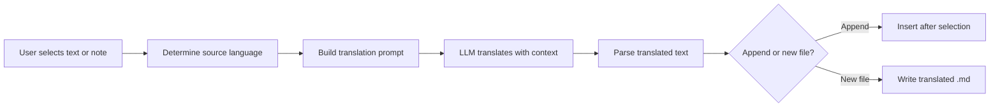

import TLDR from '@site/src/components/TLDR';

# Översättning

<TLDR>
**Notemd översätter text mellan 21+ språk med hjälp av LLM-drivna översättningsteknologier.** Det stöder översättning av enstaka delar, hela anteckningar samt batch-översättning av mappar. Varje översättningsuppgift kan använda en egen leverantör och modell genom inställningar per uppgift. UtdataSpråket kan konfigureras separat från UI-språket. Resultaten läggs till eller skrivs i en ny fil beroende på dina preferenser.

Detta ingår i [Obsidian AI Knowledge Management Guide](/docs/pillar-ai-knowledge).
</TLDR>

## Översikt

Översättning i Notemd är inte en ordförrådsökning – det är LLM-drivna, kontextmedvetna översättningar. Modellen ser hela paragraphen eller anteckningen och bevarar tonen, terminologin inom området samt meningsskapen. Detta ger högre kvalitetsresultat än serviceer som endast översätter fraser för fraser, särskilt för teknisk, akademisk och kreativ skrivning.

Funktionen stöder tre omfattningar: utvald del, aktuell anteckning och hela mapp. Tillsammans med möjligheten att välja modell per uppgift kan du använda en snabb modell (Gemini Flash) för vardagliga översättningar och en kraftig modell (Claude Sonnet) för innehåll där nyanser är viktiga – utan att ändra din globala leverantör.

## Så här fungerar det

### Översättningskommandot



1. **Källspråkdetektering** -- LLM infärder källspråket från innehållet. Du behöver inte ange det manuellt.
2. **Promptkonstruktion** -- Notemd bygger en prompt som inkluderar målspråket, valfri områdesindikation samt det innehåll som ska översättas.
3. **LLM-översättning** -- Den konfigurerade `translateProvider` / `translateModel`-teknologin bearbetar förfrågan. Modellen bevarar markdown-formatering, wiki-länkar och kodblock.
4. **Utdata** -- Den översatta texten läggs antingen till under den ursprungliga eller skrivs i en ny fil i arkivet.

### Språkpärningar

Notemd stöder alla språkpärningar som den underliggande LLM stöder. Vanliga pärningar inkluderar:

| Källspråk | Mål | Typisk kvalitet |
|--------|--------|----------------|
| Engelska | Kinesiska (simplificerat) | Utmärkt |
| Kinesiska | Engelska | Utmärkt |
| Engelska | Japanska | Mycket bra |
| Engelska | Tyska / Franska / Spanska | Mycket bra |
| Allt stödd | Allt stödd | Beroende på modell |

Inställningen `translateLanguage` styr **utdata språket**. Källspråket detekteras automatiskt.

### Modellval per uppgift

Översättningskvaliteten varierar avsevärt beroende på modellen. Notemd gör det möjligt att tilldela en exklusiv modell enbart för översättning:

| Modell | Hastighet | Kvalitet | Kostnad | Bäst för |
|-------|-------|--------|------|----------|
| `gemini-2.0-flash-exp` | Snabb | God | Låg | Casual, hög volym |
| `gpt-4o-mini` | Snabb | God | Låg | Snabba sökningar |
| `deepseek-chat` | Medel | God | Mycket låg | Budget, flerspråkig |
| `claude-3-5-sonnet` | Medel | Utmärkt | Medel | Teknisk / akademisk |
| `gpt-4o` | Medel | Utmärkt | Medel | Prosa känslig för nyanser |

### Översättning av mappar i batch

Klicka höger på en mapp och välj **"Notemd: Översätt mapp"** för att översätta alla anteckningar i den mappen. Varje fil bearbetas oberoende av andra. Konfigurationen för samtidighet styr hur många filer som översätts parallellt.

## Konfiguration

| Inställning | Standard | Effekt |
|---------|---------|--------|
| `translateProvider` / `translateModel` | DeepSeek | Specialiserad tjänste för översättningstjänster |
| `translateLanguage` | `'en'` | Måloutputspråk |
| `translationAppendToNote` | `true` | Lägg till den översatta texten under den ursprungliga. Om det är falskt skapas en ny fil. |
| `batchConcurrency` | `3` | Antal filer som bearbetas parallellt vid batchöversättning |

## Exempel

Du läser ett kinesiskt forskningsanteckning och vill ha en engelsk version:

1. Öppna anteckningen
2. Klicka höger --> **"Notemd: Översätt aktuell fil"**
3. Notemd upptäcker kinesiska text, översätter till den av dig konfigurerade målspråket (engelska) och lägger till:

```markdown
## Translation (English)

The experimental results show that the proposed method achieves
a 12% improvement in F1 score compared to the baseline, primarily
due to the enhanced feature extraction module described in Section 3.
```

Den ursprungliga kinesiska texten förblir oförändrad ovanför översättningen. `## Translation`-rubriken håller båda versionerna i samma fil för enkel referens.

## Tips

- **Använd Gemini Flash för stora mängder** -- det är den snabbaste och billigaste alternativet för batchöversättning av stora mappar.
- **Bevara wiki-länkar** -- Notemd's instruktioner uppmanar LLM att hålla `[[wiki-links]]` orimlig i översättningen. Kontrollera efter översättning, eftersom vissa modeller ibland avpackar dem.
- **Ställ in utdata språket explicit** -- automatisk detektering fungerar för källan, men konfigurera alltid `translateLanguage` för att undvika osäkerhet angående målet.
- **Översätta konceptanteckningar i batch** -- om din konceptmapp är på ett språk och du behöver den på ett annat, hanteras mappnivåsöversättning det i en enda steg.

---

## Nästa steg

- [Research](./research) -- Sök och sammanfatta på vilket språk som helst, sedan översätta resultaten
- [Workflows](./workflows) -- Kedja översättningar med wiki-länkar eller konceptextraktion
- [Batch Processing](/docs/advanced/batch-processing) -- Samtidighet och överskrivningsbeteende för mappoperationer
- [LLM Providers](/docs/providers/overview) -- Välj den bästa modellen för ditt språkpar
