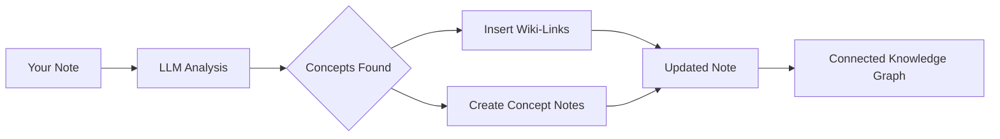

import TLDR from '@site/src/components/TLDR';

# Wiki-länkar

<TLDR>
**Notemd lägger automatiskt till `[[wiki-links]]` i nyckelkoncepten i dina anteckningar.** LLM läser din innehåll, identifierar viktiga termer i sammanhanget och infogar wiki-länkar i Obsidian-stil vid varje förekomst. Valfritt skapas konceptanteckningar med baklänkar. Stöd för synonymsuppression, länkintegritet vid omnamnning/radering samt ren extraktionsläge (ingen filändring). Till skillnad från Auto Link som endast matchar befintliga anteckningstitlar, använder Notemd AI för att identifiera nya koncept och skapa motsvarande anteckningar. Detta ingår i [Obsidian AI Knowledge Management Guide](/docs/pillar-ai-knowledge).
</TLDR>

## Översikt

Wiki-länkning är Notemd:s kärnfunktion. Den omvandlar vanlig text till en sammanlänkad kunskapsgraph genom att:

1. **Analysera dina anteckningar** med ett LLM
2. **Identifiera nyckelkoncept** (termer, personer, metoder, teorier)
3. **Infoga `[[wiki-links]]`** vid varje förekomst
4. **Skapa konceptanteckningar** (valfritt) med baklänkar

## Så här fungerar det

### Process



### Exempel

**Förut:**
```markdown
Machine learning models use neural networks to learn patterns from data.
The transformer architecture revolutionized natural language processing.
```

**Efter:**
```markdown
[[Machine learning]] models use [[neural networks]] to learn patterns from data.
The [[transformer architecture]] revolutionized [[natural language processing]].
```

## Användning

### Basis: Lägg till länkar i nuvarande anteckning

1. Öppna en anteckning
2. Klicka höger i redigeraren → **"Process file (add links)"**
3. Vänta några sekunder
4. Koncepten är nu länkade!

### Batch: Processera flera anteckningar

1. Klicka med högerklick på en mapp i filexplorern
2. Välj **"Notemd: Processa mapp (lägg till länkar)"**
3. Konfigurera:
   - Samtidighet (hur många filer samtidigt)
   - Överskriva befintliga länkar (ja/nej)
4. Klicka på **Process**

### Selektivt: Länka specifik text

1. Highlightera text som ska bearbetas
2. Klicka med högerklick → **"Process selection (add links)"**
3. Endast den highlighterade delen analyseras

## Notemd kontra Auto Link

Obsidian har två metoder för automatisk wiki-länkning:

| | **Auto Link** | **Notemd** |
|--|---------------|-------------|
| Länkkälla | Befintliga anteckningsnamn i vault | Koncept identifierade av LLM i innehållet |
| Kan länka nya koncept | Nej – titeln måste redan existera | Ja – AI identifierar koncept och skapar anteckningar |
| Hantering av synonymer | Nej | Ja – suppression av synonymer |
| Skapande av konceptanteckningar | Nej | Ja – med baklänkar och deduplikering |
| Batchbearbetning | Nej (endast en fil) | Ja (papperskorgsnivå) |
| Modellrutning per uppgift | Nej | Ja |

**Auto Link** matchar titlar: om en anteckning vid namn "Machine Learning" existerar, omsluter det förekomster i `[[Machine Learning]]`. Om anteckningen inte existerar sker ingenting.

**Notemd** drivs av AI: den LLM läser din innehåll, förstår kontexten, identifierar koncept som *bör* länkas – även om ingen anteckning finns ännu – och skapar både länken och konceptanteckningen.

## Funktioner

### Suppression av synonymer

**Problem:** "transformer", "transformers", "Transformer architecture" → 3 separata koncept

**Lösning:** Notemd upptäcker nära-duplikat och använder kanonisk form.

**Konfiguration:**
```
Settings → Advanced → Synonym Suppression
Threshold: 0.8 (0 = off, 1 = aggressive)
```

### Länkintegritet

**När du omnam en konceptnotis:**
- Alla wiki-länkar uppdateras automatiskt (Obsidian kärnfunktion)
- Baklänkar förblir intakta

**När du raderar en konceptnotis:**
- Länkarna förblir men visas som "oanknutna mentioner"
- Du kan skapa om från vilken occurrence som helst

### Ren extraktionsläge

**Extrahera koncept utan att ändra det ursprungliga:**

1. Högerklick → **"Extrahera koncept (inga länkar)"**
2. Konceptnotiser skapas
3. Ursprungliga filen förblir oförändrad

Användningsfall: Bearbetning av endast läsbar innehåll eller slutgiltiga utkast.

## Konceptnotisgenerering

### Automatisk skapning

**När det är aktiverat (standard), skapar Notemd:**

```markdown
---
tags: [concept, auto-generated]
created: 2026-06-13
source: [[Original Note Name]]
---

# Machine Learning

A branch of artificial intelligence that enables computers
to learn from data without explicit programming.

## Occurrences in Your Vault

- [[Original Note Name#Section]]
- [[Another Note#Header]]

## Related Concepts

- [[Neural Networks]]
- [[Deep Learning]]
- [[Supervised Learning]]
```

### Konfiguration

**Utdatamapp:**
```
Settings → Output → Concept Folder
Default: concepts/
```

**Hierarkisk struktur:**
```
Settings → Output → Use Hierarchical Folders
If enabled:
  papers/my-paper.md → papers/concepts/Concept.md
If disabled:
  → concepts/Concept.md
```

**Mall:**
```
Settings → Output → Concept Template
Customize with variables:
  {{concept}} — Concept name
  {{description}} — LLM-generated description
  {{backlinks}} — List of source notes
  {{date}} — Creation date
```

## Avancerade alternativ

### Sammanhangsfönster

**Hur mycket omgivande text som ska skickas:**

```
Settings → Linking → Context Window
Options: Sentence | Paragraph | Full Note
Default: Paragraph
```

Större = bättre noggrannhet, högre kostnad.

### Minsta förekomster

**Endast länka koncept som förekommer flera gånger:**

```
Settings → Linking → Min Occurrences
Default: 1 (link all)
```

Ställ in på 2 eller 3 för att fokusera på upprepada teman.

### Utsluta mönster

**Skipta vissa ord:**

```
Settings → Linking → Exclude List
Example: note, idea, example, thing
```

Förhindrar överlänkning av generiska termer.

### Särskilda prompter

**Överställ standard LLM-instruktioner:**

```
Settings → Advanced → Custom Linking Prompt
Default:
  "Identify key concepts, theories, methods, and technical
   terms in the following text. Return as a list..."
```

Anpassa för domänsspecifika behov (t.ex. "Fokusera på medicinsk terminologi").

## Tips och bästa praxis

### ✅ GÖR

- **Bearbeta anteckningar med >100 ord** — Korta anteckningar ger få koncept
- **Använd kraftfulla modeller** för bättre identifiering av koncept (GPT-4o, Claude)
- **Granska innan du accepterar** — Kontrollera om de föreslagna länkarna är logiska
- **Bygg iterativt** — Bearbeta 5-10 anteckningar, granska grafen, justera inställningarna

### ❌ MÅSTE INTE

- **Överlänka** — Inte varje substantiv behöver en länk
- **Bearbeta utkast upprepade gånger** — Koncept kan förändras, vänta tills de är stabila
- **Ignorera synonym** — Aktivera suppression för att undvika "ML" kontra "Machine Learning"

## Prestanda

### Hastighet

| Anteckningsstorlek | GPT-4o-mini | Claude Sonnet | Ollama (lokal) |
|-----------|-------------|---------------|----------------|
| 500 ord | 2-3 sekunder | 3-5 sekunder | 5-10 sekunder |
| 2000 ord | 5-8 sekunder | 10-15 sekunder | 20-40 sekunder |
| 5000+ ord | Delad (flera anrop) | Delad i chunkar | Delad i chunkar |

### Kostnadsuppskattning

**Exempel: 1000-ordig notis med GPT-4o-mini**
- Inmatning: ~1500 tokener
- Utdata: ~200 tokener
- Kostnad: ~

**Batchbearbetning av 100 anteckningar:** ~

## Felaktighetsfelsökning

### Inga länkar lagda till

**Kontrollera:**
1. LLM anropet lyckades (Inställningar → Diagnostik)
2. Notan innehåller tillräckligt med innehåll (>50 ord)
3. Koncept är tekniska/spesifika (inte bara pronomen)

**Prova:**
- Använd en kraftigare modell
- Öka kontextfönstret
- Kontrollera giltigheten på API-nyckeln

### För många länkar

**Lösningar:**
1. Öka minimiantal av förekomster (2 eller 3)
2. Lägg till vanliga ord till exkluderingslistan
3. Använd en mindre aggressiv modell

### Felaktiga koncept kopplade

**Felsökningar:**
1. Använd anpassad prompt för domänspecifikitet
2. Aktivera synonymsuppression
3. Granska manuellt och avsluta kopplingen

### Länkar bryts efter omnamn

**Detta är normalt Obsidian beteende.**

För att uppdatera alla länkar:
1. Omnamn konceptnotan
2. Obsidian uppdateras automatiskt `[[old]]` → `[[new]]`

---

## Nästa steg

- 📖 [Konceptnoter](./concept-notes) — Djupgång i generering av konceptnoter
- 🔍 [Forskningsintegration](./research) — Kombinera länkning med webbforskning
- 🎨 [Diagram](./diagrams) — Visualisera din kunskapsgraph
