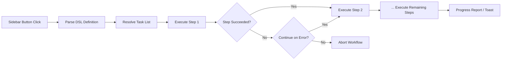

import TLDR from '@site/src/components/TLDR';

# Arbetsflöden

<TLDR>
**Notemd Arbetsflöden kopplar samman flera uppgifter till en enda en-klick-handling.** Definiera sekvenser som `add-links > extract-concepts > research > diagram` med en enkel DSL. Arbetsflöden visas som knappar i sidofältet och kör hela kedjan i den aktuella anteckningen eller mappen. Produktet levereras med fördefinierade arbetsflöden; skapa egna i inställningarna. Varje steg använder sin egen modellkonfiguration per uppgift.

Detta ingår i [Obsidian AI Knowledge Management Guide](/docs/pillar-ai-knowledge).
</TLDR>

## Översikt

Ett arbetsflöde eliminerar besväret med att köra uppgifter en efter en. Istället för att klicka höger fyra gånger för att lägga till länkar, extrahera koncept, undersöka okända termer och generera en diagram, trycker du på en knapp i sidofältet och hela kedjan exekveras. Notemd hanterar sekvenseringen, felöverföring och framstegsrapportering.

Arbetsflöden definieras med en lättviktig DSL (domänsspecifik språk). De finns i inställningarna, visas som klickbara knappar i Obsidian sidofältet och kan tillämpas antingen på den aktuella anteckningen eller en hel mapp.

## Så här fungerar det

### Arbetsflödesexekveringspipelinen



1. **Parse** -- DSL-strängen delas upp med `>` (eller `>`) till en ordnad lista av uppgiftsidentifikatorer.
2. **Resolve** -- Varje identifikator kopplas till en intern kommando (add-links, extract-concepts, research, translate, diagram osv.).
3. **Execute** -- Stegen körsekventiellt. Varje steg använder den konfigurerade leverantören och modellen per uppgift.
4. **Error handling** -- Om ett steg misslyckas avbryts arbetsflödet eller fortsätts till nästa steg, beroende på din felpolicy.
5. **Done** -- En toast-notifikation rapporterar framgång eller listar eventuella misslyckade steg.

### DSL-formatet

Arbetsflöden definieras som en `>`-skildd sekvens av uppgiftsidentifikatorer:

```
process-current-add-links>extract-concepts-current>research-and-summarize
```

**Tillgängliga uppgiftsidentifikatorer:**

| Identifier | Aktion |
|------------|--------|
| `process-current-add-links` | Lägg till wiki-länkar i den aktiva anteckningen |
| `extract-concepts-current` | Extrahera koncept från den aktiva anteckningen |
| `research-and-summarize` | Undersöka det valda texten eller anteckningsnamnet |
| `process-current-translate` | Översätta den aktiva anteckningen |
| `summarize-to-mermaid` | Generera en diagram från den aktiva anteckningen |
| `generate-from-title` | Generera innehåll från anteckningsnamnet |
| `extract-original-text` | Extrahera ursprunglig text (för OCR / skannat innehåll) |

**Varianter på mappnivå** ersätter `current` med `folder` i identifieringsnamnet.

### Fördefinierade kontra anpassade arbetsflöden

Notemd levereras med färdiga arbetsflöden för vanliga mönster:

| Arbetsflöde | Kedja | Användningsfall |
|----------|-------|----------|
| **En-klick-extraktion** | add-links > extract-concepts > research | Bearbeta en forskningsartikel i en enda gång |
| **Fullständig pipeline** | add-links > extract-concepter > forskning > diagram | Fullständig kunskapsextraktion med visualisering |
| **Översätta + Länka** | översätt > add-links | Översätt och länka koncept på mållspråket |

**Anpassade arbetsflöden** skapas i inställningarna:

1. Öppna **Inställningar** --> **Notemd** --> **Arbetsflöden**
2. Klicka på **"Lägg till arbetsflöde"**
3. Ange DSL-kedjan (t.ex. `process-current-add-links>extract-concepts-current`)
4. Ge det en visningsnamn (t.ex. "Snabb länk + Extrahera")
5. Den nya knappen visas omedelbart i sidofältet

## Konfiguration

| Inställning | Standard | Effekt |
|---------|---------|--------|
| `workflows` | Fördefinierad uppsättning | Array av arbetsflödesdefinitioner (namn + DSL) |
| `workflowContinueOnError` | `true` | Gå vidare till nästa steg om det nuvarande steget misslyckas |
| `workflowShowProgress` | `true` | Visa en framstegsnotis efter varje steg är slutfört |

### Modeller per uppgift i arbetsflöden

Varje steg i en arbetsflöde använder sin egen modellkonfiguration per uppgift. Du behöver inte ange modeller i DSL:n själv. Resolveringsordningen är:

1. Provider/modell per uppgift om `useMultiModelSettings` finns där
2. Global `activeProvider` i annat fall

Detta innebär att `add-links` kan köras på DeepSeek medan `research` köras på GPT-4o -- allt inom samma arbetsflödesklick.

## Exempel

Du har precis importerat en PDF från en maskininlärningsartikel till din säkerhetslåda och vill ha fullständig kunskapsextraktion:

1. Öppna den importerade anteckningen
2. Klicka på sidofältssknappen **"Full Pipeline"**
3. Notemd kör:
   - **Steg 1**: Lägg till wiki-länkar -- `[[attention mechanism]]`, `[[transformer]]` osv.
   - **Steg 2**: Extrahera koncept -- skapar konceptanteckningar i din konceptmapp
   - **Steg 3**: Forska -- sammanfattar webbkällor för nyckelord
   - **Steg 4**: Diagram -- genererar en Mermaid-mindmap av artikels struktur
4. Efter cirka 30 sekunder har din anteckning länkar, konceptanteckningar finns, forskningen har lagts till och en diagramfil har sparas

Allt från en enda klick.

## Tips

- **Börja med fördefinierade arbetsflöden** -- de täcker de vanligaste mönstren. Anpassa endast när du behöver en annan sekvens.
- **Aktivera `workflowContinueOnError`** -- ett misslyckat diagramsteg bör inte avbryta hela pipeline:n.
- **Använd mapparbetsscheman** för massbearbetning -- klicka med höger på en mapp, välj ett arbetsschema, och varje anteckning bearbetas.
- **Ge arbets scheman tydliga namn** -- utrymmet i sidofältet är begränsat. Använd korta, handlingstillriktade namn som "Snabb extraktion" eller "Översätta + Länka".

---

## Nästa steg

- [Research](./research) -- Förstå vad forskningssteget gör innan du lägger till det i arbets scheman
- [Wiki-Links](./wiki-links) -- Kärnfunktionen för länkning som används i de flesta arbets scheman
- [Concept Notes](./concept-notes) -- Konceptextraktion som ett arbets schemastege
- [Batch Processing](/docs/advanced/batch-processing) -- Samtidighet och progressrapportering för mapparbetsscheman
