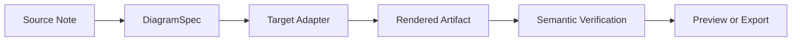
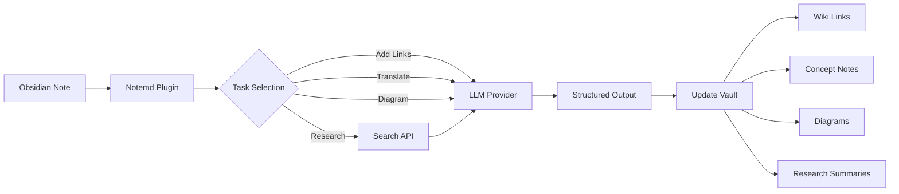

import TLDR from '@site/src/components/TLDR';

# Introduktion till Notemd

<TLDR>
**Notemd** (Note + EMD — Enhanced Markdown Documents) är en öppen källkodig Obsidian-plugin som omvandlar läsning med LLM till persistent kunskap. Till skillnad från chat-baserad AI där insikter försvinner efter sessionen skriver Notemd resultaten **direkt in i din vault** som wiki-länkar, konceptnoter, forskningssammanfattningar, översättningar, arbetsflöden och diagram. Det är byggt för forskare, studenter och kunskapsarbetare som vill att läsning, forskning och visuella förklaringar ska ackumuleras till en strukturierad, utvecklande kunskapsgraph.
</TLDR>

## Vad är Notemd?

Notemd integrerar **30+ stora språkmodeller** (OpenAI, Anthropic, Google, DeepSeek, Qwen, Ollama och fler) i ditt Obsidian-arbetsflöde för att automatisera kunskapsutvinning, organisering, översättning, forskning och diagramgenerering.

### Nyckelforskell: Tillfällig kontra persistent kunskap

| Aspekt | Chat-baserad AI (ChatGPT osv.) | Notemd |
|--------|-------------------------------|--------|
| **Vart resultaten hamnar** | Chathistorik (försvinner) | Din Obsidian vault (förblir kvar) |
| **Format** | Vanlig textantworter | Strukturerade filer: `[[wiki-links]]`, konceptnoter, diagram |
| **Långsiktig värde** | Måste fråga om igen varje gång | Ackumuleras till en kunskapsgraph |
| **Offlineåtkomst** | Kräver internet | Fungerar fullt offline med Ollama |

## Kärnfunktioner

### 1. **Automatisk wiki-länkning**
- LLM identifierar viktiga koncept i dina anteckningar
- Infogar `[[wiki-links]]` vid varje förekomst
- Skapar valfritt länkade konceptanteckningar
- Synonymsuppression för att undvika duplicater

### 2. **Generering av konceptanteckningar**
- Extraherar kärnkoncept från artiklar, rapporter och anteckningar
- Genererar specialiserade konceptfiler med baklänkar
- Anpassningsbara utdatavägar och mallar

### 3. **Integration av webbundersökning**
- Söker Tavily eller DuckDuckGo inom Obsidian
- LLM sammanfattar resultaten med källciteringar
- Lägger till forskningsresultat i den nuvarande anteckningen

### 4. **Flerspråkig översättning**
- Översätta utvalda delar eller hela anteckningar
- Stöder över 21 UI språk
- Oberoende konfiguration av utdataSpråk
- Stöd för batchöversättning

### 5. **Diagramgenerering**
- **Mermaid**: Flödesscheman, sekvens-, klass-, tillstånds-, ER- och Gantt-diagram
- **JSON Canvas**: Obsidian inhemska layouter
- **Vega-Lite**: Datachartar, tidsserier och spridningsdiagram
- **HTML / Redigerbara HTML/SVG**: Självständiga figurartefakter med semantiska annoteringar
- **Draw.io / Gränser för Drawnix-artefakter**: Exportvägar för underhållare från samma semantiska figurmodell
- **Vägkartan för kretsdiagram**: Stöd för circuitikz/TikZJax utformas kring guldreferenser, begränsade prompter, renderingsfeedback och validering av topologi/layout istället för råa, obegränsade LLM TikZ
- **Förhandsvisningsdiagnostik**: Renderade artefakter kan visa kompilations- och renderingsdiagnostik, och icke-inline-källor kan inspekteras utan att ett LaTeX-körningssystem på plugin-sidan krävs
- Automatisk syntaxrätting för Mermaid-fel

### 6. **En-klicks-arbetsflöden**
- Koppla samman flera åtgärder till sidofältsknappar
- DSL-baserad definition av arbetsflöde
- Exempel: `add-links > extract-concepts > research > diagram`

## Vem bör använda Notemd?

✅ **Forskare** som läser artiklar och skapar litteraturöversikter
✅ **Studenter** som organiserar studieanteckningar och skapar konceptkartor
✅ **Kunskapsarbetare** som vill att läsinsikterna ska förbli kvar
✅ **Tvåspråkiga experter** som behöver översättning + wiki-länkar
✅ **Privatskapsinriktade användare** som vill ha lokalt LLM-stöd (Ollama)
✅ **Kraftanvändare** som anpassar instruktioner och arbetsflöden

## Varför Notemd + Obsidian?

**Obsidian** är en lokalt fokuserad, markdown-baserad kunskapsbas. **Notemd** tillför AI-superpoder:
- Dina data förblir i din säkerhetslåda (inte en molntjänst)
- Fungerar offline med lokala modeller
- Gratis och öppen källkod (MIT-licens)
- Integrerar med befintliga Obsidian-pluginer
- Skalas till tiotusentals noter

## Starta

1. **Installera**: Inställningar → Community Plugins → Sök → "Notemd"
2. **Konfigurera**: Lägg till din LLM-leverantörs API-nyckel (eller använd lokalt Ollama)
3. **Prova**: Öppna en nota → Högerklick → "Processera fil (lägg till länkar)"
4. **Utforska**: Kolla i sidofältet efter en-klicks-arbetsflöden

👉 [Installation guide](./getting-started/installation) | [Snabbstartstutorial](./getting-started/quick-start)

## Riktning för diagramfunktioner

Notemds diagramarbete flyttar sig bort från att "be modellen skriva en syntaxsträng" mot en lagrad pipeline:

Den nuvarande implementationen stöder redan Mermaid, JSON Canvas, Vega-Lite, HTML-fallback, redigerbara HTML/SVG, Draw.io XML-artefakter, en minimal Drawnix JSON-undermängd, förhandsvisningsdiagnostik/källor-endast-fallback samt en offline `CircuitSpec -> circuitikz`-prototyp för vanliga källor och CMOS-inverter-guldmallar. Kretsdiagram är en svårare klass: circuitikz kan uttrycka exakt elektrisk topologi, men obegränsad LLM-utdata ger ofta oläsbar routning eller LaTeX som inte renderas. Nästa riktning är att hålla circuitikz begränsad med guldreferensmallar, nodgridslayoutregler, renderingsdiagnostik och skärmbildsåterkopplingsloopar.

Läs detaljerna i [Diagrams](./features/diagrams).

## Arkitektur

## Notemd kontra andra Obsidian AI-plugin

De flesta Obsidian AI-plugin är samtalstillförlitna (du frågar, AI svarar, insikter stannar i chatten). Notemd är **skrivningstillförlitligt**: AI bearbetar dina noter och skriver strukturerade resultat direkt till din säkerhetslåda.

| Funktioner | Notemd | Copilot | Smart Connections | Text Generator |
|-----------|--------|---------|-------------------|-----------------|
| Automatisk wiki-länkinsättning | Ja | Nej | Nej | Nej |
| Konceptnotergenerering | Ja (med baklänkar + deduplikering) | Nej | Nej | Nej |
| Diagramgenerering | Ja (Mermaid, Canvas, Vega-Lite, HTML, redigerbara artefakter) | Nej | Nej | Nej |
| Integration av webbenheter | Ja (Tavily + DuckDuckGo) | Nej | Nej | Nej |
| Batchhantering av mappar | Ja | Begränsad | Nej | Begränsad |
| Modellrutning per uppgift | Ja (7 uppgifter, oberoende modeller) | Nej | Nej | Nej |
| En-klicks-arbetsflödeskedjor | Ja (DSL) | Nej | Nej | Nej |
| Översättning (batch) | Ja | Nej | Nej | Nej |
| Chatt med säkerhetslådan | Nej | Ja | Nej | Nej |
| Semantisk likhetsökning | Nej | Nej | Ja | Nej |
| Generering baserad på mallar | Nej | Nej | Nej | Ja |
| LLM leverantörer | 36 (cloud + gateway + lokal) | 3-5 | 2-3 | 3-5 |
| Fullt offline | Ja (Ollama) | Delvis | Delvis | Delvis |

**När du väljer Notemd**: Du vill att AI ska skapa en permanent kunskapsgraph – inte bara chatta om dina anteckningar.

**När du väljer Copilot**: Du vill ha en konversationsbaserad AI-assistent inuti Obsidian.

**När du väljer Smart Connections**: Du vill upptäcka befintliga samband mellan anteckningar med hjälp av semantisk sökning.

## Filosofi

**Notemd anser att AI bör komplettera mänskligt kunskapsarbete, inte ersätta det.** Pluginen:
- Håller dig under kontroll (granska innan du tillämpar förändringar)
- Bevarar kontexten (alla resultat länkar tillbaka till källan)
- Respekterar integriteten (lokalt LLM-stöd, inga telemetriedata)
- Kan utökas (öppna APIs, anpassade arbetsflöden)

<!-- notemd-acknowledgments -->
## Tack och referensprojekt

Notemd underhålls oberoende. Vi tackar de öppna källkodsprojekt och gemenskaper som har påverkat dokumenterade designbeslut eller tillhandahåller integrationsgrunder. Uppräkningen erkänner endast påverkan eller interoperabilitet; den innebär inte godkännande, anknytning, medföljande kod eller ett påstående om återanvändning av kod.

- **Referensprojekt:** [cloudy-tech-diagrams-skill](https://github.com/cloudy-liu/cloudy-tech-diagrams-skill), [Drawnix](https://github.com/plait-board/drawnix), [diagrams.net / draw.io](https://www.diagrams.net/), [repo-saga](https://github.com/teee32/repo-saga).
- **Grunder med öppen källkod:** [Mermaid](https://github.com/mermaid-js/mermaid), [Vega-Lite](https://vega.github.io/vega-lite/), [Slidev](https://github.com/slidevjs/slidev), [CircuitikZ](https://github.com/circuitikz/circuitikz), [Tectonic](https://github.com/tectonic-typesetting/tectonic), [Docusaurus](https://docusaurus.io).
- Varje projekt behåller sin egen licens och sina egna villkor; Notemd är tillgängligt under [MIT-licensen](https://github.com/Jacobinwwey/obsidian-NotEMD/blob/main/LICENSE).

## Öppen källkod

- **Licens**: MIT
- **Källkod**: [github.com/Jacobinwwey/obsidian-NotEMD](https://github.com/Jacobinwwey/obsidian-NotEMD)
- **Samhälle**: [Discord](https://discord.gg/qnGgsQ9W) | [GitHub Discussions](https://github.com/Jacobinwwey/obsidian-NotEMD/discussions)
- **Bidra**: PR:er välkomna, se [CONTRIBUTING.md](https://github.com/Jacobinwwey/obsidian-NotEMD/blob/main/CONTRIBUTING.md)

---

**Nästa steg**: [Installation →](./getting-started/installation)
