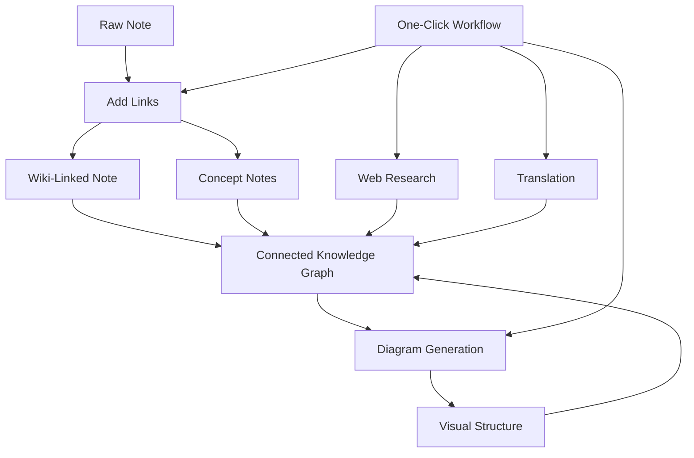

import TLDR from '@site/src/components/TLDR';

# Obsidian Guide till AI-kunskapshantering

<TLDR>
**Notemd omvandlar LLM-driven läsning till permanent kunskap: wiki-länkar kopplar samman koncept, konceptanteckningar skapar en hämtbar graf, forskning tar in webben i din förvaring, översättning bryter språkbarriärer, diagram gör strukturen synlig, och arbetsflöden sammanfogar allt med en klick.** Denna guide täcker hela processkedjan – från råa anteckningar till en sammanlänkad, visuell, flerspråkig kunskapsbas.
</TLDR>

## Varför AI-kunskapshantering?

Traditionell anteckningsfattning ger platta filer. Även med manuella wiki-länkar förblir de flesta anteckningar oanslutna. Notemd använder LLM för att automatisera anslutningslagret:

- **LLM läser din innehåll** och identifierar vad som är viktigt – termer, metoder, personer, teorier
- **Länkar införs automatiskt** vid varje konceptuppträdande, inte gömda i “se även”
- **Konceptanteckningar genereras** som självständiga, hämtbara filer
- **Forskning berikar anteckningarna** med webbbasad kontext
- **Diagram gör strukturen synlig** – tankkartor, flödesscheman, datagram från samma innehåll

Resultatet: en kunskapsgraf som växer med varje anteckning du bearbetar, inte bara när du minns att lägga till länkar.

## Hela processkedjan



Varje steg är oberoende. Använd ett eller alla. Den mest effektiva sekvensen: **Lägg till länkar → Konceptanteckningar → Diagram**.

---

## 1. Wiki-länkar: Att göra kopplingar explicita

Wiki-länkar är ryggraden i en kunskapsgraf. Notemd använder en LLM för att:

1. Läs innehållet i din anteckning (delas upp i delar för långa dokument)
2. Identifiera kärnkoncept – ge prioritet till specifika, tekniska termer framför generiska substantiv
3. Infoga `[[wiki-links]]` vid varje förekomst
4. Skrämma in synonym så att "ML" och "Machine Learning" inte skapar separata noder

### När att använda

- **Varje anteckning >100 ord** – kortare anteckningar ger få koncept
- **Forskningsartiklar, tekniska dokument, mötesanteckningar** – rika på domänspecifika termer
- **Efter att innehållet är stabilt** – bearbeta inte upprepade utkast

### Viktiga inställningar

| Inställning | Rekommenderat | Anledning |
|---------|-----------|-----|
| `addLinksProvider` | DeepSeek eller GPT-4o-mini | God noggrannhet till låg kostnad |
| Synonymskrämmning | Aktiv | Förhindrar dubbledda noder |
| Context window | Paragraf | Balans mellan noggrannhet och kostnad |

→ [Wiki-Links deep dive](/docs/features/wiki-links)

---

## 2. Konceptnoter: Återvinnabara kunskapsnodlar

Wiki-länkar kopplar idéer inlänt, men konceptnoter gör att varje idé kan återvinnas oberoende. Varje koncept får sin egen `.md`-fil:

```markdown
# Machine Learning

## Linked From
- [[My Research Notes]]
- [[Neural Networks Explained]]
```

### Extraktionsprocessen

Prompten för LLM är mycket strukturerad:
- Normalisera till singularform
- Föredra flerordiga koncept framför enstaka ord (“Dielectric Relaxation” inte “Relaxation”)
- Hoppa över referens- och bibliografisektioner
- Exportera som `CONCEPT:`-rader för deterministisk parsing

Koncept dedupliceras mellan delar med hjälp av `Set<string>`. LLM-fel i enskilda delar avbryter inte operationen.

### Backlänkar

När det aktiveras spårar varje konceptnot vilka källanoter som nämner den. Obsidian:s inbyggda backlänkpanel visar också omvända kopplingar.

### Deduplikering

Notemd:s 4-stegs dedupleringsmotor fångar upp:
1. **Exakt match** — jämförelse av filnamn oberoende av stavning
2. **Mångform** — "Models.md" kontra "Model.md"
3. **Symbolnormalisering** — "A-B.md" kontra "A B.md"
4. **Enordig innehåll** — "ML.md" markeras när "Machine Learning.md" finns

### Nyckelinställningar

| Inställning | Rekommenderat | Anledning |
|---------|-----------|-----|
| `conceptNoteFolder` | `concepts/` eller `🧠 concepts/` | Håller säkringsarkivet organiserat |
| `extractConceptsAddBacklink` | Aktivt | Möjliggör omvänd sökning |
| `extractConceptsMinimalTemplate` | Inaktivt | Komplettt mall med Linked From |
| Modell per uppgift | DeepSeek | Konceptextraktion behöver inte dyra modeller |
| Synonymsuppression | Aktivt | Samma inställning påverkar både länkning och extraktion |

→ [Concept Notes deep dive](/docs/features/concept-notes)

---

## 3. Forskning: Att integrera webben

Notemd integrerar webbsökning i din anteckningsarbetsflöde:

1. **Frågekonstruktion** — ditt anteckningstitel eller utvald del blir en sökfråga
2. **Webbsökning** — Tavily (rekommenderat, krävs API-nyckel) eller DuckDuckGo (gratis, inga nycklar)
3. **LLM sammanfattning** — sökresultaten sammanfattas till en relevant sammanfattning
4. **Lägg till i anteckning** — sammanfattningen läggs till vid markörspositionen eller som en ny sektion

### När att använda

- För innan du bearbetar ett nytt ämne — få först webbkontext
- När en konceptanteckning behöver berikning — forska sedan och lägg till länkar
- För litteraturöversikter — forska i batch på en mapp med anteckningar

### Viktiga inställningar

| Inställning | Rekommenderat | Anledning |
|---------|-----------|-----|
| `researchProvider` | GPT-4o eller Claude | Forskning kräver högre kvalitet på sammanfattning |
| Sökservice | Tavily | Bättre relevans, konfigurerbar djup |
| `maxResearchContentTokens` | 4000 | Balans mellan djup och kostnad |

→ [Research deep dive](/docs/features/research)

---

## 4. Översättning: Att bryta språkbarriärer

Notemd översätter anteckningar med den konfigurerade LLM-en din – inte en dedikerad översättnings API-en. Det innebär att.

- **Kontextmedvetna översättningar** – LLM förstår hela dokumentet, inte bara mening för mening
- **Hantering av tekniska termer** – "gradient descent" förblir "梯度下降" och inte "坡度向下"
- **Batch-stöd** – översätt en hel mapp med anteckningar i en enda operation
- **Modell per uppgift** – använd Gemini Flash för översättning (snabb, billig, flerspråkig)

### Språkstöd

Notemd stöder självt 21 UI-språk. Översättningsmålsspråket kan konfigureras per uppgift. Vanliga par: EN↔ZH, EN↔JA, EN↔KO, EN↔DE, EN↔FR, EN↔ES.

→ [Translation deep dive](/docs/features/translation)

---

## 5. Diagram: Att göra strukturen synlig

Notemd-s diagrampipeläine är specifikationsfokuserad: LLM skapar en strukturierad `DiagramSpec` JSON, och sedan översättningsadapter översätter den till målformatet. Det ger mer tillförlitlig utdata än att be LLM om rå Mermaid-syntax.

### Avsiktsdetektering

Notemd infär den bästa diagramtypen från innehållet:

- **Tabeller med siffror** → datachart (Vega-Lite)
- **Klient/server-vokabulär** → sekvensdiagram (Mermaid)
- **Entitet/huvudnyckel** → ER-diagram (Mermaid)
- **Steg/processflöde** → flödesschema (Mermaid)
- **Konceptkartas nyckelord** → JSON Canvas (Obsidian native)
- **Standard** → tankkartan (Mermaid)

### Rendering Chain

Huvudmål → fallback → fallback → HTML. Om Mermaid-syntaxen misslyckas försöker systemet en gång till med felkontext till LLM, och faller sedan tillbaka till ett minimalt diagram.

### Nyckelinställningar

| Inställning | Rekommenderat | Anledning |
|---------|-----------|-----|
| `enableExperimentalDiagramPipeline` | Aktivt | Bättre kvalitet genom specifikation först |
| `experimentalDiagramCompatibilityMode` | `best-fit` | Native-mål per avsikt |
| `summarizeToMermaidProvider` | GPT-4o eller Claude | Diagramspecifikationer kräver rumslig resonemang |
| `autoMermaidFixAfterGenerate` | Aktivt | Fångar LLM-syntaxfel automatiskt |
| Lokal kunskapsförstärkning | Aktiverat för domänspecifikt användning | Förbättrar noggrannheten med vault-kontext |

→ [Diagramdjupdykning](/docs/features/diagrams)

---

## 6. Arbetsscheman: En-klicksautomatisering

Arbetsscheman kopplar samman flera uppgifter i en enda sidofältsknapp. DSL-formatet är:

```
task1 | task2 | task3
```

Exempel: `addLinks | extractConcepts | generateDiagram` — bearbeta en anteckning från råtext till en fullt kopplad, visuell kunskapsnod med en enda klick.

### Rekommenderade arbetsscheman

| Arbetsflöde | Kedja | Användningsfall |
|----------|-------|----------|
| Fullständig process | `addLinks \| extractConcepts \| generateDiagram` | Nya anteckningar |
| Forskning först | `research \| addLinks` | Okända ämnen |
| Polyglot | `translate \| addLinks` | Flerspråkiga anteckningar |
| Endast diagram | `generateDiagram` | Snabb visualisering |

→ [Workflows deep dive](/docs/features/workflows)

---

## 7. LLM leverantörer: 36 alternativ från moln till lokalt

Notemd stöder 36 leverantörer över 4 transporttyper. Nyckelgrupper:

- **Internationellt moln**: OpenAI, Anthropic, Google, Mistral, xAI
- **Kinesiskt moln**: DeepSeek, Qwen, Doubao, Moonshot, GLM, Baidu, SiliconFlow
- **Gångvägar**: OpenRouter, GitHub Models, Hugging Face, Vercel
- **Lokalt**: Ollama, LMStudio, OVMS — inget API-nyckel, inga data lämnar din dator

### Strategi för modellhantering per uppgift

Den mest kostnadseffektiva konfigurationen använder billiga modeller för enkla uppgifter och kraftfulla modeller för komplexa uppgifter:

```
extractConcepts  → DeepSeek (fast, cheap, accurate enough)
addLinks          → DeepSeek or GPT-4o-mini
research          → GPT-4o or Claude (needs quality)
generateDiagram   → GPT-4o or Claude (needs spatial reasoning)
translate         → Gemini Flash (fast, multilingual)
```

→ [LLM Leverantöröversikt](/docs/providers/overview)

---

## Kontrolllista för att börja

1. **Installera Notemd** — [Community Plugins](/docs/getting-started/installation) (rekommenderat) eller manuellt
2. **Konfigurera en leverantör** — DeepSeek (enklast), OpenAI, eller Ollama (gratis)
3. **Bearbeta din första notis** — högerklick → "Processa fil (lägg till länkar")
4. **Ställ in konceptmapp** — Inställningar → Notemd → Utdata → Konceptmapp
5. **Extrahera koncept** — kör "Extrahera koncept" på samma anteckning
6. **Generera en diagram** — kör "Generera diagram" för att visualisera kopplingarna
7. **Skapa en arbetsflöde** — koppla ihop ovanstående till en en-klick-knapp

## Rekommenderade konfigurationer

### Student (Budget)

```
Provider: DeepSeek (free tier available)
Concept extraction: DeepSeek
Research: DuckDuckGo (free) + DeepSeek
Diagrams: Off (or legacy Mermaid)
Workflows: addLinks | extractConcepts
```

### Forskare (Kvalitet)

```
Provider: GPT-4o (primary)
Concept extraction: DeepSeek (cost savings)
Research: GPT-4o + Tavily
Diagrams: best-fit mode, GPT-4o
Workflows: research | addLinks | extractConcepts | generateDiagram
```

### Privatskapsfokuserad (Endast lokalt)

```
Provider: Ollama (llama3 or qwen2.5:7b)
All tasks: Ollama
Research: DuckDuckGo (free, no API key)
Diagrams: legacy Mermaid mode
```

### Tvåspråkig (ZH + EN)

```
Primary: DeepSeek (Chinese queries)
Translation: Google Gemini Flash
Research: Tavily + DeepSeek (Chinese search context)
Language output: per-task (extractConceptsLanguage: zh-CN)
```

---

## Vanliga mönster

### Mönster: Bearbeta en forskningsartikel

1. Importera PDF-innehåll (eller klistra in)
2. **Forskning** — hämta webbkontext om ämnet
3. **Lägg till länkar** — identifiera och länka till nyckelkoncept
4. **Extrahera koncept** — skapa självständiga anteckningar
5. **Generera diagram** — visualisera artikelnas struktur

### Mönster: Dagliga anteckningars berikning

1. Skriv daglig anteckning
2. **Lägg till länkar** — kopplar idagens idéer till befintliga koncept
3. Konceptanteckningar uppdateras automatiskt med baklänkar

### Mönster: Literaturöversikt

1. Skapa mapp med artiklar/anteckningar
2. **Lägg till länkar i batch** — bearbeta hela mappen
3. **Avdupliera koncept** — rensa nära-duplika anteckningar
4. **Generera diagram** — tankkartan över hela litteraturen

---

*Notemd är öppen källkod (MIT) och fungerar med Obsidian 0.15.0+ på alla plattformar. [Installera nu](/docs/getting-started/installation) eller [se på GitHub](https://github.com/Jacobinwwey/obsidian-NotEMD).*
