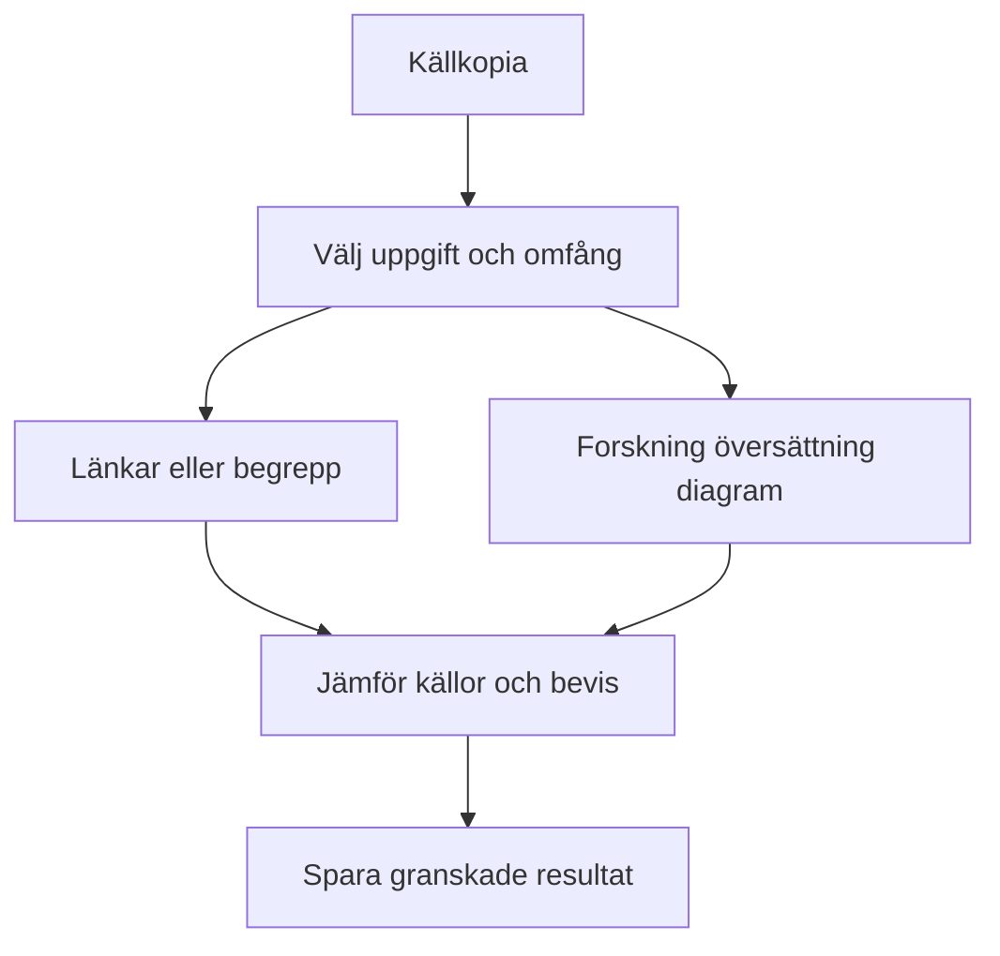

import TLDR from '@site/src/components/TLDR';

# Kunskapshantering med AI i Obsidian

<TLDR>En användbar arbetsmetod skiljer källor, modellsvar och egna rättelser åt. Notemd skapar granskbara länkar, begrepp, forskning, översättning och diagram. Börja med en källa, granska och automatisera sedan en avgränsad mapp.</TLDR>

## Välj resultat

Behöver du länkad anteckning, begrepp, källstödd sammanfattning, översättning eller diagram? Fler filer/länkar garanterar inte förståelse eller sökbarhet. Bestäm hur resultatet kontrolleras och återfinns.

## Hela vägen


```mermaid
flowchart TD
    A[Källkopia] --> B[Välj uppgift och omfång]
    B --> C[Länkar eller begrepp]
    B --> D[Forskning översättning diagram]
    C --> E[Jämför källor och bevis]
    D --> E
    E --> F[Spara granskade resultat]
```

Detta visar möjliga uppgifter, inte samtliga steg i en standardknapp. Bevara källan och granska utdata innan kedjor byggs.

## 1. Länkar: synliggör relationer

Kör **Process file (add links)** och jämför `_processed.md`: termer, citat, kod och formler. Domän-/synonyminstruktioner ger ingen identitetsgaranti eller numerisk tröskel. Deterministisk matchning kan passa bättre för upprepbar länkning till befintliga titlar. [Länkar](./features/wiki-links).

## 2. Begrepp: skilj term och förklaring

Välj mapp. Fristående extraktion bevarar källa och skapar titlar. För `Linked From` i nya filer: bakåtlänkar på, minimal form av. **Batch generate from titles** är separat och kan ta äldre lämpliga filer. Kontrollera complete-flytt och betydelser bakom samma namn. [Begrepp](./features/concept-notes).

## 3. Forskning: bevara bevis

Välj ämne/titel, Tavily eller DuckDuckGo och **Research & summarize**. Tom Tavily-nyckel växlar inte. Öppna källor och kontrollera påståenden. Valfri lexikal lokal hämtning skickar utdrag till vald LLM; lokalt index gör inte vägen offline. [Forskning](./features/research).

## 4. Översättning: betydelse och struktur

Välj målspråk och översätt filen. Standard `_<language>.md` kan ersätta befintlig utdata. Använd tillfällig anteckning för en passage. Granska termer, tal, kod, länkar och matematik; delning kan tappa kontext. UI-/webbplatsspråk bevisar inte språkparkvalitet. [Översättning](./features/translation).

## 5. Diagram: källor för fortsatt arbete

Välj kompatibel kombination och spara källa samt önskad SVG/PNG/PDF. En bild bevisar inte bevarade relationer i annan editor. CircuitikZ har avgränsat stöd/separat kompilering; Drawnix-pilar mellan grenar är statiska, Mermaid/SVG i PPTX kan vara bilder. [Diagram](./features/diagrams).

## 6. Arbetsflöden: automatisera prövade steg

Namn, `::` och åtgärder åtskilda av `>` definierar kedjan:

```text
One-Click Extract::process-current-add-links>batch-generate-from-titles>batch-mermaid-fix
```

Kedjan innehåller länkar, titelgenerering och Mermaid-reparation, ingen generell forskning/diagramåtgärd. Varje stegs krav och utdata gäller. Rapporterat fel stoppar normalt; fortsatt körning kräver att senare steg klarar återstående indata. Avbrott tar inte bort klara resultat. [Arbetsflöden](./features/workflows).

## 7. Leverantörer: uppgift och protokoll

36 profiler täcker fem familjer. Välj utifrån adress, rättigheter, datavillkor och uppmätt kvalitet. Jämför tid/kostnad med samma källa/prompt. Uppgiftsstyrning är initialt av; kontrollera alla vägar innan lokal behandling antas. [Leverantörer](./providers/overview).

## Första kontroller

1. Installera och spara källkopior.
2. Konfigurera och testa exakt modell.
3. Välj begreppsmapp och skilda destinationer.
4. Kör en kopia.
5. Jämför och spara rättelser.
6. Utöka till liten mapp och granska delresultat före längre kedjor.

## Praktiska fall

### Bearbeta en artikel

Konvertera externt till Markdown och granska tabeller, formler och figurer. Extrahera begrepp/passager, undersök precisa frågor och rita bara verifierbara relationer. Behåll original och rättelser.

### Underhåll begrepp

Separat mapp, granskade termer och genererad förklaring för ett valt urval. Säkerhetskopiera före städning. Antal ersätter inte tydliga definitioner eller användbar navigation.

### Privat material

Förbered lokal server, modeller och beroenden. Kontrollera vägar och undvik nätverksforskning där så krävs. Granska rapporter före delning. En loopbackstandard hindrar inte en extern konfiguration.

### Återuppta batch

Vänta på avslut efter fel/avbrott, granska rapport, resultat och återställning, jämför konflikter och kör riktat igen. Avbrutet betyder inte tomt. Kontrollera referenser före borttagning av följeslagarfiler.

## Nästa steg

- [Snabbstart](./getting-started/quick-start).
- [Batcher](./advanced/batch-processing).
- [Utvecklare](./developers/overview).
- [Agenter](./agents/overview).
