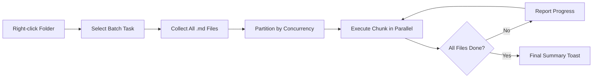

import TLDR from '@site/src/components/TLDR';

# การประมวลผลแบบกลุ่ม

<TLDR>
**Notemd จะประมวลผลโฟลเดอร์ทั้งหมดในครั้งเดียว โดยสามารถกำหนดค่าความพร้อมใช้งานพร้อมกันและการควบคุมการเขียนทับได้** คลิกขวาที่โฟลเดอร์เพื่อเพิ่มลิงก์ wiki แบบกลุ่ม ดึงข้อมูลแนวคิด ทำการวิจัย หรือแปลบันทึกทั้งหมดภายในโฟลเดอร์ ขีดจำกัดความพร้อมใช้งานพร้อมกันจะช่วยป้องกันข้อผิดพลาดด้านการจำกัดอัตรา API จะมีการรายงานความคืบหน้าสำหรับแต่ละไฟล์ พฤติกรรมการเขียนทับสามารถกำหนดได้ ได้แก่ ข้ามไฟล์ที่มีอยู่ แทรกท้าย หรือแทนที่ ไฟล์ที่ล้มเหลวจะถูกบันทึกไว้โดยไม่ทำให้การประมวลผลแบบกลุ่มหยุดลง

นี่เป็นส่วนหนึ่งของ [Obsidian คู่มือการจัดการความรู้ด้วย AI](/docs/pillar-ai-knowledge)
</TLDR>

## ภาพรวม

การประมวลผลแบบกลุ่มจะเปลี่ยนโฟลเดอร์ที่มีบันทึกให้กลายเป็นการดำเนินการเพียงครั้งเดียว แทนที่จะเปิดบันทึกแต่ละไฟล์แล้วรันคำสั่งแยกกัน คุณเพียงแค่คลิกขวาที่โฟลเดอร์แล้วเลือกงานที่ต้องการ Notemd จะทำการดำเนินการกับไฟล์ `.md` ทุกไฟล์ ใช้คำสั่งที่เลือกไว้ และรายงานความคืบหน้าแบบเรียลไทม์

คุณสมบัตินี้มีความสำคัญอย่างยิ่งสำหรับการดึงข้อมูลความรู้ทั่วทั้ง vault ตัวอย่างเช่น หลังจากนำเข้า PDF หลายสิบไฟล์ การเพิ่มลิงก์แบบกลุ่มตามด้วยการดึงข้อมูลแนวคิดแบบกลุ่มจะช่วยสร้างกราฟความรู้ของคุณได้ภายในไม่กี่นาที แทนที่จะใช้เวลาหลายชั่วโมง

## หลักการทำงาน

### แบบจำลองการดำเนินการแบบกลุ่ม

1. **การรวบรวมไฟล์** -- Notemd จะสแกนโฟลเดอร์เป้าหมายแบบเรียกซ้ำ (หรือเฉพาะระดับบนสุดตามการตั้งค่า) และรวบรวมไฟล์ `.md` ทั้งหมด
2. **การแบ่งกลุ่มความพร้อมใช้งานพร้อมกัน** -- ไฟล์จะถูกแบ่งออกเป็นส่วนย่อยตามการตั้งค่า `batchConcurrency` แต่ละส่วนย่อยจะทำงานพร้อมกัน ในขณะที่ส่วนอื่นๆ จะทำงานตามลำดับ
3. **การดำเนินการ** -- แต่ละไฟล์จะถูกประมวลผลโดยใช้ตรรกะเดียวกันกับคำสั่งสำหรับไฟล์เดี่ยว การตั้งค่าของผู้ให้บริการและโมเดลสำหรับแต่ละงานจะได้รับการเคารพ
4. **การรายงานความคืบหน้า** -- จะมีการแจ้งเตือนแบบ toast อัปเดตหลังจากที่แต่ละไฟล์เสร็จสิ้น โดยแสดงความคืบหน้า `N / Total`
5. **การจัดการข้อผิดพลาด** -- หากไฟล์ใดล้มเหลว (ข้อผิดพลาด API การหมดเวลาการเชื่อมต่อเครือข่าย ฯลฯ) ข้อผิดพลาดนั้นจะถูกบันทึกไว้และการประมวลผลแบบกลุ่มจะดำเนินต่อไป สรุปสุดท้ายจะแสดงรายชื่อไฟล์ที่ล้มเหลวทั้งหมด
6. **การเสร็จสิ้น** -- จะมีการแจ้งเตือนแบบ toast สรุปจำนวนไฟล์ที่ประมวลผลเสร็จสิ้น จำนวนที่ประสบความสำเร็จ และจำนวนที่ล้มเหลว

### พฤติกรรมการเขียนทับ

เมื่อประมวลผลไฟล์ที่มีลิงก์ wiki, บันทึกแนวคิด หรือการแปลอยู่แล้ว พฤติกรรมของ Notemd จะขึ้นอยู่กับการตั้งค่าการเขียนทับ:

| โหมด | พฤติกรรม |
|------|----------|
| **ข้าม** | เนื้อหาที่มีอยู่จะไม่ถูกแก้ไข จะมีการประมวลผลเฉพาะไฟล์ที่ยังไม่ได้รับการแก้ไขเท่านั้น. |
| **เพิ่มท้าย** (ค่าเริ่มต้น) | จะมีการเพิ่มเนื้อหาใหม่เข้าไป ส่วนลิงก์ wiki, แนวคิด หรือการแปลที่มีอยู่เดิมจะยังคงอยู่. |
| **แทนที่** | จะมีการประมวลผลไฟล์ใหม่ทั้งหมด การแก้ไขก่อนหน้านี้ทั้งหมดของ Notemd จะถูกเขียนทับ. |

สำหรับการสร้างลิงก์ wiki โดยเฉพาะ: หากบันทึกใดมี `[[wiki-links]]` อยู่แล้ว โหมด **ข้าม** จะไม่แตะต้องบันทึกนั้น ในขณะที่โหมด **แทนที่** จะส่งบันทึกทั้งหมดไปยัง LLM เพื่อให้มีการสร้างลิงก์ใหม่ ควรใช้ **ข้าม** สำหรับการประมวลผลแบบทีละน้อย และใช้ **แทนที่** สำหรับการประมวลผลใหม่หลังจากอัปเกรดโมเดล.

### การควบคุมความพร้อมกัน

การตั้งค่า `batchConcurrency` จะจำกัดจำนวนการเรียกใช้ API แบบขนาน ซึ่งช่วยป้องกันข้อผิดพลาดด้านอัตราการใช้งาน (HTTP 429) เมื่อประมวลผลโฟลเดอร์ขนาดใหญ่กับผู้ให้บริการที่มีข้อจำกัดอัตราการใช้งานที่เข้มงวด.

| ความพร้อมกัน | แนะนำสำหรับ | ผลกระทบต่ออัตราการใช้งานโดยทั่วไป |
|-------------|----------------|---------------------------|
| `1` | ระดับฟรี, ผู้ให้บริการที่เข้มงวด | ไม่มี (serial) |
| `3` (ค่าเริ่มต้น) | ผู้ให้บริการคลาวด์ส่วนใหญ่ | ต่ำ |
| `5` | Ollama (ท้องถิ่น), ระดับที่ใจกว้าง | ไม่มี / ต่ำ |
| `10` | โมเดลท้องถิ่นที่มีการประมวลผลเร็ว | ไม่มี |

หากคุณพบข้อผิดพลาด 429 ระหว่างการประมวลผลแบบชุด ให้ลดจำนวนการทำงานพร้อมกันเหลือ 1 หรือ 2

## การตั้งค่า

| การกำหนดค่า | ค่าเริ่มต้น | ผลกระทบ |
|---------|---------|--------|
| `batchConcurrency` | `3` | จำนวนการเรียกใช้ API แบบขนานสูงสุดระหว่างการดำเนินการกับโฟลเดอร์ |
| `batchOverwriteExisting` | `false` | เขียนทับเนื้อหา Notemd ที่มีอยู่แล้ว `false` = โหมดการเพิ่มเติม. |
| `batchSkipProcessed` | `false` | ข้ามไฟล์ที่มีตัวกำหนด Notemd อยู่แล้ว (เช่น ลิงก์ wiki) |
| `batchRecursive` | `true` | รวมไดเรกทอรีย่อยเมื่อสแกนโฟลเดอร์ |
| `enableStableApiCall` | `false` | เปิดใช้งานตรรกะการทดลองใหม่ (สูงสุด 4 ครั้ง) ต่อไฟล์ในรูปแบบแบตช์ |

### Per-Task Models in Batch

แต่ละการดำเนินการแบตช์จะใช้โมเดลที่สอดคล้องกับแต่ละงาน โดย batch-add-links ใช้ `addLinksProvider`, batch-research ใช้ `researchProvider` และอื่นๆ เช่นกัน ซึ่งหมายความว่าคุณสามารถกำหนดโมเดลราคาถูกสำหรับการดำเนินการจำนวนมาก และเก็บโมเดลราคาแพงไว้สำหรับงานที่ต้องการคุณภาพสูง.

## Example

คุณมีโฟลเดอร์ `papers/` ที่มีบันทึกการวิจัยที่นำเข้ามา 40 ไฟล์ คุณต้องการเพิ่มลิงก์ wiki และดึงคอนเซ็ปต์จากไฟล์เหล่านั้นทั้งหมด:

1. คลิกขวาที่โฟลเดอร์ `papers/`
2. เลือก **"Notemd: Process folder (add links)"**
3. Notemd จะสแกนโฟลเดอร์ ค้นหาไฟล์ `.md` จำนวน 40 ไฟล์ และประมวลผลทีละ 3 ไฟล์ (ความสามารถในการทำงานพร้อมกันตามค่าเริ่มต้น)
4. จะมีแถบข้อความแสดงความคืบหน้าว่า: `12/40 files processed...`
5. หลังจากประมาณ 3 นาที จะมีแถบข้อความสรุปรายงานว่า: `39 succeeded, 1 failed (API timeout on paper-37.md)`
6. ให้ทำซ้ำด้วย **"Notemd: Process folder (extract concepts)"** เพื่อสร้างบันทึกแนวคิดสำหรับไฟล์ทั้ง 40 ไฟล์

ไฟล์ที่ล้มเหลวจะถูกบันทึกไว้ คุณสามารถรันอีกครั้งเฉพาะกับไฟล์นั้นได้ในภายหลัง.

## เคล็ดลับ

- **เริ่มต้นด้วยความสามารถในการทำงานพร้อมกันในระดับต่ำ** -- หากคุณไม่แน่ใจเกี่ยวกับขีดจำกัดอัตราการใช้งานของผู้ให้บริการ ให้เริ่มต้นด้วย `1` แล้วค่อยๆ เพิ่มขึ้น
- **ใช้โหมดข้ามเพื่อการอัปเดตแบบทีละน้อย** -- หลังจากดำเนินการครั้งแรกจนครบ ให้เปลี่ยนไปใช้ `batchSkipProcessed: true` เพื่อให้มีการประมวลผลเฉพาะบันทึกใหม่ๆ เท่านั้นในการรันครั้งต่อไป
- **เปิดใช้งานการเรียกใช้ API ที่มั่นคง** -- `enableStableApiCall: true` จะเพิ่มตรรกะการทดลองใหม่เพื่อฟื้นตัวจากข้อผิดพลาดเครือข่ายชั่วคราวระหว่างการประมวลผลจำนวนมาก
- **รันอีกครั้งหลังจากอัปเกรดโมเดล** -- หากคุณเปลี่ยนไปใช้โมเดลที่ดีขึ้น ให้ตั้งค่า `batchOverwriteExisting: true` แล้วรันอีกครั้งเพื่อให้ได้ลิงก์และแนวคิดที่ดีขึ้น

---

## ขั้นตอนต่อไป

- [Workflows](/docs/features/workflows) -- รวมงานหมู่เข้าด้วยกันเป็นปุ่มบนแถบด้านข้างที่คลิกได้หนึ่งครั้ง
- [Custom Prompts](/docs/advanced/custom-prompts) -- ปรับแต่งคำสั่งสำหรับการดึงข้อมูลแบบหมู่
- [Troubleshooting](/docs/advanced/troubleshooting) -- แก้ไขข้อผิดพลาดด้านขีดจำกัดอัตราการใช้งานและปัญหาการเชื่อมต่อระหว่างการรันแบบหมู่
- [LLM ผู้ให้บริการ](/docs/providers/overview) -- ข้อมูลอ้างอิงการกำหนดค่าโมเดลต่องาน
