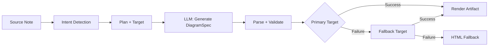
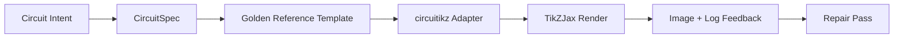

import TLDR from '@site/src/components/TLDR';

# แผนภาพ

<TLDR>
**Notemd จะสร้างแผนภาพจากบันทึกของคุณผ่านกระบวนการที่เน้นสเป็คเป็นหลัก** โดย LLM จะสร้างไฟล์ JSON แบบ `DiagramSpec` ที่ไม่ขึ้นอยู่กับตัวแสดงผล จากนั้นตัวแปลงเฉพาะทางจะแปลงมันให้เป็นรูปแบบ Mermaid, JSON Canvas, Vega-Lite, HTML, HTML/SVG ที่สามารถแก้ไขได้, Draw.io, Drawnix หรือแผนภาพ circuitikz ที่มีข้อจำกัด รองรับความตั้งใจ 9 ประเภท มีระบบ fallback อัตโนมัติ มีการดูตัวอย่างแบบเรียลไทม์พร้อมการส่งออกเป็น SVG/PNG/PDF มีการตรวจสอบเชิงความหมาย และมีระบบสร้างเนื้อหาที่เสริมด้วยข้อมูลในท้องถิ่น
</TLDR>

นี่เป็นส่วนหนึ่งของ [Obsidian คู่มือการจัดการความรู้ด้วย AI](/docs/pillar-ai-knowledge)

## สถาปัตยกรรม: ไพป์ไลน์แบบกำหนดสเปคก่อน

Notemd จะไม่มีวันขอให้ LLM สร้างไวยากรณ์ Mermaid/Vega/Canvas โดยตรง แต่จะทำในลักษณะนี้แทน:



**ทำไมต้องเริ่มจากสเปคก่อน?** LLM มักจะสร้างไวยากรณ์ของเครื่องแสดงผลที่ไม่ถูกต้องบ่อยครั้ง (โดยเฉพาะ Mermaid) ส่วน `DiagramSpec` ที่มีโครงสร้างชัดเจนสามารถตรวจสอบความถูกต้องได้ก่อนการแสดงผล และสเปคเดียวกันนี้ก็สามารถนำไปใช้กับเครื่องแสดงผลหลายตัวเพื่อใช้เป็นทางเลือกสำรองได้

## ประเภทแผนภาพที่รองรับ

| เจตนา | ตัวแสดงผลหลัก | วิธีแก้ปัญหาทดแทน | กรณีการใช้งาน |
|--------|-----------------|-----------|----------|
| `mindmap` | Mermaid | HTML | การแบ่งหัวข้อตามลำดับชั้น |
| `flowchart` | Mermaid | HTML | กระบวนการไหล ต้นไม้การตัดสินใจ |
| `sequence` | Mermaid | HTML | การโต้ตอบระหว่างไคลเอนต์กับเซิร์ฟเวอร์, โปรโตคอล |
| `classDiagram` | Mermaid | HTML | ความสัมพันธ์ระหว่างคลาสใน OOP |
| `erDiagram` | Mermaid | HTML | สเกลาของฐานข้อมูล, ความสัมพันธ์ระหว่างเอนทิตี |
| `stateDiagram` | Mermaid | HTML | เครื่องจักรสถานะ, แบบจำลองวงจรชีวิต |
| `canvasMap` | JSON Canvas | Mermaid → HTML | แผนที่แนวคิด, กราฟความรู้ |
| `dataChart` | Vega-Lite | Mermaid → HTML | แผนภูมิแท่ง, แผนภูมิเส้น, แผนภูมิพื้นที่, แผนภูมิกระจาย, แผนภูมิวงกลม, ตาราง |
| `circuit` | circuitikz | none | แผนภาพวงจรที่มีข้อจำกัดจากข้อมูล `CircuitSpec` ที่ได้รับการยืนยันความถูกต้อง |

## การตรวจจับเจตนา

Notemd จะประมวลผลหาประเภทแผนภูมิที่เหมาะสมที่สุดจากเนื้อหาบันทึกของคุณโดยใช้การให้คะแนนคำสำคัญ:

| เจตนา | ตัวกระตุ้น | ระดับความมั่นใจ |
|--------|----------|------------|
| `dataChart` | ตาราง, เซลล์ตัวเลข, คำสำคัญที่บ่งบอกตัวชี้วัด/แนวโน้ม, เปอร์เซ็นต์ | 0.88 |
| `sequence` | คำศัพท์การร้องขอ/การตอบกลับ (4 ครั้งขึ้นไป) หรือตัวกำหนด `->`/`=>` | 0.82 |
| `erDiagram` | คีย์หลัก, คีย์ภายนอก, เอนทิตี, สเกลา (2 ครั้งขึ้นไป) | 0.80 |
| `stateDiagram` | สถานะ, การเปลี่ยนแปลงสถานะ, รออยู่, กำลังทำงาน, ล้มเหลว (3 ครั้งขึ้นไป) | 0.76 |
| `flowchart` | ขั้นตอนที่มีหมายเลข (2 ขั้นตอนขึ้นไป) หรือคำศัพท์ workflow เช่น if/then/else | 0.74 |
| `canvasMap` | แผนภาพแนวคิด, กราฟความรู้, แบบพื้นที่, กลุ่ม | 0.72 |
| `circuit` | circuitikz, TikZJax, circuit, schematic, CMOS, NMOS, PMOS, MOSFET, VDD/GND, `vin`/`vout` | 0.78 |
| `mindmap` | ค่าเริ่มต้นสำหรับกรณีที่ไม่มีตัวเลือกอื่น | 0.55 |

สามารถเปลี่ยนแปลงได้โดยใช้การตั้งค่า **Preferred diagram type**, ตัวเลือกที่แถบด้านข้าง หรือตัวเลือกในพาเล็ตคำสั่งโดยตรง

## การเลือกจุดหมายปลายทางสำหรับการแสดงผล

กระบวนการที่อิงตามสเป็คเชิงทดลองในปัจจุบันมีตัวควบคุมที่แยกจากกันสองตัว:

ตั้งค่า **Preferred render target** เป็น **Auto** เพื่อใช้เป็นค่าเริ่มต้นของตัววางแผน หรือเลือกรูปแบบ Mermaid, JSON Canvas, Vega-Lite, HTML, Editable HTML/SVG, Draw.io, Drawnix หรือ Circuitikz โดยตรง การเปลี่ยนแปลงนี้จะมีผลเฉพาะกับคำสั่งสร้างไฟล์ผลลัพธ์และคำสั่งดูตัวอย่างเท่านั้น ส่วนคำสั่งมาตรฐาน **Summarise as Mermaid diagram** จะยังคงสร้างผลลัพธ์ในรูปแบบที่เข้ากันได้กับ Mermaid เพื่อไม่ให้กระบวนการทำงานแบบ Markdown ที่มีอยู่เปลี่ยนรูปแบบโดยไม่ได้รับการแจ้งเตือน

การแยกแบบนี้มีความสำคัญ เพราะตอนนี้ความตั้งใจประเภท `flowchart` สามารถถูกแสดงเป็น Mermaid สำหรับบันทึกแบบ Markdown, เป็น HTML สำหรับการ fallback ที่มีความน่าเชื่อถือสูง, เป็น Editable HTML/SVG สำหรับการแก้ไขต่อยอด หรือเป็นไฟล์ต้นฉบับ Draw.io/Drawnix พร้อมไฟล์ SVG สำหรับการตรวจสอบ ส่วนความตั้งใจประเภท `circuit` จะถูกส่งต่อไปยัง Circuitikz และจำเป็นต้องมี `CircuitSpec` ที่ได้รับการยืนยันความถูกต้อง ซึ่งไม่ใช่การขอสร้างข้อความ TikZ แบบสุ่ม
## วิธีการใช้งาน

### สร้างแผนภาพ

1. เปิดบันทึก
2. รันคำสั่ง **"Notemd: Generate diagram"** จากพาเล็ตคำสั่ง
3. Notemd จะตรวจจับเจตนา สร้างสเปค แสดงผล และบันทึกผลลัพธ์

**ไฟล์ผลลัพธ์ตามจุดหมายปลายทาง:**

| เป้าหมาย | รูปแบบการขยาย | รูปแบบชื่อไฟล์ |
|--------|-----------|------------------|
| Mermaid | `.md` | `{note}_summ.md` |
| JSON Canvas | `.canvas` | `{note}_diagram.canvas` |
| Vega-Lite | `.json` | `{note}_diagram.json` |
| HTML | `.html` | `{note}_diagram.html` |
| สามารถแก้ไข HTML/SVG ได้ | `.html` | `{note}_diagram.html` |
| Draw.io | `.drawio` + `.drawio.svg` + `.drawio.md` | `{note}_diagram.drawio` พร้อมไฟล์ประกอบสำหรับการตรวจสอบ |
| Drawnix | `.drawnix` + `.drawnix.svg` + `.drawnix.md` | `{note}_diagram.drawnix` พร้อมไฟล์ประกอบสำหรับการตรวจสอบ |
| Circuitikz | `.tex` + `.tex.svg` + `.tex.md` | `{note}_diagram.tex` พร้อมไฟล์ประกอบสำหรับการตรวจสอบ |

### ดูตัวอย่างแผนภาพ

1. รัน **"Notemd: ดูตัวอย่างแผนภาพ"**
2. หน้าต่างแบบโมดัลจะปรากฏพร้อมแผนภาพที่แสดงผล
3. ใช้ปุ่มบนแถบเครื่องมือเพื่อส่งออกเป็น SVG, PNG หรือ PDF

**การเปิดดูตัวอย่างโดยอัตโนมัติ** มีให้ใช้งานในการตั้งค่า — หลังจากสร้างแล้ว หน้าต่างดูตัวอย่างจะเปิดขึ้นโดยอัตโนมัติ

การส่งออกไฟล์ตัวอย่างในรูปแบบ PNG และ PDF จะใช้ค่า PPI ที่ตั้งค่าไว้ โดยค่าเริ่มต้นคือ 300 PPI และค่าที่สูงกว่า 600 PPI จะถูกจำกัดให้อยู่ที่ 600 ส่วน SVG จะยังคงมีขนาดเป็นแบบเวกเตอร์ ไฟล์ต้นฉบับอย่าง `.drawio`, `.drawnix` และ `.tex` สามารถมีไฟล์ประกอบ `previewSvg` เพื่อให้ Obsidian สามารถแสดงและส่งออกรูปภาพสำหรับการตรวจสอบได้ โดยไม่จำเป็นต้องฝัง diagram.net, Drawnix, LaTeX หรือ TikZJax ไว้ในช่วงเวลาที่โปรแกรมปลั๊กอินทำงาน

หน้าต่างดูตัวอย่างยังมีแผงสรุปข้อมูลการวินิจฉัยของอาร์ทิแฟคอีกด้วย โปรแกรมเรนเดอร์และการตรวจสอบเบื้องต้นสามารถเพิ่มข้อมูล `RenderArtifact.diagnostics` เข้าไปได้ หน้าต่างดังกล่าวจะแสดงสรุปผลการวินิจฉัยพร้อมจำนวนข้อผิดพลาด/คำเตือน/ข้อมูล จากนั้นจึงแสดงระดับความรุนแรง ประเภทของการวินิจฉัย ข้อความ และคำแนะนำในการแก้ไข ไว้ที่ด้านข้างของตัวอย่างที่แสดงอยู่ สรุปผลเดียวกันนี้จะถูกแสดงในรายการประวัติที่รองรับการวินิจฉัยด้วยเช่นกัน ดังนั้นจึงสามารถเปรียบเทียบความพยายามในการตรวจสอบเบื้องต้นของ circuitikz ที่ทำซ้ำกันได้ โดยไม่จำเป็นต้องเปิดดูแต่ละรายการทีละรายการ สำหรับอาร์ทิแฟคที่มีเนื้อหาต้นฉบับแต่ไม่สามารถแสดงผลแบบในไลน์หรือผ่านทางพาธ HTML iframe ได้ ตอนนี้หน้าต่างดังกล่าวจะเปลี่ยนไปใช้การดูตัวอย่างแบบมีเฉพาะเนื้อหาต้นฉบับแทนที่จะบังคับใช้ iframe ที่ว่างเปล่า วิธีนี้ช่วยให้การตรวจสอบการคอมไพล์/การเรนเดอร์ของ circuitikz การตรวจสอบโทเค็นข้อความใน SVG การตรวจสอบภาพหน้าจอที่ว่างในรูปแบบ PNG รายงานการทับกันของไกลฟ์ที่มีเฉพาะพาธ และรายงานการทับกันในอนาคตสามารถมองเห็นผลลัพธ์ได้ผ่าน UI โดยไม่จำเป็นต้องพึ่งพา TikZJax หรือ LaTeX เป็นไลบรารีที่ต้องโหลดเข้ามาใช้งานจริง หรือต้องสมมติว่าเนื้อหาต้นฉบับคือผลแสดงผลที่ได้รับการยืนยันแล้ว

### โหมด Mermaid แบบเก่า

เมื่อ `enableExperimentalDiagramPipeline` ปิดอยู่ Notemd จะส่งคำขอ Mermaid โดยตรงไปยัง LLM ซึ่งจะหลีกเลี่ยงกระบวนการตามสเป็คทั้งหมด หากกระบวนการทดลองล้มเหลว จะย้อนกลับไปใช้โหมดนี้

## แบ็กเอนด์สำหรับการแสดงผล

### Mermaid

มีอะดาปเตอร์ 6 ตัว (mindmap, flowchart, sequence, ER, class, state) ที่แปลง `DiagramSpec` เป็นไวยากรณ์ Mermaid หลังจากสร้างแล้ว `mermaid.parse()` จะทำการตรวจสอบผลลัพธ์ หากการตรวจสอบล้มเหลว:

1. **LLM ลองใหม่** — ทำการทดลองอีกครั้งโดยใช้ข้อความแสดงข้อผิดพลาดของ Mermaid เป็นข้อมูลประกอบ
2. **การย้อนกลับขั้นต่ำ** — แผนภาพ Mermaid แบบง่ายๆ ที่สร้างจาก ID ของโหนดตามสเป็ค

**Legacy Mermaid Fixer** จะซ่อมแซมข้อผิดพลาดด้านไวยากรณ์ LLM ที่พบบ่อยโดยอัตโนมัติ เช่น การปรับรูปแบบคำสั่ง note การหลบหนีของ pipe-label การจัดตำแหน่งเครื่องหมายจุลภาคใหม่ การใช้เครื่องหมายอัญประกาศอัจฉริยะ ลูกศรสองเส้นตรง ความไม่ตรงกันของรูปทรง และอื่นๆ อีกมากมาย.

### JSON Canvas

สร้างรูปแบบ Obsidian JSON Canvas พร้อมการจัดวางในระบบพื้นที่:
- ตำแหน่งของโหนดถูกกำหนดโดยความลึก (x = ความลึก × 420) และดัชนี (y = ดัชนี × 170)
- ความกว้างถูกประมาณค่าจากความยาวของป้าย
- เส้นที่มี `fromSide: 'right'`, `toSide: 'left'`, `toEnd: 'arrow'`

### Vega-Lite

สร้างสเป็ก Vega-Lite v5 JSON ที่สมบูรณ์พร้อมการเข้ารหัสโดยอัตโนมัติ:
- **แผนภูมิแบบคาร์ทีเซียน** (แท่ง/เส้น/พื้นที่/จุด/กระจาย): ช่อง x + y รวมถึงสีสำหรับหลายซีรีส์
- **แผนภูมิพาย**: theta = y (ค่าปริมาณ), สี = x (ค่าชื่อ)
- **ตาราง**: แถว = x, ข้อความ = y + คอลัมน์ = ซีรีส์

โมดูลธีมสีเข้มและสีอ่อนจะถูกรวมเข้าด้วยกันอย่างลึกซึ้งก่อนการคอมไพล์.

### HTML

เป็นตัวเลือกสำรองที่ใช้ได้ทั่วไป มีเอกสาร HTML ที่สามารถใช้งานได้ด้วยตัวเองซึ่งประกอบด้วย:
- หัวข้อ CSP meta
- โหมดสีอ่อน/สีเข้มผ่าน `prefers-color-scheme`
- ป้าย UI ที่ปรับให้เหมาะกับภาษา 20 ภาษา
- ส่วนต่างๆ ได้แก่ hero, structure (ต้นไม้โหนด), relationships, callouts, ตารางซีรีส์ข้อมูล

### สามารถแก้ไข HTML/SVG ได้

เป้าหมายตัวเลขที่ชัดเจนสำหรับกระบวนการส่งออกแบบแก้ไขได้ โดยจะนำ `DiagramSpec` มาประมวลผลเป็น `SemanticFigureModel` ที่มีค่าแน่นอน จากนั้นจึงสร้างเอกสาร HTML ที่สามารถใช้งานได้ด้วยตนเองพร้อมกลุ่ม SVG แบบฝังที่มีคำอธิบายแบบ Draw.io:

- `data-drawio-type`, `data-drawio-id` และ `data-drawio-role` บนโหนดเชิงความหมาย
- `data-drawio-source` และ `data-drawio-target` บนขอบเขตเชิงความหมาย
- รหัสประจำโหนด/ขอบเขตที่มั่นคงหลังจากการปรับรูปแบบช่องว่างและการจัดการการชนกัน
- ไม่มีสคริปต์ ไม่มีฟอนต์ภายนอก และไม่มีทรัพยากรจากระยะไกล

เป้าหมายนี้ยังไม่ได้ถูกตั้งเป็นเส้นทางผู้วางแผนเริ่มต้นโดยเจตนา แต่สามารถใช้เป็นเป้าหมายการแสดงผลที่ชัดเจนได้ในขณะที่เส้นทางผลิตภัณฑ์ยังคงพิสูจน์พฤติกรรมการแก้ไขในเครื่องมือจริงๆ

### Draw.io และ Drawnix ขอบเขตการส่งออก

การใช้งานในปัจจุบันจะจำกัดการรองรับโปรแกรมแก้ไขของบุคคลที่สามไว้ที่ขอบเขตของผลงาน ในขณะที่ยังคงเปิดให้ใช้งานจุดหมายปลายทางสำหรับการแสดงผลอย่างชัดเจนอยู่:

| เป้าหมาย | สัญญา | ความต้องการในระหว่างการทำงาน |
|--------|----------|--------------------|
| Draw.io | XML รูปแบบ `mxfile` ที่ไม่ถูกบีบอัดและมีค่าแน่นอนซึ่งสร้างจาก `SemanticFigureModel` พร้อมไฟล์สำหรับตรวจสอบในรูปแบบ SVG/PNG/PDF | ไม่มีอะไรในช่วงเวลาที่โปรแกรมปลั๊กอินทำงานหรือในกระบวนการ CI |
| Drawnix | เซ็ตย่อของไฟล์ JSON รูปแบบ `.drawnix` ที่มีขนาดเล็กที่สุด โดยใช้องค์ประกอบ `geometry` และ `arrow-line` พร้อมไฟล์สำหรับตรวจสอบในรูปแบบ SVG/PNG/PDF | ไม่มีอะไรในช่วงเวลาที่โปรแกรมปลั๊กอินทำงานหรือในกระบวนการ CI |

การตัดสินใจนี้ทำขึ้นโดยเจตนา: Notemd สามารถตรวจสอบป้ายที่มองเห็นได้ รหัสที่มั่นคง และการครอบคลุมของพื้นฐานที่รองรับได้ โดยไม่จำเป็นต้องฝัง Diagram.net Desktop, Drawnix, Plait หรือสถานะของโปรแกรมแก้ไขที่ใช้งานได้เฉพาะในเบราว์เซอร์เข้าไปในปลั๊กอิน

### circuitikz / TikZJax ทิศทาง

แผนภาพวงจรไม่ใช่ปัญหาเดียวกันกับแผนภาพกระแสทั่วไป รูปแบบไวยากรณ์ที่ถูกต้องสำหรับวงจรไฟฟ้ามักจะเป็น **circuitikz** โดยจะถูกแสดงใน Obsidian ผ่านปลั๊กอินต่าง ๆ เช่น TikZJax TikZJax สามารถโหลดแพ็กเกจต่าง ๆ เช่น `circuitikz`, `pgfplots`, `tikz-cd` และ `chemfig` ได้ ซึ่งทำให้มันเหมาะสำหรับบันทึกเกี่ยวกับฟิสิกส์ วงจรไฟฟ้า เคมี และคณิตศาสตร์

ความเสี่ยงคือ TikZ ที่สร้างขึ้นจาก LLM ในรูปแบบดิบนั้นมีความเปราะบาง:

- โครงสร้างวงจรที่ซับซ้อนอาจถูกต้องทางไฟฟ้าแต่อ่านไม่ออกทางสายตา;
- สายไฟและป้ายที่ทับกันอาจทำให้เน็ตลิสต์ที่ถูกต้องใช้งานไม่ได้สำหรับบันทึกการเรียน;
- การขาดส่วนนำหน้าของแพ็กเกจ การใช้จุดยึดที่ผิด หรือชื่อองค์ประกอบที่ไม่ถูกต้องอาจทำให้ไม่สามารถแสดงผลได้;
- ข้อมูลตอบกลับจากเครื่องแสดงผลมักจะอยู่ในระดับภาพ ในขณะที่ LLM สร้างเรขาคณิตในระดับข้อความ

สถาปัตยกรรมที่ดีกว่าคือการมอง circuitikz เป็นเป้าหมายของแผนภาพที่มีข้อจำกัด ไม่ใช่คำสั่งแบบอิสระ:



โมเดลระดับหนึ่งควรอธิบายโครงสร้างวงจรและการจัดวางแยกกัน:

| ชั้น | หน้าที่ | Example |
|-------|----------------|---------|
| โครงสร้าง | จุดต่อไฟฟ้าและการเชื่อมต่อองค์ประกอบ | `VDD -> RD -> drain(M1)`, `source(M1) -> GND` |
| การจัดวาง | การวางตำแหน่งบนกริด การจัดทิศทาง และเส้นทางการเดินสาย | `M1 at (3,2.2)`, อินพุตด้านซ้าย, เอาต์พุตด้านขวา |
| สไตล์ | แพ็กเกจ, รูปแบบแรงดันไฟฟ้า, ป้ายกำกับ, จุดยึด | `\begin{circuitikz}[american voltages]` |
| การยืนยันความถูกต้อง | ไฟล์บันทึกการคอมไพล์, จุดยึดที่ขาดหาย, การตรวจสอบการทับซ้อน/ภาพหน้าจอ | TikZJax/การวินิจฉัย LaTeX ร่วมกับการตรวจสอบแบบมองเห็นได้ |

### โปรโตทไทป์ circuitikz ปัจจุบัน

Notemd ในปัจจุบันรวมโปรโตทไทป์ของคลังข้อมูลที่มีข้อจำกัดตัวแรกสำหรับทิศทางนี้ โดยถูกตั้งให้อยู่นอกเครือข่ายและถูกจำกัดด้วยแม่แบบ:

```bash
npm run diagram:export-circuitikz -- --input cmos-inverter.json --output cmos-inverter.tex
```

ตัวต้นแบบนี้จะเพิ่มขอบเขต `CircuitSpec` ที่มีข้อจำกัด รวมถึงตัวส่งออกที่มีค่าแน่นอนสำหรับครอบครัวของตัวอย่างมาตรฐานจำนวนหกชนิด:

ในไพป์ไลน์สำหรับสร้างแผนภาพเชิงทดลองนี้ ตอนนี้สามารถเข้าถึงฟีเจอร์นี้ได้ผ่าน `intent: "circuit"` และเป้าหมายการแสดงผล `circuitikz` เช่นกัน ไฟล์ `DiagramSpec` ที่ถูกสร้างขึ้นจะสามารถฝังข้อมูล `circuitSpec` เข้าไปได้ก็ต่อเมื่อมี intent เป็น circuit เท่านั้น `CircuitikzRenderer` จะเขียนโค้ดแหล่งที่มาในรูปแบบ `.tex` ที่มีความแน่นอนเหมือนเดิม พร้อมทั้งสร้างไฟล์ตัวอย่างในรูปแบบ SVG ที่สร้างขึ้นจากโครงสร้างวงจรที่ได้รับการยืนยันแล้ว เพื่อให้สามารถดูตัวอย่างใน Obsidian รวมถึงส่งออกไฟล์ในรูปแบบ SVG/PNG/PDF ได้ ไฟล์ตัวอย่างดังกล่าวไม่ใช่ผลลัพธ์จากการคอมไพล์ LaTeX/TikZJax หลักฐานที่แท้จริงของการคอมไพล์ยังคงอยู่ในคำสั่ง smoke commands ที่ระบุไว้อย่างชัดเจนด้านล่าง

สำหรับแม่แบบ golden template ที่รองรับ `layoutHints.inputSide` และ `layoutHints.outputSide` ยังคงเป็นควบคุมที่ใช้เฉพาะสำหรับการนำเสนอเท่านั้น คุณสามารถใช้ค่าเหล่านี้เพื่อย้ายตำแหน่งของพอร์ตอินพุต/เอาต์พุตที่มีความแน่นอนได้ แต่ไม่สามารถเปลี่ยนลักษณะเฉพาะของโครงสร้างวงจร หรือใช้ในการซ่อมแซมวงจรใหม่ได้

| ประเภทวงจร | อ้างอิงทองคำ | การรับประกันค่ากระแสไฟฟ้า |
|--------------|------------------|-------------------|
| `common-source-amplifier` | `common-source-nmos-v1` | ตรวจสอบ `VDD -> R_D -> M1.D`, `vin -> M1.G`, `M1.S -> GND` และ `M1.D -> vout` ก่อนที่จะเขียน LaTeX |
| `cmos-inverter` | `cmos-inverter-v1` | ตรวจสอบโครงสร้าง PMOS-over-NMOS, อินพุตประตูร่วมกัน, เอาต์พุตดรีนร่วมกัน, `VDD -> MP.S` และ `MN.S -> GND` ก่อนที่จะเขียน LaTeX |
| `cmos-buffer` | `cmos-buffer-v1` | ตรวจสอบสองขั้นตอนของอินเวอร์เตอร์ที่เชื่อมต่อกัน, โหนดกลาง `vmid`, `vout` ที่ได้รับการฟื้นฟู, และราง VDD/GND ที่ใช้ร่วมกันก่อนที่จะเขียน LaTeX |
| `cmos-transmission-gate` | `cmos-transmission-gate-v1` | ตรวจสอบอุปกรณ์ PMOS/NMOS ที่ทำงานพร้อมกันระหว่าง `vin` และ `vout` โดยมีการควบคุม `phib` / `phi` ที่เป็นคู่กันก่อนที่จะเขียน LaTeX |
| `cmos-nand2` | `cmos-nand2-v1` | ตรวจสอบการทำงานของ PMOS แบบดึงขึ้นแบบขนาน, NMOS แบบดึงลงแบบอนุกรม, อินพุตคู่ `va` / `vb` และ `vout` ก่อนที่จะเขียน LaTeX |
| `cmos-nor2` | `cmos-nor2-v1` | ตรวจสอบความถูกต้องของการใช้ PMOS สำหรับการดึงขึ้น, NMOS สำหรับการดึงลงแบบขนาน, อินพุตคู่ `va` / `vb` และ `vout` ก่อนที่จะเขียน LaTeX |

นี่ไม่ใช่เครื่องมือสร้างไฟล์ TikZ ทั่วไป โปรแกรมนี้ไม่รับไฟล์ TikZ แบบสุ่ม ไม่ทำการคอมไพล์ LaTeX ไม่เรียกใช้ TikZJax ไม่ตรวจสอบภาพหน้าจอในระหว่างการทำงานของปลั๊กอิน และไม่ดำเนินการซ่อมแซมภาพโดยอัตโนมัติ ฟีเจอร์เหล่านั้นจะถูกเพิ่มเข้ามาในขั้นตอนต่อไป

คำสั่ง Preview diagram สามารถเปิดไฟล์ต้นฉบับ circuitikz ที่บันทึกไว้อีกครั้งได้โดยตรง เมื่อนามสกุลไฟล์เป็น `.tex` หรือ `.tikz` และไฟล์ต้นฉบับนั้นมีเนื้อหาเป็น `\usepackage{circuitikz}` หรือ `\begin{circuitikz}` วิธีนี้เป็นการดูตัวอย่างแบบมีเฉพาะต้นฉบับเท่านั้นซึ่งเรียกว่า circuitikz โดยหน้าต่างแสดงผลจะแสดงต้นฉบับ ข้อมูลวินิจฉัย ปุ่มสำหรับคัดลอก/บันทึก และข้อมูลเมตาดาต้าเกี่ยวกับประวัติการดำเนินการ แต่จะไม่มีการคอมไพล์ LaTeX หรือเรียกใช้ TikZJax ภายในช่วงเวลาที่ปลั๊กอินทำงาน

ขอบเขตการดูตัวอย่างแบบใช้เฉพาะซอร์สโค้ดเดิมนี้ตอนนี้ครอบคลุมไฟล์ผลลัพธ์ที่ถูกบันทึกไว้ Draw.io และ Drawnix ด้วย ไฟล์ `.drawio` จะได้รับการยอมรับก็ต่อเมื่อมีลักษณะคล้ายกับ Draw.io XML (`mxfile` หรือ `mxGraphModel`) ส่วนไฟล์ `.drawnix` จะได้รับการยอมรับก็ต่อเมื่อมีลักษณะเป็น Drawnix JSON พร้อมกับ `type: "drawnix"` และอาร์เรย์ `elements` ปลั๊กอินยังคงไม่รวมฟีเจอร์ diagrams.net หรือเซิร์ฟเวอร์กระดานขาว Drawnix เข้ามาด้วย การดูตัวอย่างเหล่านี้จะแสดงให้เห็นซอร์สโค้ด ข้อมูลวินิจฉัย และประวัติไฟล์ผลลัพธ์ โดยไม่มีการระบุว่ามีเครื่องมือแก้ไขภาพภายในปลั๊กอิน

สำหรับการซ่อมแซมที่รักษาโครงสร้างเดิมไว้ ให้ส่งข้อมูลสเปกก่อนการซ่อมแซมมาเป็นข้อมูลอ้างอิงก่อนที่จะยอมรับผลลัพธ์ที่ได้รับการซ่อมแซม:

```bash
npm run diagram:export-circuitikz -- --input repaired-cmos-inverter.json --topology-reference cmos-inverter.json --output cmos-inverter.tex
```

ตัวควบคุมการซ่อมแซมจะใช้ `createCircuitTopologySignature` และ `assertCircuitTopologyUnchanged` เพื่อเปรียบเทียบ `circuitKind`, `goldenReferenceId`, เครือข่าย, รหัส/ประเภท/ขั้วต่อของชิ้นส่วน รวมถึงจุดปลายทางการเชื่อมต่อแบบไม่มีทิศทางก่อนที่จะแสดงผลลัพธ์ ส่วนป้ายกำกับ ข้อความหัวข้อ คำแนะนำเรื่องการจัดวาง ลำดับการเชื่อมต่อ และป้ายกำกับการเชื่อมต่อจะถูกละเลยโดยเจตนา ผลลัพธ์ที่เสนอซึ่งเพิ่มองค์ประกอบใหม่เข้ามาหรือปรับเปลี่ยนการเชื่อมต่อของขั้วต่อจะล้มเหลวด้วย `Circuit topology drift detected` ก่อนที่ไฟล์ `.tex` จะถูกเขียนขึ้น

ตอนนี้ CLI สามารถวิเคราะห์ไฟล์บันทึกการคอมไพล์ LaTeX/TikZJax ที่มีอยู่ได้โดยไม่ต้องรันโปรแกรมคอมไพเลอร์:

```bash
npm run diagram:export-circuitikz -- --input cmos-inverter.json --output cmos-inverter.tex --compile-log cmos-inverter.log --diagnostics-output cmos-inverter.diagnostics.json
```

เส้นทางการวินิจฉัยนี้จะรายงานถึงแพ็กเกจที่หายไป เช่น `circuitikz.sty`, คีย์ TikZ/circuitikz ที่ไม่รู้จัก, ข้อผิดพลาดด้านไวยากรณ์ของเส้นทาง TikZ เช่น การขาดเครื่องหมายจุลภาค, อาร์กิวเมนต์ที่เกินมาจากวงเล็บที่ไม่สมดุลหรือป้ายที่ไม่ได้ปิด, ลำดับควบคุมที่ยังไม่ได้นิยาม, ข้อผิดพลาดทั่วไปของ LaTeX, การหยุดทำงานฉุกเฉิน, และคำเตือนเกี่ยวกับการเต็ม `\hbox` เกินขีดจำกัด โดยระบบยังคงใช้ไฟล์บันทึกเหตุการณ์เป็นหลัก: การรัน LaTeX/TikZJax แบบท้องถิ่นและการตรวจสอบคุณภาพในระดับภาพหน้าจอยังคงเป็นงานที่ต้องพัฒนาต่อไปในอนาคต

สำหรับการตรวจสอบเบื้องต้นของผู้ดูแลระบบ  CLI เดียวกันสามารถเรียกใช้เครื่องมือแสดงผลที่กำหนดค่าไว้อย่างชัดเจนได้โดยไม่ต้องมีการประมวลผลคำสั่งในเชลล์:

```bash
npm run diagram:export-circuitikz -- --input cmos-inverter.json --output cmos-inverter.tex --compile-executable pdflatex --compile-arg -interaction=nonstopmode --compile-arg -halt-on-error --compile-arg -output-directory={outputDir} --compile-arg {tex} --expected-artifact {outputDir}/{jobName}.pdf
```

ตัวรันคอมไพล์จะใช้ `shell: false` และขยายตัวแทน `{tex}`, `{outputDir}` รวมถึง `{jobName}` เป็นค่าในอาร์เรย์อาร์กิวเมนต์ จากนั้นอ่าน `{jobName}.log` ที่ถูกสร้างขึ้น และส่งคืน `compileExecution` พร้อมกับ `compileDiagnostics` ในรูปแบบผลลัพธ์ CLI JSON `--compile-executable` คือเพียงที่อยู่ของไฟล์ไบนารีหรือวอร์เปอร์ของเรนเดอร์เท่านั้น ส่วนฟลากของเรนเดอร์จะอยู่ในค่า `--compile-arg` ที่ถูกใช้ซ้ำ ไฟล์ที่ไม่มีเนื้อหาจะล้มเหลวในลักษณะ `compile-executable-invalid` ไฟล์ไบนารีที่ขาดหายไปจะล้มเหลวในลักษณะ `compile-executable-not-found` ส่วนสตริงคำสั่งแบบชェลล์จะได้รับคำแนะนำให้แยกอาร์กิวเมนต์ เพื่อให้ Windows, Linux และ macOS ทำงานตามข้อตกลงการรันโปรแกรมแบบตรงไปตรงมาเดียวกัน เมื่อมี `--expected-artifact` จะมีการรายงาน `compileExecution.renderSmoke` ด้วย และจะล้มเหลวใน CLI หากเรนเดอร์ไม่สร้างไฟล์ผลลัพธ์ที่มีเนื้อหา นอกจากนี้ยังไม่มีการบรรจุไฟล์ LaTeX หรือทำให้ TikZJax เป็นไลบรารีที่จำเป็นสำหรับการรันโปรแกรม รวมถึงไม่มีการซ่อมแซมภาพหน้าจอด้วย

หากผลลัพธ์ที่คาดหวังคือ `.svg` การตรวจสอบ Smoke Check จะทำการตรวจสอบในระดับที่ลึกขึ้นอีกหนึ่งชั้น:

```bash
npm run diagram:export-circuitikz -- --input cmos-inverter.json --output cmos-inverter.tex --compile-executable dvisvgm --compile-arg ... --expected-artifact {outputDir}/{jobName}.svg --expected-svg-text v_{in} --expected-svg-text v_{out}
```

SVG การตรวจสอบควันจะยืนยัน `<svg>` ราก มิติเชิงบวกหรือ `viewBox` โดยมีองค์ประกอบภาพที่มองเห็นได้อย่างน้อยหนึ่งอย่างหลังจากตัดองค์ประกอบที่ซ่อน/โปร่งใสออก มีโทเค็นข้อความที่ร้องขอทั้งหมด องค์ประกอบที่ชัดเจนซึ่งอยู่นอก `viewBox` ป้าย `<text>` / `<tspan>` ที่วางตำแหน่งซ้อนกันอย่างชัดเจน และป้ายข้อความที่ซ้อนกับองค์ประกอบภาพผ่าน `render-svg-label-overlap` ข้อความที่คาดหวังจะถูกค้นหาในข้อความที่มองเห็นได้และข้อมูลเมตาด้านความสามารถในการเข้าถึง เช่น `aria-label`, `<title>` และ `<desc>` ดังนั้นเครื่องแสดงผลที่รักษาป้ายเชิงความหมายไว้นอก `<text>` ก็ยังสามารถผ่านการตรวจสอบโทเค็นข้อความแบบควันได้โดยไม่จำเป็นต้องใช้ OCR ขั้นตอนการตรวจสอบเรขาคณิตตอนนี้รองรับการแปลงรูปทรงสำหรับแอตทริบิวต์กลุ่มและองค์ประกอบทั่วไป `transform` ดังนั้นกล่อง SVG ที่ถูกแปลง ขยายขนาด หมุน บิด หรือถูกแปลงด้วยเมทริกซ์จะถูกตรวจสอบหลังจากการรวมการแปลงรูปทรง ขั้นตอนนี้ครอบคลุมขอบเขตเส้นโค้งที่แม่นยำสำหรับจุดสุดขอบของเส้นโค้ง A/a ขอบเขตเส้นโค้ง Bezier ที่แม่นยำสำหรับจุดสุดขอบของเส้นโค้ง C/S/Q/T การตรวจสอบขอบเขตที่คำนึงถึงความหนาของเส้น SVG และการตรวจสอบการซ้อนกันของป้าย รวมถึงเรขาคณิตการวาดภาพ `polyline` / `polygon` และยังแก้ไขการวางตำแหน่งไกลฟ์ที่มีเพียงเส้นทางจากการอ้างอิง `<use href="#...">` ด้วย ดังนั้นป้ายที่ถูกแปลงเป็นเส้นทางไกลฟ์ที่สามารถใช้ซ้ำได้ก็ยังอาจล้มเหลวในการตรวจสอบขอบเขตแคนวาสเมื่อเรขาคณิตของไกลฟ์ที่วางอยู่นั้นออกนอก `viewBox` ป้าย `tspan` หลายอันที่วางตำแหน่งอยู่ใต้พ่อแม่ `<text>` เดียวกันจะถูกเปรียบเทียบเป็นกล่องป้ายแยกกัน ซึ่งช่วยตรวจจับผลลัพธ์แบบ LaTeX SVG ที่มิฉะนั้นอาจทำให้ป้ายที่แยกจากกันถูกรวมเป็นโหนดข้อความเดียว กล่อง `text` และ `tspan` ที่วางตำแหน่งจะปฏิบัติตามค่า `text-anchor` `start` และ `middle` ดังนั้นป้ายที่อยู่ตรงกลางและเรียงตัวทางขวาจึงสามารถกระตุ้นการตรวจสอบการซ้อนกันของข้อความ/ข้อความและป้ายกับภาพได้ โดยไม่จำเป็นต้องใช้การจัดวางข้อความระดับเบราว์เซอร์ ไกลฟ์เส้นทางที่มีเพียงคำนิยามอยู่ภายใน `<defs>` จะไม่ถูกนับเป็นองค์ประกอบภาพที่มองเห็นได้ แต่แอตทริบิวต์ `transform` ที่อยู่ในคำนิยามของมันเองจะถูกนำมาใช้ก่อนการวางตำแหน่ง `<use>` เพื่อไม่ให้คำนิยามไกลฟ์ที่ถูกขยายขนาดหรือสะท้อนถูกนับน้อยเกินไป การตรวจสอบป้ายกับภาพจะใช้ค่าทนทานของกล่องภาพที่ต่ำและค่า `stroke-width` ที่ระบุไว้ ดังนั้นสายไฟที่บาง สายไฟที่หนา และเส้นขอบขององค์ประกอบรูปหลายเหลี่ยมก็สามารถถูกมองว่าเป็นสาเหตุที่ทำให้อ่านป้ายได้ยากได้ เมื่อเส้นที่มองเห็นได้ของพวกมันไปถึงป้าย ป้ายไกลฟ์ที่มีเพียงเส้นทางและถูกแก้ไขจาก `<use href="#...">` ก็จะถูกเปรียบเทียบกับกล่องภาพเช่นกัน และจะล้มเหลวด้วย `render-svg-path-glyph-overlap` เมื่อเรขาคณิตไกลฟ์ที่สามารถใช้ซ้ำได้ซ้อนกับสายไฟหรือองค์ประกอบต่างๆ หากเครื่องแสดงผลแปลงป้ายให้เป็นไกลฟ์เส้นทางที่สามารถใช้ซ้ำได้แทนข้อความที่สามารถค้นหาได้ `<text>` และไม่รักษาข้อมูลเมตาด้านความสามารถในการเข้าถึงไว้ รายงานควันจะบันทึก `pathOnlyGlyphUseCount` และจะล้มเหลวในการตรวจสอบโทเค็นข้อความที่ร้องขอผ่าน `render-svg-text-path-only` แทนที่จะทำเป็นว่าป้ายนั้นไม่มีอยู่จริง ความล้มเหลวอื่นๆ จะถูกรายงานผ่าน `render-svg-invalid`, `render-svg-dimension-missing`, `render-svg-no-visible-elements`, `render-svg-text-missing`, `render-svg-out-of-bounds`, `render-svg-text-overlap`, `render-svg-label-overlap` หรือ `render-svg-path-glyph-overlap` การตรวจสอบโทเค็นข้อความและการซ้อนกันควรถูกมองเป็นเพียงการตรวจสอบโครงสร้างสำหรับเครื่องแสดงผลที่รักษาป้ายไว้ในรูปแบบข้อความที่สามารถค้นหาได้ SVG หรือข้อมูลเมตาด้านความสามารถในการเข้าถึงเท่านั้น ส่วนผลลัพธ์ที่มีเพียงเส้นทาง SVG ยังคงต้องมีการตรวจสอบด้วยภาพหน้าจอ/OCR เพื่อพิสูจน์ความชัดเจนของป้ายในแง่ของการมองเห็น และการตรวจสอบควันนี้ก็ยังไม่ได้รับการยืนยันว่าครอบคลุมเส้นทางทั้งหมด SVG

กลุ่มและองค์ประกอบที่ซ่อนอยู่ SVG จะถูกข้ามไปอย่างสม่ำเสมอในระหว่างการนับองค์ประกอบที่มองเห็นได้และการรวบรวมข้อมูลเชิงเรขาคณิต คุณสมบัติหรือสไตล์แบบใส่ภายใน `display:none`, `visibility:hidden`, `visibility:collapse` รวมถึง `opacity:0` โดยรวม ไม่สามารถทำให้ผลลัพธ์การแสดงผลที่ปกติแล้วว่างเปล่าผ่านการทดสอบผลลัพธ์ที่มองเห็นได้

นิยามไกลฟ์ที่ใช้เพียงพาธสามารถเป็นพาธโดยตรง หรือเป็นคอนเทนเนอร์ที่รวมกลุ่ม/สัญลักษณ์ภายใน `<defs>` ขั้นตอน smoke pass จะประมวลผลรูปทรงของพาธย่อยจาก `<g id="...">` และ `<symbol id="...">` ก่อนการวางตำแหน่งที่ `<use>` เพื่อให้ผลลัพธ์ไกลฟ์ที่ถูกห่อหุ้มยังคงถูกส่งต่อไปยัง `pathOnlyGlyphUseCount` การตรวจสอบบนแคนวาสที่มีขอบเขต และ `render-svg-path-glyph-overlap` ได้อยู่ดี

ตัวแยกเส้นทางยังติดตามจุดเริ่มต้นของส่วนย่อยของเส้นทางและตั้งค่าจุดปัจจุบันใหม่ที่ `Z/z` ดังนั้นคำสั่งแบบสัมพัทธ์ที่อยู่หลังส่วนย่อยของเส้นทางที่ปิดลงจะเริ่มต้นจากจุด SVG ที่ถูกต้องแทนที่จะสร้างข้อผิดพลาด `render-svg-out-of-bounds` ที่ไม่ถูกต้อง

การประมวลผลเรขาคณิตแบบเดียวกันจะใช้ไวยากรณ์ SVG สำหรับทศนิยมที่มีจุดนำหน้าและเครื่องหมายบวกที่ชัดเจน ดังนั้นพิกัด dvisvgm ที่กระชับเช่น `.5`, `-.5` หรือ `+.5` จึงยังคงอยู่ในรูปแบบเศษส่วนระหว่างการตรวจสอบขอบเขต แทนที่จะกลายเป็นเรขาคณิตที่อยู่นอกขอบเขตหรือถูกละเว้น.

หากตัวแสดงผลส่ง `.png` มา พาธที่คาดหวังสำหรับผลลัพธ์จะกลายเป็นภาพสเก็ตช็อตแรก โดย Notemd จะถอดรหัสไฟล์ PNG ที่มีสีด้วยการจัดอินเด็กซ์ 1/2/4/8 บิตที่ไม่ใช่แบบอินเตอร์เลส ไฟล์ PNG สีเทา 1/2/4/8/16 บิต และไฟล์ PNG สีเทา-อัลฟ่า/RGB/RGBA 8/16 บิต รูปภาพสีด้วยการจัดอินเด็กซ์และสีเทาแบบย่อยบิตรองรับตัวอย่างที่ถูกบีบอัด รูปภาพสีด้วยการจัดอินเด็กซ์ยังรองรับข้อมูล PLTE และข้อมูล tRNS ที่เลือกได้ รูปภาพสีเทา/RGB รองรับตัวอย่างโปร่งใส tRNS ตัวอย่างแบบตรง 16 บิตจะถูกปรับให้อยู่ในพื้นที่เปรียบเทียบ RGBA 8 บิตเดียวกันที่ใช้ในการตรวจสอบแบบสโมค การตรวจสอบแบบสโมคจะตรวจสอบขนาดที่เป็นบวก บันทึกขอบเขตของภาพหน้าจอเป็น `foregroundBounds` บันทึกความหนาแน่นของภาพหน้าจอภายในกล่องนั้นเป็น `foregroundDensity` จะล้มเหลวด้วย `render-png-blank` เมื่อพิกเซลที่มองเห็นทั้งหมดมีสีเท่ากับสีพื้นหลังที่มุมซ้ายบน จะล้มเหลวด้วย `render-png-content-clipped` เมื่อเนื้อหาของภาพหน้าจอสัมผัสกับขอบของรูปภาพ จะล้มเหลวด้วย `render-png-foreground-too-small` เมื่อภาพสเก็ตช็อตขนาดใหญ่มีพิกเซลของภาพหน้าจอน้อยกว่าสี่ตัว และจะล้มเหลวด้วย `render-png-foreground-dense` เมื่อพิกเซลของภาพหน้าจอมีความหนาแน่นสูงผิดปกติภายในกล่องขอบเขตที่ไม่ใช่แบบง่าย รูปแบบ PNG ที่ไม่รองรับจะล้มเหลวด้วย `render-png-unsupported` พร้อมคำแนะนำเฉพาะสำหรับรูปแบบ PNG แบบอินเตอร์เลส Adam7 หรือความลึกบิตของสีด้วยการจัดอินเด็กซ์ที่ไม่รองรับ วิธีนี้ช่วยตรวจจับภาพสเก็ตช็อตที่ว่างเปล่า การตัดต่อแคนวาสที่เห็นได้ชัด รอยเท้าของภาพหน้าจอที่ไม่ได้รับการแสดงผลเพียงพอ ความล้มเหลวในระดับพิกเซลแรก และการตั้งค่าการส่งออก PNG ของตัวแสดงผลที่ผิด โดยไม่ต้องเพิ่มความขึ้นอยู่กับเชลล์ที่เฉพาะเจาะจงกับแพลตฟอร์ม นี่ยังไม่ใช่การรู้จำป้ายระดับ OCR การตรวจจับการทับซ้อนของข้อความอย่างแม่นยำ หรือการซ่อมแซมรูปภาพโดยรักษาโครงสร้างไว้.

เมื่อการวินิจฉัยแสดงให้เห็นว่ามีการคอมไพล์หรือการทำงาน render-smoke ล้มเหลว CLI ก็สามารถเขียนรายงานการซ่อมแซมที่รักษาโครงสร้างไว้ได้เช่นกัน:

```bash
npm run diagram:export-circuitikz -- --input cmos-inverter.json --topology-reference cmos-inverter.json --output cmos-inverter.tex --compile-log cmos-inverter.log --repair-brief-output cmos-inverter.repair-brief.json
```

รายงานการซ่อมแซมใช้สคีมา `notemd.circuitikz.repair-brief.v1` และมีข้อมูลต้นทาง `CircuitSpec` ลายเซ็นโครงสร้าง ข้อมูลวินิจฉัยการคอมไพล์/การแสดงผล การแก้ไขที่อนุญาต การแก้ไขโครงสร้างที่ห้าม ขั้นตอนการตรวจสอบถัดไป และ `repairPrompt` ที่มีโครงสร้าง บทบาทของพรอมป์คือ `topology-preserving-circuitikz-repair` รายการ `diagnosticFocus` ของมันมาจากข้อมูลวินิจฉัยการคอมไพล์/การแสดงผล และ `acceptanceCriteria` ต้องการการยืนยันตัวเลือกพร้อมการคอมไพล์และการทำงาน render-smoke ใหม่ นี่คือรูปแบบการส่งต่อสำหรับวงจรการซ่อมแซมในภายหลัง ไม่ใช่การอ้างว่า Notemd ได้ทำการซ่อมแซมภาพโดยอัตโนมัติแล้ว.

หลังจากสร้างตัวเลือกการซ่อมแซมแล้ว CLI เดียวกันนี้ก็สามารถตรวจสอบความถูกต้องของมันกับรายงานก่อนที่จะเขียนผลลัพธ์ออกมาได้:

```bash
npm run diagram:export-circuitikz -- --input repaired-cmos-inverter.json --repair-brief cmos-inverter.repair-brief.json --output repaired-cmos-inverter.tex
```

`--repair-brief` จะตรวจสอบลายเซ็นโครงสร้างของตัวเลือกจากรายงาน และมีความขัดแย้งกับ `--topology-reference` การผ่านด่านนี้พิสูจน์ได้เพียงการรักษาโครงสร้างเท่านั้น ตัวเลือกยังต้องมีข้อมูลวินิจฉัยการคอมไพล์และการทำงาน render-smoke อีกด้วย.

ผลลัพธ์ของ `--repair-brief` ยังรวมถึงหลักฐาน `repairAcceptance` พร้อมสคีมา `notemd.circuitikz.repair-acceptance.v1` ด้วย มันจะรายงานด่าน `topology-signature`, `compile-diagnostics` และ `render-smoke` เป็น `passed`, `failed` หรือ `missing` เปิดเผย `remainingChecks` และรักษาให้ `readyForVisualAcceptance` เป็น false จนกว่าการทำงานของตัวเลือกจะมีหลักฐานที่จำเป็นทั้งหมด.

ใช้ `--repair-acceptance-output` ร่วมกับ `--repair-brief` เมื่อหลักฐานสำหรับ CI หรือการปล่อยต้องการไฟล์ JSON ที่ทนทาน:

```bash
npm run diagram:export-circuitikz -- --input repaired-cmos-inverter.json --repair-brief cmos-inverter.repair-brief.json --output repaired-cmos-inverter.tex --repair-acceptance-output repaired-cmos-inverter.repair-acceptance.json
```

สำหรับหลักฐานการปล่อยหรือผู้ดูแลระบบ ให้ทำการทดสอบครอบครัว golden ที่รองรับทั้งหมดผ่านตัวทำงาน fixture รวม:

```bash
npm run diagram:smoke-circuitikz -- --output-dir docs/export/circuitikz-smoke --compile-executable pdflatex --compile-arg -interaction=nonstopmode --compile-arg -halt-on-error --compile-arg -output-directory={outputDir} --compile-arg {tex} --expected-artifact {outputDir}/{jobName}.pdf
```

ตัวทำงานนี้ใช้ `docs/maintainer/fixtures/circuitikz/common-source-nmos-v1.json`, `docs/maintainer/fixtures/circuitikz/cmos-inverter-v1.json`, `docs/maintainer/fixtures/circuitikz/cmos-buffer-v1.json`, `docs/maintainer/fixtures/circuitikz/cmos-transmission-gate-v1.json`, `docs/maintainer/fixtures/circuitikz/cmos-nand2-v1.json` และ `docs/maintainer/fixtures/circuitikz/cmos-nor2-v1.json` เรียกใช้เส้นทางผู้ส่งออกที่ไม่ต้องใช้เชลล์เหมือนกันสำหรับแต่ละ fixture และส่งคืนรายงานรวม JSON พร้อม `compileExecution` และ `compileDiagnostics` สำหรับแต่ละ fixture ยังคงเป็นคำสั่งของผู้ดูแลระบบ ไม่ใช่ความขึ้นอยู่กับไลบรารีในระหว่างการทำงาน.

เมื่อเครื่องของผู้ดูแลระบบยังไม่มีตัวแสดงผลที่กำหนดไว้ ให้ทำการทดสอบคำสั่ง fixture เดียวกันโดยไม่ใช้ `--compile-executable` และบันทึกด่านสภาพแวดล้อมอย่างชัดเจน:

```bash
npm run diagram:smoke-circuitikz -- --output-dir docs/export/circuitikz-smoke --report-output docs/export/circuitikz-smoke/renderer-availability.json
```

เส้นทางนั้นยังคงเขียน artifact ของ fixture ที่มีค่าแน่นอน `.tex` แต่จะส่งคืน `ok: false` โดยตั้ง `rendererAvailability.status` เป็น `missing-configuration` พร้อมข้อมูลวินิจฉัย `compile-executable-invalid` ให้ถือว่าเป็นหลักฐานเกี่ยวกับความพร้อมของตัวแสดงผลเท่านั้น ไม่ใช่การคอมไพล์ การทำงาน render-smoke หรือการยอมรับในแง่ของภาพ.

### รูปร่างพรอมป์อ้างอิง Golden

สำหรับการใช้งานในระยะสั้น ให้จัดเตรียมตัวอย่างอ้างอิงที่สามารถแสดงผลได้ก่อนที่จะขอรูปแบบวงจรที่แตกต่างกัน พรอมป์ที่มีข้อจำกัดควรรักษาส่วนนำ มาตราส่วนพิกัด สไตล์จุดยึด และข้อตกลงการเชื่อมต่อไว้:

```latex
\usepackage{circuitikz}
\begin{document}
\begin{circuitikz}[american voltages]
\draw
  (3,5) node[vcc]{$V_{DD}$}
  to [R, l=$R_D$] (3,3)
  to [short, *-o] (5,3) node[right]{$v_{out}$}
  (3,3) to [short] (3,2.2)
  node[nmos, anchor=D] (M1) {$M_1$}
  (M1.S) to [short] (3,0.5)
  node[ground]{}
  (M1.G) to [short, -o] (0.8,2.2)
  node[left]{$v_{in}$};
\draw
  (3,0.5) node[below right]{$S$};
\end{circuitikz}
\end{document}
```

สำหรับอินเวอร์เตอร์ CMOS พรอมป์ควรระบุโครงสร้างที่ชัดเจนพร้อมข้อจำกัดด้านการวางแผน ไม่ใช่แค่ ‘วาดอินเวอร์เตอร์ CMOS’:

- ให้วาง `VDD` ไว้ด้านบน วาง `GND` ไว้ด้านล่าง ใส่ข้อมูลทางด้านซ้าย และใส่ผลลัพธ์ทางด้านขวา;
- ใช้ `pmos` ด้านบน `nmos` โดยมีกัตว์และเดรนที่ใช้ร่วมกัน;
- ให้ทิ้งโหนดผลลัพธ์ไว้ที่จุดต่อของเดรนและทำเครื่องหมายด้วย `*-o`;
- ใช้แอนคอร์เรอร์ที่มีชื่อ (`PM1.G`, `NM1.G`, `PM1.D`, `NM1.D`) แทนการคำนวณพิกัดจากภาพ;
- หลีกเลี่ยงการใช้สายไฟที่เป็นมุมหรือตัดกัน เว้นแต่จะจำเป็นทางไฟฟ้า.

### ความก้าวหน้าปัจจุบันและขั้นตอนถัดไป

| พื้นที่ | สถานะปัจจุบัน | ขั้นตอนต่อไป |
|------|----------------|-----------|
| แผนภาพทั่วไป | ได้มีการนำระบบ pipeline ที่เน้นสเปคมาใช้สำหรับ Mermaid, JSON Canvas, Vega-Lite, HTML | ยังคงขยายขอบเขตการตรวจสอบเชิงความหมายต่อไป |
| รูปภาพที่สามารถแก้ไขได้ | ได้มีการกำหนดขอบเขตของ artifact สำหรับ `editable-html-svg`, Draw.io XML และ Drawnix JSON แล้ว | เพิ่ม primitive ที่มีความซับซ้อนมากขึ้นก็ต่อเมื่อการทดสอบยืนยันว่าสามารถแก้ไขได้ |
| การสนับสนุน CLI | `npm run diagram:export-artifact` จะส่งออกไฟล์ HTML/SVG ที่สามารถแก้ไขได้, รวมถึงไฟล์ Draw.io, Drawnix, Circuitikz และไฟล์ SVG/PNG/PDF สำหรับการตรวจสอบหลักฐาน จาก `DiagramSpec` ที่ได้รับการยืนยันความถูกต้องแล้ว | เมื่อมีการเพิ่มเป้าหมายใหม่ ให้เพิ่มสคริปต์ทดสอบแบบ smoke fixture ที่เฉพาะเจาะจงกับเป้าหมายนั้นด้วย |
| circuitikz | `DiagramSpec(intent: "circuit", circuitSpec) -> CircuitikzRenderer -> circuitikz` จะส่งออกแบบจำลองต้นแบบสำหรับโครงสร้าง common-source, CMOS inverter, `cmos-buffer` / `cmos-buffer-v1`, `cmos-transmission-gate` / `cmos-transmission-gate-v1`, `cmos-nand2` / `cmos-nand2-v1` และ `cmos-nor2` / `cmos-nor2-v1`, แสดงตัวเลือกด้าน intent ของ UI และตัวเลือกเป้าหมายการแสดงผล, เขียนไฟล์ TeX พร้อมไฟล์ตัวอย่าง SVG/PNG/PDF ที่ใช้ร่วมกัน, ตรวจสอบโครงสร้างวงจรก่อนที่จะส่งออกผลลัพธ์, วิเคราะห์ไฟล์บันทึกการคอมไพล์, สามารถรันตัวแปลงรูปแบบท้องถิ่นโดยเฉพาะร่วมกับพารามิเตอร์ `--expected-artifact` ได้, และยังคงมีตัวเลือกสำรองที่ใช้เฉพาะโค้ดต้นฉบับ รวมถึงข้อมูลวินิจฉัยสำหรับการดูตัวอย่างผลลัพธ์ที่สามารถเห็นได้ผ่าน `RenderArtifact.diagnostics` และหน้าต่างแสดงตัวอย่าง | เพิ่มความสามารถในการจดจำป้ายกำกับในระดับ OCR สำหรับข้อความภาพที่มีเพียงเส้นทาง, การตรวจสอบการทับซ้อนในระดับพิกเซลที่แม่นยำยิ่งขึ้น, การครอบคลุมเส้นทาง SVG ให้กว้างขึ้นตามความจำเป็น, การติดตั้งหรือค้นหาตัวแปลงรูปแบบโดยอัตโนมัติก็ต่อเมื่อสามารถทำให้ยังคงเป็นตัวเลือกได้, และการดำเนินการซ่อมแซมโครงสร้างวงจรโดยอัตโนมัติเพื่อรักษาโครงสร้างเดิมไว้ |
| การผสานรวม TikZJax | เครื่องโฮสต์สำหรับการแสดงผลด้าน Obsidian | ให้เป็นตัวเลือก; อย่าทำให้ TikZJax เป็นความต้องการ runtime ของปลั๊กอินที่บังคับ |

## การตั้งค่า

| การกำหนดค่า | ค่าเริ่มต้น | ผลกระทบ |
|---------|---------|--------|
| `enableExperimentalDiagramPipeline` | `false` | สลับระหว่างรูปแบบที่เน้นสเปคก่อนและรูปแบบเก่า Mermaid |
| `experimentalDiagramCompatibilityMode` | `'legacy-mermaid'` | `'legacy-mermaid'` = Mermaid เท่านั้น; `'best-fit'` = เป้าหมายดั้งเดิม + ตัวเลือก fallback |
| `preferredDiagramIntent` | `undefined` (อัตโนมัติ) | เปลี่ยนการตรวจจับเจตนาโดยอัตโนมัติ |
| `preferredDiagramRenderTarget` | `undefined` (อัตโนมัติ) | เปลี่ยนการใช้งาน Render Artifact Renderer รวมถึง Draw.io, Drawnix และ Circuitikz |
| `summarizeToMermaidLanguage` | `'en'` | ภาษาเป้าหมายสำหรับป้ายแผนภาพ |
| `summarizeToMermaidProvider` / `Model` | DeepSeek | LLM ตามงานสำหรับการสร้างแผนภาพ |
| `autoMermaidFixAfterGenerate` | (จากค่าคงที่) | รันตัวแก้ไขเก่าโดยอัตโนมัติบนผลลัพธ์ Mermaid |
| `enableLocalKnowledgeForDiagramGeneration` | `false` | เสริมแหล่งข้อมูลด้วยความรู้จาก vault ในท้องถิ่น |

### การเสริมความรู้ในท้องถิ่น

เมื่อเปิดใช้งาน Notemd จะดึงข้อมูลบริบทที่เกี่ยวข้องจากฐานความรู้ภายในของ vault ของคุณ (ที่ใช้ MiniSearch) และนำมาวางไว้ด้านหน้าของ markdown ต้นฉบับ คำแนะนำสำหรับการเสริมข้อมูลระบุว่า "ใช้เพื่ออ้างอิงเท่านั้น ให้รักษาโครงสร้างหลักให้เหมือนกับบันทึกต้นฉบับ"

### โหมดความสอดคล้อง

- **`legacy-mermaid`**: คำสั่งทั้งหมดจะถูกส่งไปยัง Mermaid ส่วนคำสั่งที่ไม่ใช่ Mermaid (canvasMap, dataChart) จะถูกบังคับให้ใช้ `flowchart` หรือ `mindmap` โดยไม่มีลำดับการสำรอง
- **`best-fit`**: แต่ละคำสั่งจะถูกส่งไปยังจุดหมายปลายทางเฉพาะของมัน หากจุดหมายหลักล้มเหลว จะมีการเดินตามลำดับการสำรอง (เช่น Vega-Lite → Mermaid → HTML)

## ดูตัวอย่างและส่งออก

| การดำเนินการ | วิธีการ |
|--------|--------|
| SVG export | `mermaid.render()` / `vega.View.toSVG()` / SVG builder สำหรับ Canvas |
| ส่งออกเป็น PNG | SVG → รูปภาพ → Canvas / เครื่องมือแปลงเป็นรูปแบบแรสเตอร์ที่กำหนดค่า PPI ไว้ → ข้อมูลบัฟเฟอร์แบบ ArrayBuffer ของ PNG |
| ส่งออกเป็น PDF | SVG → รูปภาพแบบแรสเตอร์ที่กำหนดค่า PPI ไว้ → PDF หน้าเดียว |
| บันทึกต้นฉบับ | เนื้อหาของ artifact ดิบจะถูกบันทึกพร้อมกับนามสกุลไฟล์ที่เฉพาะเจาะจงกับเป้าหมาย |
| ดูตัวอย่างเฉพาะต้นฉบับ | artifact ที่ไม่ใช่แบบ inline จะแสดงเนื้อหาต้นฉบับในรูปแบบโค้ดพร้อมข้อมูลวินิจฉัย โดยไม่มีการแสดงผลผ่าน iframe |
| การตรวจสอบด้าน Semantic | มีการตรวจสอบ Mermaid, JSON Canvas, Vega-Lite, HTML/SVG ที่สามารถแก้ไขได้, Draw.io, Drawnix และ circuitikz ที่มีข้อจำกัด โดยใช้ `scripts/diagram-semantic-verification.js` ร่วมกับการทดสอบ Renderer/CLI |

**Caching**: RenderCache ใช้คีย์ JSON ที่กำหนดได้อย่างชัดเจนของ `{spec, target, theme}` การลดความซ้ำระหว่างการประมวลผลช่วยป้องกันไม่ให้มีการแสดงผลซ้ำกัน

## เคล็ดลับ

- **เริ่มต้นด้วยโหมด `best-fit`** — จะให้ผลลัพธ์ทางภาพที่ดีที่สุดสำหรับแต่ละประเภทของความตั้งใจ
- **ใช้โมเดลที่ทรงพลังสำหรับแผนภาพที่ซับซ้อน** — แผนภูมิการไหลและแผนภาพ ER จะได้ประโยชน์จาก GPT-4o หรือ Claude
- **เปิดใช้งานความรู้ในท้องถิ่น** สำหรับแผนภาพที่เฉพาะเจาะจงต่อด้าน — บริบทของ vault ที่เกี่ยวข้องจะช่วยเพิ่มความแม่นยำ
- **ตั้งค่า `autoMermaidFixAfterGenerate`** — มักจะเกิดข้อผิดพลาดด้านไวยากรณ์ Mermaid หากไม่มีการตั้งค่านี้
- **The legacy fixer มีความครอบคลุม** — หากการดูตัวอย่าง Mermaid ล้มเหลว การรันคำสั่ง fixer ด้วยตนเองมักจะช่วยแก้ไขปัญหาได้

---

## ขั้นตอนต่อไป

- 🔗 [Wiki-Links](./wiki-links) — วิธีการเชื่อมโยงแนวคิดภายในข้อความ
- 📝 [Concept Notes](./concept-notes) — ดึงข้อมูลแนวคิดเพื่อใช้เป็นสื่อต้นทางสำหรับแผนภาพ
- 🔍 [Research](./research) — เสริมแผนภาพด้วยข้อมูลจากเว็บ
