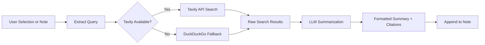

import TLDR from '@site/src/components/TLDR';

# การวิจัยและการค้นหาบนเว็บ

<TLDR>
**Notemd จะค้นหาบนเว็บและฝังผลลัพธ์ที่สรุปแล้ว LLM โดยตรงเข้าไปในบันทึกของคุณ** Tavily API เป็นแบ็กเอนด์การค้นหาหลัก ส่วน DuckDuckGo ทำหน้าที่เป็นตัวเลือกสำรองที่ไม่ต้องตั้งค่าใดๆ ผลลัพธ์จะถูกสรุปพร้อมการอ้างอิงแหล่งที่มาและถูกเพิ่มไว้ใต้หัวข้อ `## Research` รองรับการวิจัยในบันทึกเดียว การวิจัยในโฟลเดอร์หลายบันทึก และการเลือกรูปแบบโมเดลสำหรับขั้นตอนการสรุปผลตามงานที่ทำ

นี่เป็นส่วนหนึ่งของ [Obsidian คู่มือการจัดการความรู้ด้วย AI](/docs/pillar-ai-knowledge)
</TLDR>

## ภาพรวม

การวิจัยเป็นหนึ่งในการผสานระบบที่ทรงพลังที่สุดของ Notemd โดยช่วยเชื่อมโยงกระบวนการอ่าน ค้นหา และเขียนเข้าด้วยกัน แทนที่จะต้องเปลี่ยนไปใช้เบราว์เซอร์เพื่อค้นหาคำศัพท์ที่ไม่คุ้นเคย คุณเพียงแค่เลือกคำนั้นแล้วปล่อยให้ Notemd ทำการค้นหา สรุปผล และเพิ่มข้อมูลที่ได้มา -- ทั้งหมดนี้ทำได้ภายในบันทึกของคุณเอง

กระบวนการนี้สามารถตั้งค่าได้อย่างเต็มที่ คุณสามารถเลือกผู้ให้บริการค้นหา เลือก LLM ที่จะเขียนสรุปผล และเลือกว่าจะเพิ่มผลลัพธ์ไว้ในบันทึกที่กำลังใช้งานอยู่หรือจะเขียนลงในไฟล์แยกต่างหาก โหมดแบบชุดช่วยให้คุณสามารถวิจัยบันทึกทั้งหมดในโฟลเดอร์ได้ด้วยการคลิกเพียงครั้งเดียว

## หลักการทำงาน

### กระบวนการค้นหาแล้วสรุปผล



1. **การดึงข้อความคำถาม** -- Notemd จะดึงคำค้นหาออกมาจากสิ่งที่คุณเลือกหรือจากชื่อบันทึก
2. **การค้นหาบนเว็บ** -- จะพยายามใช้ Tavily เป็นอันดับแรก หากไม่ได้ตั้งค่าคีย์ API ระบบจะใช้ DuckDuckGo โดยอัตโนมัติ (ไม่จำเป็นต้องมีคีย์)
3. **การสรุปผลด้วย LLM** -- ผลลัพธ์การค้นหาดิบจะถูกส่งไปยัง LLM ที่ตั้งค่าไว้ ซึ่งจะสร้างสรุปผลที่กระชับพร้อมการอ้างอิงแหล่งที่มาแบบฝังอยู่ในข้อความ
4. **การเพิ่มผลลัพธ์** -- สรุปผลที่จัดรูปแบบแล้วจะถูกเพิ่มไว้ใต้หัวข้อ `## Research` ในบันทึกที่กำลังใช้งานอยู่

### Tavily เทียบกับ DuckDuckGo

| ด้าน | Tavily | DuckDuckGo |
|--------|--------|------------|
| คีย์ API | จำเป็น (มีแผนฟรีให้ใช้) | ไม่จำเป็น |
| คุณภาพของผลลัพธ์ | สูง (ออกแบบมาโดยเฉพาะสำหรับ AI) | เพียงพอสำหรับคำถามทั่วไป |
| ขีดจำกัดอัตราการใช้งาน | แผนฟรีที่ให้มากมาย | อาจมีการจำกัดความเร็ว |
| การตั้งค่า | `tavilyApiKey` ในการตั้งค่า | ไม่ต้องตั้งค่า -- ใช้รูปแบบอัตโนมัติ |

### การวิจัยในโฟลเดอร์กลุ่ม

คลิกขวาที่โฟลเดอร์แล้วเลือก **"Notemd: โฟลเดอร์สำหรับการวิจัย"** ไฟล์ `.md` ทุกไฟล์ในโฟลเดอร์จะถูกประมวลผลตามลำดับ (หรือพร้อมกันตามความสามารถในการทำงานที่ตั้งค่าไว้) แต่ละบันทึกจะได้รับบทสรุปการวิจัยของตัวเอง

## การตั้งค่า

| การกำหนดค่า | ค่าเริ่มต้น | ผลกระทบ |
|---------|---------|--------|
| `tavilyApiKey` | `''` | คีย์ Tavily API เมื่อว่าง จะใช้ DuckDuckGo เพียงอย่างเดียว |
| `researchProvider` / `researchModel` | DeepSeek | LLM ต่องานสำหรับการสรุปผลการค้นหา |
| `maxResearchContentTokens` | `4000` | งบประมาณโทเค็นสำหรับเนื้อหาที่ส่งไปยัง LLM หากเกินจะถูกตัดทอน |
| `researchAppendToNote` | `true` | เพิ่มบทสรุปลงในบันทึกต้นฉบับ หากตั้งค่าเป็น false จะสร้างไฟล์แยกต่างหาก |
| `researchLanguage` | `'en'` | ภาษาผลลัพธ์สำหรับการวิจัยที่สรุปแล้ว |

### การแนะนำแบบจำลองต่องาน

การวิจัยจะได้รับประโยชน์จากแบบจำลองที่สามารถจัดการเนื้อหาหลายภาษาและสร้างข้อความที่มีโครงสร้างดีได้ ลองพิจารณาดู:

- **DeepSeek** -- ตัวเลือกมาตรฐาน ราคาไม่แพง คุณภาพดี
- **GPT-4o** -- สามารถสรุปเนื้อหาได้คุณภาพสูงกว่า แต่มีราคาสูงกว่า
- **Gemini Flash** -- ทำงานได้เร็วและราคาถูก เหมาะสำหรับคำถามทั่วไป

## Example

คุณกำลังอ่านบทความเกี่ยวกับ *transformer attention mechanisms* และพบคำศัพท์ที่ไม่คุ้นเคย คือ *relative positional encoding* แทนที่จะปล่อย Obsidian:

1. ให้เน้น **"relative positional encoding"**
2. คลิกขวา --> **"Notemd: Research and summarize"**
3. Notemd จะค้นหาบนเว็บ สรุปผลลัพธ์ที่ดีที่สุด แล้วเพิ่มเติมเข้ามา:

```markdown
## Research

### Relative Positional Encoding

Relative positional encoding is a method used in transformer models
where positional information is expressed as relative distances between
tokens rather than absolute positions. Introduced by Shaw et al. (2018),
it improves generalization to unseen sequence lengths compared to
absolute encodings (Vaswani et al., 2017).

Sources:
- [Shaw et al., Self-Attention with Relative Position Representations (2018)](https://arxiv.org/abs/1803.02155)
- [Transformer Positional Encoding Overview](https://example.com/transformer-pos-enc)
```

ตอนนี้สรุปนั้นกลายเป็นส่วนหนึ่งของคลังข้อมูลของคุณ สามารถค้นหา สร้างลิงก์ และเข้าถึงได้แม้ไม่มีอินเทอร์เน็ต

## เคล็ดลับ

- **ตั้งค่าคีย์ Tavily เพื่อให้ได้ผลลัพธ์ที่ดีที่สุด** -- แม้แต่แผนฟรีก็ยังให้ความเกี่ยวข้องที่ดีกว่า DuckDuckGo ในรูปแบบดิบ
- **ใช้แบบจำลองสรุปเนื้อหาที่มีประสิทธิภาพ** -- แบบจำลองราคาถูกอาจทำให้เนื้อหาทางเทคนิคที่มีความละเอียดซับซ้อนกลายเป็นเนื้อหาที่เรียบง่าย
- **ทำการวิจัยแบบบัตช์** หลังจากอ่านครั้งแรกเสร็จ เพื่อเติมเต็มข้อมูลที่ขาดหายไปในบันทึกหลายๆ ฉบับพร้อมกัน
- **ตรวจสอบสรุปที่เพิ่มเข้ามา** -- LLM อาจสร้างข้อมูลที่ไม่ถูกต้องเกี่ยวกับแหล่งที่มาได้ ควรตรวจสอบข้ออ้างสำคัญๆ

---

## ขั้นตอนต่อไป

- [Concept Notes](./concept-notes) -- ดึงข้อมูลคีย์เวิร์ดสำคัญจากผลการวิจัยและเก็บรักษาไว้
- [Wiki-Links](./wiki-links) -- เชื่อมโยงแนวคิดที่ได้จากการวิจัยเข้าด้วยกันในคลังข้อมูลของคุณ
- [Translation](./translation) -- แปลสรุปผลการวิจัยเป็นภาษาอื่น
- [LLM ผู้ให้บริการ](/docs/providers/overview) -- กำหนดค่าโมเดลที่ใช้สำหรับการสรุปข้อความ
