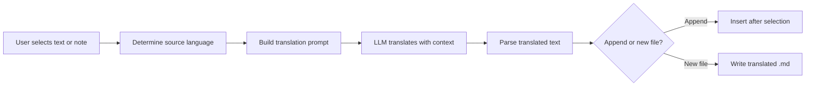

import TLDR from '@site/src/components/TLDR';

# การแปล

<TLDR>
**Notemd ช่วยแปลข้อความระหว่างภาษามากกว่า 21 ภาษาโดยใช้เทคโนโลยีการแปลจาก LLM** รองรับการแปลส่วนที่เลือก การแปลบันทึกทั้งหมด และการแปลโฟลเดอร์หลายไฟล์พร้อมกัน แต่ละงานแปลสามารถกำหนดผู้ให้บริการและโมเดลเฉพาะสำหรับงานนั้นได้ผ่านการตั้งค่าตามงาน สามารถกำหนดภาษาผลลัพธ์แยกจากภาษา UI ได้อย่างอิสระ ผลลัพธ์จะถูกเพิ่มท้ายหรือเขียนลงในไฟล์ใหม่ตามที่คุณต้องการ

นี่เป็นส่วนหนึ่งของ [Obsidian คู่มือการจัดการความรู้ด้วย AI](/docs/pillar-ai-knowledge)
</TLDR>

## ภาพรวม

การแปลใน Notemd ไม่ใช่การค้นหาจากพจนานุกรม -- เป็นการแปลที่อาศัย LLM และเข้าใจบริบท โมเดลจะมองเห็นย่อหน้าหรือบันทึกทั้งหมด ทำให้สามารถรักษาน้ำเสียง คำศัพท์เฉพาะด้าน และโครงสร้างประโยคไว้ได้ สิ่งนี้ทำให้ได้ผลลัพธ์ที่มีคุณภาพสูงกว่าบริการแปลแบบคำต่อคำ โดยเฉพาะสำหรับงานเขียนทางเทคนิค วิชาการ และสร้างสรรค์

ฟีเจอร์นี้รองรับสามขอบเขต ได้แก่ ส่วนที่เลือก บันทึกที่กำลังใช้งาน และโฟลเดอร์ทั้งหมด เมื่อรวมกับการเลือกโมเดลตามงาน คุณสามารถใช้โมเดลที่เร็ว (Gemini Flash) สำหรับการแปลธรรมดา และโมเดลที่ทรงพลัง (Claude Sonnet) สำหรับเนื้อหาที่ต้องการความละเอียดอ่อน -- โดยไม่ต้องเปลี่ยนผู้ให้บริการหลักของคุณ

## หลักการทำงาน

### คำสั่ง Translate



1. **การตรวจจับภาษาต้นทาง** -- LLM จะประมวลผลหาภาษาต้นทางจากเนื้อหา คุณไม่จำเป็นต้องระบุด้วยตนเอง
2. **การสร้างคำขอ** -- Notemd จะสร้างคำขอที่รวมภาษาปลายทาง คำบ่งชี้ด้านดоменตามต้องการ และเนื้อหาที่ต้องการแปล
3. **การแปล LLM** -- `translateProvider` / `translateModel` ที่กำหนดไว้จะประมวลผลคำขอ โมเดลจะรักษารูปแบบ markdown ลิงก์ wiki และบล็อกโค้ดไว้
4. **ผลลัพธ์** -- ข้อความที่แปลแล้วจะถูกเพิ่มท้ายหลังข้อความต้นฉบับ หรือเขียนลงในไฟล์ใหม่ใน vault

### คู่ภาษา

Notemd รองรับคู่ภาษาใดก็ได้ที่ LLM ที่อยู่เบื้องหลังรองรับ คู่ภาษาที่พบบ่อย ได้แก่

| ภาษาต้นทาง | เป้าหมาย | คุณภาพโดยทั่วไป |
|--------|--------|----------------|
| ภาษาอังกฤษ | ภาษาจีน (แบบง่าย) | ยอดเยี่ยม |
| จีน | อังกฤษ | ยอดเยี่ยม |
| อังกฤษ | ญี่ปุ่น | ดีมาก |
| อังกฤษ | เยอรมัน / ฝรั่งเศส / สเปน | ดีมาก |
| รองรับทุกภาษา | รองรับทุกภาษา | ขึ้นอยู่กับโมเดล |

การตั้งค่า `translateLanguage` จะควบคุม **ภาษาผลลัพธ์** โดยภาษาต้นทางจะถูกตรวจจับโดยอัตโนมัติ

### การเลือกโมเดลตามงาน

คุณภาพการแปลจะแตกต่างกันอย่างมากตามโมเดล Notemd ช่วยให้คุณสามารถกำหนดโมเดลเฉพาะสำหรับการแปลได้

| โมเดล | ความเร็ว | Quality | ต้นทุน | เหมาะสำหรับ |
|-------|-------|--------|------|----------|
| `gemini-2.0-flash-exp` | เร็ว | ดี | ต่ำ | ใช้งานทั่วไปปริมาณมาก |
| `gpt-4o-mini` | เร็ว | ดี | ต่ำ | การค้นหาอย่างรวดเร็ว |
| `deepseek-chat` | ปานกลาง | ดี | ต่ำมาก | สำหรับงบประมาณหลายภาษา |
| `claude-3-5-sonnet` | ปานกลาง | ยอดเยี่ยม | ปานกลาง | เชิงเทคนิค / วิชาการ |
| `gpt-4o` | ปานกลาง | ยอดเยี่ยม | ปานกลาง | ข้อความที่ต้องใส่ใจรายละเอียด |

### การแปลโฟลเดอร์แบบชุด

คลิกขวาที่โฟลเดอร์แล้วเลือก **"Notemd: Translate folder"** เพื่อแปลบันทึกทั้งหมดในโฟลเดอร์นั้น แต่ละไฟล์จะถูกประมวลผลแยกกัน การตั้งค่าความพร้อมใช้งานพร้อมกันจะควบคุมจำนวนไฟล์ที่ถูกแปลพร้อมกัน

## การตั้งค่า

| การกำหนดค่า | ค่าเริ่มต้น | ผลกระทบ |
|---------|---------|--------|
| `translateProvider` / `translateModel` | DeepSeek | ผู้ให้บริการโดยเฉพาะสำหรับงานแปล |
| `translateLanguage` | `'en'` | ภาษาผลลัพธ์ที่ต้องการ |
| `translationAppendToNote` | `true` | เพิ่มข้อความที่แปลแล้วไว้ด้านล่างของข้อความต้นฉบับ หากตั้งค่าเป็น false จะสร้างไฟล์ใหม่ |
| `batchConcurrency` | `3` | จำนวนไฟล์ที่ถูกประมวลผลพร้อมกันในระหว่างการแปลแบบชุด |

## Example

คุณกำลังอ่านบันทึกวิจัยภาษาจีนและต้องการเวอร์ชันภาษาอังกฤษ:

1. เปิดบันทึก
2. คลิกขวา --> **"Notemd: Translate current file"**
3. Notemd จะตรวจจับภาษาจีน แปลเป็นภาษาเป้าหมายที่คุณตั้งค่าไว้ (ภาษาอังกฤษ) และเพิ่มข้อความดังนี้:

```markdown
## Translation (English)

The experimental results show that the proposed method achieves
a 12% improvement in F1 score compared to the baseline, primarily
due to the enhanced feature extraction module described in Section 3.
```

ข้อความภาษาจีนต้นฉบับจะยังคงอยู่ด้านบนของข้อความที่แปล ส่วนหัว `## Translation` จะเก็บทั้งสองเวอร์ชันไว้ในไฟล์เดียวกันเพื่อให้สามารถอ้างอิงได้ง่าย

## เคล็ดลับ

- **ใช้ Gemini Flash สำหรับการแปลจำนวนมาก** -- เป็นตัวเลือกที่เร็วที่สุดและถูกที่สุดสำหรับการแปลโฟลเดอร์ขนาดใหญ่
- **รักษาลิงก์วิกิไว้** -- คำสั่งของ Notemd ระบุให้ LLM รักษา `[[wiki-links]]` ให้คงสภาพเดิมในการแปล ควรตรวจสอบอีกครั้งหลังแปล เนื่องจากโมเดลบางตัวอาจทำให้ลิงก์เหล่านั้นหายไป
- **กำหนดภาษาผลลัพธ์อย่างชัดเจน** -- การตรวจจับภาษาโดยอัตโนมัติใช้ได้กับภาษาต้นทาง แต่ควรกำหนด `translateLanguage` เสมอเพื่อหลีกเลี่ยงความคลุมเครือเกี่ยวกับภาษาปลายทาง
- **แปลบันทึกแนวคิดแบบกลุ่ม** -- หากโฟลเดอร์แนวคิดของคุณอยู่ในภาษาหนึ่งและคุณต้องการให้อยู่ในอีกภาษาหนึ่ง การแปลในระดับโฟลเดอร์จะจัดการเรื่องนี้ได้ในขั้นตอนเดียว

---

## ขั้นตอนต่อไป

- [Research](./research) -- ค้นหาและสรุปเนื้อหาในภาษาใดก็ได้ จากนั้นจึงแปลผลลัพธ์
- [Workflows](./workflows) -- ทำการแปลต่อเนื่องพร้อมการเชื่อมโยงวิกิหรือการดึงข้อมูลแนวคิด
- [Batch Processing](/docs/advanced/batch-processing) -- การทำงานพร้อมกันและพฤติกรรมการเขียนทับสำหรับการดำเนินการในโฟลเดอร์
- [LLM Providers](/docs/providers/overview) -- เลือกโมเดลที่ดีที่สุดสำหรับคู่ภาษาของคุณ
