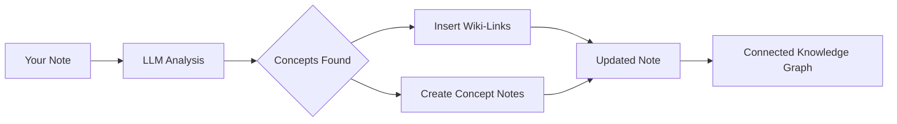

import TLDR from '@site/src/components/TLDR';

# Wiki-Links

<TLDR>
**Notemd จะเพิ่ม `[[wiki-links]]` เข้าไปในแนวคิดหลักในบันทึกของคุณโดยอัตโนมัติ** LLM จะอ่านเนื้อหาของคุณ เพื่อระบุคำสำคัญในบริบท และแทรกลิงก์วิกิแบบ Obsidian ที่แต่ละจุดที่ปรากฏ นอกจากนี้ยังสามารถสร้างไฟล์บันทึกแนวคิดพร้อมลิงก์ย้อนกลับได้ตามต้องการ รองรับการลดคำพ้องความหมาย การรักษาความสมบูรณ์ของลิงก์เมื่อมีการเปลี่ยนชื่อหรือลบ และโหมดการดึงข้อมูลเพียงอย่างเดียว (ไม่มีการแก้ไขไฟล์) ต่างจาก Auto Link ที่เปรียบเทียบเฉพาะชื่อบันทึกที่มีอยู่ Notemd ใช้ AI เพื่อระบุแนวคิดใหม่และสร้างบันทึกที่สอดคล้องกัน สิ่งนี้เป็นส่วนหนึ่งของ [Obsidian AI Knowledge Management Guide](/docs/pillar-ai-knowledge)
</TLDR>

## ภาพรวม

การสร้างลิงก์วิกิเป็นคุณสมบัติหลักของ Notemd โดยจะเปลี่ยนข้อความธรรมดาให้กลายเป็นกราฟความรู้ที่เชื่อมต่อกันผ่านวิธีต่อไปนี้:

1. **วิเคราะห์บันทึกของคุณ** ด้วย LLM
2. **ระบุแนวคิดหลัก** (คำ บุคคล วิธีการ ทฤษฎี)
3. **แทรก `[[wiki-links]]`** ที่แต่ละจุดที่ปรากฏ
4. **สร้างบันทึกแนวคิด** (ตามต้องการ) พร้อมลิงก์ย้อนกลับ

## หลักการทำงาน

### ขั้นตอน



### Example

**ก่อนหน้านี้:**
```markdown
Machine learning models use neural networks to learn patterns from data.
The transformer architecture revolutionized natural language processing.
```

**หลังจากนั้น:**
```markdown
[[Machine learning]] models use [[neural networks]] to learn patterns from data.
The [[transformer architecture]] revolutionized [[natural language processing]].
```

## วิธีการใช้งาน

### รูปแบบพื้นฐาน: เพิ่มลิงก์ให้กับบันทึกปัจจุบัน

1. เปิดบันทึก
2. คลิกขวาในโปรแกรมแก้ไข → **“Process file (add links)”**
3. รอสักครู่
4. ตอนนี้แนวคิดต่างๆ ถูกเชื่อมต่อกันแล้ว!

### การประมวลผลแบบกลุ่ม: ประมวลผลบันทึกหลายรายการ

1. คลิกขวาที่โฟลเดอร์ใน File Explorer
2. เลือก **"Notemd: Process folder (add links)"**
3. การตั้งค่า:
   - ความสอดคล้องพร้อมกัน (จำนวนไฟล์ที่ประมวลผลพร้อมกัน)
   - เขียนทับลิงก์ที่มีอยู่ (ใช่/ไม่ใช่)
4. คลิก **Process**

### การเลือก: ลิงก์ข้อความที่กำหนด

1. เน้นข้อความที่จะประมวลผล
2. คลิกขวา → **"Process selection (add links)"**
3. จะมีการวิเคราะห์เฉพาะส่วนที่ถูกเน้นเท่านั้น

## Notemd เทียบกับ Auto Link

Obsidian มีวิธีการสร้างลิงก์ wiki อัตโนมัติสองแบบดังนี้:

| | **Auto Link** | **Notemd** |
|--|---------------|-------------|
| แหล่งที่มาของลิงก์ | ชื่อบันทึกที่มีอยู่ใน vault | แนวคิดที่ LLM ระบุไว้ในเนื้อหา |
| สามารถสร้างลิงก์สำหรับแนวคิดใหม่ได้ | ไม่ได้ — ชื่อต้องมีอยู่แล้ว | ได้ — AI จะระบุแนวคิดและสร้างบันทึก |
| การจัดการคำพ้องความหมาย | ไม่ | ได้ — การยับยั้งคำพ้องความหมาย |
| การสร้างบันทึกแนวคิด | ไม่ | ได้ — พร้อมลิงก์ย้อนกลับและการลบซ้ำ |
| การประมวลผลแบบชุด | ไม่ได้ (ไฟล์เดียว) | ได้ (ระดับโฟลเดอร์) |
| การส่งต่อแบบจำลองตามงาน | ไม่ | ใช่ |

**Auto Link** ทำการจับคู่กับชื่อ: หากมีบันทึกที่ชื่อว่า "Machine Learning" อยู่ มันจะห่อหุ้มการปรากฏตัวต่างๆ ด้วย `[[Machine Learning]]` หากไม่มีบันทึกนั้นอยู่ ก็จะไม่มีอะไรเกิดขึ้น

**Notemd** ควบคุมโดย AI: LLM จะอ่านเนื้อหาของคุณ เข้าใจบริบท ระบุแนวคิดที่ *ควร* ถูกลิงก์ — แม้ว่าจะยังไม่มีบันทึกอยู่ก็ตาม — และสร้างทั้งลิงก์และบันทึกแนวคิด

## คุณสมบัติ

### การยับยั้งคำพ้องความหมาย

**ปัญหา:** "transformer", "transformers", "Transformer architecture" → 3 แนวคิดที่แยกจากกัน

**วิธีแก้ไข:** Notemd จะตรวจจับเนื้อหาที่เกือบจะซ้ำกันและใช้รูปแบบมาตรฐาน

**การตั้งค่า:**
```
Settings → Advanced → Synonym Suppression
Threshold: 0.8 (0 = off, 1 = aggressive)
```

### ความสมบูรณ์ของลิงก์

**เมื่อคุณเปลี่ยนชื่อบันทึกแนวคิด:**
- ลิงก์ใน wiki จะอัปเดตโดยอัตโนมัติ (Obsidian เป็นฟีเจอร์หลัก)
- ลิงก์ย้อนกลับยังคงสมบูรณ์

**เมื่อคุณลบบันทึกแนวคิด:**
- ลิงก์ยังคงอยู่แต่จะแสดงเป็น "unlinked mentions"
- คุณสามารถสร้างขึ้นใหม่จากการปรากฏใดก็ได้

### โหมดการสกัดข้อมูลแบบบริสุทธิ์

**สกัดแนวคิดโดยไม่ต้องแก้ไขเอกสารต้นฉบับ:**

1. คลิกขวา → **"Extract concepts (no linking)"**
2. จะมีการสร้างบันทึกแนวคิดขึ้นมา
3. เอกสารต้นฉบับจะไม่ถูกเปลี่ยนแปลง

กรณีการใช้งาน: การประมวลผลเนื้อหาที่อ่านได้เท่านั้นหรือต้นฉบับสุดท้าย.

## การสร้างบันทึกแนวคิด

### การสร้างโดยอัตโนมัติ

**เมื่อเปิดใช้งาน (ค่าเริ่มต้น) Notemd จะสร้าง:**

```markdown
---
tags: [concept, auto-generated]
created: 2026-06-13
source: [[Original Note Name]]
---

# Machine Learning

A branch of artificial intelligence that enables computers
to learn from data without explicit programming.

## Occurrences in Your Vault

- [[Original Note Name#Section]]
- [[Another Note#Header]]

## Related Concepts

- [[Neural Networks]]
- [[Deep Learning]]
- [[Supervised Learning]]
```

### การตั้งค่า

**โฟลเดอร์ผลลัพธ์:**
```
Settings → Output → Concept Folder
Default: concepts/
```

**โครงสร้างแบบลำดับชั้น:**
```
Settings → Output → Use Hierarchical Folders
If enabled:
  papers/my-paper.md → papers/concepts/Concept.md
If disabled:
  → concepts/Concept.md
```

**แม่แบบ:**
```
Settings → Output → Concept Template
Customize with variables:
  {{concept}} — Concept name
  {{description}} — LLM-generated description
  {{backlinks}} — List of source notes
  {{date}} — Creation date
```

## ตัวเลือกขั้นสูง

### หน้าต่างบริบท

**จำนวนข้อความรอบข้างที่จะส่ง:**

```
Settings → Linking → Context Window
Options: Sentence | Paragraph | Full Note
Default: Paragraph
```

ยิ่งมาก ความแม่นยำยิ่งดี แต่ค่าใช้จ่ายก็สูงขึ้น.

### จำนวนครั้งที่เกิดขึ้นขั้นต่ำ

**เชื่อมโยงเฉพาะแนวคิดที่ปรากฏหลายครั้งเท่านั้น:**

```
Settings → Linking → Min Occurrences
Default: 1 (link all)
```

ตั้งค่าที่ 2 หรือ 3 เพื่อให้มุ่งเน้นไปที่หัวข้อที่เกิดซ้ำ.

### รูปแบบที่จะตัดออก

**ข้ามคำบางคำ:**

```
Settings → Linking → Exclude List
Example: note, idea, example, thing
```

ช่วยป้องกันไม่ให้เกิดการเชื่อมโยงคำทั่วไปมากเกินไป.

### คำสั่งกำหนดเอง

**เปลี่ยนคำสั่ง LLM ตามค่าเริ่มต้น:**

```
Settings → Advanced → Custom Linking Prompt
Default:
  "Identify key concepts, theories, methods, and technical
   terms in the following text. Return as a list..."
```

ปรับแต่งให้เหมาะกับความต้องการเฉพาะด้าน (เช่น "มุ่งเน้นไปที่ศัพท์ทางการแพทย์").

## เคล็ดลับและแนวทางปฏิบัติที่ดีที่สุด

### ✅ ควรทำ

- **จัดการบันทึกที่มีความยาวมากกว่า 100 คำ** — บันทึกสั้นๆ ให้แนวคิดน้อย
- **ใช้โมเดลที่ทรงพลัง** เพื่อการระบุแนวคิดที่ดีขึ้น (GPT-4o, Claude)
- **ตรวจสอบก่อนยอมรับ** — ตรวจสอบว่าลิงก์ที่แนะนำมีเหตุผล
- **สร้างแบบค่อยเป็นค่อยไป** — จัดการบันทึก 5-10 บันทึก ตรวจสอบแผนภาพ ปรับการตั้งค่า

### ❌ ไม่ควรทำ

- **เชื่อมโยงมากเกินไป** — ไม่ใช่ทุกคำนามที่ต้องมีลิงก์
- **จัดการต้นฉบับซ้ำๆ** — แนวคิดอาจเปลี่ยนแปลง รอจนกว่าจะมั่นคง
- **เพิกเฉยคำพ้องความหมาย** — เปิดใช้งานการยับยั้งเพื่อหลีกเลี่ยง "ML" กับ "Machine Learning"

## ประสิทธิภาพ

### ความเร็ว

| ขนาดบันทึก | GPT-4o-mini | Claude Sonnet | Ollama (local) |
|-----------|-------------|---------------|----------------|
| 500 คำ | 2-3 วินาที | 3-5 วินาที | 5-10 วินาที |
| 2000 คำ | 5-8 วินาที | 10-15 วินาที | 20-40 วินาที |
| มากกว่า 5000 คำ | แบ่งเป็นชิ้น (การเรียกหลายครั้ง) | แบ่งเป็นส่วนๆ | แบ่งเป็นส่วนๆ |

### การประมาณค่าใช้จ่าย

**ตัวอย่าง: บันทึก 1,000 คำโดยใช้ GPT-4o-mini**
- อินพุต: ประมาณ 1500 โทเคน
- ผลลัพธ์: ประมาณ 200 โทเคน
- ค่าใช้จ่าย: ~

**ประมวลผลบันทึก 100 รายการพร้อมกัน:** ประมาณ $0.10

## การแก้ไขปัญหา

### ไม่มีลิงก์เพิ่มเติม

**ตรวจสอบ:**
1. LLM การเรียกใช้งานสำเร็จ (Settings → Diagnostics)
2. บันทึกนี้มีเนื้อหาเพียงพอ (>50 คำ)
3. แนวคิดเหล่านี้เป็นเชิงเทคนิค/เฉพาะเจาะจง (ไม่ใช่เพียงสรรพนาม)

**ลองดู:**
- ใช้โมเดลที่มีประสิทธิภาพสูงกว่า
- เพิ่มหน้าต่างบริบท
- ตรวจสอบความถูกต้องของคีย์ API

### ลิงก์มากเกินไป

**วิธีแก้ไข:**
1. เพิ่มจำนวนครั้งขั้นต่ำ (2 หรือ 3)
2. เพิ่มคำทั่วไปลงในรายการที่จะตัดออก
3. ใช้โมเดลที่ไม่รุนแรงเกินไป

### แนวคิดที่ผิดถูกเชื่อมโยงเข้าด้วยกัน

**ข้อแก้ไข:**
1. ใช้พรอมป์ที่กำหนดเองเพื่อความเฉพาะเจาะจงของโดเมน
2. เปิดใช้งานการยับยั้งคำพ้องความหมาย
3. ตรวจสอบและถอดการเชื่อมโยงด้วยตนเอง

### ลิงก์จะขาดหลังจากการเปลี่ยนชื่อ

**นี่คือพฤติกรรมปกติ Obsidian ครับ.**

เพื่ออัปเดตลิงก์ทั้งหมด:
1. เปลี่ยนชื่อบันทึกแนวคิด
2. Obsidian จะอัปเดต `[[old]]` เป็น `[[new]]` โดยอัตโนมัติ

---

## ขั้นตอนต่อไป

- 📖 [บันทึกแนวคิด](./concept-notes) — ศึกษาอย่างลึกซึ้งเกี่ยวกับการสร้างบันทึกแนวคิด
- 🔍 [การผสานการวิจัย](./research) — รวมการเชื่อมโยงเข้ากับการวิจัยบนเว็บ
- 🎨 [แผนภาพ](./diagrams) — แสดงกราฟความรู้ของคุณในรูปแบบภาพ
