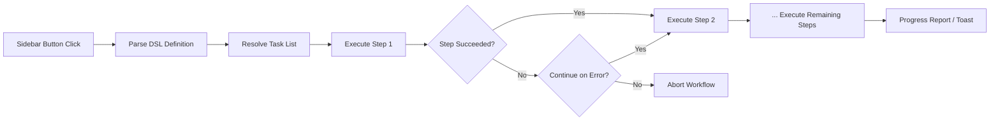

import TLDR from '@site/src/components/TLDR';

# กระบวนการทำงาน

<TLDR>
**Notemd วิธีการทำงานแบบนี้จะเชื่อมต่องานหลายอย่างเข้าด้วยกันให้กลายเป็นการดำเนินการเพียงคลิกเดียว** คุณสามารถกำหนดลำดับการทำงานเช่น `add-links > extract-concepts > research > diagram` ได้โดยใช้ DSL ที่เรียบง่าย วิธีการทำงานเหล่านี้จะปรากฏเป็นปุ่มที่แถบด้านข้าง ซึ่งจะทำการดำเนินการตามลำดับทั้งหมดในโน้ตหรือโฟลเดอร์ปัจจุบัน มีวิธีการทำงานที่กำหนดไว้ล่วงหน้ามาให้ และคุณสามารถสร้างวิธีการทำงานเฉพาะตัวขึ้นมาได้ในส่วนการตั้งค่า แต่ละขั้นตอนจะมีการกำหนดค่าโมเดลสำหรับแต่ละงานแยกกัน

นี่เป็นส่วนหนึ่งของ [Obsidian คู่มือการจัดการความรู้ด้วย AI](/docs/pillar-ai-knowledge)
</TLDR>

## ภาพรวม

กระบวนการทำงานแบบนี้ช่วยขจัดความยุ่งยากจากการทำงานแต่ละขั้นตอนทีละอย่าง แทนที่จะต้องคลิกขวาสี่ครั้งเพื่อเพิ่มลิงก์ ดึงข้อมูลแนวคิด ค้นหาคำศัพท์ที่ไม่คุ้นเคย และสร้างแผนภาพ คุณเพียงแค่กดปุ่มบนแถบด้านข้างเพียงปุ่มเดียว แล้วกระบวนการทั้งหมดก็จะดำเนินการโดยอัตโนมัติ Notemd จะจัดการเรื่องลำดับการทำงาน การแพร่กระจายข้อผิดพลาด และการรายงานความก้าวหน้าให้

วิธีการทำงานจะถูกกำหนดไว้ใน DSL แบบเบา (ภาษาเฉพาะด้าน) โดยจะอยู่ในส่วนการตั้งค่า ปรากฏเป็นปุ่มที่สามารถคลิกได้ในแถบข้าง Obsidian และสามารถนำไปใช้กับโน้ตปัจจุบันหรือโฟลเดอร์ทั้งหมดได้

## หลักการทำงาน

### ท่อส่งการดำเนินการไวร์คัฟลโหว์



1. **Parse** -- สตริง DSL จะถูกแบ่งตาม `>` (หรือ `>`) เป็นรายการที่เรียงลำดับของรหัสประจำงาน
2. **Resolve** -- ตัวระบุแต่ละตัวจะถูกเชื่อมโยงไปยังคำสั่งภายใน (add-links, extract-concepts, research, translate, diagram ฯลฯ)
3. **Execute** -- ขั้นตอนต่างๆ จะทำงานต่อเนื่องกัน โดยแต่ละขั้นตอนจะใช้ผู้ให้บริการและโมเดลที่กำหนดไว้สำหรับแต่ละงาน
4. **การจัดการข้อผิดพลาด** -- หากขั้นตอนใดขั้นตอนหนึ่งล้มเหลว กระบวนการทำงานจะยุติลงหรือดำเนินต่อไปยังขั้นตอนถัดไป ขึ้นอยู่กับนโยบายการจัดการข้อผิดพลาดของคุณ
5. **เสร็จสิ้น** -- การแจ้งเตือนแบบโทสต์จะรายงานความสำเร็จหรือแสดงรายการขั้นตอนที่ล้มเหลว

### รูปแบบ DSL

วิธีการทำงานถูกนิยามให้เป็นลำดับของรหัสประจำงานที่แยกด้วย `>`

```
process-current-add-links>extract-concepts-current>research-and-summarize
```

**รหัสประจำงานที่มีให้เลือก:**

| ตัวระบุ | การดำเนินการ |
|------------|--------|
| `process-current-add-links` | เพิ่มลิงก์วิกิเข้าไปในบันทึกที่กำลังใช้งาน |
| `extract-concepts-current` | ดึงแนวคิดออกจากบันทึกที่กำลังใช้งาน |
| `research-and-summarize` | ค้นคว้าข้อความหรือชื่อบันทึกที่เลือกไว้ |
| `process-current-translate` | แปลบันทึกที่กำลังใช้งาน |
| `summarize-to-mermaid` | สร้างแผนภาพจากบันทึกที่กำลังใช้งาน |
| `generate-from-title` | สร้างเนื้อหาจากชื่อบันทึก |
| `extract-original-text` | ดึงข้อความต้นฉบับ (สำหรับ OCR / เนื้อหาที่สแกน) |

**รูปแบบระดับโฟลเดอร์** ให้แทนที่ `current` ด้วย `folder` ในชื่อตัวระบุ.

### กระบวนการทำงานที่กำหนดไว้ล่วงหน้าเทียบกับกระบวนการทำงานที่ปรับแต่งเอง

Notemd มาพร้อมกับกระบวนการทำงานที่เตรียมไว้สำหรับรูปแบบทั่วไปดังนี้:

| กระบวนการทำงาน | ลำดับการทำงาน | กรณีการใช้งาน |
|----------|-------|----------|
| **การดึงข้อมูลด้วยการคลิกเดียว** | add-links > extract-concepts > research | ประมวลผลบทความวิจัยในครั้งเดียว |
| **สายการประมวลผลแบบเต็มรูปแบบ** | add-links > extract-concepts > research > diagram | การดึงข้อมูลความรู้อย่างสมบูรณ์พร้อมการแสดงผลในรูปแบบกราฟิก |
| **Translate + Link** | translate > add-links | แปลแล้วเชื่อมโยงแนวคิดเป็นภาษาเป้าหมาย |

**Custom workflows** จะถูกสร้างขึ้นในส่วนการตั้งค่า:

1. เปิด **Settings** --> **Notemd** --> **Workflows**
2. คลิก **"Add Workflow"**
3. ป้อนลำดับ DSL (เช่น `process-current-add-links>extract-concepts-current`)
4. ตั้งชื่อแสดงผล (เช่น "Quick Link + Extract")
5. ปุ่มใหม่จะปรากฏในแถบด้านข้างทันที

## การตั้งค่า

| การกำหนดค่า | ค่าเริ่มต้น | ผลกระทบ |
|---------|---------|--------|
| `workflows` | ชุดที่กำหนดไว้ล่วงหน้า | อาร์เรย์ของคำนิยามกระบวนการทำงาน (ชื่อ + DSL) |
| `workflowContinueOnError` | `true` | หากขั้นตอนปัจจุบันล้มเหลวให้ไปที่ขั้นตอนถัดไป |
| `workflowShowProgress` | `true` | แสดงข้อความแจ้งความคืบหน้าหลังจากแต่ละขั้นตอนเสร็จสิ้น |

### Per-Task Models in Workflows

แต่ละขั้นตอนในวิธีการทำงานจะใช้การกำหนดค่าโมเดลต่องานของตัวเอง คุณไม่จำเป็นต้องระบุโมเดลไว้ใน DSL เอง ลำดับการแก้ไขคือ:

1. ผู้ให้บริการ/โมเดลต่องาน หาก `useMultiModelSettings` อยู่บนนั้น
2. `activeProvider` ระดับโลก ในกรณีอื่น

นั่นหมายความว่า `add-links` สามารถทำงานบน DeepSeek ในขณะที่ `research` ทำงานบน GPT-4o -- ทั้งหมดอยู่ภายในวิธีการทำงานเดียวกัน

## Example

คุณเพิ่งนำ PDF ของบทความด้านการเรียนรู้ของเครื่องเข้ามาใน vault ของคุณและต้องการการสกัดความรู้อย่างเต็มที่:

1. เปิดบันทึกที่นำเข้ามา
2. คลิกปุ่มแถบข้าง **"Full Pipeline"**
3. Notemd จะทำการดำเนินการดังนี้:
   - **ขั้นตอนที่ 1**: เพิ่มลิงก์ wiki -- `[[attention mechanism]]`, `[[transformer]]` ฯลฯ
   - **ขั้นตอนที่ 2**: สกัดแนวคิด -- สร้างบันทึกแนวคิดในโฟลเดอร์แนวคิดของคุณ
   - **ขั้นตอนที่ 3**: ทำการวิจัย -- สรุปแหล่งข้อมูลบนเว็บสำหรับคำสำคัญ
   - **ขั้นตอนที่ 4**: สร้างแผนภาพ -- สร้าง mindmap แบบ Mermaid ของโครงสร้างบทความ
4. หลังจากประมาณ 30 วินาที บันทึกของคุณจะมีลิงก์ มีบันทึกแนวคิด มีเนื้อหาการวิจัยที่เพิ่มเข้ามา และมีไฟล์แผนภาพที่ถูกบันทึกไว้

ทั้งหมดนี้ทำได้ด้วยการคลิกเพียงครั้งเดียว.

## เคล็ดลับ

- **เริ่มต้นด้วยวิธีการทำงานที่กำหนดไว้ล่วงหน้า** -- ซึ่งครอบคลุมรูปแบบที่พบบ่อยที่สุด จงปรับแต่งเฉพาะเมื่อคุณต้องการลำดับที่แตกต่างกันเท่านั้น.
- **เปิดใช้งาน `workflowContinueOnError`** -- หากขั้นตอนสร้างแผนภาพล้มเหลว ไม่ควรทำให้กระบวนการทั้งหมดหยุดลง
- **ใช้วิธีการทำงานกับโฟลเดอร์** สำหรับการประมวลผลแบบจำนวนมาก -- คลิกขวาที่โฟลเดอร์ เลือกวิธีการทำงาน แล้วบันทึกทุกตัวจะได้รับการประมวลผล.
- **ตั้งชื่อวิธีการทำงานให้ชัดเจน** -- พื้นที่ด้านข้างมีจำกัด ควรใช้ชื่อที่สั้นและบ่งบอกการดำเนินการ เช่น "Quick Extract" หรือ "Translate + Link".

---

## ขั้นตอนต่อไป

- [Research](./research) -- ทำความเข้าใจก่อนว่าขั้นตอนการวิจัยทำอะไรบ้าง ก่อนที่จะเพิ่มเข้าไปในวิธีการทำงาน
- [Wiki-Links](./wiki-links) -- ฟีเจอร์การเชื่อมโยงหลักที่ใช้ในวิธีการทำงานส่วนใหญ่
- [Concept Notes](./concept-notes) -- การดึงข้อมูลแนวคิดเป็นขั้นตอนหนึ่งของวิธีการทำงาน
- [Batch Processing](/docs/advanced/batch-processing) -- การทำงานพร้อมกันและการรายงานความคืบหน้าสำหรับวิธีการทำงานกับโฟลเดอร์
