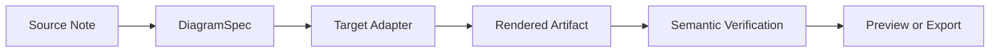
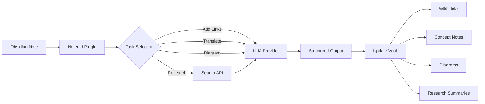

import TLDR from '@site/src/components/TLDR';

# บทนำสู่ Notemd

<TLDR>
**Notemd** (Note + EMD — Enhanced Markdown Documents) เป็นปลั๊กอินแบบโอเพนซอร์สสำหรับ Obsidian ที่ช่วยแปลงการอ่านด้วย LLM ให้กลายเป็นความรู้แบบถาวร ต่างจาก AI แบบแชทที่ข้อมูลความรู้จะหายไปหลังจากสิ้นสุดการสนทนา Notemd จะเขียนผลลัพธ์ **ลงใน vault ของคุณโดยตรง** ในรูปแบบลิงก์ wiki บันทึกแนวคิด สรุปการวิจัย การแปล กระบวนการทำงาน และแผนภาพ มีไว้สำหรับนักวิจัย นักศึกษา และผู้ที่ทำงานด้านความรู้ที่ต้องการให้การอ่าน การวิจัย และคำอธิบายเชิงภาพถูกรวบรวมเข้าด้วยกันเป็นกราฟความรู้ที่มีโครงสร้างและพัฒนาต่อไปได้
</TLDR>

## Notemd คืออะไร?

Notemd รวม **30+ แบบจำลองภาษาขนาดใหญ่** (OpenAI, Anthropic, Google, DeepSeek, Qwen, Ollama และอื่นๆ) เข้ากับกระบวนการทำงาน Obsidian ของคุณเพื่อทำให้การดึงข้อมูลความรู้ การจัดระเบียบ การแปล การวิจัย และการสร้างแผนภาพเป็นไปอัตโนมัติ

### ความแตกต่างหลัก: ความรู้ชั่วคราวกับความรู้ถาวร

| ด้าน | AI แบบแชท (ChatGPT ฯลฯ) | Notemd |
|--------|-------------------------------|--------|
| **ที่ไหนที่ผลลัพธ์จะถูกเก็บ** | ประวัติการสนทนา (หายไป) | Vault Obsidian ของคุณ (คงอยู่) |
| **รูปแบบ** | คำตอบแบบข้อความธรรมดา | ไฟล์ที่มีโครงสร้าง: `[[wiki-links]]`, บันทึกแนวคิด, แผนภาพ |
| **คุณค่าระยะยาว** | ต้องถามใหม่ทุกครั้ง | รวบรวมข้อมูลเป็นกราฟความรู้ |
| **การเข้าถึงแบบออฟไลน์** | ต้องใช้อินเทอร์เน็ต | สามารถทำงานได้แบบออฟไลน์เต็มรูปแบบด้วย Ollama |

## ความสามารถหลัก

### 1. **การเชื่อมโยง Wiki อัตโนมัติ**
- LLM จะระบุแนวคิดสำคัญในบันทึกของคุณ
- แทรก `[[wiki-links]]` ที่ทุกจุดที่ปรากฏ
- สามารถสร้างบันทึกแนวคิดที่เชื่อมโยงกันได้ตามต้องการ
- การยับยั้งคำพ้องความหมายเพื่อหลีกเลี่ยงข้อมูลซ้ำ

### 2. **การสร้างบันทึกแนวคิด**
- ดึงแนวคิดหลักจากเอกสาร บทความ และบันทึกต่างๆ
- สร้างไฟล์แนวคิดที่มีลิงก์ย้อนกลับ
- สามารถปรับเปลี่ยนเส้นทางการส่งออกและแม่แบบได้

### 3. **การผสานรวมการค้นหาบนเว็บ**
- ค้นหา Tavily หรือ DuckDuckGo ภายใน Obsidian
- LLM สรุปผลลัพธ์พร้อมอ้างอิงแหล่งที่มา
- เพิ่มผลการค้นคว้าลงในบันทึกปัจจุบัน

### 4. **การแปลหลายภาษา**
- แปลส่วนที่เลือกหรือบันทึกทั้งหมด
- รองรับภาษา UI มากกว่า 21 ภาษา
- การตั้งค่าภาษาผลลัพธ์แบบอิสระ
- การสนับสนุนการแปลแบบกลุ่ม

### 5. **การสร้างแผนภาพ**
- **Mermaid**: แผนภาพกระแสงาน, ลำดับเหตุการณ์, คลาส, สถานะ, ER, Gantt
- **JSON Canvas**: รูปแบบการจัดวางแบบดั้งเดิมของ Obsidian
- **Vega-Lite**: แผนภูมิข้อมูล, ชุดข้อมูลตามเวลา, แผนภูมิแบบกระจาย
- **HTML / HTML ที่สามารถแก้ไขได้/SVG**: สื่อสิ่งพิมพ์รูปภาพที่สมบูรณ์ในตัวพร้อมคำอธิบายเชิงความหมาย
- **Draw.io / ขอบเขตสื่อสิ่งพิมพ์ Drawnix**: เส้นทางส่งออกสำหรับผู้ดูแลระบบจากโมเดลรูปภาพเชิงความหมายเดียวกัน
- **แผนทางสำหรับแผนภาพวงจรไฟฟ้า**: การสนับสนุน circuitikz/TikZJax กำลังถูกออกแบบโดยอิงจากข้อมูลอ้างอิงมาตรฐาน, คำสั่งที่มีข้อจำกัด, ข้อมูลตอบกลับการแสดงผล, และการตรวจสอบโครงสร้าง/การจัดวาง แทนที่จะใช้ TikZ แบบไม่มีข้อจำกัด
- **การวินิจฉัยล่วงหน้า**: สื่อสิ่งพิมพ์ที่ถูกแสดงผลสามารถแสดงข้อมูลวินิจฉัยเกี่ยวกับการคอมไพล์/การแสดงผล และสามารถตรวจสอบแหล่งข้อมูลที่ไม่ใช่แบบอินไลน์ได้โดยไม่จำเป็นต้องมีเฟรมเวิร์ก LaTeX ทางด้านปลั๊กอิน
- การแก้ไขโครงสร้างไวยากรณ์โดยอัตโนมัติสำหรับข้อผิดพลาด Mermaid

### 6. **กระบวนการทำงานแบบคลิกเดียว**
- เชื่อมต่อการดำเนินการหลายอย่างเข้าด้วยกันเป็นปุ่มในแถบด้านข้าง
- การกำหนดไฟล์โวร์คฟลอว์โดยใช้ DSL
- ตัวอย่าง: `add-links > extract-concepts > research > diagram`

## ใครควรใช้ Notemd?

✅ **นักวิจัย** ที่อ่านบทความและสร้างบทวิจารณ์วรรณกรรม
✅ **นักเรียน** ที่จัดระเบียบบันทึกการเรียนและสร้างแผนภาพแนวคิด
✅ **ผู้ปฏิบัติงานด้านความรู้** ที่ต้องการให้ข้อมูลการอ่านถูกเก็บไว้ต่อเนื่อง
✅ **ผู้เชี่ยวชาญสองภาษา** ที่ต้องการการแปลร่วมกับการเชื่อมโยงวิกิ
✅ **ผู้ใช้ที่ให้ความสำคัญกับความเป็นส่วนตัว** ที่ต้องการการสนับสนุน LLM แบบอยู่ในเครื่อง (Ollama)
✅ **ผู้ใช้ระดับสูง** ที่ปรับแต่งคำสั่งและไฟล์โวร์คฟลอว์

## ทำไมต้อง Notemd + Obsidian?

**Obsidian** เป็นฐานความรู้ที่เน้นการใช้งานในเครื่องและใช้ Markdown เป็นพื้นฐาน  **Notemd** เพิ่มความสามารถพิเศษด้วย AI ให้
- ข้อมูลของคุณจะถูกเก็บไว้ในตู้เซฟของคุณเอง (ไม่ใช่บริการบนคลาวด์)
- ทำงานได้โดยไม่ต้องเชื่อมต่ออินเทอร์เน็ตด้วยโมเดลท้องถิ่น
- ฟรีและเป็นโอเพนซอร์ส (ใบอนุญาต MIT)
- สามารถรวมเข้ากับปลั๊กอิน Obsidian ที่มีอยู่แล้วได้
- สามารถขยายขนาดได้ถึงหลายหมื่นบันทึก

## การเริ่มต้นใช้งาน

1. **การติดตั้ง**: การตั้งค่า → ปลั๊กอินชุมชน → ค้นหา → "Notemd"
2. **การกำหนดค่า**: เพิ่มคีย์ API ของผู้ให้บริการ LLM ของคุณ (หรือใช้ Ollama ท้องถิ่น)
3. **ลองใช้ดู**: เปิดบันทึก → คลิกขวา → "Process file (add links)"
4. **สำรวจ**: ตรวจสอบแถบด้านข้างเพื่อดูวิธีการทำงานแบบคลิกเดียว

👉 [คู่มือการติดตั้ง](./getting-started/installation) | [คู่มือเริ่มต้นใช้งานอย่างรวดเร็ว](./getting-started/quick-start)

## ความสามารถในการสร้างแผนภาพ

งานด้านแผนภาพของ Notemd กำลังเปลี่ยนจากการ "ขอให้โมเดลเขียนสตริงไวยากรณ์หนึ่งสตริง" ไปสู่ระบบที่มีหลายชั้น:

การใช้งานในปัจจุบันรองรับ Mermaid, JSON Canvas, Vega-Lite, ตัวเลือกสำรอง HTML, HTML/SVG ที่สามารถแก้ไขได้, ผลงาน Draw.io XML, เซ็ตย่อยขั้นต่ำของ Drawnix JSON, การตรวจสอบล่วงหน้าและตัวเลือกสำรองที่ใช้เฉพาะแหล่งข้อมูล, รวมถึงต้นแบบออฟไลน์ `CircuitSpec -> circuitikz` สำหรับแม่แบบโกลเดนของ common-source และ CMOS inverter แผนภาพวงจรถือเป็นประเภทที่ยากกว่า: circuitikz สามารถแสดงโครงสร้างไฟฟ้าที่แม่นยำได้ แต่ผลลัพธ์ที่ไม่มีข้อจำกัดของ LLM มักจะให้เส้นทางการเชื่อมต่อที่อ่านไม่ออกหรือ LaTeX ที่ไม่สามารถแสดงผลได้ ทิศทางต่อไปคือการยังคงจำกัด circuitikz ด้วยแม่แบบโกลเดน, กฎการจัดวางเครือข่ายโหนด, การตรวจสอบการแสดงผล และวงจรป้อนกลับจากภาพหน้าจอ.

อ่านรายละเอียดเพิ่มเติมได้ที่ [Diagrams](./features/diagrams).

## สถาปัตยกรรม

## Notemd เทียบกับปลั๊กอิน AI Obsidian อื่นๆ

ปลั๊กอิน AI Obsidian ส่วนใหญ่เน้นการสนทนาเป็นหลัก (คุณถาม  AI ตอบ ข้อมูลเชิงลึกจะอยู่ในช่องแชท) ส่วน Notemd นั้นเน้นการเขียนเป็นหลัก: AI จะประมวลผลบันทึกของคุณแล้วเขียนผลลัพธ์ที่มีโครงสร้างไปยัง vault ของคุณโดยตรง.

| ความสามารถ | Notemd | Copilot | Smart Connections | Text Generator |
|-----------|--------|---------|-------------------|-----------------|
| การแทรกลิงก์ wiki อัตโนมัติ | ใช่ | ไม่ | ไม่ | ไม่ |
| การสร้างบันทึกแนวคิด | มี (พร้อมลิงก์ย้อนกลับ + การลบซ้ำ) | ไม่ | ไม่ | ไม่ |
| การสร้างแผนภาพ | ใช่ (Mermaid, Canvas, Vega-Lite, HTML, อาร์ทิแฟคที่สามารถแก้ไขได้) | ไม่ | ไม่ | ไม่ |
| การผสานรวมการค้นคว้าบนเว็บ | ใช่ (Tavily + DuckDuckGo) | ไม่ | ไม่ | ไม่ |
| การประมวลผลโฟลเดอร์แบบกลุ่ม | ใช่ | จำกัด | ไม่ | จำกัด |
| การส่งต่อแบบจำลองตามงาน | ใช่ (7 งาน, โมเดลที่ทำงานอิสระ) | ไม่ | ไม่ | ไม่ |
| ห่วงโซ่กระบวนการทำงานแบบคลิกเดียว | ใช่ (DSL) | ไม่ | ไม่ | ไม่ |
| การแปลแบบกลุ่ม | ใช่ | ไม่ | ไม่ | ไม่ |
| สนทนากับ vault | ไม่ | ใช่ | ไม่ | ไม่ |
| การค้นหาความคล้ายคลึงกันเชิงความหมาย | ไม่ | ไม่ | ใช่ | ไม่ |
| การสร้างโดยใช้เทมเพลต | ไม่ | ไม่ | ไม่ | ใช่ |
| ผู้ให้บริการ LLM | 36 (cloud + gateway + local) | 3-5 | 2-3 | 3-5 |
| ทำงานได้โดยไม่ต้องเชื่อมต่ออินเทอร์เน็ต | ใช่ (Ollama) | บางส่วน | บางส่วน | บางส่วน |

**เมื่อควรเลือก Notemd**: คุณต้องการให้ AI สร้างกราฟความรู้ที่คงอยู่ — ไม่ใช่แค่พูดคุยเกี่ยวกับบันทึกของคุณ.

**เมื่อควรเลือก Copilot**: คุณต้องการผู้ช่วย AI แบบสนทนาภายใน Obsidian.

**เมื่อควรเลือก Smart Connections**: คุณต้องการค้นหาความสัมพันธ์ที่มีอยู่ระหว่างบันทึกผ่านการค้นหาเชิงความหมาย.

## ปรัชญา

**Notemd เชื่อว่า AI ควรช่วยเสริมงานด้านความรู้ของมนุษย์ ไม่ใช่แทนที่มัน** ปลั๊กอินนี้:
- ช่วยให้คุณควบคุมได้ (ตรวจสอบก่อนนำการเปลี่ยนแปลงไปใช้)
- รักษาบริบทไว้ (ผลลัพธ์ทั้งหมดมีลิงก์กลับไปยังแหล่งที่มา)
- เคารพความเป็นส่วนตัว (รองรับ LLM ในเครื่อง ไม่มีการส่งข้อมูลไปยังศูนย์กลาง)
- ยังคงสามารถขยายฟังก์ชันได้ (ใช้ APIs แบบเปิด สามารถสร้างวิธีการทำงานเฉพาะได้)

## โอเพนซอร์ส

- **ใบอนุญาต**: MIT
- **แหล่งที่มา**: [github.com/Jacobinwwey/obsidian-NotEMD](https://github.com/Jacobinwwey/obsidian-NotEMD)
- **ชุมชน**: [Discord](https://discord.gg/qnGgsQ9W) | [GitHub Discussions](https://github.com/Jacobinwwey/obsidian-NotEMD/discussions)
- **มีส่วนร่วม**: ยินดีรับ PR ดูที่ [CONTRIBUTING.md](https://github.com/Jacobinwwey/obsidian-NotEMD/blob/main/CONTRIBUTING.md)

---

**ขั้นตอนต่อไป**: [Installation →](./getting-started/installation)
