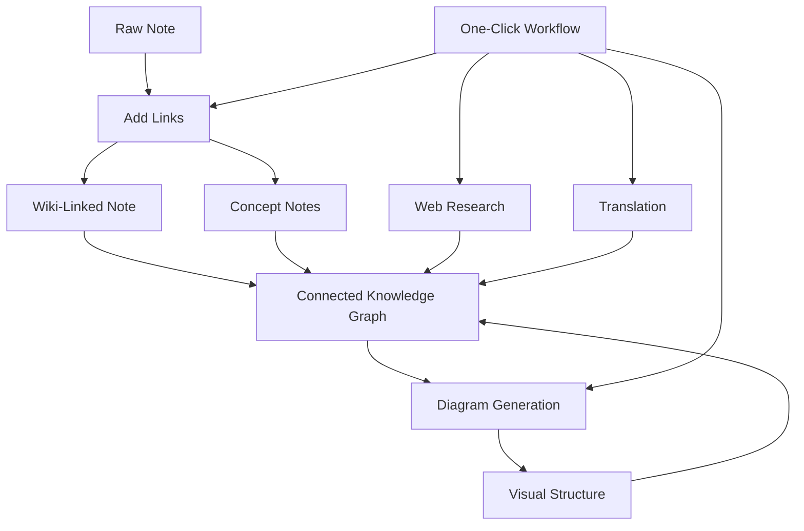

import TLDR from '@site/src/components/TLDR';

# Obsidian คู่มือการจัดการความรู้ด้วย AI

<TLDR>
**Notemd เปลี่ยนการอ่านที่ใช้ LLM ให้กลายเป็นความรู้ที่คงอยู่ตลอดไป: ลิงก์ wiki เชื่อมโยงแนวคิดต่าง ๆ บันทึกแนวคิดสร้างกราฟที่สามารถค้นหาได้ การค้นคว้านำเนื้อหาจากเว็บมาไว้ในคลังของคุณ การแปลขจัดอุปสรรคทางภาษา แผนภาพทำให้โครงสร้างเห็นได้ชัดเจน และกระบวนการทำงานเชื่อมโยงทุกอย่างเข้าด้วยกันด้วยการคลิกเพียงครั้งเดียว** คู่มือนี้ครอบคลุมกระบวนการทั้งหมด — ตั้งแต่บันทึกดิบไปจนถึงฐานความรู้ที่เชื่อมต่อกัน มีลักษณะเป็นภาพ และรองรับหลายภาษา
</TLDR>

## ทำไมต้องจัดการความรู้ด้วย AI?

การจดบันทึกแบบดั้งเดิมจะสร้างไฟล์แบบแบน แม้จะมีการสร้างลิงก์ wiki ด้วยตนเอง บันทึกส่วนใหญ่ก็ยังคงไม่เชื่อมต่อกัน Notemd ใช้ LLM เพื่อทำให้ชั้นการเชื่อมโยงเป็นไปโดยอัตโนมัติ:

- **LLMs อ่านเนื้อหาของคุณ** และระบุสิ่งที่สำคัญ — คำศัพท์ วิธีการ บุคคล ทฤษฎี
- **ลิงก์จะถูกเพิ่มเข้าไปโดยอัตโนมัติ** ทุกครั้งที่มีการกล่าวถึงแนวคิด ไม่ใช่ถูกซ่อนไว้ในส่วน "ดูเพิ่มเติม"
- **บันทึกแนวคิดจะถูกสร้างขึ้น** เป็นไฟล์ที่สามารถค้นหาได้โดยอิสระ
- **การค้นคว้าช่วยเสริมบันทึก** ด้วยบริบทจากเว็บ
- **แผนภาพทำให้โครงสร้างเห็นได้ชัดเจน** — แผนที่ความคิด แผนภูมิการไหล แผนภูมิข้อมูลจากเนื้อหาเดียวกัน

ผลลัพธ์คือ: กราฟความรู้ที่เติบโตขึ้นทุกครั้งที่คุณประมวลผลบันทึก ไม่ใช่แค่ตอนที่คุณนึกจะเพิ่มลิงก์เท่านั้น

## กระบวนการทั้งหมด



แต่ละขั้นตอนเป็นอิสระต่อกัน สามารถใช้หนึ่งขั้นตอนหรือทั้งหมดก็ได้ ลำดับที่มีผลกระทบมากที่สุดคือ: **เพิ่มลิงก์ → บันทึกแนวคิด → แผนภาพ**.

---

## 1. ลิงก์วิกิ: การสร้างความเชื่อมโยงอย่างชัดเจน

ลิงก์วิกิเป็นโครงสร้างหลักของกราฟความรู้ Notemd ใช้ LLM เพื่อทำสิ่งต่อไปนี้:

1. อ่านเนื้อหาบันทึก (แบ่งเป็นส่วนๆ สำหรับเอกสารที่ยาว)
2. ระบุแนวคิดหลัก — ให้ความสำคัญกับคำศัพท์เฉพาะทางมากกว่าคำนามทั่วไป
3. แทรก `[[wiki-links]]` ที่แต่ละจุดที่ปรากฏ
4. ยับยั้งคำพ้องความหมายเพื่อไม่ให้ "ML" และ "Machine Learning" สร้างโหนดแยกกัน

### เมื่อไหร่ควรใช้

- **บันทึกที่มีความยาวมากกว่า 100 คำ** — บันทึกที่สั้นกว่าจะให้แนวคิดน้อย
- **บทความวิจัย เอกสารเทคนิค บันทึกการประชุม** — มีคำศัพท์เฉพาะทางมากมาย
- **หลังจากที่เนื้อหามีความมั่นคงแล้ว** — อย่าประมวลผลต้นฉบับซ้ำๆ

### การตั้งค่าคีย์

| การกำหนดค่า | แนะนำ | เหตุผล |
|---------|-----------|-----|
| `addLinksProvider` | DeepSeek หรือ GPT-4o-mini | ความแม่นยำสูงในราคาถูก |
| การยับยั้งคำพ้องความหมาย | เปิด | ป้องกันไม่ให้มีโหนดซ้ำ |
| หน้าต่างบริบท | ย่อหน้า | สมดุลระหว่างความแม่นยำกับต้นทุน |

→ [Wiki-Links deep dive](/docs/features/wiki-links)

---

## 2. หมายเหตุแนวคิด: โหนดความรู้ที่สามารถเรียกคืนได้

ลิงก์วิกิช่วยเชื่อมโยงแนวคิดเข้าด้วยกันในรูปแบบอินไลน์ แต่บันทึกแนวคิดทำให้สามารถค้นหาแต่ละแนวคิดได้อย่างอิสระ แต่ละแนวคิดจะมีไฟล์ `.md` ของตัวเอง:

```markdown
# Machine Learning

## Linked From
- [[My Research Notes]]
- [[Neural Networks Explained]]
```

### กระบวนการสกัดข้อมูล

คำสั่ง LLM มีโครงสร้างที่ชัดเจนมาก:
- ปรับให้อยู่ในรูปแบบเอกพจน์
- ให้ความสำคัญกับแนวคิดที่มีหลายคำมากกว่าคำเดียว ("Dielectric Relaxation" ไม่ใช่ "Relaxation")
- ข้ามส่วนอ้างอิง/บรรณานุกรม
- แสดงผลเป็นบรรทัด `CONCEPT:` เพื่อให้สามารถแปลงรูปแบบได้อย่างแน่นอน

แนวคิดจะถูกลบซ้ำกันระหว่างชุดข้อมูลต่าง ๆ ผ่าน `Set<string>` ข้อผิดพลาด LLM ในชุดข้อมูลแต่ละชุดจะไม่ทำให้การดำเนินการหยุดลง.

### ลิงก์ย้อนกลับ

เมื่อเปิดใช้งาน บันทึกแนวคิดแต่ละรายการจะบันทึกว่ามีบันทึกแหล่งข้อมูลใดบ้างที่กล่าวถึงมัน แผงลิงก์ย้อนกลับของ Obsidian ก็จะแสดงการเชื่อมต่อแบบย้อนกลับด้วย

### การลดความซ้ำกัน

เครื่องมือลบซ้ำ 4 ขั้นตอนของ Notemd สามารถตรวจจับได้ดังนี้:
1. **การตรงกันทั้งหมด** — การเปรียบเทียบชื่อไฟล์โดยไม่สนใจตัวพิมพ์ใหญ่และตัวพิมพ์เล็ก
2. **รูปแบบพหูพจน์** — "Models.md" เทียบกับ "Model.md"
3. **การปรับมาตรฐานสัญลักษณ์** — "A-B.md" เทียบกับ "A B.md"
4. **การมีคำเดียวอยู่ภายใน** — "ML.md" จะถูกระบุเมื่อมี "Machine Learning.md" อยู่

### การตั้งค่าคีย์

| การกำหนดค่า | ที่แนะนำ | เหตุผล |
|---------|-----------|-----|
| `conceptNoteFolder` | `concepts/` หรือ `🧠 concepts/` | ช่วยให้ตู้เก็บข้อมูลเป็นระเบียบ |
| `extractConceptsAddBacklink` | เปิด | เปิดใช้งานการค้นหาย้อนกลับ |
| `extractConceptsMinimalTemplate` | ปิด | แบบฟอร์มสมบูรณ์พร้อม Linked From |
| โมเดลตามงาน | DeepSeek | การสกัดแนวคิดไม่จำเป็นต้องใช้โมเดลที่มีราคาแพง |
| การยับยั้งคำพ้องความหมาย | เปิด | การตั้งค่าเดียวกันส่งผลต่อทั้งการเชื่อมโยงและการสกัดแนวคิด |

→ [Concept Notes deep dive](/docs/features/concept-notes)

---

## 3. การวิจัย: การนำเว็บเข้ามาใช้

Notemd รวมการค้นหาบนเว็บเข้ากับกระบวนการจดบันทึกของคุณ:

1. **การสร้างคำขอ** — ชื่อหรือส่วนที่คุณเลือกในบันทึกจะกลายเป็นคำขอค้นหา
2. **การค้นหาบนเว็บ** — Tavily (แนะนำ, ต้องมีคีย์ API) หรือ DuckDuckGo (ฟรี, ไม่ต้องมีคีย์)
3. **การสรุปด้วย LLM** — ผลลัพธ์จากการค้นหาจะถูกสรุปเป็นบทสรุปที่เกี่ยวข้อง
4. **เพิ่มเข้าไปในบันทึก** — บทสรุปจะถูกเพิ่มไว้ที่ตำแหน่งเคอร์เซอร์หรือเป็นส่วนใหม่

### เมื่อใดควรใช้

- ก่อนประมวลผลหัวข้อใหม่ — ต้องรับข้อมูลบริบทจากเว็บก่อน
- เมื่อบันทึกแนวคิดต้องการเพิ่มเนื้อหา — ให้ทำการค้นคว้าก่อนแล้วจึงเพิ่มลิงก์
- สำหรับการทบทวนวรรณกรรม — ให้ทำการค้นคว้าแบบกลุ่มสำหรับโฟลเดอร์ของบันทึก

### การตั้งค่าหลัก

| การกำหนดค่า | ที่แนะนำ | เหตุผล |
|---------|-----------|-----|
| `researchProvider` | GPT-4o หรือ Claude | การค้นคว้าต้องการการสรุปที่มีคุณภาพสูงกว่า |
| บริการค้นหา | Tavily | ความเกี่ยวข้องที่ดีขึ้น สามารถปรับระดับความลึกได้ |
| `maxResearchContentTokens` | 4000 | การหาจุดสมดุลระหว่างความลึกกับต้นทุน |

→ [Research deep dive](/docs/features/research)

---

## 4. การแปล: การทลายอุปสรรคทางภาษา

Notemd แปลบันทึกโดยใช้ LLM ที่คุณตั้งค่าไว้ — ไม่ใช่เครื่องมือแปลแบบเฉพาะทาง API นั่นหมายความว่า:

- **การแปลที่เข้าใจบริบท** — LLM จะเข้าใจเนื้อหาทั้งหมดของเอกสาร ไม่ใช่แค่ประโยคต่อประโยค
- **การจัดการคำศัพท์เฉพาะทาง** — "gradient descent" จะยังคงเป็น "梯度下降" ไม่ใช่ "坡度向下"
- **การรองรับการแปลหลายไฟล์พร้อมกัน** — สามารถแปลบันทึกทั้งโฟลเดอร์ในครั้งเดียวได้
- **การใช้โมเดลตามงาน** — ใช้ Gemini Flash สำหรับการแปล (เร็ว ราคาถูก รองรับหลายภาษา)

### การรองรับภาษา

Notemd เองรองรับภาษา UI ถึง 21 ภาษา ส่วนภาษาปลายทางสำหรับการแปลสามารถตั้งค่าได้ตามแต่ละงาน คู่ภาษาที่พบบ่อย ได้แก่ EN↔ZH, EN↔JA, EN↔KO, EN↔DE, EN↔FR, EN↔ES.

→ [การดูรายละเอียดการแปลเชิงลึก](/docs/features/translation)

---

## 5. แผนภาพ: ทำให้โครงสร้างมองเห็นได้

กระบวนการสร้างแผนภาพของ Notemd จะเริ่มจากการกำหนดสเปกก่อน: LLM จะสร้าง `DiagramSpec` JSON ที่มีโครงสร้างชัดเจน จากนั้นตัวแปลงจะนำไปแปลเป็นรูปแบบปลายทาง วิธีนี้ให้ผลลัพธ์ที่น่าเชื่อถือกว่าการขอให้ LLM แปลตามสัญกรณ์ Mermaid ดิบๆ

### การตรวจจับเจตนา

Notemd จะประมวลผลหาประเภทแผนภาพที่เหมาะสมที่สุดจากเนื้อหา:

- **ตารางที่มีตัวเลข** → แผนภูมิข้อมูล (Vega-Lite)
- **คำศัพท์ไคลเอนต์/เซิร์ฟเวอร์** → แผนภาพลำดับการทำงาน (Mermaid)
- **อ็อบเจกต์/คีย์หลัก** → แผนภาพ ER (Mermaid)
- **ขั้นตอน/กระบวนการ** → แผนภาพกระแสงาน (Mermaid)
- **คำสำคัญของแผนภาพแนวคิด** → JSON Canvas (Obsidian native)
- **ค่าเริ่มต้น** → แผนภาพมายด์แมป (Mermaid)

### Rendering Chain

เป้าหมายหลัก → การสำรองไว้ → การสำรองไว้อีกครั้ง → HTML. หากไวยากรณ์ Mermaid ล้มเหลว จะพยายามใหม่อีกครั้งโดยส่งข้อมูลข้อผิดพลาดไปยัง LLM แล้วจึงหันไปใช้แผนภาพขั้นต่ำที่สุด.

### Key Settings

| การกำหนดค่า | Recommended | เหตุผล |
|---------|-----------|-----|
| `enableExperimentalDiagramPipeline` | On | คุณภาพที่ดีขึ้นโดยใช้ข้อกำหนดเป็นอันดับแรก |
| `experimentalDiagramCompatibilityMode` | `best-fit` | เป้าหมาย native ตามความตั้งใจ |
| `summarizeToMermaidProvider` | GPT-4o หรือ Claude | ข้อกำหนดของแผนภาพต้องใช้ความสามารถในการคิดเชิงพื้นที่ |
| `autoMermaidFixAfterGenerate` | เปิด | จับข้อผิดพลาดด้านไวยากรณ์ LLM โดยอัตโนมัติ |
| การเสริมความรู้ในระดับท้องถิ่น | เปิดสำหรับกรณีที่เฉพาะทาง | เพิ่มความแม่นยำด้วยบริบทของ vault |

→ [Diagrams deep dive](/docs/features/diagrams)

---

## 6. วิธีการทำงาน: การอัตโนมัติด้วยการคลิกเดียว

วิธีการทำงานจะเชื่อมต่องานหลายอย่างเข้าด้วยกันผ่านปุ่มในแถบด้านข้างเดียว รูปแบบ DSL คือ:

```
task1 | task2 | task3
```

ตัวอย่าง: `addLinks | extractConcepts | generateDiagram` — แปลงบันทึกจากข้อความดิบให้กลายเป็นโหนดความรู้แบบเชื่อมต่อกันทั้งหมดในรูปแบบภาพได้ในเพียงคลิกเดียว.

### กระบวนการทำงานที่แนะนำ

| กระบวนการทำงาน | ลำดับการทำงาน | กรณีการใช้งาน |
|----------|-------|----------|
| กระบวนการทั้งหมด | `addLinks \| extractConcepts \| generateDiagram` | บันทึกใหม่ |
| การวิจัยก่อน | `research \| addLinks` | หัวข้อที่ไม่คุ้นเคย |
| Polyglot | `translate \| addLinks` | บันทึกหลายภาษา |
| แค่แผนภาพ | `generateDiagram` | การแสดงผลแบบรวดเร็ว |

→ [Workflows deep dive](/docs/features/workflows)

---

## 7. LLM ผู้ให้บริการ: ตัวเลือก 36 แห่งตั้งแต่บนคลาวด์ไปจนถึงแบบโลคัล

Notemd รองรับผู้ให้บริการ 36 รายใน 4 ประเภทการส่งข้อมูล กลุ่มคีย์หลัก:

- **Cloud ระดับนานาชาติ**: OpenAI, Anthropic, Google, Mistral, xAI
- **Cloud ในประเทศจีน**: DeepSeek, Qwen, Doubao, Moonshot, GLM, Baidu, SiliconFlow
- **Gateway**: OpenRouter, GitHub Models, Hugging Face, Vercel
- **Local**: Ollama, LMStudio, OVMS — ไม่มีคีย์ API ข้อมูลจะไม่ออกจากเครื่องของคุณ

### กลยุทธ์โมเดลตามงาน

การตั้งค่าที่ประหยัดที่สุดคือการใช้โมเดลราคาถูกสำหรับงานง่ายและโมเดลที่ทรงพลังสำหรับงานซับซ้อน:

```
extractConcepts  → DeepSeek (fast, cheap, accurate enough)
addLinks          → DeepSeek or GPT-4o-mini
research          → GPT-4o or Claude (needs quality)
generateDiagram   → GPT-4o or Claude (needs spatial reasoning)
translate         → Gemini Flash (fast, multilingual)
```

→ [LLM ภาพรวมผู้ให้บริการ](/docs/providers/overview)

---

## รายการตรวจสอบก่อนเริ่มต้น

1. **ติดตั้ง Notemd** — [Community Plugins](/docs/getting-started/installation) (แนะนำ) หรือทำด้วยตนเอง
2. **กำหนดค่าผู้ให้บริการ** — DeepSeek (ง่ายที่สุด), OpenAI หรือ Ollama (ฟรี)
3. **ประมวลผลบันทึกแรกของคุณ** — คลิกขวา → "Process file (add links)"
4. **ตั้งค่าโฟลเดอร์แนวคิด** — การตั้งค่า → Notemd → ผลลัพธ์ → โฟลเดอร์แนวคิด
5. **ดึงข้อมูลแนวคิด** — รัน “ดึงข้อมูลแนวคิด” บนโน้ตเดียวกัน
6. **สร้างแผนภาพ** — รัน “สร้างแผนภาพ” เพื่อแสดงการเชื่อมต่อ
7. **สร้างไหลงาน** — เชื่อมโยงขั้นตอนข้างต้นเข้าด้วยกันเป็นปุ่มคลิกเดียว

## การตั้งค่าที่แนะนำ

### นักศึกษา (งบประมาณ)

```
Provider: DeepSeek (free tier available)
Concept extraction: DeepSeek
Research: DuckDuckGo (free) + DeepSeek
Diagrams: Off (or legacy Mermaid)
Workflows: addLinks | extractConcepts
```

### นักวิจัย (คุณภาพ)

```
Provider: GPT-4o (primary)
Concept extraction: DeepSeek (cost savings)
Research: GPT-4o + Tavily
Diagrams: best-fit mode, GPT-4o
Workflows: research | addLinks | extractConcepts | generateDiagram
```

### ความเป็นส่วนตัวเป็นอันดับแรก (ใช้งานในเครื่องเท่านั้น)

```
Provider: Ollama (llama3 or qwen2.5:7b)
All tasks: Ollama
Research: DuckDuckGo (free, no API key)
Diagrams: legacy Mermaid mode
```

### สองภาษา (ZH + EN)

```
Primary: DeepSeek (Chinese queries)
Translation: Google Gemini Flash
Research: Tavily + DeepSeek (Chinese search context)
Language output: per-task (extractConceptsLanguage: zh-CN)
```

---

## รูปแบบทั่วไป

### รูปแบบ: ประมวลผลบทความวิจัย

1. นำเข้าเนื้อหา PDF (หรือวางลงมา)
2. **วิจัย** — รับข้อมูลบริบทจากเว็บเกี่ยวกับหัวข้อ
3. **เพิ่มลิงก์** — ระบุและเชื่อมโยงแนวคิดสำคัญ
4. **ดึงข้อมูลแนวคิด** — สร้างบันทึกที่สามารถใช้งานได้เอง
5. **สร้างแผนภาพ** — แสดงโครงสร้างของเอกสาร

### รูปแบบ: การเสริมคุณค่าบันทึกประจำวัน

1. เขียนบันทึกประจำวัน
2. **เพิ่มลิงก์** — เชื่อมโยงแนวคิดในวันนี้กับแนวคิดที่มีอยู่แล้ว
3. บันทึกแนวคิดจะอัปเดตโดยอัตโนมัติพร้อมลิงก์ย้อนกลับ

### รูปแบบ: การทบทวนวรรณกรรม

1. สร้างโฟลเดอร์สำหรับเก็บเอกสาร/บันทึก
2. **เพิ่มลิงก์แบบกลุ่ม** — ประมวลผลโฟลเดอร์ทั้งหมด
3. **ลบบันทึกที่คล้ายกัน** — จัดการบันทึกที่เกือบจะซ้ำกัน
4. **สร้างแผนภาพ** — แผนภาพความคิดของวรรณกรรมทั้งหมด

---

*Notemd เป็นโอเพนซอร์ส (MIT) และทำงานได้กับ Obsidian 0.15.0+ บนทุกแพลตฟอร์ม [ติดตั้งตอนนี้](/docs/getting-started/installation) หรือ [ดูที่ GitHub](https://github.com/Jacobinwwey/obsidian-NotEMD).*
