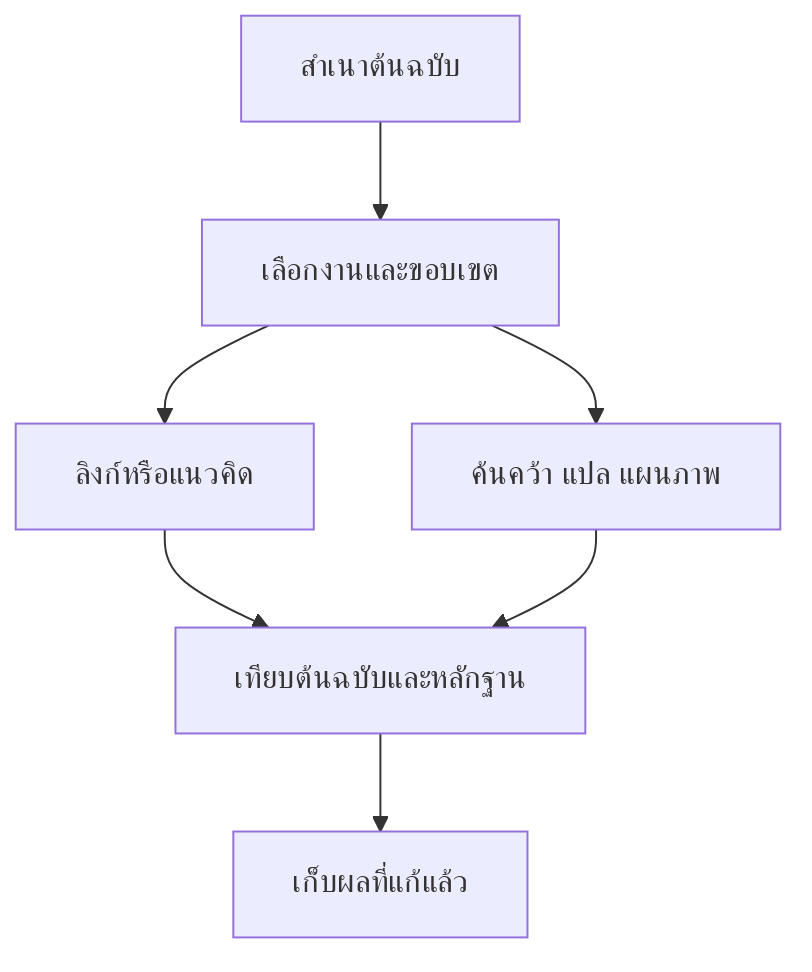

import TLDR from '@site/src/components/TLDR';

# จัดการความรู้ด้วย AI ใน Obsidian

<TLDR>วิธีทำงานที่ใช้งานได้จริงแยกต้นฉบับ คำตอบโมเดล และข้อแก้ไขของคุณ Notemd สร้างลิงก์ แนวคิด การค้นคว้า คำแปล และแผนภาพเป็นเอกสารที่ตรวจสอบได้ เริ่มจากแหล่งเดียว ตรวจผล แล้วค่อยทำโฟลเดอร์จำกัดขอบเขตโดยอัตโนมัติ</TLDR>

## เลือกผลลัพธ์

ต้องการโน้ตที่มีลิงก์ แนวคิด สรุปพร้อมแหล่งข้อมูล คำแปล หรือแผนภาพ จำนวนไฟล์หรือลิงก์ที่มากขึ้นไม่รับประกันความเข้าใจหรือการค้นพบข้อมูล วางวิธีตรวจและค้นกลับให้ชัดเจน

## เส้นทางครบวงจร


```mermaid
flowchart TD
    A[สำเนาต้นฉบับ] --> B[เลือกงานและขอบเขต]
    B --> C[ลิงก์หรือแนวคิด]
    B --> D[ค้นคว้า แปล แผนภาพ]
    C --> E[เทียบต้นฉบับและหลักฐาน]
    D --> E
    E --> F[เก็บผลที่แก้แล้ว]
```

นี่แสดงงานที่เลือกใช้ได้ ไม่ใช่ทุกขั้นของปุ่มเริ่มต้นปุ่มเดียว เก็บต้นฉบับและตรวจผลก่อนสร้างชุดงาน

## 1. ลิงก์: แสดงความสัมพันธ์

ใช้ **ประมวลผลไฟล์ (เพิ่มลิงก์)** แล้วเทียบ `_processed.md` ในด้านศัพท์ คำอ้างอิง โค้ด และสูตร คำสั่งสาขา/คำพ้องไม่ได้บังคับตัวตนของคำหรือเกณฑ์ตัวเลข หากต้องเชื่อมชื่อที่มีอยู่ให้ซ้ำได้แน่นอน วิธีจับคู่เชิงกำหนดอาจเหมาะกว่า ดู [ลิงก์](./features/wiki-links)

## 2. แนวคิด: แยกชื่อจากคำอธิบาย

เลือกโฟลเดอร์ การแยกอิสระรักษาต้นฉบับและสร้างชื่อเรื่อง หากต้องการ `Linked From` ในไฟล์ใหม่ให้เปิดลิงก์ย้อนกลับและปิดรูปแบบขั้นต่ำ **สร้างแบบกลุ่มจากชื่อเรื่อง** เป็นอีกงานและอาจทำกับโน้ตเดิมที่เข้าเงื่อนไข ตรวจการย้ายไป complete และความหมายต่างกันที่ใช้ชื่อเหมือนกัน ดู [แนวคิด](./features/concept-notes)

## 3. ค้นคว้า: เก็บหลักฐาน

เลือกหัวข้อ/ชื่อเรื่อง Tavily หรือ DuckDuckGo และ **ค้นคว้าและสรุป** คีย์ Tavily ว่างไม่เปลี่ยนบริการ เปิดแหล่งอ้างอิงเพื่อตรวจข้อกล่าวอ้าง การค้นตามคำในเครื่องที่เปิดเพิ่มจะส่งข้อความให้ LLM ที่เลือก ดัชนีในเครื่องไม่ได้ทำให้เส้นทางนั้นออฟไลน์ ดู [ค้นคว้า](./features/research)

## 4. แปล: ความหมายและโครงสร้าง

เลือกภาษาเป้าหมายและแปลทั้งไฟล์ `_<language>.md` เริ่มต้นอาจแทนผลเก่า ใช้โน้ตชั่วคราวสำหรับแปลบางส่วน ตรวจคำศัพท์ ตัวเลข โค้ด ลิงก์ และคณิตศาสตร์ การแบ่งส่วนอาจเสียบริบท จำนวนภาษา UI/เว็บไซต์ไม่พิสูจน์คุณภาพคู่ภาษา ดู [การแปล](./features/translation)

## 5. แผนภาพ: แหล่งสำหรับแก้ต่อ

เลือกคู่ที่เข้ากันแล้วเก็บต้นฉบับกับ SVG/PNG/PDF ที่ต้องใช้ ภาพไม่ได้พิสูจน์ว่าความสัมพันธ์ทั้งหมดคงอยู่ใน editor อื่น CircuitikZ มีขอบเขตจำกัดและต้องคอมไพล์แยก ลูกศรข้ามกิ่ง Drawnix เป็นแบบคงที่ และ Mermaid/SVG ใน PPTX อาจเป็นภาพ ดู [แผนภาพ](./features/diagrams)

## 6. เวิร์กโฟลว์: ทำขั้นที่ทดสอบแล้วโดยอัตโนมัติ

ชื่อ `::` และการทำงานที่คั่นด้วย `>` กำหนดชุดงาน:

```text
One-Click Extract::process-current-add-links>batch-generate-from-titles>batch-mermaid-fix
```

ชุดนี้มีเพิ่มลิงก์ สร้างจากชื่อเรื่อง และซ่อม Mermaid ไม่ใช่ขั้นค้นคว้าหรือสร้างแผนภาพทั่วไป เงื่อนไขกับผลลัพธ์ยังเป็นของแต่ละงาน ค่าเริ่มต้นหยุดเมื่อรายงานผิดพลาด การทำต่อเหมาะเมื่อขั้นถัดไปรับข้อมูลที่เหลือได้ การยกเลิกไม่ลบผลที่เสร็จแล้ว ดู [เวิร์กโฟลว์](./features/workflows)

## 7. ผู้ให้บริการ: งานและโพรโทคอล

36 โปรไฟล์ครอบคลุมห้ากลุ่ม เลือกจากที่อยู่ สิทธิ์ เงื่อนไขข้อมูล และผลที่วัด เปรียบเทียบเวลา/ค่าใช้จ่ายด้วยต้นฉบับและพรอมป์ต์เดียวกัน การกำหนดเส้นทางตามงานเริ่มปิด ตรวจทุกเส้นทางก่อนสรุปว่าทำในเครื่อง ดู [ผู้ให้บริการ](./providers/overview)

## ตรวจครั้งแรก

1. ติดตั้งและเก็บสำเนาต้นฉบับ
2. ตั้งและทดสอบโมเดลจริง
3. เลือกโฟลเดอร์แนวคิดและปลายทางที่ต่างกัน
4. ทดสอบสำเนา
5. เปรียบเทียบและเก็บข้อแก้ไข
6. ขยายไปโฟลเดอร์เล็กแล้วตรวจผลบางส่วนก่อนสร้างชุดยาว

## กรณีใช้งาน

### ประมวลผลบทความ

แปลงเป็น Markdown ภายนอกและตรวจตาราง สูตร และรูป แยกแนวคิด/ข้อความ ถามคำถามค้นคว้าที่เจาะจง และวาดเฉพาะความสัมพันธ์ที่ตรวจได้ เก็บต้นฉบับและข้อแก้ไข

### ดูแลแนวคิด

ใช้โฟลเดอร์แยก ตรวจคำและสร้างคำอธิบายให้กลุ่มที่เลือก สำรองก่อนเก็บกวาด จำนวนไม่แทนคำจำกัดความที่แม่นยำและการนำทางที่มีประโยชน์

### ข้อมูลส่วนตัว

เตรียมเซิร์ฟเวอร์ในเครื่อง โมเดล และ dependency ตรวจเส้นทางและหลีกเลี่ยงค้นคว้าเว็บตามความจำเป็น ตรวจรายงานก่อนแชร์ ค่า loopback เริ่มต้นไม่ป้องกันการตั้งให้ส่งออกไปภายนอก

### ทำงานชุดต่อ

รอให้ข้อผิดพลาดหรือการยกเลิกสิ้นสุด ตรวจรายงาน ผลลัพธ์ และไฟล์กู้คืน เปรียบเทียบข้อขัดแย้งแล้วเรียกซ้ำเฉพาะส่วน ยกเลิกไม่ได้แปลว่าไม่มีไฟล์ ตรวจการอ้างอิงก่อนลบไฟล์ประกอบ

## ขั้นต่อไป

- [เริ่มต้นอย่างรวดเร็ว](./getting-started/quick-start)
- [ประมวลผลเป็นชุด](./advanced/batch-processing)
- [นักพัฒนา](./developers/overview)
- [Agent](./agents/overview)
