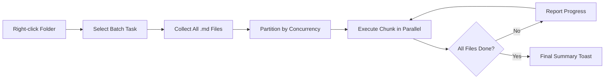

import TLDR from '@site/src/components/TLDR';

# Toplu İşleme

<TLDR>
**Notemd, ayarlanabilir eşzamanlılık ve üzerine yazma kontrolü ile tüm klasörleri tek seferde işler.** Bir klasöre sağ tıklayarak içindeki tüm notlara wiki bağlantıları ekleyebilir, kavramları çıkarabilir, araştırma yapabilir veya çeviri yapabilirsiniz. Eşzamanlılık sınırları API hız sınırı hatalarını önler. İlerleme her dosya için raporlanır. Üzerine yazma davranışı ayarlanabilir: mevcutları atlamak, eklemek veya değiştirmek. Başarısız olan dosyalar, toplu işlemi durdurmadan kaydedilir.

Bu içerik [Obsidian AI Bilgi Yönetimi Kılavuzu](/docs/pillar-ai-knowledge) serisinin bir parçasıdır.
</TLDR>

## Genel Bakış

Toplu işleme, notların bulunduğu bir klasörü tek bir işlem haline getirir. Her bir notu ayrı ayrı açıp komutları çalıştırmak yerine, klasöre sağ tıklayıp görevi seçersiniz. Notemd, her `.md` dosyasını dolaşır, seçilen işlemi uygular ve ilerlemeyi gerçek zamanlı olarak raporlar.

Bu özellik, tüm veri havuzundaki bilgilerin çıkarılması için vazgeçilmezdir. Örneğin, onlarca PDF dosyasını içe aktardıktan sonra, önce toplu bağlantı ekleme ardından toplu kavram çıkarma işlemleri sayesinde bilgi grafiğiniz saatler yerine dakikalar içinde oluşturulur.

## Nasıl Çalışır

### Toplu İşlem Modeli

1. **Dosya toplama** -- Notemd, hedef klasörü özyinelemeli olarak tarar (veya ayarlara bağlı olarak yalnızca üst düzeyde) ve tüm `.md` dosyalarını toplar.
2. **Eşzamanlılık bölme** -- Dosyalar, `batchConcurrency` ayarına göre parçalara ayrılır. Her parça paralel olarak çalışır; parçalar ise sıralı olarak çalışır.
3. **İşleme** -- Her dosya, tek dosya komutunda kullanılan aynı mantıkla işlenir. Görev başına sağlayıcı ve model ayarları dikkate alınır.
4. **İlerleme raporlama** -- Her dosya tamamlandığında bir bildirim penceresi güncellenir ve `N / Total` ilerlemesi gösterilir.
5. **Hata yönetimi** -- Bir dosya başarısız olursa (API hatası, ağ zaman aşımı vb.), hata kaydedilir ve toplu işlem devam eder. Son özet, başarısız olan dosyaları listeler.
6. **Tamamlanma** -- Bir özet bildirimi, toplamda işlenen, başarılı ve başarısız olanları raporlar.

### Üst Üste Yazma Davranışı

Zaten wiki-bağlantıları, kavram notları veya çeviriler içeren bir dosya işlenirken, Notemd'ın davranışı üst üste yazma ayarına bağlıdır:

| Mod | Davranış |
|------|----------|
| **Atla** | Mevcut içerik dokunulmaz kalır. Yalnızca değiştirilmemiş dosyalar işlenir. |
| **Ekle** (varsayılan) | Yeni içerik eklenir. Mevcut wiki-bağlantıları, kavramlar veya çeviriler korunur. |
| **Yerine Koyma** | Dosya tamamen yeniden işlenir. Tüm önceki Notemd değişiklikleri üst üste yazılır. |

Özellikle wiki-bağlantıları için: bir not zaten `[[wiki-links]]` içeriyorsa, **Atla** modu onu olduğu gibi bırakırken, **Yerine Koyma** modu tüm notu yeni bağlantı ekleme işlemi için LLM'a yeniden gönderir. Artımlı işleme için **Atla**, model yükseltmesinden sonra yeniden işleme için **Yerine Koyma** kullanın.

### Eş Zamanlılık Kontrolü

`batchConcurrency` ayarı, paralel API çağrılarını sınırlar. Bu sayede, sıkı kota politikalarına sahip sağlayıcılarda büyük klasörler işlenirken oran sınırlama hataları (HTTP 429) önlenebilir.

| Eş Zamanlılık | Tavsiye Edilen Kullanım Alanları | Tipik Oran Sınırlama Etkisi |
|-------------|----------------|---------------------------|
| `1` | Ücretsiz planlar, katı sağlayıcılar | Yok (sıralı) |
| `3` (varsayılan) | Çoğu bulut sağlayıcısı | Düşük |
| `5` | Ollama (yerel), cömert planlar | Yok / Düşük |
| `10` | Hızlı çıkarım yapan yerel modeller | Yok |

Toplu işleme sırasında 429 hataları alırsanız eşzamanlılık düzeyini 1 veya 2'ye düşürün.

## Yapılandırma

| Ayar | Varsayılan | Etki |
|---------|---------|--------|
| `batchConcurrency` | `3` | Klasör işlemleri sırasında maksimum paralel API çağrısı |
| `batchOverwriteExisting` | `false` | Mevcut Notemd içeriğini üzerine yazın. `false` = ekleme modudur. |
| `batchSkipProcessed` | `false` | Zaten Notemd işaretleyicilerini içeren dosyaları atlayın (örneğin, wiki bağlantıları) |
| `batchRecursive` | `true` | Klasörü tararken alt klasörleri dahil edin |
| `enableStableApiCall` | `false` | Toplu işlemler sırasında her dosya için yeniden deneme mantığını etkinleştirin (en fazla 4 deneme) |

### Toplu İşlemlerde Görev Bazlı Modeller

Her toplu işlem operasyonu ilgili görev bazlı modeli kullanır. batch-add-links `addLinksProvider` kullanır, batch-research `researchProvider` kullanır ve benzeri. Bu sayede yüksek hacimli işlemler için ucuz modeller atayabilir ve kaliteye duyarlı görevler için pahalı modelleri ayırabilirsiniz.

## Örnek

`papers/` adında 40 adet içe aktarılmış araştırma notunun bulunduğu bir klasörünüz var. Tüm notlara wiki bağlantıları eklemek ve bunlardan kavramlar çıkarmak istiyorsunuz:

1. `papers/` klasörüne sağ tıklayın
2. **"Notemd: Klasörü işle (bağlantılar ekle)"** seçeneğini seçin
3. Notemd klasörü tarar, 40 adet `.md` dosyası bulur ve varsayılan eşzamanlılık düzeyinde her seferinde 3 tanesini işler
4. Bir ilerleme bildirimi şunu gösterir: `12/40 files processed...`
5. Yaklaşık 3 dakika sonra bir özet bildirimi şunu rapor eder: `39 succeeded, 1 failed (API timeout on paper-37.md)`
6. Tüm 40 dosya için konsept notları oluşturmak amacıyla **"Notemd: Klasörü işle (kavramları çıkar)"** seçeneğiyle tekrarlayın

Başarısız olan tek dosya kaydedilir. Daha sonra yalnızca bu dosya üzerinde yeniden çalıştırma yapabilirsiniz.

## İpuçları

- **Düşük eşzamanlılıkla başlayın** -- Sağlayıcınızın hız sınırlamalarından emin değilseniz, `1` ile başlayıp kademeli olarak artırın.
- **Artımlı güncellemeler için atla modunu kullanın** -- İlk tam parti işlendikten sonra `batchSkipProcessed: true` moda geçin ki sonraki çalıştırmalarda yalnızca yeni notlar işlensin.
- **Stabil API çağrılarını etkinleştirin** -- `enableStableApiCall: true`, uzun partiler sırasında geçici ağ hatalarından kurtulmak için yeniden deneme mantığı ekler.
- **Model yükseltmelerinden sonra yeniden çalıştırın** -- Daha iyi bir modele geçtiyseniz, `batchOverwriteExisting: true` değerini ayarlayıp daha iyi bağlantılar ve kavramlar elde etmek için yeniden çalıştırın.

---

## Sonraki Adımlar

- [İş Akışları](/docs/features/workflows) -- Toplu görevleri tek tıklamalı kenar çubuğu düğmeleri halinde zincirleyin
- [Özel İstekler](/docs/advanced/custom-prompts) -- Toplu çıkarma işlemleri için istekleri özelleştirin
- [Sorun Giderme](/docs/advanced/troubleshooting) -- Toplu çalıştırmalar sırasında ortaya çıkan hız sınırlama hatalarını ve bağlantı sorunlarını düzeltin
- [LLM Sağlayıcılar](/docs/providers/overview) -- Görev başına model yapılandırma referansı
