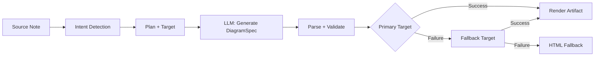
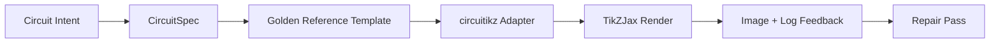

import TLDR from '@site/src/components/TLDR';

# Şemalar

<TLDR>
**Notemd, özellik-öncelikli bir işlem akışı aracılığıyla notlarınızdan şemalar oluşturur.** LLM, renderörden bağımsız bir `DiagramSpec` JSON üretir; ardından özel adaptörler bunu Mermaid, JSON Canvas, Vega-Lite, HTML veya düzenlenebilir HTML/SVG çıktısına dönüştürür. 8 farklı amaç türünü, otomatik yedekleme zincirlerini, SVG/PNG dışa aktarımıyla canlı önizlemeyi, semantik doğrulamayı ve yerel bilgiyle zenginleştirilmiş üretimi destekler.
</TLDR>

Bu içerik [Obsidian AI Bilgi Yönetimi Kılavuzu](/docs/pillar-ai-knowledge) serisinin bir parçasıdır.

## Mimari: Özellik-Öncelikli İşlem Akışı

Notemd, asla LLM'den doğrudan Mermaid/Vega/Canvas sözdizimini üretmesini istemez. Bunun yerine:



**Neden özellik-öncelikli?** LLM'ler sık sık geçersiz renderör sözdizimi üretir (özellikle Mermaid). Yapılandırılmış bir `DiagramSpec`, render edilmeden önce doğrulanabilir ve aynı özellik, yedek olarak birden fazla renderöre beslenebilir.

## Desteklenen Şema Türleri

| Amaç | Ana Renderör | Yedekler | Kullanım Senaryosu |
|--------|-----------------|-----------|----------|
| `mindmap` | Mermaid | HTML | Hiyerarşik konu bölümlemesi |
| `flowchart` | Mermaid | HTML | İş akışları, karar ağaçları |
| `sequence` | Mermaid | HTML | Müşteri-sunucu etkileşimleri, protokoller |
| `classDiagram` | Mermaid | HTML | OOP sınıf ilişkileri |
| `erDiagram` | Mermaid | HTML | Veritabanı şemaları, varlık ilişkileri |
| `stateDiagram` | Mermaid | HTML | Durum makineleri, yaşam döngüsü modelleri |
| `canvasMap` | JSON Canvas | Mermaid → HTML | Kavram haritaları, bilgi grafikleri |
| `dataChart` | Vega-Lite | Mermaid → HTML | Çubuk, çizgi, alan, dağılım, pasta, tablolar |

## Niyet Tespiti

Notemd, notunuzdaki içerikten anahtar kelime puanlaması kullanarak en uygun diyagram türünü belirler:

| Niyet | Tetikleyiciler | Güvenilirlik |
|--------|----------|------------|
| `dataChart` | Tablolar, sayısal hücreler, ölçüm/eğilim anahtar kelimeleri, yüzdelikler | 0.88 |
| `sequence` | İstek/yanıt sözlüğü (4+ eşleşme) veya `->`/`=>` işaretleyicileri | 0.82 |
| `erDiagram` | Birincil anahtar, dış anahtar, varlık, şema (2+ eşleşme) | 0.80 |
| `stateDiagram` | Durum, geçiş, beklemede, çalışıyor, başarısız (3+ eşleşme) | 0.76 |
| `flowchart` | Numaralandırılmış adımlar (2+) veya if/then/else/iş akışı sözlüğü | 0.74 |
| `canvasMap` | Kavram haritası, bilgi grafiği, mekansal, küme | 0.72 |
| `mindmap` | Varsayılan geri dönüş | 0.55 |

**Tercih edilen diyagram türü** ayarı, kenar çubuğu seçici veya açık bir komut paleti seçeneği ile geçersiz kılınabilir.

## Render Hedefi Seçimi

Deneysel özellik öncelikli iş akışı artık iki bağımsız kontrolü içerir:

| Kontrol | Ayar | Etki |
|---------|---------|--------|
| Tercih edilen diyagram türü | `preferredDiagramIntent` | Oluşturulan `DiagramSpec`'nun anlamsal şeklini yönlendirir |
| Tercih edilen render hedefi | `preferredDiagramRenderTarget` | **Diyagram oluştur** ve **Diyagram önizle** işlemleri için araç renderleyicisini seçer |

Planlayıcı varsayılanı için **Tercih edilen render hedefi**'ni **Otomatik** olarak ayarlayın veya Mermaid, JSON Canvas, Vega-Lite, HTML veya Düzenlenebilir HTML/SVG'yi açıkça seçin. Bu geçersiz kılma yalnızca araç ve önizleme komutları için geçerlidir. Standart **Mermaid diyagramı olarak özetle** komutu mevcut Markdown iş akışlarının sessizce format değiştirmemesi için Mermaid uyumlu çıktılara sabitlenmiştir.

Bu ayrım önemlidir çünkü bir `flowchart` amacı artık Markdown notları için Mermaid, sağlam bir geri dönüş için HTML veya sonraki düzenlemeler için Düzenlenebilir HTML/SVG olarak render edilebilir. Draw.io ve Drawnix hâlâ CLI araç ihracatçıları olarak kalır ve eklenti içi render hedefleri değildir.

## Kullanım

### Bir Diyagram Oluştur

1. Bir notu açın
2. Komut paletinden **"Notemd: Diyagram oluştur**" komutunu çalıştırın
3. Notemd amacı algılar, özeti oluşturur, render eder ve aracı kaydeder

**Hedefe göre çıktı dosyaları:**

| Hedef | Eklenti | Dosya Adı Deseni |
|--------|-----------|------------------|
| Mermaid | `.md` | `{note}_summ.md` |
| JSON Canvas | `.canvas` | `{note}_diagram.canvas` |
| Vega-Lite | `.json` | `{note}_diagram.json` |
| HTML | `.html` | `{note}_diagram.html` |
| Düzenlenebilir HTML/SVG | `.html` | `{note}_diagram.html` |

### Bir Diyagramı Önizle

1. **"Notemd: Diyagramı Önizle"** komutunu Çalıştır
2. İşlenmiş diyagramla birlikte modala bir pencere açılır
3. Arayüz düğmelerini kullanarak SVG veya PNG olarak Dışa Aktar

Ayarlar bölümünde **Önizlemeyi Otomatik Aç** seçeneği mevcuttur — oluşturma işleminden sonra önizleme modali otomatik olarak başlatılır.

Önizleme modali ayrıca bir hata teşhisi paneline sahiptir. İşleyiciler ve duman kontrolü işlemleri `RenderArtifact.diagnostics` ekleyebilir; modala, önizlemenin yanında hata/uyarı/bilgi sayıları, ardından ciddiyet düzeyi, teşhis türü, mesaj ve onarım önerileri içeren bir teşhis özeti gösterilir. Aynı özet önizleme geçmişi girişlerinde de görüntülenir, böylece her girişi açmadan tekrarlanan circuitikz duman kontrolü denemeleri karşılaştırılabilir. Kaynak içeriğine sahip ancak doğrudan veya HTML iframe yoluyla işlenemeyen nesneler için modala artık boş bir iframe zorlamak yerine yalnızca kaynak içeriğine dayalı bir önizleme sunar. Bu sayede circuitikz derleme/işleme duman kontrolü, SVG metin-tokenu kontrolü, PNG boş ekran görüntüsü kontrolü ve gelecekteki örtüşme raporları için görünür bir UI yüzey sağlanır; aynı zamanda TikZJax veya LaTeX’i zorunlu bir eklenti çalışma zamanı bağımlılığı haline getirmez ya da kaynak metnin doğrulanmış görsel bir işlenmiş versiyon olduğunu varsaymaz.

### Eski Mermaid Modu

`enableExperimentalDiagramPipeline` kapalıyken, Notemd doğrudan Mermaid isteğini LLM’a gönderir. Bu, özellik akışını tamamen atlar. Deneysel akış başarısız olursa bu moda geri dönülür.

## İşleme Arka Uçları

### Mermaid

6 adaptör (zihin haritası, akış şeması, sıralama, ER, sınıf, durum) `DiagramSpec`’yı Mermaid sözdizimine çevirir. Oluşturma işleminden sonra `mermaid.parse()` çıktıyı doğrular. Doğrulama başarısız olursa:

1. **LLM yeniden deneme** — Mermaid hata mesajını bağlam olarak kullanan bir deneme
2. **En az düzeyde geri dönüş** — özellik düğümü kimliklerinden oluşan basit bir Mermaid diyagramı

**Eski Mermaid Düzeltici** yaygın LLM sözdizimi hatalarını otomatik olarak düzeltir: not direktiflerinin normalleştirilmesi, pipe-etiketlerinin kaçırılması, noktalı virgüllerin yeniden yerleştirilmesi, akıllı tırnaklar, çift çizgi okları, şekil uyuşmazlıkları ve daha fazlası.

### JSON Canvas

Mekânsal düzenleme ile Obsidian JSON Canvas formatında sonuç üretir:
- Nodlar derinlik (x = derinlik × 420) ve indeks (y = indeks × 170) ile konumlandırılır
- Genişlik etiket uzunluğundan tahmin edilir
- `fromSide: 'right'`, `toSide: 'left'`, `toEnd: 'arrow'` içeren kenarlar

### Vega-Lite

Otomatik kodlama ile tam Vega-Lite v5 JSON özelliklerini oluşturur:
- **Karteziyen grafikler** (çubuk/çizgi/alan/nokta/dağılım): çoklu seriler için x + y kanalları ve renk
- **Peygamber**: theta = y (nicel), renk = x (nominal)
- **Tablo**: satır = x, metin = y + sütun = seri

Karanlık ve açık tema düzeltmeleri derlemeden önce derin birleştirme yapılır.

### HTML

Evrensel alternatif. Kendi içinde tam olan HTML belgesi şunları içerir:
- CSP meta başlıkları
- `prefers-color-scheme` aracılığıyla açık/karanlık mod
- 20 farklı dil için yerelleştirilmiş UI etiketleri
- Bölümler: ana sayfa, yapı (nod ağacı), ilişkiler, vurgular, veri serisi tabloları

### Düzenlenebilir HTML/SVG

Düzenlenebilir dışa aktarım iş akışları için açık bir şekil hedefi. Bu hedef, `DiagramSpec`'ı belirlenmiş bir `SemanticFigureModel` haline getirir, ardından içinde Draw.io tarzı notlar içeren satır içi SVG gruplarına sahip, kendi başına işleyebilen bir HTML belgesi oluşturur:

- Semantik düğümlerde `data-drawio-type`, `data-drawio-id` ve `data-drawio-role`
- Semantik kenarlar üzerinde `data-drawio-source` ve `data-drawio-target`
- Boşluk normalizasyonu ve çakışma işleme sonrasında sabit düğüm/kenar tanımlayıcıları
- Hiçbir script, harici yazı tipi veya uzak varlık yok

Bu hedef henüz varsayılan planlayıcı rotası olarak tasarlanmamıştır. Ürün yolunun gerçek araçlarda düzenleme davranışını kanıtlaması sırasında açık bir render hedefi olarak mevcuttur.

### Draw.io ve Drawnix Dışa Aktarım Sınırları

Mevcut uygulama, üçüncü taraf düzenleyici desteğini ürün sınırında tutar:

| Hedef | Sözleşme | Çalışma Zamanı Bağımlılığı |
|--------|----------|--------------------|
| Draw.io | `SemanticFigureModel`'dan gelen belirlenmiş, sıkıştırılmamış `mxfile` XML | Eklenti çalışma zamanında veya CI'de hiçbiri yok |
| Drawnix | `geometry` ve `arrow-line` öğelerini kullanan minimal `.drawnix` JSON alt kümesi | Eklenti çalışma zamanında veya CI'de hiçbiri yok |

Bu denge kasıtlıdır: Notemd, diagram.net Desktop, Drawnix, Plait veya yalnızca tarayıcı tabanlı düzenleyici durumlarını eklentiye dahil etmeden görünür etiketleri, sabit ID'leri ve desteklenen ilkel kapsamı doğrulayabilir.

### circuitikz / TikZJax Yönü

Devre şemaları, genel akış şemalarıyla aynı sorunu taşımaz. Elektrik devreleri için doğru sözdizimi hedefi genellikle **circuitikz** olup, Obsidian aracılığıyla TikZJax gibi eklentilerle gösterilir. TikZJax, `circuitikz`, `pgfplots`, `tikz-cd` ve `chemfig` gibi paketleri yükleyebilir; bu da fizik, devreler, kimya ve matematik notları için cazip kılar.

Risk, ham LLM tarafından üretilen TikZ dosyalarının kırılgan olmasıdır:

- Karmaşık devre topolojileri elektriksel olarak doğru olabilir ancak görsel olarak okunaksız olabilir;
- Üst üste gelen teller ve etiketler, doğru bir netlist dosyasını çalışma notları için kullanılamaz hâle getirebilir;
- Eksik paket girişleri, yanlış ankraj noktaları veya geçersiz bileşen adları render işlemini engelleyebilir;
- Renderlayıcının geri bildirimi genellikle görüntü seviyesindedir, oysa LLM tarafından üretilenler metin seviyesinde geometridir.

Daha iyi mimari, circuitikz'yu serbest biçimli bir komut olarak değil, sınırlı bir şema hedefi olarak ele almak olmalıdır:



Birinci sınıf model, devre topolojisini ve yerleşimini ayrı ayrı tanımlamalıdır:

| Katman | Sorumluluk | Örnek |
|-------|----------------|---------|
| Topoloji | elektriksel düğümler ve bileşen bağlantıları | `VDD -> RD -> drain(M1)`, `source(M1) -> GND` |
| Yerleşim | grid yerleşimi, yönlendirme ve yönlendirme şeritleri | `M1 at (3,2.2)`, sol giriş, sağ çıkış |
| Stil | paket, gerilim kuralı, etiketler, ankrajlar | `\begin{circuitikz}[american voltages]` |
| Doğrulama | derleme günlüğü, eksik ankrajlar, örtüşme/ekran görüntüsü kontrolleri | TikZJax/LaTeX teşhisleri ve görsel inceleme |

### Mevcut circuitikz Prototipi

Notemd şu an bu yönde ilk kısıtlı depo prototipini içermektedir. Kasıtlı olarak çevrimdışıdır ve şablonla sınırlıdır:

```bash
npm run diagram:export-circuitikz -- --input cmos-inverter.json --output cmos-inverter.tex
```

Prototip, altı altın referans ailesi için ayrı bir `CircuitSpec` sınırı ve belirlenmiş bir dışa aktarıcı ekler:

| Devre türü | Altın referans | Akım garanti |
|--------------|------------------|-------------------|
| `common-source-amplifier` | `common-source-nmos-v1` | LaTeX yazmadan önce `VDD -> R_D -> M1.D`, `vin -> M1.G`, `M1.S -> GND` ve `M1.D -> vout`'ü doğrular |
| `cmos-inverter` | `cmos-inverter-v1` | LaTeX yazmadan önce PMOS-over-NMOS topolojisini, ortak kapı girişini, ortak drenaj çıkışını, `VDD -> MP.S` ve `MN.S -> GND`'ü doğrular |
| `cmos-buffer` | `cmos-buffer-v1` | LaTeX yazmadan önce iki ardışık invertör aşamasını, ara düğüm `vmid`, geri yüklenmiş `vout` ve ortak VDD/GND hatlarını doğrular |
| `cmos-transmission-gate` | `cmos-transmission-gate-v1` | LaTeX yazmadan önce `vin` ve `vout` arasındaki paralel PMOS/NMOS geçiş cihazlarını tamamlayıcı `phib` / `phi` kontrolleriyle doğrular |
| `cmos-nand2` | `cmos-nand2-v1` | LaTeX yazmadan önce paralel PMOS çekme, seri NMOS indirme, çift giriş `va` / `vb` ve `vout`'yi doğrular |
| `cmos-nor2` | `cmos-nor2-v1` | LaTeX yazmadan önce seri PMOS çekme, paralel NMOS indirme, çift giriş `va` / `vb` ve `vout`'yi doğrular |

Bu henüz genel bir TikZ üreticisi değil. LaTeX derlemez, TikZJax'yı çağırmaz, ekran görüntülerini incelemez veya otomatik görüntü geri bildirimli onarım yapmaz. Bunlar daha sonraki aşamalarda gerçekleştirilir.

Dosya uzantısı `.tex` veya `.tikz` olduğunda ve kaynak `\usepackage{circuitikz}` veya `\begin{circuitikz}` içerdiğinde, Önizleme diyagramı komutu kaydedilen circuitikz kaynak nesnelerini doğrudan yeniden açabilir. Bu yol sadece kaynak içeren bir circuitikz önizlemesidir: modül kaynağı, teşhisleri, kopyalama/kaydet kontrollerini ve geçmiş meta verilerini gösterir, ancak LaTeX derlemez veya eklenti çalışma zamanında TikZJax'yı çağırmaz.

Aynı sadece kaynak içeren önizleme kapsamı artık kaydedilen Draw.io ve Drawnix nesnelerini de kapsar. `.drawio` dosyaları Draw.io XML (`mxfile` veya `mxGraphModel`) gibi göründüğünde kabul edilir ve `.drawnix` dosyaları Drawnix JSON şeklinde `type: "drawnix"` ve bir `elements` dizisi ile birlikte olduğunda kabul edilir. Eklenti hâlâ diagrams.net veya Drawnix tahtası sunucusunu içermez; bu önizlemeler kaynağı, teşhisleri ve nesne geçmişini gösterir ancak eklenti içi görsel bir düzenleyici iddia etmez.

Topolojiyi koruyan onarım için, onarılmış adayı kabul etmeden önce önceden hazırlanan özellikleri referans olarak geçirin:

```bash
npm run diagram:export-circuitikz -- --input repaired-cmos-inverter.json --topology-reference cmos-inverter.json --output cmos-inverter.tex
```

Onarım koruyucusu çıktıdan önce `circuitKind`, `goldenReferenceId`, ağlar, bileşen kimlikleri/türleri/terminalleri ve yönsüz bağlantı uç noktalarını karşılaştırmak için `createCircuitTopologySignature` ve `assertCircuitTopologyUnchanged` kullanır. Etiketler, başlık metinleri, yerleşim ipuçları, bağlantı sırası ve bağlantı etiketleri kasıtlı olarak göz ardı edilir. Kısa bir eklem yapan veya bir terminali yeniden bağlayan adaylar `.tex` dosyası yazılmadan önce `Circuit topology drift detected` ile başarısız olur.

CLI artık bir derleyici çalıştırmadan mevcut LaTeX/TikZJax derleme günlüğünü analiz edebilir:

```bash
npm run diagram:export-circuitikz -- --input cmos-inverter.json --output cmos-inverter.tex --compile-log cmos-inverter.log --diagnostics-output cmos-inverter.diagnostics.json
```

Bu teşhis yolu `circuitikz.sty` gibi eksik paketleri, bilinmeyen TikZ/circuitikz anahtarlarını, noktalı virgül eksikliği gibi TikZ yol sözdizimi hatalarını, dengesiz parantezlerden veya bitmemiş etiketlerden kaynaklanan aşırı argümanları, tanımsız kontrol dizilerini, genel LaTeX hatalarını, acil durdurma işlemlerini ve aşırı dolu `\hbox` uyarılarını rapor eder. Hâlâ günlük tabanlıdır: yerel LaTeX/TikZJax çalıştırması ve ekran görüntüsü kalitesi kontrolü hâlâ ayrı gelecekteki işlerdir.

Bakım görevlileri için duman testleri amacıyla, aynı CLI isteğe bağlı olarak kabuk komutu analizi olmadan önceden yapılandırılmış bir render ediciyi çalıştırabilir:

```bash
npm run diagram:export-circuitikz -- --input cmos-inverter.json --output cmos-inverter.tex --compile-executable pdflatex --compile-arg -interaction=nonstopmode --compile-arg -halt-on-error --compile-arg -output-directory={outputDir} --compile-arg {tex} --expected-artifact {outputDir}/{jobName}.pdf
```

Derleme yürütücüsü `shell: false` kullanır, `{tex}`, `{outputDir}` ve `{jobName}` yer tutucularını argüman dizisi değerlerine dönüştürür, oluşturulan `{jobName}.log`'yu okur ve `compileExecution` ile birlikte `compileDiagnostics`'yı CLI JSON çıktısında geri verir. `--compile-executable` yalnızca render edici ikili dosyası veya kapsayıcı yoludur; render edici bayrakları tekrarlanan `--compile-arg` değerlerinde yer alır. Boş yürütülebilir dosyalar `compile-executable-invalid` olarak başarısız olur, eksik ikili dosyalar `compile-executable-not-found` olarak başarısız olur ve kabuk komutu şeklindeki yürütülebilir dizeler, Windows, Linux ve macOS'ın aynı doğrudan çalıştırma sözleşmesine uyması için argümanların bölünmesi konusunda tavsiye alır. `--expected-artifact` ile birlikte `compileExecution.renderSmoke`'yi de rapor eder ve render edici boş olmayan bir nesne oluşturmadığında CLI ile başarısız olur. Hâlâ LaTeX'i dahil etmez, TikZJax'ü eklenti çalışma zamanı bağımlılığı yapmaz veya ekran görüntüsü seviyesinde görsel onarım yapmaz.

Beklenen nesne `.svg` ise, duman testi bir kat daha derinleşir:

```bash
npm run diagram:export-circuitikz -- --input cmos-inverter.json --output cmos-inverter.tex --compile-executable dvisvgm --compile-arg ... --expected-artifact {outputDir}/{jobName}.svg --expected-svg-text v_{in} --expected-svg-text v_{out}
```

SVG duman testi `<svg>` kökünü, pozitif boyutları veya `viewBox`'yi, gizli/şeffaf öğeler hariç tutulduktan sonra en az bir görünür çizim öğesini, istenen tüm metin token'larını, `viewBox` dışındaki belirgin öğeleri, `<text>` / `<tspan>` etiketlerinin belirgin olarak üst üste gelmesini ve `render-svg-label-overlap` aracılığıyla çizim öğelerinin üzerine gelen belirgin metin etiketlerini doğrular. Beklenen metin, görünür metinde ve `aria-label`, `<title>`, `<desc>` gibi erişilebilirlik meta verilerinde aranır, böylece görünür `<text>` dışındaki semantik etiketleri koruyan render ediciler OCR gerektirmeden metin token duman testini geçirebilir. Geometri kontrolü artık yaygın grup ve öğe `transform` özellikleri için dönüşüm bilincine sahip geometridir, bu yüzden çevrilmiş, ölçeklenmiş, döndürülmüş, eğiltilmiş veya matris dönüşümü yapılmış SVG kutuları dönüşüm kompozisyonundan sonra kontrol edilir. A/a yay uç noktaları için kesin yay sınırları, C/S/Q/T eğri uç noktaları için kesin Bezier eğri sınırları, çizgi kalınlığına duyarlı SVG sınırlar ve etiket üst üste gelme kontrolleri, `polyline` / `polygon` çizim geometrisi ve ayrıca `<use href="#...">` referanslarından gelen yalnızca yol tabanlı glyph yerleşimi çözülür, böylece yeniden kullanılabilir glyph yollarına dönüştürülen etiketler, yerleştirilen glyph geometrisi `viewBox`'u aştığında sınırlı çizim alanı kontrollerini geçemez. Bir `<text>` ebeveyninin altındaki birden fazla konumlandırılmış `tspan` etiket, ayrı etiket kutuları olarak karşılaştırılır; bu da aksi takdirde farklı etiketleri tek bir metin düğümüne indirgeyecek LaTeX tarzı SVG çıktıyı tespit eder. Konumlandırılmış SVG `text` ve `tspan` kutuları `text-anchor` değerleri `start`, `middle` ve `end`'ye uyar, böylece merkezli ve sağa hizalanmış etiketler, tarayıcı seviyesi metin düzenlemesi iddia etmeden metin/metin ve etiket-çizim üst üste gelme teşhislerini tetikleyebilir. `<defs>` içindeki yalnızca tanım tabanlı glyph yolları görünür çizim öğeleri olarak sayılmaz, ancak kendi tanım yerel `transform` özellikleri `<use>` yerleştirme öncesinde uygulanır, böylece ölçeklenmiş veya yansıtılmış glyph tanımları eksik olarak sayılmaz. Etiket-çizim kontrolü küçük bir çizim kutusu toleransı ve beyan edilen `stroke-width` kullanır, bu yüzden ince teller, kalın teller ve çokgen bileşen konturları, görünür çizgileri bir etikete ulaştığında potansiyel etiket okunabilirliği başarısızlıkları olarak değerlendirilebilir. `<use href="#...">`'den çözülen yalnızca yol tabanlı glyph etiketleri de çizim kutularıyla karşılaştırılır ve yeniden kullanılabilir glyph geometrisi tellerle veya bileşenlerle üst üste geldiğinde `render-svg-path-glyph-overlap` ile başarısız olur. Eğer bir render edici etiketleri aranabilir `<text>` yerine yeniden kullanılabilir yol glyph'lerine dönüştürür ve erişilebilirlik meta verilerini korumazsa, duman raporu `pathOnlyGlyphUseCount`'yu kaydeder ve istenen metin token'ını `render-svg-text-path-only` aracılığıyla başarısız kılar, etiketin sadece yokmuş gibi davranılmasına izin vermez. Diğer başarısızlıklar `render-svg-invalid`, `render-svg-dimension-missing`, `render-svg-no-visible-elements`, `render-svg-text-missing`, `render-svg-out-of-bounds`, `render-svg-text-overlap`, `render-svg-label-overlap` veya `render-svg-path-glyph-overlap` aracılığıyla rapor edilir. Metin token ve üst üste gelme kontrolleri yalnızca etiketleri aranabilir SVG metin veya erişilebilirlik meta verileri olarak koruyan render ediciler için yapısal duman testi olarak ele alınmalıdır; yalnızca yol tabanlı SVG çıktılar hâlâ görsel etiket okunabilirliğini kanıtlamak için daha sonraki ekran görüntüsü/OCR aşamasına ihtiyaç duyar ve bu duman testi hâlâ tam SVG yol kapsamını iddia etmez.

Görünür öğe sayımı ve geometri toplama sırasında gizli SVG gruplar ve öğeler tutarlı bir şekilde atlanır. Özellik veya iç satır stilindeki `display:none`, `visibility:hidden`, `visibility:collapse` ve genel `opacity:0`, aksi takdirde boş olan bir render nesnesinin görünür çıktı duman testini geçmesini sağlayamaz.

Yalnızca yol tabanlı glyph tanımları doğrudan yollar veya `<defs>` içinde gruplanmış/sembol konteynerleri olabilir. Duman testi, `<use>` yerleştirme öncesinde `<g id="...">` ve `<symbol id="...">`'den çocuk yol geometrisini çözer, böylece kapsanan glyph çıktısı hâlâ `pathOnlyGlyphUseCount`, sınırlı çizim alanı kontrollerine ve `render-svg-path-glyph-overlap`'a beslenir.

Yol analizörü ayrıca alt yol başlangıçlarını takip eder ve `Z/z` üzerinde mevcut noktayı sıfırlar, böylece kapalı bir alt yol sonrasındaki göreceli komutlar yanlış `render-svg-out-of-bounds` teşhisleri oluşturmak yerine doğru SVG noktasından devam eder.

Aynı geometri işlemi, ön tırnaklı ondalık sayılar ve açık artı işaretleri için SVG numaralı sözdizimini takip eder; bu yüzden `.5`, `-.5` veya `+.5` gibi kompakt dvisvgm koordinatları sınırlar kontrolü sırasında kesirli kalır ve yanlış sınır dışı geometri oluşturulmaz ya da atlanmaz.

Eğer render motoru `.png` üretirse, beklenen sanat eseri yolu ilk ekran görüntüsü dumanı haline gelir: Notemd, çapraz olmayan 1/2/4/8-bit indeksli renkli PNG dosyalarını, 1/2/4/8/16-bit gri tonlu PNG dosyalarını ve 8/16-bit gri tonlu‑alfa/RGB/RGBA PNG dosyalarını çözer. İndeksli renkli ve alt‑bayt gri tonlu görüntüler paketlenmiş örnekleri destekler; indeksli renkli görüntüler ayrıca PLTE ve isteğe bağlı tRNS verilerini destekler; gri tonlu/RGB görüntüler tRNS şeffaf örneklerini destekler. 16‑bit doğrudan örnekler, duman kontrolünde kullanılan aynı 8‑bit RGBA karşılaştırma alanına normalleştirilir. Duman kontrolü pozitif boyutları doğrular, ön plan sınırlarını `foregroundBounds` olarak kaydeder, o kutu içindeki ön plan yoğunluğunu `foregroundDensity` olarak kaydeder; her görünür piksel en üst sol arka plan rengiyle eşleşirse `render-png-blank` ile başarısız olur, ön plan içeriği görüntü sınırlarına temas ederse `render-png-content-clipped` ile başarısız olur, büyük bir ekran görüntüsünde dörtten az ön plan pikseli varsa `render-png-foreground-too-small` ile başarısız olur ve ön plan pikselleri önemsiz bir sınırlama kutusu içinde olağandışı derecede yoğunsa `render-png-foreground-dense` ile başarısız olur. Desteklenmeyen PNG formatları `render-png-unsupported` ile başarısız olur ve Adam7 çapraz PNG’ler veya desteklenmeyen indeksli renk derinlikleri için format‑özgü yönlendirmeler sağlanır. Bu yöntem, boş ekran görüntülerini, bariz tuval kesimlerini, yetersiz render edilmiş ön plan izlerini, ilk piksel düzeyindeki yoğunluk hatalarını ve yanlış render motoru PNG dışa aktarma ayarlarını, platform‑özgü bir kabuk bağımlılığı eklemeksizin tespit eder. Bu henüz OCR seviyesinde etiket tanıma, kesin metin üst üste gelme tespiti veya topolojiyi koruyan görüntü onarımı değildir.

Teşhisler başarısız derleme veya render‑duman çalıştırmasını gösterdiğinde, CLI aynı zamanda topolojiyi koruyan bir onarım özeti de yazabilir:

```bash
npm run diagram:export-circuitikz -- --input cmos-inverter.json --topology-reference cmos-inverter.json --output cmos-inverter.tex --compile-log cmos-inverter.log --repair-brief-output cmos-inverter.repair-brief.json
```

Onarım özeti `notemd.circuitikz.repair-brief.v1` şemasını kullanır ve kaynak `CircuitSpec`, topoloji imzasını, derleme/render teşhislerini, izin verilen düzenlemeleri, yasaklanan topoloji düzenlemelerini, bir sonraki doğrulama adımlarını ve yapılandırılmış `repairPrompt` içerir. İstek rolü `topology-preserving-circuitikz-repair`’tür; onun `diagnosticFocus` listesi derleme/render teşhislerinden türetilir ve `acceptanceCriteria`, adayın doğrulanmasını ve yeni derleme ile render‑duman kontrollerini gerektirir. Bu, daha sonraki bir onarım döngüsü için aktarım formatıdır, Notemd’nın zaten otonom görsel onarım yaptığı anlamına gelmez.

Bir onarım adayı üretildikten sonra, aynı CLI çıktıyı yazmadan önce onu özete göre doğrulayabilir:

```bash
npm run diagram:export-circuitikz -- --input repaired-cmos-inverter.json --repair-brief cmos-inverter.repair-brief.json --output repaired-cmos-inverter.tex
```

`--repair-brief`, özetten gelen adayın topoloji imzasını kontrol eder ve bu işlem `--topology-reference` ile birbirini dışlar. Bu kontrolü geçmek yalnızca topolojinin korunduğunu kanıtlar; aday hâlâ derleme teşhislerine ve render‑duman kontrollerine ihtiyaç duyar.

`--repair-brief` sonucu ayrıca `repairAcceptance` kanıtlarını `notemd.circuitikz.repair-acceptance.v1` şemasıyla içerir. `topology-signature`, `compile-diagnostics` ve `render-smoke` kontrol noktalarını `passed`, `failed` veya `missing` olarak rapor eder; `remainingChecks`’yu açığa çıkarır; ve aday çalıştırması gerekli tüm kanıtları içerene kadar `readyForVisualAcceptance`’u yanlış olarak tutar.

CI veya sürüm kanıtlarının kalıcı bir JSON dosyasına ihtiyaç duyduğunda `--repair-acceptance-output`’yu `--repair-brief` ile birlikte kullanın:

```bash
npm run diagram:export-circuitikz -- --input repaired-cmos-inverter.json --repair-brief cmos-inverter.repair-brief.json --output repaired-cmos-inverter.tex --repair-acceptance-output repaired-cmos-inverter.repair-acceptance.json
```

Sürüm veya bakım kanıtları için, desteklenen tüm altın aileleri toplu fixture çalıştırıcısı üzerinden çalıştırın:

```bash
npm run diagram:smoke-circuitikz -- --output-dir docs/export/circuitikz-smoke --compile-executable pdflatex --compile-arg -interaction=nonstopmode --compile-arg -halt-on-error --compile-arg -output-directory={outputDir} --compile-arg {tex} --expected-artifact {outputDir}/{jobName}.pdf
```

Çalıştırıcı `docs/maintainer/fixtures/circuitikz/common-source-nmos-v1.json`, `docs/maintainer/fixtures/circuitikz/cmos-inverter-v1.json`, `docs/maintainer/fixtures/circuitikz/cmos-buffer-v1.json`, `docs/maintainer/fixtures/circuitikz/cmos-transmission-gate-v1.json`, `docs/maintainer/fixtures/circuitikz/cmos-nand2-v1.json` ve `docs/maintainer/fixtures/circuitikz/cmos-nor2-v1.json` kullanır, her fixture için aynı kabuk‑sız dışa aktarma yolunu çağırır ve her fixture için `compileExecution` ve `compileDiagnostics` içeren toplu bir JSON raporu döndürür. Bu hâlâ bir bakım komutudur, bir eklenti çalışma zamanı bağımlılığı değildir.

Bir bakım makinesinde henüz bir render motoru yapılandırılmamışsa, `--compile-executable` olmadan aynı fixture komutunu çalıştırın ve ortam kontrol noktasını açıkça saklayın:

```bash
npm run diagram:smoke-circuitikz -- --output-dir docs/export/circuitikz-smoke --report-output docs/export/circuitikz-smoke/renderer-availability.json
```

Bu yol yine de belirli fixture `.tex` artefaktlarını yazar, ancak `ok: false`’i `rendererAvailability.status`’yi `missing-configuration` olarak ayarlayarak ve bir `compile-executable-invalid` teşhisiyle döndürür. Bunu yalnızca render motoru kullanılabilirlik kanıtı olarak görün; bu derleme, render‑duman veya görsel kabul değildir.

### Altın Referans İstek Şekli

Kısa vadede kullanım için, bir devre varyantı istemeden önce render edilebilir bir altın referans sağlayın. Sınırlı bir istek, giriş bölümünü, koordinat ölçeğini, bağlantı stilini ve yönlendirme kurallarını korumalıdır:

```latex
\usepackage{circuitikz}
\begin{document}
\begin{circuitikz}[american voltages]
\draw
  (3,5) node[vcc]{$V_{DD}$}
  to [R, l=$R_D$] (3,3)
  to [short, *-o] (5,3) node[right]{$v_{out}$}
  (3,3) to [short] (3,2.2)
  node[nmos, anchor=D] (M1) {$M_1$}
  (M1.S) to [short] (3,0.5)
  node[ground]{}
  (M1.G) to [short, -o] (0.8,2.2)
  node[left]{$v_{in}$};
\draw
  (3,0.5) node[below right]{$S$};
\end{circuitikz}
\end{document}
```

Bir CMOS invertörü için, istek yalnızca "CMOS invertör çizin" demek yerine açık bir topoloji ve yerleşim kısıtlamaları talep etmelidir:

- `VDD`’u üstte, `GND`’ı altta, girişi sol tarafta, çıktıyı sağ tarafta tutun;
- `pmos`'yi `nmos`'nin üstünde, ortak kapılar ve ortak drenajlar kullanarak uygulayın;
- Çıkış düğümünü drenaj birleşim noktasında tutun ve bunu `*-o` ile işaretleyin;
- Görsel olarak tahmin edilen koordinatlar yerine adlandırılmış çapa noktalarını (`PM1.G`, `NM1.G`, `PM1.D`, `NM1.D`) kullanın;
- Elektriksel olarak gerekli olmadıkça diyagonal veya kesişen tellerden kaçının.

### Mevcut İlerleme ve Sonraki Aşamalar

| Alan | Mevcut durum | Bir sonraki adım |
|------|----------------|-----------|
| Genel diyagramlar | Mermaid, JSON Canvas, Vega-Lite, HTML için özellik odaklı iş akışı uygulandı | Anlamsal doğrulama kapsamını genişletmeye devam edin |
| Düzenlenebilir şekiller | `editable-html-svg`, Draw.io XML ve Drawnix JSON nesne sınırları uygulandı | Testler düzenlenebilirliği kanıtladıktan sonra daha zengin temel elemanlar ekleyin |
| CLI desteği | `npm run diagram:export-artifact`, tek bir `DiagramSpec`'dan düzenlenebilir HTML/SVG, Draw.io ve Drawnix'yi dışa aktarır | Yeni hedefler gönderildiğinde hedefe özel duman düzenekleri ekleyin |
| circuitikz | `CircuitSpec -> circuitikz` prototip, ortak kaynak, CMOS invertör, `cmos-buffer` / `cmos-buffer-v1`, `cmos-transmission-gate` / `cmos-transmission-gate-v1`, `cmos-nand2` / `cmos-nand2-v1` ve `cmos-nor2` / `cmos-nor2-v1` altın şablonlarını, projeleri `layoutHints.inputSide` ve `layoutHints.outputSide` topolojiyi değiştirmeden belirli giriş/çıkış port yerleşimine dönüştürür; `--topology-reference` aracılığıyla onarım topolojisi sapmalarını reddeder, `--repair-brief-output` ve şema `notemd.circuitikz.repair-brief.v1` aracılığıyla topolojiyi koruyan onarım özetleri üretir, `diagnosticFocus`, `acceptanceCriteria` ve rol `topology-preserving-circuitikz-repair` ile yapılandırılmış `repairPrompt` devir içeriği içerir, `--repair-brief` aracılığıyla onarım adaylarını doğrular, şema `notemd.circuitikz.repair-acceptance.v1` aracılığıyla `readyForVisualAcceptance` ve `remainingChecks` ile birlikte `repairAcceptance` kapı kanıtlarını döndürür, bu kanıtları `--repair-acceptance-output` aracılığıyla saklar, derleme günlüklerini analiz eder, açık yerel render motorları ve `--expected-artifact`, SVG `--expected-svg-text` ile çalışabilir, `aria-label`, `<title>` ve `<desc>` aracılığıyla erişilebilirlik meta verisi kontrolleri yapar, gizli/şeffaf SVG öğe dışlaması, yol‑sade etiketler için `render-svg-text-path-only` / `pathOnlyGlyphUseCount` sınıflandırma, `<use href="#...">` için yol‑sade görsel karakter yerleşim kontrolü, `render-svg-path-glyph-overlap` aracılığıyla yol‑sade görsel karakter örtüşme teşhisi, `Z/z` için kapalı yol akım noktası işleme, A/a yay uçları için kesin yay sınırları, C/S/Q/T eğri uçları için kesin Bezier eğri sınırları, çizgi kalınlığına duyarlı SVG sınırlar ve etiket örtüşme kontrolleri, `polyline` / `polygon` çizim geometrisi kontrolleri, konumlandırılmış `tspan` etiket geometrisi, `text-anchor`‑bilinçli konumlandırılmış metin geometrisi, SVG sınırlı‑canvas/metin‑örtüşmesi ve etiket‑vs‑çizim duman kontrolleri için dönüşüm‑bilinçli geometri, ayrıca PNG boş olmayan / kesilmiş / yoğun ön plan ekran görüntüsü duman kontrolleri; indeksli renk paleti alfası, gri tonlama/RGB tRNS şeffaf örnekleri ve Adam7 çapraz PNG’ler ile indeksli bit derinliği hataları için format‑özgü `render-png-unsupported` rehberlikleri içerir, bunlar `foregroundBounds`, `foregroundDensity`, `render-png-content-clipped` ve `render-png-foreground-dense` aracılığıyla kabuk analizi olmadan yapılır; toplu bakımci duman düzeneklerini içerir, eksik render motoru yapılandırmalarını `rendererAvailability.status: "missing-configuration"` ve `compile-executable-invalid` ile kaydeder ve genel önizleme teşhisleri, teşhis özet sayıları, teşhis‑bilinçli geçmiş girişleri ve sadece kaynak‑tabanlı geri dönüş imkanı sağlar `RenderArtifact.diagnostics` ve önizleme modu aracılığıyla | Yol‑sade görsel metinler için OCR seviyesinde etiket tanıma, hassas piksel‑seviyesi örtüşme kontrolleri, gerektiğinde daha geniş SVG yol kapsamı, yalnızca isteğe bağlı kalabilecekse otomatik render motoru kurulumu/bulma ve otomatik topolojiyi koruyan onarım işlemleri |
| TikZJax entegrasyonu | Obsidian tarafı ekran için aday render sunucusu | Bunu isteğe bağlı tutun; TikZJax’yu zorunlu bir eklenti çalışma zamanı bağımlılığı haline getirmeyin |

## Yapılandırma

| Ayar | Varsayılan | Etki |
|---------|---------|--------|
| `enableExperimentalDiagramPipeline` | `false` | Öncelik‑ilk ve eski Mermaid arasında geçiş yapın |
| `experimentalDiagramCompatibilityMode` | `'legacy-mermaid'` | `'legacy-mermaid'` = yalnızca Mermaid; `'best-fit'` = yerel hedefler + geri dönüş seçenekleri |
| `preferredDiagramIntent` | `undefined` (otomatik) | Otomatik niyet algılama işlemini geçersiz kılın |
| `summarizeToMermaidLanguage` | `'en'` | Şema etiketleri için hedef dil |
| `summarizeToMermaidProvider` / `Model` | DeepSeek | Şema oluşturma için görev‑özel LLM |
| `autoMermaidFixAfterGenerate` | (sabitlerden) | Mermaid çıktısı üzerinde eski düzelticiyi otomatik olarak çalıştırın |
| `enableLocalKnowledgeForDiagramGeneration` | `false` | Yerel vault bilgileriyle kaynağı zenginleştirin |

### Yerel Bilgi Zenginleştirme

Etkinleştirildiğinde, Notemd kasanızın yerel bilgi tabanından (MiniSearch tabanlı) ilgili bağlam parçalarını alır ve bunları kaynak markdown'ının başına ekler. Zenginleştirme isteği şu notu içerir: "Yalnızca destekleyici referans; birincil yapının kaynak notuna sadık kalmasını sağlayın."

### Uyumluluk Modları

- **`legacy-mermaid`**: Tüm niyetler Mermaid'a yönlendirilir. Mermaid olmayan niyetler (canvasMap, dataChart) zorunlu olarak `flowchart` veya `mindmap`'ya yönlendirilir. Herhangi bir yedek zincir yoktur.
- **`best-fit`**: Her niyet kendi yerel hedefine yönlendirilir. Birincil hedef başarısız olursa, yedek zincir takip edilir (örneğin, Vega-Lite → Mermaid → HTML).

## Önizleme ve Dışa Aktarma

| Eylem | Yöntem |
|--------|--------|
| SVG export | Canvas için `mermaid.render()` / `vega.View.toSVG()` / SVG oluşturucu |
| PNG dışa aktarımı | SVG → Görüntü → Canvas (cihaz piksel oranı 1x-3x) → PNG ArrayBuffer |
| Kaynak kaydetme | Hedefe özgü uzantıyla ham eser içeriği kaydedilir |
| Yalnızca kaynak önizleme | Kaynak içeriğine sahip, iframe olmadan kod ve teşhis bilgileriyle gösterilen doğrudan olmayan eserler |
| Anlamsal denetim | Mermaid, JSON Canvas, Vega-Lite ve HTML/SVG şeklinde düzenlenebilir olanlar `scripts/diagram-semantic-verification.js` tarafından kontrol edilir |

**Önbellekleme**: RenderCache, `{spec, target, theme}`'ın belirlenmiş JSON anahtarını kullanır. Yol üzerindeki tekrar önleme, aynı görüntünün tekrar üretilmesini engeller.

## İpuçları

- **`best-fit` moduyla başlayın** — bu, her amaç türü için en iyi görsel çıktıyı sağlar
- **Karmaşık diyagramlar için güçlü modeller kullanın** — akış şemaları ve ER şemaları GPT-4o veya Claude'dan fayda görür
- **Alan özelindeki diyagramlar için yerel bilgiyi etkinleştirin** — ilgili vault bağlamı doğruluğu artırır
- **`autoMermaidFixAfterGenerate`'yı ayarlayın** — bunun olmaması durumunda Mermaid sözdizimi hataları sık görülür
- **Eski sürüm düzelticisi kapsamlıdır** — eğer Mermaid önizlemesi başarısız olursa, düzeltici komutunu manuel olarak çalıştırmak genellikle sorunu çözer

---

## Sonraki Adımlar

- 🔗 [Wiki-Links](./wiki-links) — Kavramların nasıl satır içinde bağlandığı
- 📝 [Concept Notes](./concept-notes) — Diyagram kaynak materyali için kavramları çıkartın
- 🔍 [Research](./research) — Web kaynaklı verilerle diyagramları zenginleştirin
