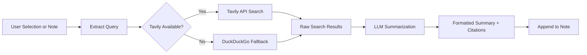

import TLDR from '@site/src/components/TLDR';

# Araştırma ve Web Araması

<TLDR>
**Notemd web’i tarar ve LLM-özetlenmiş sonuçları doğrudan notlarınıza ekler.** Tavily API birincil arama arka ucu olarak kullanılır; DuckDuckGo sıfır yapılandırma gerektiren bir yedek olarak hizmet verir. Sonuçlar kaynak atıflarıyla özetlenir ve `## Research` başlığı altına eklenir. Tek not araştırması, klasördeki tüm notların toplu araştırılması ve özetleme adımı için görev bazlı model seçimi desteklenir.

Bu içerik [Obsidian AI Bilgi Yönetimi Kılavuzu](/docs/pillar-ai-knowledge) serisinin bir parçasıdır.
</TLDR>

## Genel Bakış

Araştırma, Notemd’ın en güçlü entegrasyonlarından biridir: okuma, arama ve yazma arasındaki döngüyü kapatır. Bilinmeyen bir terimi aramak için tarayıcıya geçmek yerine, onu vurgulayın ve Notemd’ın arama yapmasına, özet çıkarmasına ve bulguları notlarınıza eklemesine izin verin -- hepsi de notlarınızın içinde gerçekleşir.

Bu süreç tamamen yapılandırılabilir. Arama sağlayıcısını, özet yazacak LLM’ı ve sonuçların aktif nota mı eklenmesini yoksa ayrı dosyalara mı yazılmasını siz seçersiniz. Toplu mod sayesinde bir tıklamayla bir klasördeki tüm notları araştırabilirsiniz.

## Nasıl Çalışır

### Arama‑Sonra‑Özetleme İş Akışı



1. **Sorgu çıkarma** -- Notemd, seçiminizden veya not başlığından arama terimlerini çıkarır.
2. **Web araması** -- Önce Tavily denir. Eğer herhangi bir API anahtarı yapılandırılmamışsa, otomatik olarak DuckDuckGo kullanılır (anahtar gerekmez).
3. **LLM özetleme** -- Ham arama sonuçları yapılandırılan LLM’a gönderilir ve bu da içinde kaynak atıfları bulunan özlü bir özet üretir.
4. **Eklemek** -- Biçimlendirilmiş özet, aktif nottaki `## Research` başlığı altına eklenir.

### Tavily ile DuckDuckGo Karşılaştırması

| Özellik | Tavily | DuckDuckGo |
|--------|--------|------------|
| API anahtarı | Gerekli (ücretsiz plan mevcut) | Gerekli değil |
| Sonuç kalitesi | Yüksek (yapay zeka için özel olarak tasarlanmış) | Genel sorgular için yeterli |
| Hız sınırlamaları | Cömert ücretsiz plan | Sınırlama uygulanabilir |
| Yapılandırma | Ayarlar içinde `tavilyApiKey` | Sıfır yapılandırma -- otomatik geri dönüş |

### Toplu Klasör Araştırması

Bir klasöre sağ tıklayın ve **"Notemd: Araştırma klasörü"** seçeneğini belirleyin. Klasördeki her `.md` dosyası sırayla (veya yapılandırılan eşzamanlılık düzeyine kadar paralel olarak) işlenir. Her not için ayrı bir araştırma özeti oluşturulur.

## Yapılandırma

| Ayar | Varsayılan | Etki |
|---------|---------|--------|
| `tavilyApiKey` | `''` | Tavily API anahtarı. Boş olduğunda yalnızca DuckDuckGo kullanılır. |
| `researchProvider` / `researchModel` | DeepSeek | Araştırma sonuçlarını özetlemek için görev başına LLM |
| `maxResearchContentTokens` | `4000` | LLM'a gönderilen içerik için token bütçesi. Fazlası kısaltılır. |
| `researchAppendToNote` | `true` | Özeti kaynak notuna ekleyin. False değeri verilirse ayrı bir dosya oluşturulur. |
| `researchLanguage` | `'en'` | Özetlenen araştırmanın çıkış dili |

### Görev bazlı model önerisi

Araştırma, çok dilli içerikleri işleyebilen ve iyi yapılandırılmış metinler üretebilen bir modelden fayda görür. Şunları göz önünde bulundurun:

- **DeepSeek** -- standart, uygun fiyatlı, yüksek kalite
- **GPT-4o** -- daha yüksek kaliteli özetleme, daha yüksek maliyet
- **Gemini Flash** -- hızlı ve ucuz, basit sorgular için yeterli

## Örnek

*transformer attention mechanisms* konulu bir makale okurken *relative positional encoding* adında tanımadığınız bir terimle karşılaşırsınız. Obsidian bırakmak yerine:

1. **"relative positional encoding"** ifadesini vurgulayın
2. Sağ tıklayın --> **"Notemd: Araştırma ve özetleme"**
3. Notemd web’i arar, en iyi sonuçları özetler ve ekler:

```markdown
## Research

### Relative Positional Encoding

Relative positional encoding is a method used in transformer models
where positional information is expressed as relative distances between
tokens rather than absolute positions. Introduced by Shaw et al. (2018),
it improves generalization to unseen sequence lengths compared to
absolute encodings (Vaswani et al., 2017).

Sources:
- [Shaw et al., Self-Attention with Relative Position Representations (2018)](https://arxiv.org/abs/1803.02155)
- [Transformer Positional Encoding Overview](https://example.com/transformer-pos-enc)
```

Özet artık aranabilir, bağlantılanabilir ve çevrimdışı erişilebilir şekilde sizin arşivinizin bir parçasıdır.

## İpuçları

- **En iyi sonuçlar için bir Tavily anahtarı belirleyin** -- ücretsiz seviye bile ham DuckDuckGo’dan daha iyi alaka düzeyi sağlar.
- **Güçlü bir özetleme modeli kullanın** -- ucuz modeller ince teknik içerikleri basite indirebilir.
- **İlk okumadan sonra toplu araştırma yapın** -- böylece birçok not arasındaki eksiklikleri tek seferde giderin.
- **Eklenen özetleri gözden geçirin** -- LLM’lar kaynak detaylarını uydurabilir. Önemli iddiaları doğrulayın.

---

## Sonraki Adımlar

- [Concept Notes](./concept-notes) -- Araştırma sonuçlarından önemli terimleri çıkarın ve kalıcı hâle getirin
- [Wiki-Links](./wiki-links) -- Arşivinizdeki araştırma sonuçlarından elde edilen kavramları birbirine bağlayın
- [Translation](./translation) -- Araştırma özetlerini başka bir dile çevirin
- [LLM Sağlayıcılar](/docs/providers/overview) -- Özetleme için kullanılacak modeli yapılandırın
