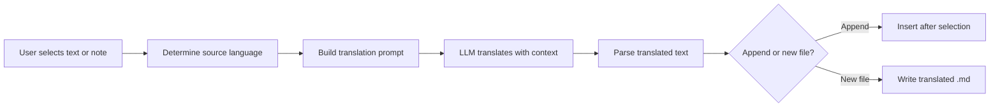

import TLDR from '@site/src/components/TLDR';

# Çeviri

<TLDR>
**Notemd, LLM destekli çeviri özelliğiyle 21'den fazla dil arasında metin çevirisi yapar.** Tek seçimli çeviri, tüm notun çevirisi ve toplu klasör çevirisi özelliklerini destekler. Her çeviri görevi, görev bazlı ayarlar aracılığıyla özel bir sağlayıcı ve model kullanabilir. Çıktı dili, UI dilinden bağımsız olarak ayrıca yapılandırılabilir. Sonuçlar tercihinize göre mevcut dosyaya eklenir veya yeni bir dosyaya yazılır.

Bu içerik [Obsidian AI Bilgi Yönetimi Kılavuzu](/docs/pillar-ai-knowledge) serisinin bir parçasıdır.
</TLDR>

## Genel Bakış

Notemd içindeki çeviri bir sözlük araması değildir -- bu, LLM destekli, bağlam bilincine sahip bir çeviridir. Model, tonu, alan terimlerini ve cümle yapısını koruyarak tam paragrafı veya notu inceler. Bu sayede özellikle teknik, akademik ve yaratıcı yazılar için kelime kelime hizmetlerden daha kaliteli sonuçlar elde edilir.

Bu özellik seçim, aktif not ve tüm klasör olmak üzere üç farklı kapsamı destekler. Görev bazlı model seçimiyle birlikte, gündelik çeviriler için hızlı bir model (Gemini Flash) ve nüanslara duyarlı içerikler için güçlü bir model (Claude Sonnet) kullanılabilir -- küresel sağlayıcınızı değiştirmenize gerek kalmaz.

## Nasıl Çalışır

### Çevirme Komutu



1. **Kaynak tespiti** -- LLM, içerikten kaynak dilini otomatik olarak tahmin eder. Manuel olarak belirtmenize gerek yoktur.
2. **İstek oluşturma** -- Notemd, hedef dili, isteğe bağlı alan ipucunu ve çevrilecek içeriği içeren bir istek oluşturur.
3. **LLM çevirisi** -- Yapılandırılan `translateProvider` / `translateModel`, isteği işler. Model, markdown biçimlendirmesini, wiki bağlantılarını ve kod bloklarını korur.
4. **Çıktı** -- Çevrilmiş metin ya orijinalinin altına eklenir ya da vault'ta yeni bir dosyaya yazılır.

### Dil Çiftleri

Notemd, altta yatan LLM'ın desteklediği her dil çiftini destekler. Yaygın çiftler arasında şunlar bulunur:

| Kaynak Dili | Hedef | Tipik Kalite |
|--------|--------|----------------|
| İngilizce | Çince (Basitleştirilmiş) | Mükemmel |
| Çince | İngilizce | Mükemmel |
| İngilizce | Japonca | Çok iyi |
| İngilizce | Almanca / Fransızca / İspanyolca | Çok iyi |
| Herhangi bir desteklenen dil | Herhangi bir desteklenen dil | Modele bağlı |

`translateLanguage` ayarı **çıktı dili**ni kontrol eder. Kaynak dili otomatik olarak tespit edilir.

### Görev Bazlı Model Seçimi

Çeviri kalitesi modele göre büyük ölçüde değişir. Notemd, sadece çeviri için özel bir model atamanıza olanak tanır.

| Model | Hız | Kalite | Maliyet | En İyi İçin |
|-------|-------|--------|------|----------|
| `gemini-2.0-flash-exp` | Hızlı | İyi | Düşük | Günlük, yüksek hacimli |
| `gpt-4o-mini` | Hızlı | İyi | Düşük | Hızlı arama |
| `deepseek-chat` | Orta | İyi | Çok düşük | Bütçe dostu çok dillilik |
| `claude-3-5-sonnet` | Orta | Mükemmel | Orta | Teknik / akademik |
| `gpt-4o` | Orta | Mükemmel | Orta | Nüanslara duyarlı metin yazımı |

### Toplu Klasör Çevirisi

Bir klasöre sağ tıklayın ve **"Notemd: Klasörü çevir"** seçeneğini seçerek o klasördeki tüm notları çevirin. Her dosya ayrı ayrı işlenir. Eşzamanlılık ayarı, kaç dosyanın paralel olarak çevrileceğini kontrol eder.

## Yapılandırma

| Ayar | Varsayılan | Etki |
|---------|---------|--------|
| `translateProvider` / `translateModel` | DeepSeek | Çeviri görevleri için özel sağlayıcı |
| `translateLanguage` | `'en'` | Hedef çıktı dili |
| `translationAppendToNote` | `true` | Çevrilmiş metni orijinalinin altına ekleyin. Bu değer false ise yeni bir dosya oluşturulur. |
| `batchConcurrency` | `3` | Toplu çeviri sırasında paralel olarak işlenen dosya sayısı |

## Örnek

Bir Çince araştırma notu okuyorsunuz ve İngilizce versiyonunu istiyorsunuz:

1. Notu açın
2. Sağ tıklayın --> **"Notemd: Mevcut dosyayı çevir"**
3. Notemd Çinceyi algılar, ayarladığınız hedef dil (İngilizce) olarak çevirir ve şunu ekler:

```markdown
## Translation (English)

The experimental results show that the proposed method achieves
a 12% improvement in F1 score compared to the baseline, primarily
due to the enhanced feature extraction module described in Section 3.
```

Orijinal Çince metin, çevirinin üstünde değiştirilmeden kalır. `## Translation` başlığı her iki versiyonu da aynı dosyada tutarak kolay erişim sağlar.

## İpuçları

- **Büyük klasörlerin toplu çevirisi için Gemini Flash kullanın** -- bu, büyük klasörlerin toplu çevirisinde en hızlı ve en ucuz seçenektir.
- **Viki bağlantılarını koru** -- Notemd'ın talimatları, LLM'ye çeviride `[[wiki-links]]`'yı bozmadan tutmasını söyler. Bazı modellerin bunları ara sıra açtığı için çeviriden sonra kontrol edin.
- **Çıktı dilini açıkça belirle** -- Kaynak için otomatik algılama işe yarar, ancak hedef konusunda belirsizlikleri önlemek amacıyla her zaman `translateLanguage`'yı yapılandırın.
- **Kavram notlarını topluca çevir** -- Eğer kavram dosyanız bir dildeyse ve başka bir dilde olmasını istiyorsanız, dosya düzeyindeki çeviri bunu tek adımda halleder.

---

## Sonraki Adımlar

- [Araştırma](./research) -- Herhangi bir dilde arama yapın ve özet çıkarın, ardından sonuçları çevirin
- [İş Akışları](./workflows) -- Viki bağlantılaması veya kavram çıkarma ile çeviriyi zincirleme yapın
- [Toplu İşleme](/docs/advanced/batch-processing) -- Dosya işlemleri için eşzamanlılık ve üzerine yazma davranışları
- [LLM Sağlayıcılar](/docs/providers/overview) -- Dil çiftiniz için en iyi modeli seçin
