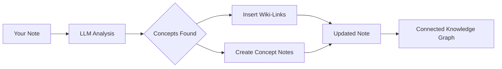

import TLDR from '@site/src/components/TLDR';

# Wiki-Linkler

<TLDR>
**Notemd, notlarınızdaki anahtar kavramlara otomatik olarak `[[wiki-links]]` ekler.** LLM içeriğinizi okur, bağlamdaki önemli terimleri tespit eder ve her ortaya çıkışta Obsidian tarzı wiki-link'ler ekler. İsteğe bağlı olarak geri bağlantılar içeren konsept notu dosyaları oluşturur. Eşanlamlı kelime bastırma, yeniden adlandırma/silme durumunda link bütünlüğü ve sadece çıkarma modu (dosya değişikliği yapılmaz) özelliklerini destekler. Sadece mevcut not başlıklarını eşleştiren Auto Link'in aksine, Notemd yapay zeka kullanarak yeni kavramları tespit eder ve buna karşılık gelen notlar oluşturur. Bu özellik [Obsidian Yapay Zeka Bilgi Yönetimi Kılavuzu](/docs/pillar-ai-knowledge) içinde yer alır.
</TLDR>

## Genel Bakış

Wiki-linkleme, Notemd'ın temel özelliğidir. Basit metni birbirine bağlı bir bilgi grafiğine dönüştürmek için şunları yapar:

1. **Bir LLM ile notunuzu analiz etmek**
2. **Anahtar kavramları tespit etmek** (terimler, kişiler, yöntemler, teoriler)
3. **Her ortaya çıkışta `[[wiki-links]]` eklemek**
4. **İsteğe bağlı olarak geri bağlantılar içeren konsept notları oluşturmak**

## Nasıl Çalışır

### Süreç



### Örnek

**Önce:**
```markdown
Machine learning models use neural networks to learn patterns from data.
The transformer architecture revolutionized natural language processing.
```

**Sonra:**
```markdown
[[Machine learning]] models use [[neural networks]] to learn patterns from data.
The [[transformer architecture]] revolutionized [[natural language processing]].
```

## Kullanım

### Temel: Mevcut Nota Link Ekleme

1. Bir notu açın
2. Düzenleyicide sağ tıklayın → **"Dosyayı İşle (link ekle)"**
3. Birkaç saniye bekleyin
4. Kavramlar artık bağlantılı!

### Toplu İşleme: Birden Fazla Notu İşle

1. Dosya Gezgini'nde bir klasöre sağ tıklayın
2. **"Notemd: Klasörü işle (bağlantılar ekle)"** seçeneğini seçin
3. Yapılandırma:
   - Eş Zamanlılık (paralel kaç dosya)
   - Mevcut bağlantıları üzerine yaz (evet/hayır)
4. **İşle** butonuna tıklayın

### Seçmeli: Belirli Metni Bağla

1. İşlenecek metni vurgulayın
2. Sağ tık → **"Seçimi İşle (bağlantı ekle)"**
3. Yalnızca vurgulanan kısım analiz edilir

## Notemd ile Otomatik Bağlama

Obsidian, otomatik wiki bağlaması için iki yaklaşıma sahiptir:

| | **Otomatik Bağlama** | **Notemd** |
|--|---------------|-------------|
| Bağlantı kaynağı | Depodaki mevcut not başlıkları | İçerikte LLM tarafından tanımlanan kavramlar |
| Yeni kavramlar bağlanabilir | Hayır — başlık zaten mevcut olmalı | Evet — AI kavramları tanır ve notlar oluşturur |
| Eşanlamlı kelime işleme | Hayır | Evet — eşanlamlı kelime bastırma |
| Kavram notu oluşturma | Hayır | Evet — geri bağlantılar ve tekrar önleme ile |
| Toplu işleme | Hayır (tek dosya) | Evet (klasör düzeyinde) |
| Görev bazlı model yönlendirme | Hayır | Evet |

**Auto Link** başlık eşleştirmeli çalışır: "Machine Learning" adında bir not mevcutsa, bulunan örnekleri `[[Machine Learning]]` ile sarar. Eğer not mevcut değilse hiçbir şey olmaz.

**Notemd** AI tabanlıdır: LLM içeriğinizi okur, bağlamı anlar, henüz bir not mevcut olmasa bile bağlanması gereken kavramları tespit eder ve hem bağlantıyı hem de kavram notunu oluşturur.

## Özellikler

### Eşanlamlı Kelime Bastırma

**Sorun:** "transformer", "transformers", "Transformer architecture" → 3 ayrı kavram

**Çözüm:** Notemd neredeyse aynı olanları tespit eder ve standart biçimi kullanır.

**Yapılandırma:**
```
Settings → Advanced → Synonym Suppression
Threshold: 0.8 (0 = off, 1 = aggressive)
```

### Bağlantı Bütünlüğü

**Bir kavram notunu yeniden adlandırdığınızda:**
- Tüm wiki bağlantıları otomatik olarak güncellenir (Obsidian temel özellik)
- Geri bağlantılar aynı kalır

**Bir kavram notunu sildiğinizde:**
- Bağlantılar mevcut kalır ancak "bağlantısız atıflar" olarak gösterilir
- Herhangi bir örneğinden yeniden oluşturabilirsiniz

### Saf Çıkarma Modu

**Orijinalini değiştirmeden kavramları çıkarın:**

1. Sağ tık → **"Kavramları çıkar (bağlantı olmadan)"**
2. Kavram notları oluşturulur
3. Orijinal dosya bozulmaz

Kullanım durumu: Okunabilir içeriklerin veya nihai taslakların işlenmesi.

## Kavram Notu Oluşturma

### Otomatik Oluşturma

**Etkinleştirildiğinde (varsayılan), Notemd şunları oluşturur:**

```markdown
---
tags: [concept, auto-generated]
created: 2026-06-13
source: [[Original Note Name]]
---

# Machine Learning

A branch of artificial intelligence that enables computers
to learn from data without explicit programming.

## Occurrences in Your Vault

- [[Original Note Name#Section]]
- [[Another Note#Header]]

## Related Concepts

- [[Neural Networks]]
- [[Deep Learning]]
- [[Supervised Learning]]
```

### Yapılandırma

**Çıktı klasörü:**
```
Settings → Output → Concept Folder
Default: concepts/
```

**Hiyerarşik yapı:**
```
Settings → Output → Use Hierarchical Folders
If enabled:
  papers/my-paper.md → papers/concepts/Concept.md
If disabled:
  → concepts/Concept.md
```

**Şablon:**
```
Settings → Output → Concept Template
Customize with variables:
  {{concept}} — Concept name
  {{description}} — LLM-generated description
  {{backlinks}} — List of source notes
  {{date}} — Creation date
```

## Gelişmiş Seçenekler

### Bağlam Penceresi

**Ne kadar çevreleyici metin gönderilecek:**

```
Settings → Linking → Context Window
Options: Sentence | Paragraph | Full Note
Default: Paragraph
```

Daha büyük = daha iyi doğruluk, daha yüksek maliyet.

### Minimum Oluşum Sayısı

**Yalnızca birden fazla kez görünen kavramları bağlayın:**

```
Settings → Linking → Min Occurrences
Default: 1 (link all)
```

Tekrar eden temalara odaklanmak için 2 veya 3 olarak ayarlayın.

### Dışlama Kalıpları

**Belirli kelimeleri atlayın:**

```
Settings → Linking → Exclude List
Example: note, idea, example, thing
```

Genel terimlerin aşırı bağlanmasını önler.

### Özel İstekler

**Varsayılan LLM talimatlarını geçersiz kılın:**

```
Settings → Advanced → Custom Linking Prompt
Default:
  "Identify key concepts, theories, methods, and technical
   terms in the following text. Return as a list..."
```

Alan özelindeki ihtiyaçlar için değiştirin (örneğin, "Tıbbi terminolojiye odaklanın").

## İpuçları ve En İyi Uygulamalar

### ✅ YAPIN

- **100 kelimeyi aşan notları işleyin** — Kısa notlar az kavram sağlar
- **Daha iyi kavram tanımlaması için güçlü modeller kullanın** (GPT-4o, Claude)
- **Kabul etmeden önce gözden geçirin** — Önerilen bağlantıların mantıklı olduğundan emin olun
- **Iteratif olarak geliştirin** — 5-10 notu işleyin, grafiği inceleyin, ayarları düzenleyin

### ❌ YAPMAYIN

- **Aşırı bağlantı kullanmayın** — Her ismin bağlantıya ihtiyacı yoktur
- **Taslakları tekrar tekrar işlemeyin** — Kavramlar değişebilir, stabil hale gelene kadar bekleyin
- **Eşanlamlıları göz ardı etmeyin** — "ML" ile "Machine Learning" arasındaki farkı önlemek için baskılamayı etkinleştirin

## Performans

### Hız

| Not Boyutu | GPT-4o-mini | Claude Sonnet | Ollama (yerel) |
|-----------|-------------|---------------|----------------|
| 500 kelime | 2-3 saniye | 3-5 saniye | 5-10 saniye |
| 2000 kelime | 5-8 saniye | 10-15 saniye | 20-40 saniye |
| 5000+ kelime | Bloklu (çoklu çağrılar) | Bloklu | Bloklu |

### Maliyet Tahmini

**Örnek: GPT-4o-mini ile 1000 kelimelik not**
- Girdi: ~1500 token
- Çıktı: ~200 token
- Maliyet: ~

**100 notun toplu işlenmesi:** ~

## Sorun Giderme

### Hiçbir bağlantı eklenmedi.

**Kontrol Et:**
1. LLM çağrısı başarılı oldu (Ayarlar → Teşhis)
2. Notun yeterli içeriği var (>50 kelime).
3. Kavramlar teknik/özeldir (sadece zamirler değil).

**Deneyin:**
- Daha güçlü bir model kullanın
- Bağlam penceresini genişlet
- API anahtarının geçerliliğini kontrol edin

### Çok Fazla Bağlantı

**Çözümler:**
1. Minimum tekrar sayısını artırın (2 veya 3)
2. Dışlama listesine yaygın kelimeler ekle
3. Daha az agresif bir model kullanın

### Yanlış Kavramlar Bağlandı

**Düzeltmeler:**
1. Alan özgüllüğü için özel istem kullanın
2. Eşanlamlı kelime baskılamasını etkinleştirin
3. El ile inceleyip bağlantıyı kaldırın

### Yeniden adlandırma sonrası bağlantılar bozulur

**Bu, Obsidian davranışıdır ve normaldir.**

Tüm bağlantıları güncellemek için:
1. Kavram notunu yeniden adlandırın
2. Obsidian otomatik olarak `[[old]]` → `[[new]]` olarak güncellenir

---

## Sonraki Adımlar

- 📖 [Kavram Notları](./concept-notes) — Kavram notu oluşturma konusunda derinlemesine bilgi
- 🔍 [Araştırma Entegrasyonu](./research) — Bağlantı kurmayı web araştırmasıyla birleştirin
- 🎨 [Şemalar](./diagrams) — Bilgi grafiğinizi görselleştirin
