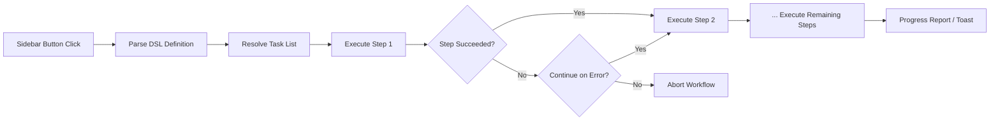

import TLDR from '@site/src/components/TLDR';

# İş Akışları

<TLDR>
**Notemd iş akışları, birden fazla görevi tek bir tek tıklamalı eyleme dönüştürür.** `add-links > extract-concepts > research > diagram` gibi dizileri basit bir DSL kullanarak tanımlayın. İş akışları, mevcut notta veya klasörde tüm zinciri çalıştıran kenar çubuğu düğmeleri olarak görünür. Önceden tanımlanmış iş akışlarıyla birlikte gelir; ayarlarda özelleştirilmiş olanlar oluşturulabilir. Her adım, kendi görev özelindeki model yapılandırmasını kullanır.

Bu içerik [Obsidian AI Bilgi Yönetimi Kılavuzu](/docs/pillar-ai-knowledge) serisinin bir parçasıdır.
</TLDR>

## Genel Bakış

Bir iş akışı, görevleri tek tek çalıştırmanın getirdiği zorlukları ortadan kaldırır. Bağlantı ekleme, kavramlar çıkarma, bilinmeyen terimler üzerine araştırma yapma ve bir diyagram oluşturma için dört kez sağ tıklamak yerine, tek bir kenar çubuğu düğmesine basarsınız ve tüm zincir çalıştırılır. Notemd sıralama, hata yayılımı ve ilerleme raporlamasını üstlenir.

İş akışları, hafif bir DSL (alan özelinde dil) kullanılarak tanımlanır. Ayarlarda bulunurlar, Obsidian kenar çubuğunda tıklanabilir düğmeler olarak görünür ve ya mevcut nota ya da tüm bir klasöre uygulanabilir.

## Nasıl Çalışır

### İş Akışı Yürütme İş Akışı



1. **Ayarla** -- DSL dizgesi `>` (veya `>`) ile bölünerek sıralı bir görev tanımlayıcıları listesine dönüştürülür.
2. **Çöz** -- Her tanımlayıcı, içsel bir komuta (add-links, extract-concepts, research, translate, diagram vb.) ile eşleştirilir.
3. **Yürüt** -- Adımlar sırayla çalıştırılır. Her adım, yapılandırılmış görev özelindeki sağlayıcı ve modelini kullanır.
4. **Hata yönetimi** -- Bir adım başarısız olursa, iş akışı hata politikanıza bağlı olarak ya durdurulur ya da bir sonraki adıma devam eder.
5. **Bitti** -- Bir bildirim kutusu başarıyı raporlar veya başarısız olan adımları listeler.

### DSL Formatı

İş akışları, `>` ile ayrılmış görev tanımlayıcılarının bir dizisi olarak tanımlanır:

```
process-current-add-links>extract-concepts-current>research-and-summarize
```

**Mevcut görev tanımlayıcıları:**

| Tanımlayıcı | Eylem |
|------------|--------|
| `process-current-add-links` | Aktif notaya wiki bağlantıları ekle |
| `extract-concepts-current` | Aktif notadan kavramlar çıkar |
| `research-and-summarize` | Seçilen metin veya not başlığı üzerine araştırma yap |
| `process-current-translate` | Aktif notayı çevir |
| `summarize-to-mermaid` | Aktif notadan bir diyagram oluştur |
| `generate-from-title` | Not başlığından içerik üret |
| `extract-original-text` | OCR / taramalı içerik için orijinal metni çıkar |

**Klasör düzeyindeki varyantlar**: tanımlayıcı adlardaki `current` yerine `folder` kullanılır.

### Önceden tanımlanmış iş akışları ile özel iş akışları

Notemd, yaygın desenler için hazır iş akışlarıyla birlikte gelir:

| İş Akışı | Zincir | Kullanım Senaryosu |
|----------|-------|----------|
| **Tek Tıkla Çıkarma** | bağlantı ekle > kavram çıkar > araştırma | Bir araştırma makalesini tek seferde işle |
| **Tam İşlem Akışı** | add-links > extract-concept > research > diagram | Görselleştirme ile tam bilgi çıkarma |
| **Çevir + Bağlantı** | translate > add-links | Kavramları hedef dilde çevirip bağlayın |

**Özel iş akışları** ayarlarda oluşturulur:

1. **Ayarlar** --> **Notemd** --> **İş Akışları**'na gidin
2. **"İş Akışı Ekle"** butonuna tıklayın
3. DSL zincirini girin (örneğin, `process-current-add-links>extract-concepts-current`)
4. Bir görünüm adı verin (örneğin, "Hızlı Bağlantı + Çıkarma")
5. Yeni düğme hemen kenar çubuğunda belirir

## Yapılandırma

| Ayar | Varsayılan | Etki |
|---------|---------|--------|
| `workflows` | Önceden tanımlanmış set | İş akışı tanımları dizisi (ad + DSL) |
| `workflowContinueOnError` | `true` | Mevcut adım başarısız olursa bir sonraki adıma geçin |
| `workflowShowProgress` | `true` | Her adım tamamlandıktan sonra ilerleme bildirimi gösterin |

### İş Akışlarındaki Görev Bazlı Modeller

Bir iş akışındaki her adım, kendi görev bazlı model yapılandırmasını kullanır. DSL içinde doğrudan modeller belirtmenize gerek yoktur. Çözüm sırası şu şekildedir:

1. `useMultiModelSettings` mevcutsa görev bazlı sağlayıcı/model kullanılır
2. Aksi takdirde küresel `activeProvider` kullanılır

Bu, `add-links`'ın DeepSeek üzerinde çalışırken `research`'ın GPT-4o üzerinde çalışabileceği anlamına gelir -- hepsi aynı iş akışı tıklaması içinde gerçekleşir.

## Örnek

Sadece bir makine öğrenimi makalesinin PDF versiyonunu kasanıza içe aktardınız ve tam bilgi çıkarma istiyorsunuz:

1. İçe aktarılan notu açın
2. **"Tam İş Akışı"** kenar çubuğu düğmesine tıklayın
3. Notemd şunları gerçekleştirir:
   - **Adım 1**: Wiki bağlantıları ekle -- `[[attention mechanism]]`, `[[transformer]]` vb.
   - **Adım 2**: Kavramlar çıkar -- kavramlarınızı kavram klasörünüzde oluşturur
   - **Adım 3**: Araştırma -- anahtar terimler için web kaynaklarını özetler
   - **Adım 4**: Diyagram -- makalenin yapısının Mermaid şeklinde bir zihin haritası oluşturur
4. Yaklaşık 30 saniye sonra notunuzda bağlantılar bulunur, kavram notları oluşur, araştırma eklenir ve bir diyagram dosyası kaydedilir

Hepsi tek bir tıklamayla.

## İpuçları

- **Önceden tanımlanmış iş akışlarından başlayın** -- bunlar en yaygın desenleri kapsar. Farklı bir sıra gerektiğinde yalnızca özelleştirin.
- **`workflowContinueOnError`'ı etkinleştirin** -- başarısız bir diyagram adımı tüm iş akışını durdurmamalıdır.
- Toplu işleme için **Klasör İş Akışları**nı kullanın -- bir klasöre sağ tıklayın, bir iş akışı seçin ve her not işlenir.
- İş akışlarınızı **açık bir şekilde adlandırın** -- kenar çubuğu alanı sınırlıdır. "Hızlı Çıkarma" veya "Çevir + Bağlantı" gibi kısa ve eylem odaklı isimler kullanın.

---

## Sonraki Adımlar

- [Araştırma](./research) -- İş akışlarına eklemeden önce araştırma adımının ne yaptığını anlayın
- [Wiki-Bağlantıları](./wiki-links) -- Çoğu iş akışında kullanılan temel bağlantı özelliği
- [Kavram Notları](./concept-notes) -- Bir iş akışı adımı olarak kavram çıkarma
- [Toplu İşleme](/docs/advanced/batch-processing) -- Klasör iş akışları için eş zamanlılık ve ilerleme raporlama
