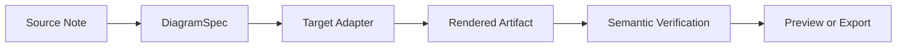
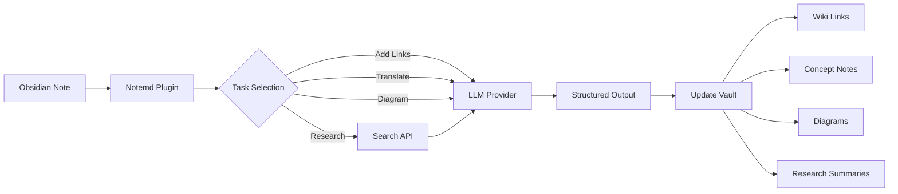

import TLDR from '@site/src/components/TLDR';

# Notemd'a Giriş

<TLDR>
**Notemd** (Not + EMD — Geliştirilmiş Markdown Belgeleri), LLM destekli okumaları kalıcı bilgiye dönüştüren açık kaynaklı bir Obsidian eklentisidir. Oturum bittikten sonra içgörülerin silindiği sohbet tabanlı yapay zekanın aksine, Notemd sonuçları wiki bağlantıları, kavram notları, araştırma özetleri, çeviriler, iş akışları ve diyagramlar şeklinde **doğrudan sizin vault'unuza** yazar. Bu araç, okuma, araştırma ve görsel açıklamaların yapılandırılmış, gelişen bir bilgi grafiği halinde birikmesini isteyen araştırmacılar, öğrenciler ve bilgi çalışanları için tasarlanmıştır.
</TLDR>

## Notemd nedir?

Notemd, bilgi çıkarma, düzenleme, çeviri, araştırma ve diyagram oluşturma işlemlerini otomatikleştirmek amacıyla **30'dan fazla Büyük Dil Modeli**ni (OpenAI, Anthropic, Google, DeepSeek, Qwen, Ollama ve daha fazlası) Obsidian iş akışınıza entegre eder.

### Temel Fark: Geçici Bilgi ile Kalıcı Bilgi

| Özellik | Sohbet tabanlı yapay zeka (ChatGPT vb.) | Notemd |
|--------|-------------------------------|--------|
| **Sonuçların nereye gittiği** | Sohbet geçmişi (silinir) | Sizin Obsidian vault'unuz (kalır) |
| **Format** | Düz metin cevaplar | Yapılandırılmış dosyalar: `[[wiki-links]]`, kavram notları, diyagramlar |
| **Uzun vadeli değer** | Her seferinde yeniden sormak gerekir | Bir bilgi grafiği halinde birikir |
| **Çevrimdışı erişim** | İnternet gerektirir | Ollama ile tamamen çevrimdışı çalışır |

## Temel Özellikler

### 1. **Otomatik Wiki Bağlantıları**
- LLM, notlarınızdaki temel kavramları tespit eder
- Her ortaya çıkışta `[[wiki-links]]` ekler
- İsteğe bağlı olarak bağlantılı kavram notları oluşturur
- Tekrarları önlemek için eşanlamlı kelime engelleme

### 2. **Kavram Notu Oluşturma**
- Makalelerden, yazılardan ve notlardan temel kavramları çıkarır
- Geri bağlantılar içeren özel kavram dosyaları oluşturur
- Özelleştirilebilir çıktı yolları ve şablonlar

### 3. **Web Araştırma Entegrasyonu**
- Obsidian içinden Tavily veya DuckDuckGo sorgulanabilir
- LLM, sonuçları kaynak atıflarıyla özetler
- Mevcut notlara araştırma bulgularını ekler

### 4. **Çok Dilli Çeviri**
- Seçilen kısımları veya tüm notları çevirir
- 21'den fazla UI dilini destekler
- Bağımsız çıktı dili yapılandırması
- Toplu çeviri desteği

### 5. **Şema Oluşturma**
- **Mermaid**: Akış şemaları, sıralama, sınıf, durum, ER, Gantt
- **JSON Canvas**: Obsidian yerel düzenleri
- **Vega-Lite**: Veri grafikleri, zaman serileri, dağılım grafikleri
- **HTML / Düzenlenebilir HTML/SVG**: Anlamsal açıklamalar içeren kendi başına geçerli şekil nesneleri
- **Draw.io / Drawnix nesne sınırları**: Aynı anlamsal şekil modelinden bakım ekibine yönelik dışa aktarım yolları
- **Devre şemaları yol haritası**: circuitikz/TikZJax desteği, ham ve kısıtlamasız LLM TikZ yerine altın referanslar, kısıtlanmış istemler, işleme geri bildirimleri ve topoloji/düzen doğrulamaları etrafında tasarlanmaktadır
- **Önizleme teşhisleri**: İşlenen nesneler derleme/işleme ile ilgili hata teşhislerini gösterebilir ve eklenti tabanlı LaTeX çalışma zamanı gerektirmeden doğrudan olmayan kaynaklar incelenebilir
- Mermaid hataları için otomatik sözdizimi düzeltmesi

### 6. **Tek Tıkla İş Akışları**
- Sütun çubuğu düğmelerine birden fazla eylemi zincirleme
- DSL tabanlı iş akışı tanımı
- Örnek: `add-links > extract-concepts > research > diagram`

## Kimler Notemd kullanmalı?

✅ Makaleleri okuyup literatür incelemeleri oluşturan **Araştırmacılar**
✅ Çalışma notlarını düzenleyen ve kavram haritaları oluşturan **Öğrenciler**
✅ Okuma içgörülerinin kalıcı olmasını isteyen **Bilgi işçileri**
✅ Çeviri ve wiki bağlantılarına ihtiyaç duyan **Çift dilli profesyoneller**
✅ Yerel LLM desteği (Ollama) isteyen **Gizliliğe önem veren kullanıcılar**
✅ İpuçlarını ve iş akışlarını özelleştiren **Güçlü kullanıcılar**

## Neden Notemd + Obsidian?

**Obsidian**, yerel odaklı, markdown tabanlı bir bilgi tabanıdır. **Notemd** ise yapay zeka gücü ekler:
- Verileriniz kendi kasanızda kalır (bulut hizmetinde değil)
- Yerel modellerle çevrimdışı çalışır
- Ücretsiz ve açık kaynaklıdır (MIT lisansı)
- Mevcut Obsidian eklentileriyle entegre olur
- On binlerce nota seviyesine kadar ölçeklenebilir

## Başlangıç

1. **Yükleme**: Ayarlar → Topluluk Eklentileri → Gözat → "Notemd"
2. **Yapılandırma**: Kendi LLM sağlayıcınızın API anahtarını ekleyin (veya yerel Ollama kullanın)
3. **Deneyin**: Bir nota açın → Sağ tıklayın → "Dosyayı işle (bağlantılar ekle)"
4. **Keşfedin**: Tek tıklamalı iş akışları için kenar çubuğuna bakın

👉 [Yükleme Kılavuzu](./getting-started/installation) | [Hızlı Başlangıç Eğitimi](./getting-started/quick-start)

## Diyagram Yetenek Yönü

Notemd'nun diyagram işlemleri artık "modelden tek bir sözdizimi dizesi yazmasını isteme" yaklaşımından uzaklaşarak katmanlı bir iş akışına doğru ilerliyor:

Mevcut uygulama zaten Mermaid, JSON Canvas, Vega-Lite, HTML yedekleme, düzenlenebilir HTML/SVG, Draw.io XML nesneleri, minimal Drawnix JSON alt kümesini, önizleme teşhisleri/kaynak‑sadece yedeklemeyi ve yaygın kaynaklar ile CMOS invertör altın şablonları için çevrimdışı `CircuitSpec -> circuitikz` prototiplerini destekliyor. Devre diyagramları daha zor bir kategori: circuitikz doğru elektriksel topolojiyi ifade edebilir, ancak sınırsız LLM çıktı genellikle okunaksız yönlendirmeler veya render edilemeyen LaTeX üretir. Bir sonraki yön, altın‑referans şablonlar, düğüm‑grid yerleşim kuralları, render teşhisleri ve ekran görüntüsü geri bildirim döngüleri ile circuitikz'u sınırlı tutmaktır.

Ayrıntıları [Diyagramlar](./features/diagrams) bölümünde okuyun.

## Mimari

## Notemd vs Diğer Obsidian AI Eklentileri

Çoğu Obsidian AI eklentisi sohbet‑önceliklidir (siz sorarsınız, AI cevap verir, içgörüler sohbette kalır). Notemd ise **yazma‑önceliklidir**: AI notalarınızı işler ve sonuçları doğrudan kasanıza yapılandırılmış şekilde yazar.

| Yetenekler | Notemd | Copilot | Smart Connections | Text Generator |
|-----------|--------|---------|-------------------|-----------------|
| Otomatik wiki bağlantısı ekleme | Evet | Hayır | Hayır | Hayır |
| Kavram notu oluşturma | Evet (geri bağlantılar ve tekrarları kaldırma ile) | Hayır | Hayır | Hayır |
| Diyagram oluşturma | Evet (Mermaid, Canvas, Vega-Lite, HTML, düzenlenebilir nesneler) | Hayır | Hayır | Hayır |
| Web araştırması entegrasyonu | Evet (Tavily + DuckDuckGo) | Hayır | Hayır | Hayır |
| Toplu klasör işleme | Evet | Sınırlı | Hayır | Sınırlı |
| Görev bazlı model yönlendirme | Evet (7 görev, bağımsız modeller) | Hayır | Hayır | Hayır |
| Tek tıklamalı iş akışı zincirleri | Evet (DSL) | Hayır | Hayır | Hayır |
| Çeviri (toplu) | Evet | Hayır | Hayır | Hayır |
| Vault ile sohbet | Hayır | Evet | Hayır | Hayır |
| Anlamsal benzerlik araması | Hayır | Hayır | Evet | Hayır |
| Şablon tabanlı oluşturma | Hayır | Hayır | Hayır | Evet |
| LLM sağlayıcılar | 36 (bulut + ağ geçidi + yerel) | 3-5 | 2-3 | 3-5 |
| Tamamen çevrimdışı | Evet (Ollama) | Kısmi | Kısmi | Kısmi |

**Notemd'yı ne zaman seçmelisiniz**: Yalnızca notlarınız hakkında sohbet etmesini değil, kalıcı bir bilgi grafiği oluşturmasını istiyorsanız AI'yi kullanın.

**Copilot'yi ne zaman seçmelisiniz**: Obsidian içinde konuşma tabanlı bir yapay zeka asistanı istiyorsunuz.

**Smart Connections'yı ne zaman seçmelisiniz**: Notlar arasındaki mevcut ilişkileri semantik arama yoluyla keşfetmek istiyorsanız.

## Felsefe

**Notemd**, yapay zekânın insanların bilgi işlerini yerine getirmesi yerine onları güçlendirmesi gerektiğine inanıyor. Eklenti:
- Değişiklikleri uygulamadan önce gözden geçirerek kontrolü sizde tutar.
- Bağlamı korur (tüm sonuçlar kaynağa geri bağlanır)
- Gizliliğe saygı gösterir (yerel LLM desteği, telemetri yok).
- Genişletilebilir kalır (açık APIlar, özel iş akışları)

## Açık Kaynak

- **Lisans**: MIT
- **Kaynak**: [github.com/Jacobinwwey/obsidian-NotEMD](https://github.com/Jacobinwwey/obsidian-NotEMD)
- **Topluluk**: [Discord](https://discord.gg/qnGgsQ9W) | [GitHub Discussions](https://github.com/Jacobinwwey/obsidian-NotEMD/discussions)
- **Katkıda Bulunun**: PR'ler kabul edilir, [CONTRIBUTING.md](https://github.com/Jacobinwwey/obsidian-NotEMD/blob/main/CONTRIBUTING.md) bakınız

---

**Bir Sonraki Adım**: [Installation →](./getting-started/installation)
