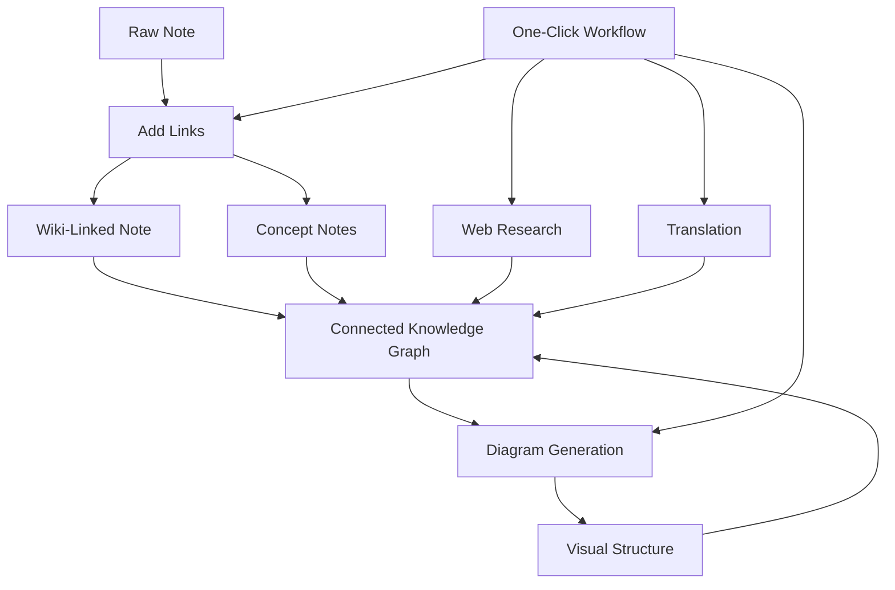

import TLDR from '@site/src/components/TLDR';

# Obsidian AI Bilgi Yönetimi Kılavuzu

<TLDR>
**Notemd, LLM destekli okumayı kalıcı bilgiye dönüştürür: wiki bağlantıları kavramları birbirine bağlar, kavram notları erişilebilir bir grafik oluşturur, araştırma web içeriğini sizin deposunuza getirir, çeviri dil engellerini ortadan kaldırır, diyagramlar yapıyı görünür kılar ve iş akışları her şeyi tek tıkla birleştirir.** Bu kılavuz ham notlardan bağlantılı, görsel ve çok dilli bir bilgi tabanına kadar olan tüm süreci kapsar.
</TLDR>

## Neden AI Bilgi Yönetimi?

Geleneksel not alma yöntemleri düz dosyalar üretir. El ile yapılan wiki bağlantıları olsa bile çoğu not birbirinden ayrı kalır. Notemd, bağlantı katmanını otomatikleştirmek için LLM'ları kullanır:

- **LLM'lar içeriğinizi okur** ve önemli olanları — terimleri, yöntemleri, kişileri, teorileri — tespit eder
- **Bağlantılar her kavramın geçtiği yerde otomatik olarak eklenir**, "ayrıca bakınız" bölümlerinde gizlenmez
- **Kavram notları** bağımsız ve erişilebilir dosyalar olarak oluşturulur
- **Araştırma**, web kaynaklı bağlamla notları zenginleştirir
- **Diyagramlar yapıyı görünür kılar** — aynı içerikten zihin haritaları, akış şemaları, veri grafikleri oluşturulur

Sonuç: Sadece bağlantı eklemeyi hatırladığınızda değil, işlediğiniz her notla birlikte büyüyen bir bilgi grafiği.

## Tam Süreç Akışı



Her adım bağımsızdır. Birini veya hepsini kullanabilirsiniz. En etkili sıralama: **Bağlantı Ekle → Kavram Notları → Diyagramlar**.

---

## 1. Wiki Bağlantıları: Bağlantıları Açıkça Gösterme

Wiki bağlantıları bir bilgi grafiğinin temelini oluşturur. Notemd, bir LLM kullanarak şunları yapar:

1. Notunuzun içeriğini okuyun (uzun belgeler için parçalara ayırın)
2. Temel kavramları belirleyin — genel isimler yerine özel, teknik terimlere öncelik verin
3. Her ortaya çıkışta `[[wiki-links]]` ekleyin
4. Eşanlamlıları engelleyin ki "ML" ve "Machine Learning" ayrı düğümler oluşturmasın

### Ne zaman kullanılmalı

- **100 kelimeyi aşan her not** — daha kısa notlarda az sayıda kavram bulunur
- **Araştırma makaleleri, teknik dokümanlar, toplantı notları** — alan özelinde zengin terimler içerir
- **İçerik sabitlendikten sonra** — taslakları tekrar tekrar işlemeyin

### Ana Ayarlar

| Ayar | Önerilen | Neden |
|---------|-----------|-----|
| `addLinksProvider` | DeepSeek veya GPT-4o-mini | Düşük maliyetle iyi doğruluk |
| Eşanlamlı engelleme | Açık | Tekrarlanan düğümleri önler |
| Bağlam penceresi | Paragraf | Doğruluk ve maliyet dengesi |

→ [Wiki-Links derinlemesine inceleme](/docs/features/wiki-links)

---

## 2. Kavram Notları: Eriştirilebilir Bilgi Düğümleri

Wiki bağlantıları fikirleri satır içinde birbirine bağlar, ancak kavram notları her bir fikrin ayrı ayrı erişilebilir olmasını sağlar. Her kavram kendi `.md` dosyasına sahiptir:

```markdown
# Machine Learning

## Linked From
- [[My Research Notes]]
- [[Neural Networks Explained]]
```

### Çıkarma Süreci

LLM isteği oldukça yapılandırılmıştır:
- Tekil biçime dönüştürme
- Tek kelimelere kıyasla çok kelimelik kavramları tercih edin ("Dielectric Relaxation", "Relaxation" yerine)
- Kaynaklar/bibliyografi bölümlerini atlayın
- Belirli bir yapıda ayrıştırma için `CONCEPT:` satırları olarak çıktı verin

Kavramlar, `Set<string>` aracılığıyla parçalar arasında tekrarlarından arındırılır. Tekil parçalardaki LLM hataları işlemi durdurmaz.

### Geri Bağlantılar

Etkinleştirildiğinde, her kavram notu kendisinden bahseden kaynak notlarını takip eder. Obsidian'nin yerleşik geri bağlantı paneli aynı zamanda ters bağlantıları da gösterir.

### Tekillik giderme

Notemd'nin 4 adımlı tekrar önleme motoru şunları tespit eder:
1. **Tam eşleşmeler** — büyük/küçük harf duyarsız dosya adı karşılaştırması
2. **Çoğul formları** — "Models.md" ile "Model.md"
3. **Sembol normalizasyonu** — "A-B.md" ile "A B.md"
4. **Tek kelimelik içerik** — "Machine Learning.md" mevcutken "ML.md" işaretlenir

### Anahtar Ayarları

| Ayar | Önerilen | Neden |
|---------|-----------|-----|
| `conceptNoteFolder` | `concepts/` veya `🧠 concepts/` | Kasa düzenini korur |
| `extractConceptsAddBacklink` | Açık | Ters arama özelliğini etkinleştirir |
| `extractConceptsMinimalTemplate` | Kapalı | Bağlantılı Olanlar ile tam şablon |
| Görev bazlı model | DeepSeek | Kavram çıkarma için pahalı modellere gerek yok |
| Eşanlamlı kelime bastırma | Açık | Aynı ayar hem bağlantılamayı hem de çıkarmayı etkiler |

→ [Kavram Notlarına Derinlemesine Bakış](/docs/features/concept-notes)

---

## 3. Araştırma: Web’i İçe Katmak

Notemd, not alma iş akışınıza web aramasını entegre eder:

1. **Sorgu oluşturma** — notunuzun başlığı veya seçimi bir arama sorgusuna dönüşür
2. **Web araması** — Tavily (tavsiye edilir, API anahtarı gereklidir) veya DuckDuckGo (ücretsiz, anahtar gerekmez)
3. **LLM özetleme** — arama sonuçları alakalı bir özete dönüştürülür
4. **Notunza ekleme** — özet imleç konumuna veya yeni bir bölüm olarak eklenir

### Ne Zaman Kullanılmalı

- Yeni bir konuyu işlemeden önce — önce web bağlamını edinin
- Bir kavram notunun zenginleştirilmesi gerektiğinde — araştırma yapın ardından bağlantılar ekleyin
- Literatür incelemeleri için — notların bulunduğu bir klasörü toplu olarak araştırın

### Önemli Ayarlar

| Ayar | Tavsiye Edilen | Neden |
|---------|-----------|-----|
| `researchProvider` | GPT-4o veya Claude | Araştırma daha yüksek kaliteli özetleme gerektirir |
| Arama hizmeti | Tavily | Daha iyi alaka düzeyi, ayarlanabilir derinlik |
| `maxResearchContentTokens` | 4000 | Derinlik ile maliyet arasındaki denge |

→ [Araştırma derinlemesine inceleme](/docs/features/research)

---

## 4. Çeviri: Dil engellerini aşmak

Notemd, ayarladığınız LLM kullanarak notları çevirir — özel bir çeviri API değildir. Bu şu anlama gelir:

- **Bağlam bilgisine dayalı çeviriler** — LLM, cümle cümle değil tüm belgeyi anlar
- **Teknik terimlerin işlenmesi** — "gradient descent" ifadesi "坡度向下" yerine "梯度下降" olarak kalır
- **Toplu çeviri desteği** — tüm notlar klasörü tek seferde çevrilebilir
- **Görev bazlı model** — çeviri için Gemini Flash kullanılır (hızlı, ucuz, çok dillidir)

### Dil Desteği

Notemd kendisi 21 UI dilini destekler. Çeviri hedef dili her görev için ayarlanabilir. Yaygın çiftler: EN↔ZH, EN↔JA, EN↔KO, EN↔DE, EN↔FR, EN↔ES.

→ [Çeviri derinlemesine inceleme](/docs/features/translation)

---

## 5. Diyagramlar: Yapıyı görünür kılmak

Notemd'nin diyagram işleme akışı önce spesifikasyonlara dayanır: LLM, yapılandırılmış bir `DiagramSpec` JSON üretir, ardından adaptörler bunu hedef formata çevirir. Bu yöntem, LLM'den ham Mermaid sözdizimini istemekten daha güvenilir sonuçlar verir.

### Niyet Tespiti

Notemd, içerikten en uygun diyagram türünü tahmin eder:

- **Sayılar içeren tablolar** → veri grafiği (Vega-Lite)
- **Müşteri/sunucu terimleri** → dizge diyagramı (Mermaid)
- **Varlık/ana anahtar** → ER diyagramı (Mermaid)
- **Adım/iş akışı** → akış şeması (Mermaid)
- **Kavram haritası anahtar kelimeleri** → JSON Canvas (Obsidian yerel)
- **Varsayılan** → zihin haritası (Mermaid)

### İşleme Zinciri

Ana hedef → yedek → yedek → HTML. Eğer Mermaid sözdizimi başarısız olursa, hata bağlamıyla bir kez daha LLM'ye deneme yapılır, ardından en basit diyagrama geçilir.

### Ana Ayarlar

| Ayar | Önerilen | Neden |
|---------|-----------|-----|
| `enableExperimentalDiagramPipeline` | Açık | Spesifikasyon öncelikli olarak daha iyi kalite |
| `experimentalDiagramCompatibilityMode` | `best-fit` | Niyete göre yerel hedef |
| `summarizeToMermaidProvider` | GPT-4o veya Claude | Diyagram spesifikasyonları için mekansal akıl yürütme gerekir |
| `autoMermaidFixAfterGenerate` | Açık | LLM sözdizimi hatalarını otomatik olarak tespit eder |
| Yerel bilgi zenginleştirme | Alan özelinde etkinleştirme | Vault bağlamıyla doğruluğu artırma |

→ [Şemaların derinlemesine incelenmesi](/docs/features/diagrams)

---

## 6. İş Akışları: Tek Tıklamalı Otomasyon

İş akışları, birden fazla görevi tek bir kenar çubuğu düğmesinde birleştirir. DSL formatı şöyledir:

```
task1 | task2 | task3
```

Örnek: `addLinks | extractConcepts | generateDiagram` — bir notu ham metinden tek tıklamayla tamamen bağlantılı, görsel bir bilgi düğümüne dönüştürme.

### Önerilen İş Akışları

| İş Akışı | Zincir | Kullanım Senaryosu |
|----------|-------|----------|
| Tam Süreç | `addLinks \| extractConcepts \| generateDiagram` | Yeni Notlar |
| Önce Araştırma | `research \| addLinks` | Yabancı Konular |
| Çok Dilli | `translate \| addLinks` | Çok Dilli Notlar |
| Sadece Diyagram | `generateDiagram` | Hızlı görselleştirme |

→ [İş Akışlarına Derinlemesine Bakış](/docs/features/workflows)

---

## 7. LLM Sağlayıcılar: Buluttan Yerel’e 36 Seçenek

Notemd, 4 farklı taşıma türünde 36 sağlayıcıyı destekler. Ana gruplar:

- **Uluslararası bulut**: OpenAI, Anthropic, Google, Mistral, xAI
- **Çin bulutu**: DeepSeek, Qwen, Doubao, Moonshot, GLM, Baidu, SiliconFlow
- **Ağ Geçitleri**: OpenRouter, GitHub Models, Hugging Face, Vercel
- **Yerel**: Ollama, LMStudio, OVMS — API anahtarı yoktur, veriler cihazınızdan çıkmaz

### Görev Bazlı Model Stratejisi

En uygun maliyetli yapılandırma, basit görevler için ucuz modelleri ve karmaşık görevler için güçlü modelleri kullanır:

```
extractConcepts  → DeepSeek (fast, cheap, accurate enough)
addLinks          → DeepSeek or GPT-4o-mini
research          → GPT-4o or Claude (needs quality)
generateDiagram   → GPT-4o or Claude (needs spatial reasoning)
translate         → Gemini Flash (fast, multilingual)
```

→ [LLM Sağlayıcılar Genel Bakışı](/docs/providers/overview)

---

## Başlangıç Kontrol Listesi

1. **Notemd’yi Yükleyin** — [Topluluk Eklentileri](/docs/getting-started/installation) (tavsiye edilir) veya manuel olarak
2. **Bir sağlayıcıyı yapılandırın** — DeepSeek (en kolay), OpenAI veya Ollama (ücretsiz)
3. **İlk notunuzu işleyin** — sağ tıklayın → "Dosyayı İşle (bağlantı ekle)"
4. **Kavram klasörü ayarla** — Ayarlar → Notemd → Çıktı → Kavram Klasörü
5. **Kavramları çıkar** — aynı not üzerinde "Kavramları Çıkar" komutunu çalıştır
6. **Bir diyagram oluştur** — bağlantıları görselleştirmek için "Diyagram Oluştur" komutunu çalıştır
7. **Bir iş akışı oluştur** — yukarıdakileri tek tıklamalı bir düğme halinde birleştir

## Önerilen Yapılandırmalar

### Öğrenci (Bütçeli)

```
Provider: DeepSeek (free tier available)
Concept extraction: DeepSeek
Research: DuckDuckGo (free) + DeepSeek
Diagrams: Off (or legacy Mermaid)
Workflows: addLinks | extractConcepts
```

### Araştırmacı (Kaliteli)

```
Provider: GPT-4o (primary)
Concept extraction: DeepSeek (cost savings)
Research: GPT-4o + Tavily
Diagrams: best-fit mode, GPT-4o
Workflows: research | addLinks | extractConcepts | generateDiagram
```

### Gizlilik Öncelikli (Yalnızca Yerel)

```
Provider: Ollama (llama3 or qwen2.5:7b)
All tasks: Ollama
Research: DuckDuckGo (free, no API key)
Diagrams: legacy Mermaid mode
```

### Çift Dilli (ZH + EN)

```
Primary: DeepSeek (Chinese queries)
Translation: Google Gemini Flash
Research: Tavily + DeepSeek (Chinese search context)
Language output: per-task (extractConceptsLanguage: zh-CN)
```

---

## Yaygın Kalıplar

### Kalıp: Bir Araştırma Makalesini İşleme

1. PDF içeriğini içe aktar (veya yapıştır)
2. **Araştır** — konuyla ilgili web bağlamını elde et
3. **Bağlantılar ekle** — anahtar kavramları belirleyip bağla
4. **Kavramları çıkar** — bağımsız notlar oluştur
5. **Diyagram oluştur** — makalenin yapısını görselleştir

### Kalıp: Günlük Not Zenginleştirme

1. Günlük not yazın
2. **Bağlantı Ekle** — günün fikirlerini mevcut kavramlarla ilişkilendirir
3. Kavram notları geri bağlantılarla otomatik olarak güncellenir

### Şablon: Literatür İncelemesi

1. Makaleler/notlarla bir klasör oluşturun
2. **Toplu Bağlantı Ekle** — tüm klasörü işleyin
3. **Benzer Notları Ortadan Kaldır** — neredeyse benzer notları temizleyin
4. **Diyagram Oluştur** — tüm literatürün zihin haritasını oluşturun

---

*Notemd açık kaynaklıdır (MIT) ve Obsidian 0.15.0+ sürümleriyle tüm platformlarda çalışır. [Şimdi yükleyin](/docs/getting-started/installation) veya [GitHub’da görüntüleyin](https://github.com/Jacobinwwey/obsidian-NotEMD).*
