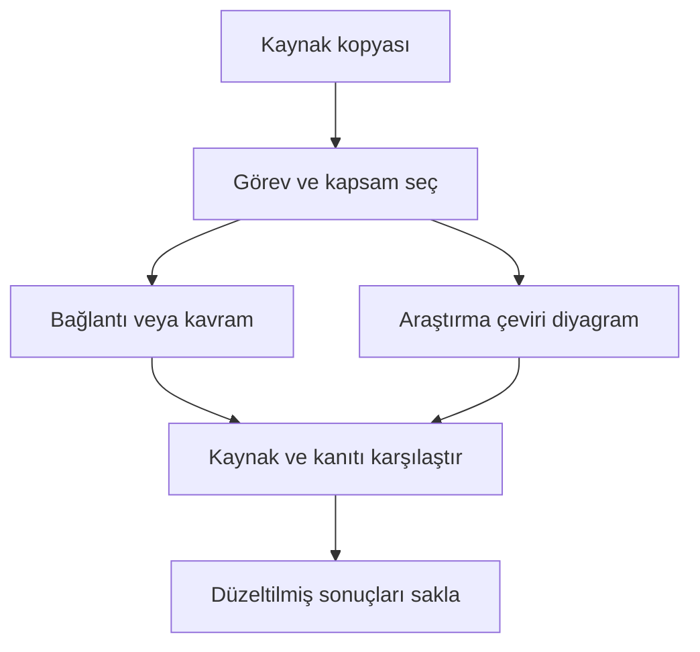

import TLDR from '@site/src/components/TLDR';

# Obsidian’da yapay zekâyla bilgi yönetimi

<TLDR>İşe yarayan yöntem kaynakları, model yanıtlarını ve kendi düzeltmelerinizi ayırır. Notemd bağlantı, kavram, araştırma, çeviri ve diyagramları incelenebilir belgeler olarak üretir. Tek kaynakla başlayın, inceleyin, ardından sınırlı klasörü otomatikleştirin.</TLDR>

## Sonucu seçin

Bağlantılı not, kavramlar, kaynaklı özet, çeviri veya diyagram mı gerekiyor? Fazla dosya veya bağlantı daha iyi anlama ya da bulma garantisi değildir. İçeriği nasıl kontrol edip tekrar bulacağınızı belirleyin.

## Uçtan uca yol


```mermaid
flowchart TD
    A[Kaynak kopyası] --> B[Görev ve kapsam seç]
    B --> C[Bağlantı veya kavram]
    B --> D[Araştırma çeviri diyagram]
    C --> E[Kaynak ve kanıtı karşılaştır]
    D --> E
    E --> F[Düzeltilmiş sonuçları sakla]
```

Bunlar kullanılabilir görevlerdir, tek varsayılan düğmenin tüm adımları değildir. Zincir kurmadan kaynağı koruyup çıktıyı inceleyin.

## 1. Bağlantılar: ilişkileri görünür kılın

**Dosyayı işle (bağlantı ekle)** çalıştırıp `_processed.md` içindeki terim, alıntı, kod ve formülleri karşılaştırın. Alan/eş anlamlı talimatları kimlik veya sayısal eşik zorlamaz. Bilinen başlıkları tekrarlanabilir bağlamak için deterministik eşleştirme daha uygun olabilir. [Bağlantılar](./features/wiki-links).

## 2. Kavramlar: terim ve açıklamayı ayırın

Klasör seçin. Bağımsız çıkarma kaynağı korur ve başlık oluşturur. Yeni dosyada `Linked From` için geri bağlantıyı açıp asgari biçimi kapatın. **Başlıklardan toplu üretim** ayrıdır, eski uygun notları da işleyebilir. Complete taşınmasını ve aynı adların anlam farklarını kontrol edin. [Kavramlar](./features/concept-notes).

## 3. Araştırma: kanıtı saklayın

Konu/başlık, Tavily veya DuckDuckGo ve **Araştır ve özetle** seçin. Boş Tavily anahtarı hizmeti değiştirmez. Kaynakları açıp iddiaları doğrulayın. İsteğe bağlı sözcüksel yerel getirme parçaları seçili LLM’ye gönderir; yerel indeks rotayı çevrimdışı yapmaz. [Araştırma](./features/research).

## 4. Çeviri: anlam ve yapı

Hedef dili seçip dosyayı çevirin. Varsayılan `_<language>.md` eski çıktıyı değiştirebilir. Tek parça için geçici not kullanın. Terim, sayı, kod, bağlantı ve matematiği kontrol edin; bölme bağlam kaybettirebilir. Arayüz/site dil sayısı dil çiftinin kalitesini kanıtlamaz. [Çeviri](./features/translation).

## 5. Diyagramlar: sonraki düzenlemenin kaynağı

Tek çalıştırmada birden çok diyagram türü ve her tür için ayrı ayrı birden çok çıktı biçimi seçin. İşareti kaldırmak türün biçimlerini korur; hiçbir tür seçilmezse içerik otomatik analiz edilir. Onay kutusu türü dahil eder. Adına tıklayarak türü seçip biçimlerini düzenleyin. İşaretçiyi üzerine getirmek veya klavye odağı, ayarları kaydetmeden önizlemeyi değiştirir. Escape menüyü kapatır ve odağı geri getirir.

## 6. İş akışları: denenmiş adımları otomatikleştirin

Ad, `::` ve `>` ile ayrılan eylemler zinciri tanımlar:

```text
One-Click Extract::process-current-add-links>batch-generate-from-titles>batch-mermaid-fix
```

Bağlantı, başlık üretimi ve Mermaid onarımı içerir; genel araştırma/diyagram adımı değildir. Her eylemin koşul ve çıktıları geçerlidir. Varsayılan hatada durur; devam, sonraki adımların kalan girdiye dayanabilmesini gerektirir. İptal bitmiş çıktıyı silmez. [İş akışları](./features/workflows).

## 7. Sağlayıcılar: görev ve protokol

36 profil beş aileyi kapsar. Adres, yetki, veri şartları ve ölçülen sonuca göre seçin. Aynı kaynak/istemle süre ve maliyeti karşılaştırın. Görev rotaları başlangıçta kapalıdır; yerel işlem varsaymadan tümünü kontrol edin. [Sağlayıcılar](./providers/overview).

## İlk kontroller

1. Kurun ve kaynak kopyalarını saklayın.
2. Tam modeli yapılandırıp test edin.
3. Kavram klasörü ve ayrı hedefler seçin.
4. Kopyada deneyin.
5. Karşılaştırıp düzeltmeleri saklayın.
6. Küçük klasöre genişletin, uzun zincirden önce kısmi sonuçları inceleyin.

## Uygulama örnekleri

### Makale işleme

Dış araçla Markdown’a çevirip tablo, formül ve resimleri kontrol edin. Kavram/parça çıkarın, kesin soruları araştırın ve yalnız doğrulanabilir ilişkileri çizin. Özgün belgeyi ve düzeltmeleri saklayın.

### Kavramları sürdürme

Ayrı klasör kullanın, terimleri inceleyin, seçili alt küme için açıklama üretin. Temizlikten önce yedekleyin. Sayılar, açık tanımların ve yararlı gezinmenin yerini tutmaz.

### Özel malzeme

Yerel sunucu, modeller ve bağımlılıkları hazırlayın. Rotaları kontrol edip gerektiğinde web araştırmasından kaçının. Paylaşmadan raporları inceleyin. Loopback varsayılanı uzak yapılandırmayı engellemez.

### Partiyi sürdürme

Hata/iptalin sonlanmasını bekleyin, rapor, çıktı ve kurtarma dosyalarını inceleyip çakışmaları karşılaştırın, hedefli tekrarlayın. İptal edilmiş demek boş demek değildir; eşlikçi dosyaları silmeden referansları kontrol edin.

## Sonraki adımlar

- [Hızlı başlangıç](./getting-started/quick-start).
- [Toplu işleme](./advanced/batch-processing).
- [Geliştiriciler](./developers/overview).
- [Agent](./agents/overview).
