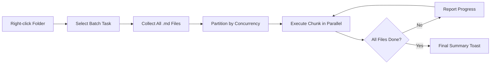

import TLDR from '@site/src/components/TLDR';

# Пакетна обробка

<TLDR>
**Notemd обробляє цілі папки за одну операцію з можливістю налаштування паралельності та контролю над перезаписом.** Клацніть правою кнопкою миші на папці, щоб пакетно додати посилання wiki, витягнути концепції, провести дослідження чи перекласти всі нотатки всередині. Обмеження на паралельність запобігають помилкам обмеження швидкості API. Прогрес відображається для кожного файлу. Поведінка перезапису може бути налаштована: пропустити існуючі дані, додати їх або замінити. Неуспішні файли записуються у журнал, без припинення обробки пакету.

Це частина [Obsidian Посібника з управління знаннями в ШІ](/docs/pillar-ai-knowledge).
</TLDR>

## Огляд

Пакетна обробка перетворює папку з нотатками на одну операцію. Замість того, щоб відкривати кожну нотатку та виконувати команди окремо, ви клацаєте правою кнопкою миші на папці та обираєте завдання. Notemd проходиться по кожному файлу `.md`, застосовує обрану дію та повідомляє про прогрес у реальному часі.

Ця функція є необхідною для вилучення знань у всьому сховищі. Після імпорту десятків PDF, наприклад, за допомогою операцій batch-add-links та batch-extract-concepts, ваша граф знань формується протягом хвилин, а не годин.

## Як це працює

### Модель пакетної обробки

1. **Збір файлів** -- Notemd рекурсивно сканує цільову папку (або лише верхній рівень, залежно від налаштувань) та збирає всі файли `.md`.
2. **Розділення на потоки** -- Файли діляться на частини відповідно до налаштування `batchConcurrency`. Кожна частина виконується паралельно; частини виконуються послідовно.
3. **Виконання** -- Кожен файл обробляється за тією ж логікою, що й команда для одного файлу. Дотримуються налаштування постачальника та моделі для кожного завдання.
4. **Звіт про прогрес** -- Повідомлення типу toast оновлюється після завершення кожного файлу, відображаючи прогрес `N / Total`.
5. **Обробка помилок** -- Якщо файл завершує роботу (помилка API, тайм-аут мережі тощо), помилка фіксується у журналі, а обробка пакету продовжується. У кінцевому підсумку вказуються всі файли, які були оброблені невдало.
6. **Завершення** -- У резюме повідомлення відображається загальна кількість оброблених елементів, кількість успішних та невдалих операцій.

### Поведінка перезапису

Під час обробки файлу, який вже містить wiki-посилання, концепт-нотатки або переклади, поведінка Notemd залежить від налаштування перезапису:

| Режим | Поведінка |
|------|----------|
| **Пропустити** | Існуючий вміст залишається недоторканим. Обробляються лише незмінені файли. |
| **Додати** (за замовчуванням) | Новий вміст додається. Існуючі wiki-посилання, концепти або переклади зберігаються. |
| **Замінити** | Файл повністю переобробляється. Усі попередні зміни Notemd перезаписуються. |

Щодо wiki-посилань конкретно: якщо нотатка вже містить `[[wiki-links]]`, режим **Пропустити** залишає її без змін, тоді як режим **Замінити** пересилає всю нотатку до LLM для вставки нових посилань. Використовуйте **Пропустити** для інкрементальної обробки та **Замінити** для повторної обробки після оновлення моделі.

### Контроль конкурентності

Налаштування `batchConcurrency` обмежує кількість паралельних викликів API. Це запобігає помилкам обмеження швидкості (HTTP 429) під час обробки великих папок у постачальників із суворими лімітами.

| Конкурентність | Рекомендовано для | Типовий вплив на обмеження швидкості |
|-------------|----------------|---------------------------|
| `1` | Безкоштовні тарифи, суворі постачальники | Жоден (серійний) |
| `3` (за замовчуванням) | Більшість хмарних постачальників | Низький |
| `5` | Ollama (локальний), щедрі тарифи | Жоден / Низький |
| `10` | Локальні моделі з швидким інференсом | Жоден |

Якщо під час пакетної обробки виникають помилки 429, зменшіть кількість одночасних запитів до 1 або 2.

## Конфігурація

| Налаштування | За замовчуванням | Ефект |
|---------|---------|--------|
| `batchConcurrency` | `3` | Максимальна кількість паралельних API викликів під час операцій з папками |
| `batchOverwriteExisting` | `false` | Перезаписати існуючий вміст Notemd. `false` – режим додавання. |
| `batchSkipProcessed` | `false` | Пропустити файли, які вже містять маркери Notemd (наприклад, посилання wiki) |
| `batchRecursive` | `true` | Включити підкаталоги під час сканування папки |
| `enableStableApiCall` | `false` | Увімкнути логіку повторних спроб (до 4 спроб) для кожного файлу під час обробки пакетом |

### Моделі на рівні завдань у пакетній обробці

Кожна операція пакета використовує відповідну модель на рівні завдання. batch-add-links використовує `addLinksProvider`, batch-research використовує `researchProvider` тощо. Це дозволяє використовувати дешеві моделі для операцій з великим обсягом та зберігати дорогі моделі для завдань, де важлива якість.

## Приклад

У вас є папка `papers/`, яка містить 40 імпортованих нотаток з дослідженнями. Ви хочете додати посилання wiki та витягнути концепції з усіх них:

1. Клацніть правою кнопкою миші на папці `papers/`
2. Виберіть **"Notemd: Обробка папки (додати посилання)"**
3. Notemd сканує папку, знаходить 40 файлів `.md` та обробляє їх по 3 за раз (стандартна конкурентність)
4. У спливаючому повідомленні про прогрес відображається: `12/40 files processed...`
5. Через приблизно 3 хвилини у спливаючому повідомленні з підсумками йдеться: `39 succeeded, 1 failed (API timeout on paper-37.md)`
6. Повторіть дію за допомогою **"Notemd: Обробка папки (витягнути концепції)"** щоб створити концепт-нотатки для всіх 40 файлів

Файл, який не пройшов обробку, записується. Пізніше можна перезапустити обробку лише цього файлу.

## Поради

- **Почніть з низької конкурентності** -- Якщо ви не впевнені щодо лімітів швидкості вашого постачальника, почніть з `1` та поступово збільшуйте це значення.
- **Використовуйте режим пропуску для інкрементних оновлень** -- Після першої повної партії перейдіть на `batchSkipProcessed: true` щоб на наступних запусках оброблялися лише нові нотатки.
- **Увімкніть стабільні виклики API** -- `enableStableApiCall: true` додає логіку повторних спроб, яка допомагає відновитися від тимчасових мережевих помилок під час довгих пакетів обробки.
- **Перезапустіть після оновлень моделі** -- Якщо ви перейдете на кращу модель, встановіть `batchOverwriteExisting: true` та перезапустіть процес щоб отримати покращені посилання та концепції.

---

## Наступні кроки

- [Робочі потоки](/docs/features/workflows) -- Об’єднайте завдання пакетної обробки у кнопки бічної панелі одним кліком
- [Персоналізовані запити](/docs/advanced/custom-prompts) -- Налаштуйте запити для пакетного витягування даних
- [Усунення проблем](/docs/advanced/troubleshooting) -- Виправте помилки лімітів швидкості та проблеми з підключенням під час пакетних запусків
- [LLM Постачальники](/docs/providers/overview) -- Посилання на конфігурацію моделі за завданням
