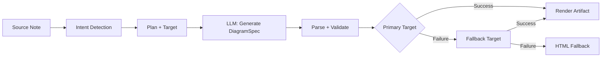
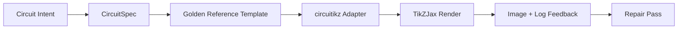

import TLDR from '@site/src/components/TLDR';

# Діаграми

<TLDR>
**Notemd створює діаграми з ваших нотаток через конвеєр, орієнтований на специфікацію.** LLM генерує рендерер-незалежний `DiagramSpec` JSON, після чого спеціалізовані адаптери перетворюють його на Mermaid, JSON Canvas, Vega-Lite, HTML або редагований HTML/SVG вихід. Підтримує 8 типів намірів, автоматичні ланцюги заміни, прямий перегляд з експортом у SVG/PNG, семантичну перевірку та генерацію з підсиленням місцевих знань.
</TLDR>

Це частина [Obsidian Посібника з управління знаннями в ШІ](/docs/pillar-ai-knowledge).

## Архітектура: Конвеєр, орієнтований на специфікацію

Notemd ніколи не просить LLM створювати синтаксис Mermaid/Vega/Canvas безпосередньо. Натомість:



**Чому орієнтація на специфікацію?** LLM часто створюють недійсний синтаксис для рендерерів (особливо Mermaid). Структурований `DiagramSpec` можна перевірити перед рендерингом, а та сама специфікація може використовуватися для кількох рендерерів як заміна.

## Підтримувані типи діаграм

| Намір | Основний рендерер | Заміни | Сценарій використання |
|--------|-----------------|-----------|----------|
| `mindmap` | Mermaid | HTML | Ієрархічний розбір тем |
| `flowchart` | Mermaid | HTML | Потоки процесів, дерева прийняття рішень |
| `sequence` | Mermaid | HTML | Взаємодія клієнт-сервер, протоколи |
| `classDiagram` | Mermaid | HTML | Відношення між класами OOP |
| `erDiagram` | Mermaid | HTML | Схеми баз даних, взаємозв’язки ентитетів |
| `stateDiagram` | Mermaid | HTML | Машини станів, моделі життєвого циклу |
| `canvasMap` | JSON Canvas | Mermaid → HTML | Карти концепцій, графи знань |
| `dataChart` | Vega-Lite | Mermaid → HTML | Стовпчасті, лінійні, площинні, розсіяні, кругові діаграми, таблиці |

## Виявлення наміру

Notemd визначає найкращий тип діаграми на основі змісту вашої записки за допомогою оцінки ключових слів:

| Намір | Тригери | Рівень впевненості |
|--------|----------|------------|
| `dataChart` | Таблиці, числові клітинки, ключові слова, що позначають метрики/тренди, відсотки | 0.88 |
| `sequence` | Лексикон запитів/відповідей (4+ збіги) або маркери `->`/`=>` | 0.82 |
| `erDiagram` | Первинний ключ, іноземний ключ, ентитет, схема (2+ збіги) | 0.80 |
| `stateDiagram` | Стан, перехід, у очікуванні, у роботі, збій (3+ збіги) | 0.76 |
| `flowchart` | Нумеровані кроки (2+) або лексикон if/then/else/workflow | 0.74 |
| `canvasMap` | Карта концепцій, граф знань, просторовий, кластер | 0.72 |
| `mindmap` | За замовчуванням | 0.55 |

Перевизначте за допомогою налаштування **Бажаний тип діаграми**, вибірника з бічної панелі або прямої опції палітри команд.

## Вибір мети відображення

Експериментальний підхід, орієнтований на специфікацію, тепер має два незалежні контролери:

| Контролер | Налаштування | Ефект |
|---------|---------|--------|
| Бажаний тип діаграми | `preferredDiagramIntent` | Визначає семантичну форму створеного `DiagramSpec` |
| Бажана мета відображення | `preferredDiagramRenderTarget` | Вибирає інструмент для генерації та перегляду діаграми |

Встановіть **Бажану мету відображення** як **Автоматично** для за замовчуванням планувальника, або виберіть Mermaid, JSON Canvas, Vega-Lite, HTML чи редактируваний HTML/SVG прямо. Це перевизначення застосовується лише до команд генерації та перегляду артефактів. Стандартна команда **Узагальнити як діаграму Mermaid** залишається прив’язаною до формату, сумісного з Mermaid, щоб існуючі робочі процеси з Markdown не змінювали формат без уваги.

Це розділення має значення, оскільки намір `flowchart` тепер може бути відображений як Mermaid для нотаток у Markdown, як HTML для надійного запасного варіанту або як редактируваний HTML/SVG для подальшої редагування. Draw.io та Drawnix залишаються експортерами артефактів у форматі CLI, а не метами відображення всередині плагіну.

## Використання

### Створити діаграму

1. Відкрити примітку
2. Виконайте **"Notemd: Створити діаграму"** з палітри команд
3. Notemd виявляє намір, генерує специфікацію, відображає результат та зберігає артефакт

**Файли вихідних даних за метою:**

| Ціль | Розширення | Шаблон імені файлу |
|--------|-----------|------------------|
| Mermaid | `.md` | `{note}_summ.md` |
| JSON Canvas | `.canvas` | `{note}_diagram.canvas` |
| Vega-Lite | `.json` | `{note}_diagram.json` |
| HTML | `.html` | `{note}_diagram.html` |
| Редаговано HTML/SVG | `.html` | `{note}_diagram.html` |

### Перегляд діаграми

1. Запустити **"Notemd: Перегляд діаграми"**
2. Відкривається модальне вікно з відтвореною діаграмою
3. Експортувати у форматі SVG або PNG за допомогою кнопок інструментарію

Функція **Автоматичний перегляд** доступна в налаштуваннях — після генерації модальне вікно перегляду відкривається автоматично.

У модальному вікні перегляду також є панель діагностики артефактів. Рендерери та перевірки можуть додавати `RenderArtifact.diagnostics`; у вікні відображається підсумок діагностики з кількістю помилок/попереджень/інформації, потім ступінь серйозності, тип діагностики, повідомлення та поради щодо виправлення поруч із переглядом. Той самий підсумок відображається у записах історії перегляду, тож можна порівнювати повторні спроби circuitikz без необхідності відкривати кожен запис. Для артефактів, які мають вихідний контент, але не можуть бути відтворені безпосередньо або через шлях iframe HTML, модальне вікно тепер переходить на перегляд лише вихідного коду замість примусового використання порожнього iframe. Це дозволяє circuitikz проводити перевірки компіляції/рендерингу, SVG перевірки текстових токенів, перевірки порожніх скріншотів у форматі PNG та майбутні звіти про перекриття матеріалу на видимій UI поверхні, не роблячи TikZJax або LaTeX обов’язковою залежністю під час виконання плагінів та не прикидаючись, що вихідний текст — це перевірений візуальний результат.

### Режим легасі Mermaid

Коли `enableExperimentalDiagramPipeline` вимкнено, Notemd надсилає прямий запит Mermaid до LLM. Це повністю обходить пайплайн специфікації. Якщо експериментальний пайплайн зазнає невдачі, система переходить у цей режим.

## Бекенди рендерингу

### Mermaid

6 адаптерів (майндмап, діаграма потоку, послідовність, ER, клас, стан) перетворюють `DiagramSpec` на синтаксис Mermaid. Після генерації `mermaid.parse()` перевіряє результат. Якщо перевірка провалюється:

1. **Повторна спроба LLM** — одна спроба з повідомленням про помилку Mermaid як контекстом
2. **Мінімальний варіант відновлення** — примітивна діаграма Mermaid на основі ідентифікаторів вузлів специфікації

**Legacy Mermaid Fixer** автоматично виправляє поширені помилки синтаксису LLM: нормалізацію директив note, ескейпування pipe-label, перерозташування крапок з комою, розумні лапки, стрілки з подвійною хрест-рискою, невідповідності форм та багато іншого.

### JSON Canvas

Створює формат Obsidian JSON Canvas з просторовим розташуванням:
- Вузли розташовуються за глибиною (x = глибина × 420) та індексом (y = індекс × 170)
- Ширина оцінюється за довжиною мітки
- Криві з `fromSide: 'right'`, `toSide: 'left'`, `toEnd: 'arrow'`

### Vega-Lite

Створює повні специфікації Vega-Lite v5 JSON з автоматичним кодуванням:
- **Картезійські графіки** (стовпчики/лінії/площа/точки/розсіювання): канали x + y та колір для багатьох серій
- **Коло**: theta = y (кількісне), колір = x (номінальне)
- **Таблиця**: рядок = x, текст = y + стовпець = серія

Патчі тем темного та світлого кольору глибоко об’єднуються перед компіляцією.

### HTML

Універсальний запасний варіант. Самодостатня документація HTML з:
- Мета-заголовки CSP
- Режим світлий/темний через `prefers-color-scheme`
- Локалізовані мітки UI для 20 локацій
- Розділи: герой, структура (дерево вузлів), взаємозв’язки, примітки, таблиці даних серій

### Редаговані HTML/SVG

Чітка мета для фігур у робочих процесах експорту, які піддаються редагуванню. Вона проєктує `DiagramSpec` у детермінований `SemanticFigureModel`, а потім генерує самостійний документ HTML з вбудованими групами SVG, які містять анотації у стилі Draw.io:

- `data-drawio-type`, `data-drawio-id` та `data-drawio-role` на семантичних вузлах
- `data-drawio-source` та `data-drawio-target` на семантичних ребрах
- стабільні ідентифікатори вузлів/ребер після нормалізації пробілів та обробки зіткнень
- жодних скриптів, жодних зовнішніх шрифтів та жодних віддалених ресурсів

Ця мета навмисно ще не є стандартним маршрутом планувальника. Вона доступна як чітка мета відображення, поки шлях продукту доводить поведінку редагування у реальних інструментах.

### Draw.io та Drawnix Межі експорту

Текуща реалізація зберігає підтримку сторонніх редакторів на межі артефакта:

| Мета | Контракт | Залежність під час виконання |
|--------|----------|--------------------|
| Draw.io | детермінований некомпресований `mxfile` XML від `SemanticFigureModel` | жодних у часі виконання плагіна або у CI |
| Drawnix | мінімальний підмножина `.drawnix` JSON з використанням елементів `geometry` та `arrow-line` | жодних у часі виконання плагіна або у CI |

Цей компроміс є навмисним: Notemd може перевіряти видимі мітки, стабільні ідентифікатори та покриття підтримуваних примітивів без вбудовування Diagrams.NET Desktop, Drawnix, Plait або стану редактора лише у браузері у плагін.

### circuitikz / TikZJax Напрямок

Схеми колій — це не та сама проблема, що й загальні діаграми потоку. Правильна синтаксична мета для електричних схем зазвичай є **circuitikz**, яка відображається у Obsidian за допомогою плагінів, таких як TikZJax. TikZJax може завантажувати пакети, такі як `circuitikz`, `pgfplots`, `tikz-cd` та `chemfig`, що робить його привабливим для нотаток з фізики, електроніки, хімії та математики.

Ризик полягає у тому, що необроблений TikZ, створений за допомогою LLM, є крихким:

- складна топологія схеми може бути електрично правильною, але візуально нерозбірливою;
- накладення дротів та міток може зробити правильний нетліст непридатним для навчальних нотаток;
- відсутність вступних частин пакетів, неправильні анкери або недійсні назви компонентів можуть завадити відображенню;
- зворотний зв’язок від рендерера зазвичай є на рівні зображення, тоді як LLM генерує геометрію на рівні тексту.

Кращою архітектурою є розгляд circuitikz як обмеженої мети діаграми, а не як вільної форми запиту:



Модель першого класу повинна описувати топологію схеми та її розташування окремо:

| Шар | Відповідальність | Приклад |
|-------|----------------|---------|
| Топологія | електричні вузли та з’єднання компонентів | `VDD -> RD -> drain(M1)`, `source(M1) -> GND` |
| Розташування | розміщення у сітці, орієнтація, маршрутизаційні смуги | `M1 at (3,2.2)`, вхід зліва, вихід справа |
| Стиль | пакет, конвенція напруги, мітки, якорі | `\begin{circuitikz}[american voltages]` |
| Перевірка | журнал компіляції, відсутні якорі, перевірки на перекриття/скріншот | TikZJax/Діагностика LaTeX плюс візуальний огляд |

### Текущий прототип circuitikz

Notemd тепер включає перший обмежений прототип репозиторію для цього напрямку. Він навмисно знаходиться офлайн і обмежений шаблоном:

```bash
npm run diagram:export-circuitikz -- --input cmos-inverter.json --output cmos-inverter.tex
```

Прототип додає окрему межу `CircuitSpec` та детермінований експортер для шести сімей золотих референцій:

| Тип схеми | Золота референція | Гарантія струму |
|--------------|------------------|-------------------|
| `common-source-amplifier` | `common-source-nmos-v1` | перевіряє `VDD -> R_D -> M1.D`, `vin -> M1.G`, `M1.S -> GND` та `M1.D -> vout` перед записом у LaTeX |
| `cmos-inverter` | `cmos-inverter-v1` | перевіряє топологію PMOS-over-NMOS, спільний вхід гейта, спільний вихід дрену, `VDD -> MP.S` та `MN.S -> GND` перед записом у LaTeX |
| `cmos-buffer` | `cmos-buffer-v1` | перевіряє два каскадові етапи інверторів, проміжну точку `vmid`, відновлений `vout` та спільні доріжки VDD/GND перед записом у LaTeX |
| `cmos-transmission-gate` | `cmos-transmission-gate-v1` | перевіряє паралельні пристрої PMOS/NMOS між `vin` та `vout` з комплементарним керуванням `phib` / `phi` перед записом у LaTeX |
| `cmos-nand2` | `cmos-nand2-v1` | перевіряє паралельний підтягувальний PMOS, послідовний опускаючий NMOS, подвійні входи `va` / `vb` та `vout` перед записом у LaTeX |
| `cmos-nor2` | `cmos-nor2-v1` | перевіряє послідовний підтягувальний PMOS, паралельний опускаючий NMOS, подвійні входи `va` / `vb` та `vout` перед записом у LaTeX |

Це ще не загальний генератор TikZ. Він не компілює LaTeX, не викликає TikZJax, не перевіряє скріншоти та не запускає автоматичне виправлення за допомогою зображень. Ці функції залишаються на пізніших етапах.

Команда Preview diagram може знову відкрити збережені об’єкти джерела circuitikz безпосередньо, якщо розширення файлу є `.tex` або `.tikz` та джерело містить `\usepackage{circuitikz}` або `\begin{circuitikz}`. Цей шлях — це перегляд лише джерела circuitikz: модальне вікно показує джерело, діагностику, контролі копіювання/збереження та метадані історії, але не компілює LaTeX та не викликає TikZJax під час роботи плагіну.

Тепер той самий перегляд лише джерела охоплює збережені об’єкти Draw.io та Drawnix. Файли `.drawio` приймаються, якщо вони схожі на Draw.io XML (`mxfile` або `mxGraphModel`), а файли `.drawnix` приймаються, якщо вони є Drawnix JSON з `type: "drawnix"` та масивом `elements`. Плагін все ще не вбудовує diagrams.net чи хост білого дошки Drawnix; ці перегляди відображають джерело, діагностику та історію об’єктів без використання вбудованого візуального редактора.

Для виправлення з збереженням топології перед поданням виправленого кандидата потрібно передати специфікацію до виправлення як посилання:

```bash
npm run diagram:export-circuitikz -- --input repaired-cmos-inverter.json --topology-reference cmos-inverter.json --output cmos-inverter.tex
```

Захисник виправлення використовує `createCircuitTopologySignature` та `assertCircuitTopologyUnchanged` для порівняння `circuitKind`, `goldenReferenceId`, мереж, ідентифікаторів/типів/терміналів компонентів та кінцівок непрямих з’єднань перед виведенням результату. Етикетки, текст заголовка, підказки розташування, порядок з’єднань та етикетки з’єднань навмисно ігноруються. Кандидат, який додає коротку лінію або перепідключає термінал, отримує помилку `Circuit topology drift detected` перед тим, як буде записаний файл `.tex`.

Тепер CLI може парсувати існуючий журнал компіляції LaTeX/TikZJax без запуску компілятора:

```bash
npm run diagram:export-circuitikz -- --input cmos-inverter.json --output cmos-inverter.tex --compile-log cmos-inverter.log --diagnostics-output cmos-inverter.diagnostics.json
```

Цей діагностичний шлях повідомляє про відсутність пакетів, таких як `circuitikz.sty`, невідомі ключі TikZ/circuitikz, помилки синтаксису шляху TikZ, такі як відсутні крапки з комою, неконтрольовані аргументи від незбалансованих дужок або незавершених етикеток, невизначені послідовності керування, загальні помилки LaTeX, аварійні зупинки та попередження про переповнення `\hbox`. Це залишається орієнтованим на журнал: локальна компіляція LaTeX/TikZJax та етапи якості скріншотів — це окремі завдання майбутньої роботи.

Для перевірок для адміністраторів той самий CLI може за бажанням запустити явно налаштований рендерер без парсингу команд шелу:

```bash
npm run diagram:export-circuitikz -- --input cmos-inverter.json --output cmos-inverter.tex --compile-executable pdflatex --compile-arg -interaction=nonstopmode --compile-arg -halt-on-error --compile-arg -output-directory={outputDir} --compile-arg {tex} --expected-artifact {outputDir}/{jobName}.pdf
```

Запускник компіляції використовує `shell: false`, розширює `{tex}`, `{outputDir}` та `{jobName}` як місця заміни на значення масиву аргументів, читає створений `{jobName}.log` та повертає `compileExecution` разом із `compileDiagnostics` у вихідному форматі CLI JSON. `--compile-executable` — це лише шлях до бінарника рендерера або обгортки; флаги рендерера мають бути в повторюваних значеннях `--compile-arg`. Порожні виконувані файли призводять до помилки `compile-executable-invalid`, відсутні бінарники — до помилки `compile-executable-not-found`, а рядки виконуваних файлів у форматі команди шелу отримують пораду розділити аргументи, щоб Windows, Linux та macOS дотримувалися однакових правил прямого виконання. З `--expected-artifact` також повідомляється про `compileExecution.renderSmoke` та помилка CLI, якщо рендерер не створює непорожнього об’єкта. Плагін все ще не вбудовує LaTeX, не робить TikZJax залежністю часу роботи плагіну та не виконує візуальне виправлення на рівні скріншотів.

Якщо очікуваним об’єктом є `.svg`, перевірка для диму просувається на один рівень глибше:

```bash
npm run diagram:export-circuitikz -- --input cmos-inverter.json --output cmos-inverter.tex --compile-executable dvisvgm --compile-arg ... --expected-artifact {outputDir}/{jobName}.svg --expected-svg-text v_{in} --expected-svg-text v_{out}
```

SVG перевірка диму перевіряє корень `<svg>`, позитивні розміри або `viewBox`, принаймні один видимий елемент малюнка після виключення прихованих/прозорих елементів, будь-які запитані токени тексту, очевидні елементи за межами `viewBox`, очевидні перекриваючіся розташовані `<text>` / `<tspan>` етикетки та очевидні текстові етикетки, що перекривають елементи малюнка через `render-svg-label-overlap`. Очікуваний текст шукається у видимому тексті та декодується з метаданими доступності, такими як `aria-label`, `<title>` та `<desc>`, тож рендерери, які зберігають семантичні етикетки поза видимим `<text>`, все ще можуть задовольнити перевірку токенів тексту без необхідності OCR. Етап геометрії тепер є геометрією, чутливою до трансформацій, для поширених атрибутів груп та елементів `transform`, тож перевіряються перекладені, масштабовані, обернені, викривлені або матрично-трансформовані SVG прямокутники після складання трансформацій. Він охоплює точні межі дуг для крайніх точок дуги A/a, точні межі кривих Bezier для крайніх точок кривих C/S/Q/T, межі SVG, чутливі до товщини лінії, та перевірки перекриття етикеток, геометрію малюнку `polyline` / `polygon`, а також вирішує розміщення гліфів лише з шляху з посилань `<use href="#...">`, тож етикетки, перетворені на повторно використовувані гліфні шляхи, все ще можуть провалитися у перевірках обмеженої площадки, якщо геометрія розміщеного гліфа виходить за межі `viewBox`. Кілька розташованих `tspan` етикеток під одним батьківським елементом `<text>` порівнюються як окремі коробки етикеток, що дозволяє виявити вихід у стилі LaTeX SVG, який інакше об’єднав би різні етикетки в один текстовий вузол. Розташовані `text` та `tspan` прямокутники дотримуються значень `text-anchor` `start`, `middle` та `end`, тож центровані та вирівняні праворуч етикетки можуть спричинити діагностику перекриття тексту/етикеток та малюнка без необхідності використання розташування тексту рівня браузера. Гліфні шляхи, що є лише визначеннями, всередині `<defs>`, не враховуються як видимі елементи малюнка, але їхні власні локальні атрибути `transform` застосовуються перед `<use>` розміщенням, тож масштабовані або віддзеркалені визначення гліфів не підраховуються недостатньо. Перевірка етикеток та малюнка використовує невелику толерантність до коробки малюнка та оголошені `stroke-width`, тож тонкі дроти, товсті дроти та контури полігональних компонентів можуть вважатися потенційними причинами поганої читабельності етикеток, коли їхня видима лінія досягає етикетки. Гліфні етикетки, що є лише з шляху та вирішені з `<use href="#...">`, також порівнюються з коробками малюнка та провалюються з `render-svg-path-glyph-overlap`, якщо повторно використовувана геометрія гліфів перекриває дроти або компоненти. Якщо рендерер перетворює етикетки на повторно використовувані гліфні шляхи замість пошукових `<text>` та не зберігає метадані доступності, звіт про дим записує `pathOnlyGlyphUseCount` та провалює запитаний токен тексту через `render-svg-text-path-only` замість того, щоб вдавати, ніби етикетка просто відсутня. Інші помилки повідомляються через `render-svg-invalid`, `render-svg-dimension-missing`, `render-svg-no-visible-elements`, `render-svg-text-missing`, `render-svg-out-of-bounds`, `render-svg-text-overlap`, `render-svg-label-overlap` або `render-svg-path-glyph-overlap`. Перевірки токенів тексту та перекриття слід розглядати лише як структурні перевірки для рендерерів, які зберігають етикетки як пошуковий SVG текст або метадані доступності; вихід лише з шляху SVG все ще потребує пізнішого етапу скріншоту/OCR для доведення читабельності візуальних етикеток, і ця перевірка диму все ще не стверджує повного SVG покриття шляхів.

Приховані групи та елементи SVG послідовно пропускаються під час підрахунку видимих елементів та збору геометрії. Атрибути або стиль внутрішнього тексту `display:none`, `visibility:hidden`, `visibility:collapse` та загальний `opacity:0` не можуть зробити інакше порожній об’єкт рендерингу придатним для перевірки видимого вихіду диму.

Визначення гліфів лише з шляху можуть бути прямими шляхами або контейнерами груп/символів всередині `<defs>`. Перевірка диму вирішує геометрію дочірніх шляхів з `<g id="...">` та `<symbol id="...">` перед розміщенням `<use>`, тож вихід у форматі обгортки гліфів все одно надходить до `pathOnlyGlyphUseCount`, перевірок обмеженої площадки та `render-svg-path-glyph-overlap`.

Парсер шляху також відстежує початки підшляхів та скидає поточну точку на `Z/z`, тож відносні команди після закритого підшляху продовжуються з правильною SVG точкою замість створення хибних діагнозів `render-svg-out-of-bounds`.

Той самий процес обробки геометрії дотримується SVG правил форматування десяткових чисел із крапкою та явними знаками „+“, тому компактні координати dvisvgm, такі як `.5`, `-.5` чи `+.5`, залишаються дробовими під час перевірки меж, замість того щоб стати недійсною геометрією поза межами або бути проігнорованими.

Якщо рендерер виводить `.png`, той самий шлях очікуваного результату стає першим скріншотом для перевірки: Notemd декодує PNG-файли з індексованим кольором 1/2/4/8 біт без інтерлейсу, PNG-файли у сірому кольорі 1/2/4/8/16 біт, а також PNG-файли у сірому кольорі з альфа-каналом 8/16 біт, RGB чи RGBA. Зображення з індексованим кольором та підбайтовим сірим кольором підтримують стиснуті зразки; зображення з індексованим кольором також підтримують дані PLTE та необов’язкові дані tRNS; зображення у сірому кольорі/RGB підтримують прозорі зразки tRNS. 16-бітні прямі зразки нормалізуються до того ж простору порівняння 8-бітного RGBA, що використовується під час перевірок. Перевірка перевіряє позитивні розміри, записує межі фону як `foregroundBounds`, записує щільність фону всередині цієї області як `foregroundDensity`, призводить до помилки `render-png-blank`, коли кожен видимий піксель збігається з кольором верхнього лівого фону, призводить до помилки `render-png-content-clipped`, коли контент фону торкається меж зображення, призводить до помилки `render-png-foreground-too-small`, коли великий скріншот має менше чотирьох пікселів фону, і призводить до помилки `render-png-foreground-dense`, коли пікселі фону надто щільні всередині непростої області меж. Не підтримувані формати PNG призводять до помилки `render-png-unsupported` та надають інструкції щодо конкретних форматів для інтерлейсованих PNG Adam7 чи не підтримуваних глибин кольору з індексуванням. Це дозволяє виявити порожні скріншоти, очевидне обрізання полотна, недостатню обробку контенту фону, перші помилки через перенаселення на рівні пікселів та неправильні налаштування експорту PNG рендерером, без необхідності використання залежностей від конкретної платформи. Це ще не розпізнавання міток на рівні OCR, точне виявлення перекриття тексту чи відновлення зображень із збереженням топології.

Коли діагностика показує невдалий процес компіляції або рендер-перевірки, CLI також може створювати короткий опис відновлення зі збереженням топології:

```bash
npm run diagram:export-circuitikz -- --input cmos-inverter.json --topology-reference cmos-inverter.json --output cmos-inverter.tex --compile-log cmos-inverter.log --repair-brief-output cmos-inverter.repair-brief.json
```

Цей опис використовує схему `notemd.circuitikz.repair-brief.v1` та містить джерело `CircuitSpec`, підпис топології, діагностику компіляції/рендерингу, дозволені зміни, заборонені зміни топології, наступні кроки перевірки та структурований `repairPrompt`. Роль запиту — `topology-preserving-circuitikz-repair`; його `diagnosticFocus` список формується на основі діагностики компіляції/рендерингу, а його `acceptanceCriteria` вимагають перевірки кандидата та нових перевірок компіляції та рендер-перевірки. Це формат передачі для подальшого циклу відновлення, а не твердження про те, що Notemd вже виконує автономне візуальне відновлення.

Після створення кандидата на відновлення той самий CLI може перевірити його за описом перед тим, як записати результат:

```bash
npm run diagram:export-circuitikz -- --input repaired-cmos-inverter.json --repair-brief cmos-inverter.repair-brief.json --output repaired-cmos-inverter.tex
```

`--repair-brief` перевіряє підпис топології кандидата з опису, і це є взаємовиключним з `--topology-reference`. Пройшовши цю перевірку, підтверджується лише збереження топології; кандидат все ще потребує діагностики компіляції та перевірок рендер-перевірки.

Результат `--repair-brief` також містить докази `repairAcceptance` у форматі схеми `notemd.circuitikz.repair-acceptance.v1`. Він повідомляє про проходження/непроходження гейтів `topology-signature`, `compile-diagnostics` та `render-smoke` як `passed`, `failed` чи `missing`; відображає `remainingChecks`; і залишає `readyForVisualAcceptance` як неправильний, доки кандидат не міститиме всі необхідні докази.

Використовуйте `--repair-acceptance-output` разом з `--repair-brief`, коли для доказів у CI чи релізі потрібен стабільний файл JSON:

```bash
npm run diagram:export-circuitikz -- --input repaired-cmos-inverter.json --repair-brief cmos-inverter.repair-brief.json --output repaired-cmos-inverter.tex --repair-acceptance-output repaired-cmos-inverter.repair-acceptance.json
```

Для доказів релізу чи адміністратора виконайте кожну підтримувану „золоту“ сім’ю через збірник тестів:

```bash
npm run diagram:smoke-circuitikz -- --output-dir docs/export/circuitikz-smoke --compile-executable pdflatex --compile-arg -interaction=nonstopmode --compile-arg -halt-on-error --compile-arg -output-directory={outputDir} --compile-arg {tex} --expected-artifact {outputDir}/{jobName}.pdf
```

Цей збірник використовує `docs/maintainer/fixtures/circuitikz/common-source-nmos-v1.json`, `docs/maintainer/fixtures/circuitikz/cmos-inverter-v1.json`, `docs/maintainer/fixtures/circuitikz/cmos-buffer-v1.json`, `docs/maintainer/fixtures/circuitikz/cmos-transmission-gate-v1.json`, `docs/maintainer/fixtures/circuitikz/cmos-nand2-v1.json` та `docs/maintainer/fixtures/circuitikz/cmos-nor2-v1.json`, викликає той самий без-шель-експортер для кожного тесту та повертає збірний звіт JSON із даними `compileExecution` та `compileDiagnostics` для кожного тесту. Це все ще команда адміністратора, а не залежність під час виконання плагінів.

Якщо на машині адміністратора ще немає налаштованого рендерера, виконайте ту саму команду тесту без `--compile-executable` та чітко збережіть статус середовища:

```bash
npm run diagram:smoke-circuitikz -- --output-dir docs/export/circuitikz-smoke --report-output docs/export/circuitikz-smoke/renderer-availability.json
```

Цей шлях все одно записує детерміновані артефакти тесту `.tex`, але повертає `ok: false` із `rendererAvailability.status` встановленим у значення `missing-configuration` та діагнозом `compile-executable-invalid`. Вважайте це лише доказом наявності рендерера; це не є доказом компіляції, рендер-перевірки чи візуального прийняття.

### Форма золотого референтного запиту

Для найближчого використання надавайте готовий до рендерингу золотий референт перед тим, як просити варіант схеми. Обмежений запит має зберігати вступ, масштаб координат, стиль кріплення та правила маршрутизації:

```latex
\usepackage{circuitikz}
\begin{document}
\begin{circuitikz}[american voltages]
\draw
  (3,5) node[vcc]{$V_{DD}$}
  to [R, l=$R_D$] (3,3)
  to [short, *-o] (5,3) node[right]{$v_{out}$}
  (3,3) to [short] (3,2.2)
  node[nmos, anchor=D] (M1) {$M_1$}
  (M1.S) to [short] (3,0.5)
  node[ground]{}
  (M1.G) to [short, -o] (0.8,2.2)
  node[left]{$v_{in}$};
\draw
  (3,0.5) node[below right]{$S$};
\end{circuitikz}
\end{document}
```

Для інвертора CMOS запит має вимагати чітко вказаної топології та обмежень розташування, а не просто „намалюй інвертор CMOS“:

- залиште `VDD` зверху, `GND` знизу, вхід зліва, вихід справа;
- Використовуйте `pmos` над `nmos` з спільними гейтами та спільними дренажами;
- Збережіть вихідний вузол біля з’єднання дренажу та позначте його `*-o`;
- Використовуйте іменовані анкери (`PM1.G`, `NM1.G`, `PM1.D`, `NM1.D`) замість координат, визначених візуально;
- Уникайте діагональних чи перетинаючихся дротів, якщо це не є електрично необхідним.

### Текущий прогрес та наступні етапи

| Площа | Текущий статус | Наступний крок |
|------|----------------|-----------|
| Загальні діаграми | Реалізовано конвеєр з орієнтацією на специфікації для Mermaid, JSON Canvas, Vega-Lite, HTML | Продовжувати розширювати охоплення семантичної перевірки |
| Редаговані фігури | Реалізовано межі артефактів `editable-html-svg`, Draw.io XML та Drawnix JSON | Додавати більш складні примітиви лише після того, як тести підтвердять можливість редагування |
| Підтримка CLI | `npm run diagram:export-artifact` експортує редаговані HTML/SVG, Draw.io та Drawnix з одного `DiagramSpec` | Додати спеціалізовані пристрої для димування для конкретних цілей під час відправки нових цілей |
| circuitikz | `CircuitSpec -> circuitikz` прототип експортує шаблони common-source, інвертор CMOS, `cmos-buffer` / `cmos-buffer-v1`, `cmos-transmission-gate` / `cmos-transmission-gate-v1`, `cmos-nand2` / `cmos-nand2-v1` та `cmos-nor2` / `cmos-nor2-v1` золоті шаблони, проекти `layoutHints.inputSide` та `layoutHints.outputSide` у визначене розташування вхідних/вихідних портів без зміни топології, відхиляє зміни топології під час ремонту через `--topology-reference`, генерує інструкції з ремонтом зі збереженням топології через `--repair-brief-output` та схему `notemd.circuitikz.repair-brief.v1`, містить структурований контент передачі `repairPrompt` разом із `diagnosticFocus`, `acceptanceCriteria` та роллю `topology-preserving-circuitikz-repair`, перевіряє кандидати на ремонт через `--repair-brief`, повертає докази проходження `repairAcceptance` через схему `notemd.circuitikz.repair-acceptance.v1` разом із `readyForVisualAcceptance` та `remainingChecks`, зберігає ці докази через `--repair-acceptance-output`, аналізує журнали компіляції, може запускати явні локальні рендерери та `--expected-artifact`, SVG `--expected-svg-text`, перевірки метаданих доступності через `aria-label`, `<title>` та `<desc>`, виключення прихованих/прозорих елементів SVG, класифікація `render-svg-text-path-only` / `pathOnlyGlyphUseCount` для міток лише з шляхом, перевірки розташування гліфів лише з шляхом для `<use href="#...">`, діагностика перекриття гліфів лише з шляхом через `render-svg-path-glyph-overlap`, обробка точки струму для закритих шляхів для `Z/z`, точні межі дуги для крайніх точок дуги A/a, точні межі кривої Безьє для крайніх точок кривих C/S/Q/T, перевірки меж та перекриття міток з урахуванням товщини ліній SVG, перевірки геометрії малювання `polyline` / `polygon`, геометрія розташованих міток `tspan`, геометрія тексту з урахуванням `text-anchor`, геометрія з урахуванням трансформацій для SVG bounded-canvas/text-overlap та димування міток проти малюнку через `render-svg-label-overlap`, а також перевірки скріншотів PNG без порожніх ділянок/обрізаних/щільних фонів, включаючи альфа-канал індексованої палітри кольорів, прозорі зразки у сірому/RGB форматах tRNS та специфічні для формату рекомендації `render-png-unsupported` щодо інтерлейсованих PNG Adam7 та проблем з індексованою глибиною бітів, через `foregroundBounds`, `foregroundDensity`, `render-png-content-clipped` та `render-png-foreground-dense` без аналізу шеллу, містить агреговані пристрої для димування від адміністраторів через `npm run diagram:smoke-circuitikz`, фіксує відсутню конфігурацію рендерера через `rendererAvailability.status: "missing-configuration"` та `compile-executable-invalid`, а також має загальні діагностики перегляду, підрахунок підсумків діагностик, записи історії з урахуванням діагностик та резервний варіант лише з кодом через `RenderArtifact.diagnostics` та модальне вікно перегляду | Додати розпізнавання міток на рівні OCR для візуального тексту лише з шляхом, точні перевірки перекриття на рівні пікселів, більш широке покриття SVG шляхів за потреби, автоматична установка/виявлення рендерера лише тоді, коли це може залишатися необов’язковим, та автоматизоване виконання ремонту зі збереженням топології |
| Інтеграція TikZJax | Кандидат на хост для рендерингу для відображення з боку Obsidian | Залишити це необов’язковим; не робити TikZJax обов’язковою залежністю під час виконання плагіну |

## Конфігурація

| Налаштування | За замовчуванням | Ефект |
|---------|---------|--------|
| `enableExperimentalDiagramPipeline` | `false` | Переключатися між підходом, орієнтованим на специфікацію, та старим підходом Mermaid |
| `experimentalDiagramCompatibilityMode` | `'legacy-mermaid'` | `'legacy-mermaid'` = Mermaid лише; `'best-fit'` = нативні цілі + резерви |
| `preferredDiagramIntent` | `undefined` (автоматично) | Перевизначити автоматичне виявлення наміру |
| `summarizeToMermaidLanguage` | `'en'` | Мова цілі для міток діаграми |
| `summarizeToMermaidProvider` / `Model` | DeepSeek | LLM на кожному завданні для генерації діаграми |
| `autoMermaidFixAfterGenerate` | (з констант) | Автоматично запустити старий фіксер на вихідних даних Mermaid |
| `enableLocalKnowledgeForDiagramGeneration` | `false` | Доповнити код локальними знаннями сховища |

### Посилення локальних знань

Коли це увімкнено, Notemd отримує відповідні фрагменти контексту з локальної бази знань вашого сховища (за технологією MiniSearch) та додає їх у початок вихідного markdown. У інструкції до покращення зазначено: "лише допоміжна посилання; зберігайте первинну структуру вірною до вихідної записки."

### Режими сумісності

- **`legacy-mermaid`**: Усі інтенти направляються до Mermaid. Інтенти, що не є Mermaid (canvasMap, dataChart), примушуються використовувати `flowchart` або `mindmap`. Немає ланцюга резервних рішень.
- **`best-fit`**: Кожен інтент направляється до свого власного цільового об’єкта. Якщо основний спосіб зазнає невдачі, використовується ланцюг резервних рішень (наприклад, Vega-Lite → Mermaid → HTML).

## Попередній перегляд та експорт

| Дія | Метод |
|--------|--------|
| SVG export | Будівельник `mermaid.render()` / `vega.View.toSVG()` / SVG для Canvas |
| Експорт у форматі PNG | SVG → Image → Canvas (співвідношення пікселів пристрою 1x-3x) → PNG ArrayBuffer |
| Збереження вихідного коду | Контент сирого артефакту зберігається з розширенням, характерним для цільової системи |
| Попередній перегляд лише вихідного коду | Нелінійні артефакти з вмістом вихідного коду відображаються у вигляді коду разом із діагностикою, без відтворення iframe |
| Семантичний аудит | Mermaid, JSON Canvas, Vega-Lite та редагований HTML/SVG перевірений `scripts/diagram-semantic-verification.js` |

**Кешування**: RenderCache використовує детермінований ключ JSON від `{spec, target, theme}`. Видалення дублікатів під час обробки запобігає багаторазовому генеруванню.

## Поради

- **Почніть з режиму `best-fit`** — він забезпечує найкращий візуальний результат для кожного типу завдання
- **Використовуйте потужні моделі для складних діаграм** — діаграми потоків та ER-діаграми отримують користь від GPT-4o або Claude
- **Увімкніть локальні знання** для діаграм специфічних доменів — відповідний контекст сховища покращує точність
- **Встановіть `autoMermaidFixAfterGenerate`** — без нього часто трапляються синтаксичні помилки Mermaid
- **Легасі-фіксер є всебічним** — якщо попередній перегляд Mermaid не працює, виконання команди фіксера вручну часто допомагає вирішити проблему

---

## Наступні кроки

- 🔗 [Wiki-Links](./wiki-links) — Як концепції підключаються безпосередньо в текст
- 📝 [Concept Notes](./concept-notes) — Вилучення концепцій для матеріалів джерела діаграм
- 🔍 [Research](./research) — Доповнення діаграм даними з Інтернету
