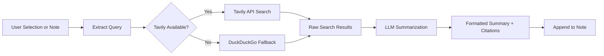

import TLDR from '@site/src/components/TLDR';

# Дослідження та пошук в Інтернеті

<TLDR>
**Notemd шукає в мережі та вставляє LLM-узагальнені результати безпосередньо у ваші нотатки.** Tavily API є основним двигуном пошуку; DuckDuckGo слугує резервним варіантом без налаштувань. Результати узагальнюються з посиланнями на джерела та додаються під заголовком `## Research`. Підтримується дослідження в одній нотатці, дослідження всіх нотаток у папці та вибір моделі для кроку узагальнення за завданням.

Це частина [Obsidian Посібника з управління знаннями в ШІ](/docs/pillar-ai-knowledge).
</TLDR>

## Огляд

Дослідження є однією з найпотужніших інтеграцій Notemd: вона створює замкнутий цикл між читанням, пошуком та записом. Замість того, щоб переходити у браузер для пошуку невідомого терміна, ви виділяєте його та дозволяєте Notemd шукати, узагальнювати та додавати результати — все це прямо у вашому сховищі.

Процес повністю налаштовується. Ви обираєте постачальника пошуку, LLM, який пише узагальнення, та вирішуєте, чи додавати результати до активної нотатки чи записувати їх у окремі файли. Режим пакетних операцій дозволяє дослідити кожну нотатку у папці одним кліком.

## Як це працює

### Пайплайн «Пошук, потім узагальнення»,



1. **Вилучення запиту** -- Notemd вилучає терміни пошуку з вашого вибору або з назви нотатки.
2. **Пошук в Інтернеті** -- Спочатку намагається використати Tavily. Якщо не налаштовано ключ API, автоматично використовується DuckDuckGo (ключ не потрібен).
3. **Узагальнення за допомогою LLM** -- Сирі результати пошуку надсилаються до налаштованого LLM, який створює стисле узагальнення з посиланнями на джерела.
4. **Додавання** -- Форматоване узагальнення додається під заголовком `## Research` у активну нотатку.

### Tavily проти DuckDuckGo

| Аспект | Tavily | DuckDuckGo |
|--------|--------|------------|
| Ключ API | Обов’язково (є безкоштовний тариф) | Не обов’язково |
| Якість результату | Вища (спеціально створена для ШІ) | Достатня для звичайних запитів |
| Обмеження швидкості | Щедрий безкоштовний тариф | Підлягає обмеженню швидкості |
| Конфігурація | `tavilyApiKey` у налаштуваннях | Нульова конфігурація – автоматичний перехід |

### Дослідження папки пакетами

Клацніть правою кнопкою миші на папці та виберіть **"Notemd: Папка досліджень"**. Кожен файл `.md` у папці обробляється послідовно (або паралельно до налаштованої кількості одночасних операцій). Кожна нотатка отримує власний підсумок дослідження.

## Конфігурація

| Налаштування | За замовчуванням | Ефект |
|---------|---------|--------|
| `tavilyApiKey` | `''` | Ключ Tavily API. Якщо він порожній, використовується виключно DuckDuckGo. |
| `researchProvider` / `researchModel` | DeepSeek | LLM на завдання для підсумовування результатів пошуку |
| `maxResearchContentTokens` | `4000` | Бюджет токенів для контенту, надісланого до LLM. Надлишок обрізається. |
| `researchAppendToNote` | `true` | Додати підсумок до вихідної нотатки. Якщо значення false, створюється окремий файл. |
| `researchLanguage` | `'en'` | Мова виводу для підсумкового дослідження |

### Рекомендація моделі на завдання

Дослідження отримують користь від моделі, яка обробляє багатомовний контент та створює добре структурований текст. Розгляньте:

- **DeepSeek** -- стандартний варіант, доступний за ціною, висока якість
- **GPT-4o** -- краща якість підсумовування, вища вартість
- **Gemini Flash** -- швидкий та недорогий, підходить для простих запитів

## Приклад

Ви читаєте статтю про *механізми уваги transformer* та натрапляєте на незнайомий термін: *relative positional encoding*. Замість того, щоб залишити Obsidian:

1. Підкресліть **"relative positional encoding"**
2. Клацніть правою кнопкою --> **"Notemd: Дослідження та підсумування"**
3. Notemd шукає в Інтернеті, підсумовує найкращі результати та додає:

```markdown
## Research

### Relative Positional Encoding

Relative positional encoding is a method used in transformer models
where positional information is expressed as relative distances between
tokens rather than absolute positions. Introduced by Shaw et al. (2018),
it improves generalization to unseen sequence lengths compared to
absolute encodings (Vaswani et al., 2017).

Sources:
- [Shaw et al., Self-Attention with Relative Position Representations (2018)](https://arxiv.org/abs/1803.02155)
- [Transformer Positional Encoding Overview](https://example.com/transformer-pos-enc)
```

Тепер підсумок є частиною вашого архіву, його можна шукати, створювати посилання та отримувати офлайн.

## Поради

- **Встановіть ключ Tavily для кращих результатів** -- навіть безкоштовний тариф забезпечує кращу релевантність, ніж просто DuckDuckGo.
- **Використовуйте потужну модель підсумовування** -- дешеві моделі можуть спрощувати тонкий технічний контент.
- **Проводьте пакетне дослідження** після першого ознайомлення, щоб одночасно заповнити прогалини в багатьох нотатках.
- **Перегляньте додані підсумки** -- LLM може вигадувати деталі джерел. Перевіряйте ключові твердження.

---

## Наступні кроки

- [Concept Notes](./concept-notes) -- Витягуйте та зберігайте ключові терміни з результатів досліджень
- [Wiki-Links](./wiki-links) -- Підключайте концепції, отримані в результаті досліджень, у ваш архів
- [Translation](./translation) -- Перекладайте підсумки досліджень на іншу мову
- [LLM Постачальники](/docs/providers/overview) -- Налаштувати модель, яка використовується для стиснення
