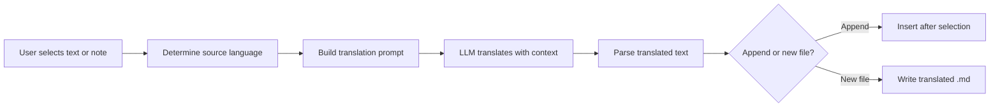

import TLDR from '@site/src/components/TLDR';

# Переклад

<TLDR>
**Notemd перекладає текст між 21+ мовами за допомогою технологій LLM.** Підтримується переклад окремих вибраних фрагментів, переклад усіх нотаток та пакетний переклад папок. Кожен завдання перекладу може використовувати окремого постачальника та модель через налаштування для конкретного завдання. Мова вихідного тексту може бути налаштована окремо від мови UI. Результати додаються під оригіналом або зберігаються у новому файлі залежно від ваших уподобань.

Це частина [Obsidian Посібника з управління знаннями в ШІ](/docs/pillar-ai-knowledge).
</TLDR>

## Огляд

Переклад у Notemd — це не просто пошук у словнику, а переклад з використанням технологій LLM та розуміння контексту. Модель бачить повний абзац чи нотатку, зберігаючи тон, специфічну термінологію та структуру речень. Це забезпечує кращу якість результатів, ніж послуги перекладу фраз за фразою, особливо для технічних, академічних та творчих текстів.

Ця функція підтримує три рівні обробки: вибрані фрагменти, активна нотатка та вся папка. У поєднанні з можливістю вибору моделі для кожного завдання ви можете використовувати швидку модель (Gemini Flash) для неформальних перекладів та потужну модель (Claude Sonnet) для контенту, що вимагає точного розуміння нюансів — без зміни глобального постачальника.

## Як це працює

### Команда Translate



1. **Виявлення джерела** — LLM визначає мову джерела з контенту. Вам не потрібно вказувати її вручну.
2. **Складання запиту** — Notemd створює запит, який включає мову перекладу, необов’язкові підказки щодо сфери та текст для перекладу.
3. **Переклад LLM** — налаштовані `translateProvider` / `translateModel` обробляють запит. Модель зберігає форматування в markdown, посилання wiki та блоки коду.
4. **Вихідний результат** — перекладений текст додається під оригіналом або зберігається у новому файлі в сховищі.

### Пари мов

Notemd підтримує будь-які пари мов, які підтримується основна технологія LLM. Поширені пари включають:

| Джерело | Ціль | Типова якість |
|--------|--------|----------------|
| Англійська | Китайська (спрощена) | Відмінна |
| Китайська | Англійська | Відмінно |
| Англійська | Японська | Дуже добре |
| Англійська | Німецька / Французька / Іспанська | Дуже добре |
| Будь-яка підтримувана | Будь-яка підтримувана | Залежить від моделі |

Налаштування `translateLanguage` керує **мовою виводу**. Мова вихідного тексту визначається автоматично.

### Вибір моделі для кожного завдання

Якість перекладу сильно залежить від моделі. Notemd дозволяє призначити окрему модель лише для перекладу:

| Модель | Швидкість | Якість | Вартість | Для чого підходить |
|-------|-------|--------|------|----------|
| `gemini-2.0-flash-exp` | Швидкий | Гарний | Низький | Для неформального використання з великою кількістю даних |
| `gpt-4o-mini` | Швидкий | Гарний | Низький | Швидкі пошуки |
| `deepseek-chat` | Середній | Гарний | Дуже низький | Бюджетний багатомовний |
| `claude-3-5-sonnet` | Середній | Відмінний | Середній | Технічний / академічний |
| `gpt-4o` | Середній | Відмінний | Середній | Проза, чутлива до нюансів |

### Переклад папки пакетом

Клацніть правою кнопкою миші на папці та виберіть **"Notemd: Translate folder"**, щоб перекласти всі нотатки в цій папці. Кожен файл обробляється окремо. Налаштування паралельності контролює кількість файлів, які перекладаються одночасно.

## Конфігурація

| Налаштування | За замовчуванням | Ефект |
|---------|---------|--------|
| `translateProvider` / `translateModel` | DeepSeek | Спеціалізований провайдер для завдань перекладу |
| `translateLanguage` | `'en'` | Мова цільового виводу |
| `translationAppendToNote` | `true` | Додайте перекладений текст під оригінал. Якщо значення false, створюється новий файл. |
| `batchConcurrency` | `3` | Кількість файлів, які обробляються паралельно під час пакетного перекладу |

## Приклад

Ви читаєте китайську наукову нотатку та хочете її англійську версію:

1. Відкрийте нотатку
2. Клацніть правою кнопкою миші --> **"Notemd: Translate current file"**
3. Notemd виявляє китайську мову, перекладає її на налаштовану мета-мову (англійську) та додає:

```markdown
## Translation (English)

The experimental results show that the proposed method achieves
a 12% improvement in F1 score compared to the baseline, primarily
due to the enhanced feature extraction module described in Section 3.
```

Оригінальний китайський текст залишається недоторканим над перекладом. Заголовок `## Translation` зберігає обидві версії в одному файлі для зручного пошуку.

## Поради

- **Використовуйте Gemini Flash для великих обсягів** -- це найшвидший та найдешевший варіант для пакетного перекладу великих папок.
- **Зберегти посилання у вікі** -- інструкція Notemd змушує LLM залишати `[[wiki-links]]` недоторканим під час перекладу. Перевірте після перекладу, адже деякі моделі іноді їх розпаковують.
- **Явно встановити мову виводу** -- автоматичне виявлення працює для вихідного тексту, але завжди налаштовуйте `translateLanguage`, щоб уникнути неоднозначностей щодо цільової мови.
- **Пакетний переклад концептуальних нотаток** -- якщо ваша папка з концепціями написана однією мовою, а вам потрібна інша, переклад на рівні папки вирішує це за один крок.

---

## Наступні кроки

- [Дослідження](./research) -- Шукайте та узагальнюйте інформацію будь-якою мовою, а потім перекладіть результати
- [Робочі процеси](./workflows) -- Послідовний переклад з посиланнями у вікі або видобутком концепцій
- [Пакетна обробка](/docs/advanced/batch-processing) -- Конкурентність та поведінка перезапису під час операцій з папками
- [LLM Постачальники](/docs/providers/overview) -- Виберіть найкращу модель для вашої пари мов
