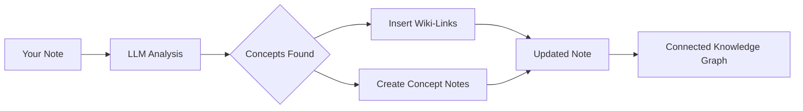

import TLDR from '@site/src/components/TLDR';

# Wiki-Лінки

<TLDR>
**Notemd автоматично додає `[[wiki-links]]` до ключових концепцій у ваших нотатах.** LLM читає ваш контент, визначає важливі терміни в контексті та вставляє wiki-лінки у стилі Obsidian при кожному зустрічанні. За потреби створюються файли концепт-нотаток із зворотними посиланнями. Підтримується придушення синонімів, збереження цілісності посилань під час перейменування/видалення та режим чистого витягування (без змін файлів). На відміну від Auto Link, який відповідає лише існуючим назвам нотаток, Notemd використовує ШІ для виявлення нових концепцій та створення відповідних нотаток. Це є частиною [Obsidian Посібника з управління знаннями за допомогою ШІ](/docs/pillar-ai-knowledge).
</TLDR>

## Огляд

Створення wiki-лінків — це основна функція Notemd. Вона перетворює звичайний текст на взаємопов’язану графіку знань шляхом:

1. **Аналізу вашої нотатки** за допомогою LLM
2. **Визначення ключових концепцій** (терміни, люди, методи, теорії)
3. **Вставки `[[wiki-links]]`** при кожному зустрічанні
4. **Створення концепт-нотаток** (за потреби) із зворотними посиланнями

## Як це працює

### Процес



### Приклад

**До:**
```markdown
Machine learning models use neural networks to learn patterns from data.
The transformer architecture revolutionized natural language processing.
```

**Після:**
```markdown
[[Machine learning]] models use [[neural networks]] to learn patterns from data.
The [[transformer architecture]] revolutionized [[natural language processing]].
```

## Використання

### Базовий: Додати лінки до поточної нотатки

1. Відкрити примітку
2. Клацніть правою кнопкою миші в редакторі → **"Обробити файл (додати лінки)"**
3. Чекайте кілька секунд
4. Концепції тепер пов’язані!

### Пакетна обробка: обробка кількох нотаток

1. Клацніть правою кнопкою миші на папці в File Explorer
2. Виберіть **"Notemd: Обробка папки (додати посилання)"**
3. Налаштування:
   - Конкурентність (скільки файлів одночасно)
   - Перезаписати існуючі посилання (так/ні)
4. Натисніть **Обробити**

### Вибірково: посилання на конкретний текст

1. Підкресліть текст для обробки
2. Клацніть правою кнопкою миші → **"Обробити вибране (додати посилання)"**
3. Аналізується лише підкреслена частина

## Notemd проти Автоматичного посилання

Obsidian має два підходи до автоматичного створення wiki-посилань:

| | **Автоматичне посилання** | **Notemd** |
|--|---------------|-------------|
| Джерело посилання | Існуючі назви нотаток у сховищі | Концепції, ідентифіковані LLM у контенті |
| Можливість створення посилань на нові концепції | Ні — заголовок має вже існувати | Так — ШІ ідентифікує концепції та створює нотатки |
| Обробка синонімів | Ні | Так — придушення синонімів |
| Створення нотатки про концепцію | Ні | Так — з позначками посилань та усуненням дублікатів |
| Пакетна обробка | Ні (один файл) | Так (на рівні папки) |
| Маршрутизація моделі за завданням | Ні | Так |

**Auto Link** здійснює пошук за заголовком: якщо існує нотатка під назвою "Machine Learning", вона обгортає вхідні значення у `[[Machine Learning]]`. Якщо нотатки немає, нічого не відбувається.

**Notemd** працює за допомогою ШІ: LLM читає ваш контент, розуміє контекст, ідентифікує концепції, які *слід* посилатися — навіть якщо нотатки ще немає — та створює як посилання, так і нотатку про концепцію.

## Функції

### Придушення синонімів

**Проблема:** "transformer", "transformers", "Transformer architecture" → 3 окремі концепції

**Рішення:** Notemd виявляє майже однакові записи та використовує канонічну форму.

**Конфігурація:**
```
Settings → Advanced → Synonym Suppression
Threshold: 0.8 (0 = off, 1 = aggressive)
```

### Цілісність посилань

**Під час перейменування концепт-ноти:**
- Усі вікі-посилання автоматично оновлюються (Obsidian основна функція)
- Зворотні посилання залишаються недоторканими

**Під час видалення концепт-ноти:**
- Посилання залишаються, але відображаються як "непосилані згадки"
- Ви можете створити її знову з будь-якої появи

### Режим чистого вилучення

**Вилучати концепти без змін оригіналу:**

1. Клацніть правою кнопкою → **"Вилучити концепти (без посилань)"**
2. Створюються концепт-ноти
3. Оригінальний файл залишається недоторканим

Сценарій використання: обробка тільки для читання контенту або кінцевих версій.

## Створення концепт-ноти

### Автоматичне створення

**Коли увімкнено (за замовчуванням), Notemd створює:**

```markdown
---
tags: [concept, auto-generated]
created: 2026-06-13
source: [[Original Note Name]]
---

# Machine Learning

A branch of artificial intelligence that enables computers
to learn from data without explicit programming.

## Occurrences in Your Vault

- [[Original Note Name#Section]]
- [[Another Note#Header]]

## Related Concepts

- [[Neural Networks]]
- [[Deep Learning]]
- [[Supervised Learning]]
```

### Конфігурація

**Каталог вихідних даних:**
```
Settings → Output → Concept Folder
Default: concepts/
```

**Ієрархічна структура:**
```
Settings → Output → Use Hierarchical Folders
If enabled:
  papers/my-paper.md → papers/concepts/Concept.md
If disabled:
  → concepts/Concept.md
```

**Шаблон:**
```
Settings → Output → Concept Template
Customize with variables:
  {{concept}} — Concept name
  {{description}} — LLM-generated description
  {{backlinks}} — List of source notes
  {{date}} — Creation date
```

## Розширені параметри

### Вікно контексту

**Скільки оточуючого тексту надсилати:**

```
Settings → Linking → Context Window
Options: Sentence | Paragraph | Full Note
Default: Paragraph
```

Чим більше – тим краща точність, але вища вартість.

### Мінімальна кількість входжень

**Підключати лише ті поняття, які з’являються кілька разів:**

```
Settings → Linking → Min Occurrences
Default: 1 (link all)
```

Встановіть 2 або 3, щоб зосередитися на повторюваних темах.

### Виключення шаблонів

**Пропустити певні слова:**

```
Settings → Linking → Exclude List
Example: note, idea, example, thing
```

Це запобігає надмірному підключенню до загальних термінів.

### Кастомні запити

**Перевизначити стандартні інструкції LLM:**

```
Settings → Advanced → Custom Linking Prompt
Default:
  "Identify key concepts, theories, methods, and technical
   terms in the following text. Return as a list..."
```

Змініть їх для потреб конкретної галузі (наприклад, "Зосередитися на медичній термінології").

## Поради та найкращі практики

### ✅ РОБИТИ

- **Обробляйте нотатки довжиною понад 100 слів** — Короткі нотатки містять мало концепцій
- **Використовуйте потужні моделі** для кращого визначення концепцій (GPT-4o, Claude)
- **Перевіряйте перед прийняттям** — Переконайтеся, що пропоновані посилання мають сенс
- **Створюйте ітеративно** — Обробляйте 5-10 нотаток, перегляньте граф, скоригуйте налаштування

### ❌ НЕ РОБИТИ

- **Надмірне посилання** — Не кожному іменнику потрібне посилання
- **Повторна обробка чернеток** — Концепції можуть змінюватися, чекайте, поки вони стабілізуються
- **Ігнорування синонімів** — Увімкніть придушення, щоб уникнути різниці між "ML" та "Machine Learning"

## Продуктивність

### Швидкість

| Розмір нотатки | GPT-4o-mini | Claude Sonnet | Ollama (локально) |
|-----------|-------------|---------------|----------------|
| 500 слів | 2-3 секунди | 3-5 секунд | 5-10 секунд |
| 2000 слів | 5-8 секунд | 10-15 секунд | 20-40 секунд |
| 5000+ слів | Частково (кілька викликів) | Чанкований | Чанкований |

### Оцінка вартості

**Приклад: 1000-слівний запис з GPT-4o-mini**
- Вхід: ~1500 токенів
- Вихід: ~200 токенів
- Вартість: ~

**Пакетна обробка 100 нотаток:** ~

## Усунення несправностей

### Жодних посилань не додано

**Перевірка:**
1. LLM виклик вдалося (Налаштування → Діагностика)
2. У примітці достатньо контенту (>50 слів)
3. Концепції є технічними/специфічними (а не просто займенниками)

**Спробуйте:**
- Використати потужніший модель
- Збільшити вікно контексту
- Перевірити дійсність ключа API

### Занадто багато посилань

**Рішення:**
1. Збільшити мінімальну кількість входжень (2 або 3)
2. Додати поширені слова до списку виключень
3. Використовуйте менш агресивну модель

### Неправильні концепції пов’язані

**Виправлення:**
1. Використовуйте власний запит для специфіки домену
2. Увімкніть придушення синонімів
3. Перегляньте вручну та роз’єднайте

### Лінки руйнуються після перейменування

**Це є нормальною Obsidian поведінкою.**

Щоб оновити всі лінки:
1. Перейменуйте концепт-ноту
2. Obsidian автоматично оновлює `[[old]]` → `[[new]]`

---

## Наступні кроки

- 📖 [Concept Notes](./concept-notes) — Детальний огляд створення концепт-нот
- 🔍 [Research Integration](./research) — Об’єднання посилань з веб-дослідженнями
- 🎨 [Diagrams](./diagrams) — Візуалізація вашої графи знань
