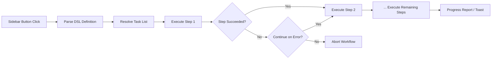

import TLDR from '@site/src/components/TLDR';

# Робочі потоки

<TLDR>
**Notemd робочі потоки об’єднують кілька завдань у одну дію одним кліком.** Визначайте послідовності на кшталт `add-links > extract-concepts > research > diagram` за допомогою простої DSL. Робочі потоки відображаються як кнопки у бічній панелі, які виконують всю послідовність у поточній нотатці або папці. Установка постачається з готовими робочими потоками; можна створювати власні у налаштуваннях. Кожен крок використовує власну конфігурацію моделі для окремого завдання.

Це частина [Obsidian Посібника з управління знаннями в ШІ](/docs/pillar-ai-knowledge).
</TLDR>

## Огляд

Робочий потік усуває необхідність виконання завдань по одному. Замість того, щоб чотири рази клацнути правою кнопкою миші, щоб додати посилання, витягнути концепції, дослідити незнайомі терміни та створити діаграму, достатньо натиснути одну кнопку у бічній панелі, і вся послідовність виконується. Notemd керує послідовністю, поширенням помилок та звітами про прогрес.

Робочі потоки визначаються за допомогою легкої DSL (мови спеціального призначення). Вони знаходяться у налаштуваннях, відображаються як клікабельні кнопки у бічній панелі Obsidian та можуть застосовуватися як до поточної нотатки, так і до всієї папки.

## Як це працює

### Канал виконання робочих потоків



1. **Аналіз** -- Рядок DSL розділяється за допомогою `>` (або `>`) на впорядкований список ідентифікаторів завдань.
2. **Вирішення** -- Кожен ідентифікатор відповідає внутрішній команді (add-links, extract-concepts, research, translate, diagram тощо.).
3. **Виконання** -- Кроки виконуються послідовно. Кожен крок використовує налаштованого постачальника та модель для окремого завдання.
4. **Обробка помилок** -- Якщо якийсь крок зазнає невдачі, робочий потік або припиняється, або продовжується до наступного кроку, залежно від вашої політики обробки помилок.
5. **Завершено** -- Повідомлення у вигляді поп-апа інформує про успіх або перелічує всі невдалі кроки.

### Формат DSL

Робочі потоки визначаються як послідовність ідентифікаторів завдань, розділених `>`:

```
process-current-add-links>extract-concepts-current>research-and-summarize
```

**Доступні ідентифікатори завдань:**

| Ідентифікатор | Дія |
|------------|--------|
| `process-current-add-links` | Додати посилання на wiki до активної нотатки |
| `extract-concepts-current` | Витягнути концепції з активної нотатки |
| `research-and-summarize` | Дослідити вибраний текст або назву нотатки |
| `process-current-translate` | Перекласти активну нотатку |
| `summarize-to-mermaid` | Створити діаграму з активної нотатки |
| `generate-from-title` | Сгенерувати контент з назви нотатки |
| `extract-original-text` | Витягнути оригінальний текст (для OCR / сканованого контенту) |

**Варіанти на рівні папки** — замініть `current` на `folder` у назві ідентифікатора.

### Заздалегідь визначені та користувацькі робочі процеси

Notemd постачається з готовими робочими процесами для поширених сценаріїв:

| Робочий процес | Ланцюг | Сценарій використання |
|----------|-------|----------|
| **Одноклікове витягування** | додати-посилання > витягнути-концепції > дослідити | Обробити наукову статтю за один прохід |
| **Повний пайплайн** | додати-посилання > витягнути-концепції > дослідження > діаграма | Повне витягування знань із візуалізацією |
| **Перекласти + Посилання** | перекласти > додати-посилання | Перекласти, а потім посилатися на концепції мовою цілі |

**Скористані робочі процеси** створюються у налаштуваннях:

1. Відкрити **Налаштування** --> **Notemd** --> **Робочі процеси**
2. Натиснути **"Додати робочий процес"**
3. Ввести ланцюжок DSL (наприклад, `process-current-add-links>extract-concepts-current`)
4. Дати йому ім’я для відображення (наприклад, "Швидке посилання + Витягування")
5. Нова кнопка з’являється у бічній панелі негайно

## Конфігурація

| Налаштування | За замовчуванням | Ефект |
|---------|---------|--------|
| `workflows` | Заздалегідь визначений набір | Масив визначень робочих процесів (ім’я + DSL) |
| `workflowContinueOnError` | `true` | Продовжити до наступного кроку, якщо поточний крок зазнає невдачі |
| `workflowShowProgress` | `true` | Показати повідомлення про прогрес після завершення кожного кроку |

### Моделі на рівні завдань у робочих процесах

Кожен крок у робочому процесі використовує власну конфігурацію моделі для окремого завдання. Вам не потрібно вказувати моделі безпосередньо в DSL. Порядок обробки:

1. Постачальник/модель за завданням, якщо `useMultiModelSettings` увімкнено
2. Глобальний `activeProvider` інакше

Це означає, що `add-links` може працювати на DeepSeek, тоді як `research` працює на GPT-4o – усе це в межах одного кліку у робочому процесі.

## Приклад

Ви щойно імпортували PDF статті з галузі машинного навчання у свій сховище та хочете отримати повне вилучення інформації:

1. Відкрийте імпортовану нотатку
2. Натисніть кнопку бічної панелі **"Full Pipeline"**
3. Notemd виконує:
   - **Крок 1**: Додайте посилання на вікі -- `[[attention mechanism]]`, `[[transformer]]` тощо.
   - **Крок 2**: Витягнення концепцій – створює нотатки про концепції у вашій папці з концепціями
   - **Крок 3**: Дослідження -- узагальнює веб-джерела за ключовими термінами
   - **Крок 4**: Діаграма – створює Mermaid ментальну карту структури статті
4. Через приблизно 30 секунд у вашій записці з’являються посилання, створюються концепт-нотатки, додається дослідження, і зберігається файл з діаграмою

Усе за один клік.

## Поради

- **Почніть з заздалегідь визначених робочих процесів** – вони охоплюють найпоширеніші сценарії. Налаштовуйте їх лише тоді, коли потрібна інша послідовність.
- **Увімкнути `workflowContinueOnError`** – невдалий крок діаграми не повинен зупиняти весь конвеєр обробки.
- **Використовуйте робочі процеси для папок** для масової обробки – клацніть правою кнопкою миші на папці, виберіть робочий процес, і кожна нотатка буде оброблена.
- **Називайте робочі процеси зрозуміло** – простір у бічній панелі обмежений. Використовуйте короткі, орієнтовані на дію назви, такі як "Швидке вилучення" або "Переклад + Посилання".

---

## Наступні кроки

- [Дослідження](./research) – Зрозумійте, що робить крок дослідження, перш ніж додавати його до робочих процесів
- [Вікі-посилання](./wiki-links) – Основна функція посилань, яка використовується у більшості робочих процесів
- [Нотатки концепцій](./concept-notes) – Вилучення концепцій як крок робочого процесу
- [Масова обробка](/docs/advanced/batch-processing) – Конкурентність та звіти про прогрес для робочих процесів папок
