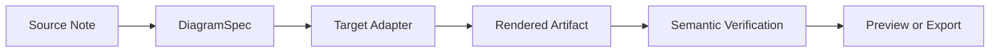
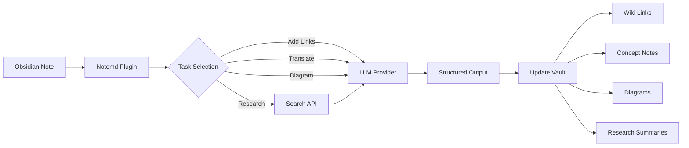

import TLDR from '@site/src/components/TLDR';

# Вступ до Notemd

<TLDR>
**Notemd** (Note + EMD — покращені Markdown-документи) — це відкритий плагін Obsidian, який перетворює читання за допомогою LLM на постійні знання. На відміну від ШІ на основі чату, де інсайти зникають після сесії, Notemd записує результати **безпосередньо у ваш сховище** у вигляді посилань wiki, нотаток про концепції, резюме досліджень, перекладів, робочих процесів та діаграм. Він створений для дослідників, студентів та працівників, які хочуть, щоб читання, дослідження та візуальні пояснення накопичувалися у структурованій, еволюціонуючій графі знань.
</TLDR>

## Що таке Notemd?

Notemd інтегрує **30+ великих моделей мови** (OpenAI, Anthropic, Google, DeepSeek, Qwen, Ollama та інші) у ваш робочий процес Obsidian для автоматизації видобутку знань, їх організації, перекладу, досліджень та створення діаграм.

### Ключова різниця: тимчасові vs. постійні знання

| Аспект | ШІ на основі чату (ChatGPT тощо) | Notemd |
|--------|-------------------------------|--------|
| **Куди потрапляють результати** | Історія чату (зникає) | Ваше сховище Obsidian (зберігається) |
| **Формат** | Відповіді у простому тексті | Структуровані файли: `[[wiki-links]]`, нотатки про концепції, діаграми |
| **Довгострокова цінність** | Треба запитувати знову щоразу | Накопичується у графі знань |
| **Офлайн-режим** | Треба інтернет | Працює повністю офлайн з Ollama |

## Основні функції

### 1. **Автоматичне створення посилань у Wiki**
- LLM визначає ключові концепції у ваших нотатах
- Вставляє `[[wiki-links]]` при кожному зустрічанні
- За потреби створює посилані нотатки про концепції
- Придушення синонімів для уникнення дублікатів

### 2. **Створення нотаток про концепції**
- Витягує основні концепції з статей, матеріалів, нотаток
- Створює спеціальні файли концепцій із посиланнями назад
- Можливість налаштування шляхів виведення та шаблонів

### 3. **Інтеграція з веб-дослідженнями**
- Запитувати Tavily або DuckDuckGo прямо у Obsidian
- LLM підсумовує результати з посиланнями на джерела
- Додає результати досліджень до поточної нотатки

### 4. **Багатомовний переклад**
- Перекладати вибрані частини або всі нотатки
- Підтримує понад 21 UI мову
- Незалежна налаштування мови виводу
- Підтримка пакетного перекладу

### 5. **Створення діаграм**
- **Mermaid**: діаграми потоків, послідовності, класів, станів, ER, Gantt
- **JSON Canvas**: нативні макети Obsidian
- **Vega-Lite**: графіки даних, часові ряди, діаграми розсіювання
- **HTML / Редаговані HTML/SVG**: самостійні візуальні елементи з семантичними анотаціями
- **Draw.io / Межі елементів Drawnix**: шляхи експорту для адміністраторів з того ж семантичного моделювання візуалізацій
- **Дорожня карта схем циркуитів**: підтримка circuitikz/TikZJax розробляється на основі золотих стандартів, обмежених запитів, зворотного зв’язку від рендерингу та перевірки топології/макету, а не на основі необмеженого LLM TikZ
- **Діагностика попереднього перегляду**: елементи рендерингу можуть відображати діагностику проблем під час компіляції/рендерингу, а нелінійні джерела можна перевіряти без необхідності використання LaTeX на стороні плагіну
- Автоматичне виправлення синтаксису для помилок Mermaid

### 6. **Робочі потоки одним кліком**
- Під’єднати кілька дій у кнопки бічної панелі
- Визначення робочого процесу на основі DSL
- Приклад: `add-links > extract-concepts > research > diagram`

## Хто повинен використовувати Notemd?

✅ **Дослідники**, які читають статті та створюють огляди літератури
✅ **Студенти**, які організовують нотатки та створюють карти концепцій
✅ **Професіонали знань**, які хочуть, щоб інсайти від читання зберігалися
✅ **Багатомовні фахівці**, яким потрібен переклад + посилання на wiki
✅ **Користувачі, які піклуються про приватність**, що хочуть локальної підтримки LLM (Ollama)
✅ **Потужні користувачі**, які налаштовують запити та робочі процеси

## Чому Notemd + Obsidian?

**Obsidian** — це база знань, орієнтована на локальне використання та заснована на markdown. **Notemd** додає штучний інтелект:
- Ваші дані залишаються у вашому сховищі (а не в хмарному сервісі)
- Працює офлайн з локальними моделями
- Безкоштовний та з відкритим кодом (лицензія MIT)
- Інтегрується з існуючими плагінами Obsidian
- Масштабується до десятків тисяч нот

## Початок роботи

1. **Встановлення**: Налаштування → Комунітетні плагіни → Перегляд → "Notemd"
2. **Налаштування**: Додайте ключ вашого LLM постачальника API (або використовуйте локальний Ollama)
3. **Спробуйте**: Відкрийте ноту → Клацніть правою кнопкою → "Обробити файл (додати посилання)"
4. **Дослідження**: Перевірте бічну панель на одноклікові робочі процеси

👉 [Інструкція з встановлення](./getting-started/installation) | [Швидкий посібник](./getting-started/quick-start)

## Напрямок можливостей діаграм

Робота з діаграмами Notemd відходить від підходу "запитати модель написати один рядок синтаксису" до багатошарового конвеєра:

Текуща реалізація вже підтримує Mermaid, JSON Canvas, Vega-Lite, HTML як альтернативу, редаговані HTML/SVG, Draw.io XML об’єкти, мінімальний набір Drawnix JSON, діагностику передпоказу/альтернативу лише вихідного коду, а також офлайн-прототип `CircuitSpec -> circuitikz` для типових шаблонів джерела та інверторів CMOS. Діаграми схем є складнішим класом: circuitikz може відтворювати точну електричну топологію, але без обмежень LLM результат часто містить нерозбірливі маршрутизації або LaTeX, який не відображається. Наступним кроком є обмеження circuitikz за допомогою шаблонів золотого стандарту, правил розташування вузлів у сітці, діагностики відображення та циклів зворотного зв’язку у вигляді скріншотів.

Деталі можна прочитати у [Діаграми](./features/diagrams).

## Архітектура

## Notemd проти інших плагінів Obsidian для ШІ

Більшість плагінів Obsidian для ШІ орієнтовані на розмову (ви запитуєте, ШІ відповідає, інсайти залишаються у чаті). Notemd є **орієнтованим на написання**: ШІ обробляє ваші нотатки та записує структуровані результати безпосередньо у ваш сховище.

| Можливості | Notemd | Copilot | Smart Connections | Text Generator |
|-----------|--------|---------|-------------------|-----------------|
| Вставка автоматичних посилань у вікі | Так | Ні | Ні | Ні |
| Створення концептуальної записки | Так (з позначковими посиланнями + усуненням дублікатів) | Ні | Ні | Ні |
| Створення діаграм | Так (Mermaid, Canvas, Vega-Lite, HTML, редаговані об’єкти) | Ні | Ні | Ні |
| Інтеграція з веб-дослідженнями | Так (Tavily + DuckDuckGo) | Ні | Ні | Ні |
| Обробка папок пакетом | Так | Обмежено | Ні | Обмежено |
| Маршрутизація моделі за завданням | Так (7 завдань, незалежні моделі) | Ні | Ні | Ні |
| Ланцюги робочих процесів одним кліком | Так (DSL) | Ні | Ні | Ні |
| Переклад (пакетом) | Так | Ні | Ні | Ні |
| Чат із сховищем | Ні | Так | Ні | Ні |
| Пошук за семантичною схожістю | Ні | Ні | Так | Ні |
| Генерація на основі шаблонів | Ні | Ні | Ні | Так |
| постачальники LLM | 36 (хмара + шлюз + локальний) | 3-5 | 2-3 | 3-5 |
| Повністю офлайн | Так (Ollama) | Частковий | Частковий | Частковий |

**Коли вибирати Notemd**: якщо ви хочете, щоб ШІ створив постійну графіку знань — а не просто обговорював ваші нотатки.

**Коли варто обрати Copilot**: Ви хочете мати асистента ШІ для спілкування всередині Obsidian.

**Коли вибирати Smart Connections**: Ви хочете знайти наявні зв’язки між нотатками за допомогою семантичного пошуку.

## Філософія

**Notemd вважає, що ШІ має допомагати людям у роботі зі знаннями, а не замінювати їх.** Плагін:
- Дозволяє вам контролювати ситуацію (перегляньте перед застосуванням змін)
- Зберігає контекст (усі результати посилаються на джерело)
- Дотримується приватності (локальна підтримка LLM, без телеметрії)
- Залишається розширюваним (відкриті APIs, користувацькі робочі процеси)

<!-- notemd-acknowledgments -->
## Подяки та довідкові проєкти

Notemd підтримується незалежно. Ми дякуємо проєктам і спільнотам з відкритим кодом, які вплинули на задокументовані проєктні рішення або надають основу для інтеграцій. Згадування визнає лише вплив чи сумісність; воно не означає схвалення, афілійованості, включеного коду чи заяви про повторне використання коду.

- **Довідкові проєкти:** [cloudy-tech-diagrams-skill](https://github.com/cloudy-liu/cloudy-tech-diagrams-skill), [Drawnix](https://github.com/plait-board/drawnix), [diagrams.net / draw.io](https://www.diagrams.net/), [repo-saga](https://github.com/teee32/repo-saga).
- **Основи з відкритим кодом:** [Mermaid](https://github.com/mermaid-js/mermaid), [Vega-Lite](https://vega.github.io/vega-lite/), [Slidev](https://github.com/slidevjs/slidev), [CircuitikZ](https://github.com/circuitikz/circuitikz), [Tectonic](https://github.com/tectonic-typesetting/tectonic), [Docusaurus](https://docusaurus.io).
- Кожен проєкт зберігає власну ліцензію та умови; Notemd доступний за [ліцензією MIT](https://github.com/Jacobinwwey/obsidian-NotEMD/blob/main/LICENSE).

## Відкритий код

- **Ліцензія**: MIT
- **Джерело**: [github.com/Jacobinwwey/obsidian-NotEMD](https://github.com/Jacobinwwey/obsidian-NotEMD)
- **Спільнота**: [Discord](https://discord.gg/qnGgsQ9W) | [GitHub Discussions](https://github.com/Jacobinwwey/obsidian-NotEMD/discussions)
- **Внесок**: приймаються PR, див. [CONTRIBUTING.md](https://github.com/Jacobinwwey/obsidian-NotEMD/blob/main/CONTRIBUTING.md)

---

**Наступне**: [Installation →](./getting-started/installation)
