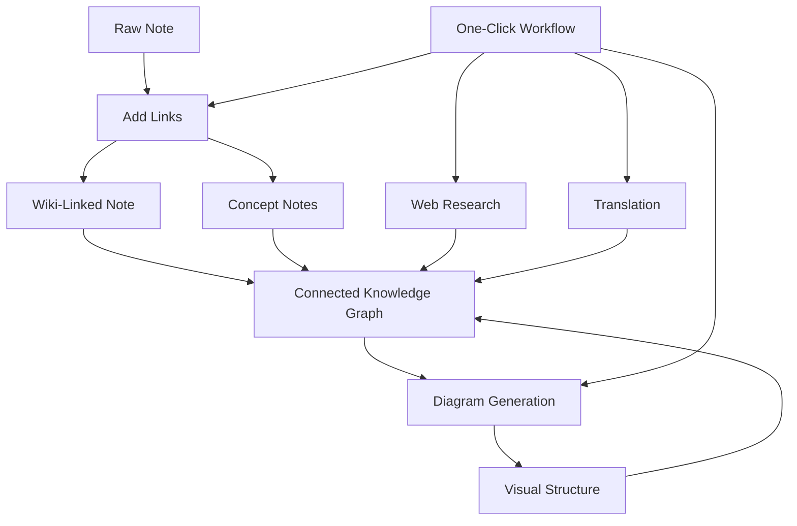

import TLDR from '@site/src/components/TLDR';

# Obsidian Посібник з управління знаннями за допомогою ШІ

<TLDR>
**Notemd перетворює читання, що працює з LLM, на постійні знання: вікі-посилання з’єднують концепції, нотатки про концепції створюють доступну для пошуку графіку, дослідження вносять інформацію з Інтернету у ваш архів, переклад усуває мовні бар’єри, діаграми роблять структуру видимою, а робочі процеси об’єднують усе це одним кліком.** Цей посібник охоплює весь процес — від сирих нотаток до об’єднаної, візуальної, багатомовної бази знань.
</TLDR>

## Чому управління знаннями за допомогою ШІ?

Традиційне ведення нотаток створює плоскі файли. Навіть із ручними вікі-посиланнями більшість нотаток залишаються роз’єднаними. Notemd використовує LLM для автоматизації шару з’єднань:

- **LLM читають ваш контент** та визначають, що є важливим — терміни, методи, люди, теорії
- **Посилання вставляються автоматично** при кожному згадуванні концепції, а не ховаються у розділі «див. також»
- **Нотатки про концепції створюються** як окремі файли, доступні для пошуку
- **Дослідження збагачують нотатки** контекстом з Інтернету
- **Діаграми роблять структуру видимою** — ментальні карти, блок-схеми, графіки даних з того ж контенту

Результат: граф знань, який росте з кожною обробленою нотаткою, а не лише тоді, коли ви пам’ятаєте додати посилання.

## Повний процес



Кожен крок є незалежним. Можна використовувати один або всі. Найефективніша послідовність: **Додати посилання → Нотатки про концепції → Діаграми**.

---

## 1. Вікі-посилання: чітке створення зв’язків

Вікі-посилання є основою графа знань. Notemd використовує LLM для:

1. Читати вміст вашої нотатки (розділяти на частини для довгих документів)
2. Визначати основні концепції — надавати пріоритет конкретним технічним термінам перед загальними іменами
3. Вставляти `[[wiki-links]]` при кожному зустрічанні
4. Пригнічувати синоніми, щоб "ML" та "Machine Learning" не створювали окремих вузлів

### Коли використовувати

- **Кожна нотатка >100 слів** — короткі нотатки містять мало концепцій
- **Наукові статті, технічні документи, записи зустрічей** — багаті на терміни, специфічні для галузі
- **Після того, як контент стабілізується** — не обробляти чернетки багаторазово

### Ключові налаштування

| Налаштування | Рекомендовано | Чому |
|---------|-----------|-----|
| `addLinksProvider` | DeepSeek або GPT-4o-mini | Хороша точність за низьку ціну |
| Пригнічення синонімів | Увімкнено | Запобігає створенню дублікатів вузлів |
| Вікно контексту | Абзац | Баланс між точністю та вартістю |

→ [Глибокий огляд Wiki-посилань](/docs/features/wiki-links)

---

## 2. Концептуальні нотатки: вузли знань, які можна отримати

Wiki-посилання з’єднують ідеї безпосередньо, проте концептуальні нотатки дозволяють отримувати кожну ідею окремо. Кожна концепція має свій `.md` файл:

```markdown
# Machine Learning

## Linked From
- [[My Research Notes]]
- [[Neural Networks Explained]]
```

### Процес вилучення

Запит LLM має дуже чітку структуру:
- Нормалізувати до однини
- Віддавати перевагу багатослівним концепціям перед однослівними („Dielectric Relaxation“, а не „Relaxation“)
- Пропустити розділи з посиланнями/бібліографією
- Виводити результат у `CONCEPT:` рядках для детермінованого парсингу

Концепції усуваються з дублікатами між частинами за допомогою `Set<string>`. Помилки LLM у окремих частинах не призводять до зупинки операції.

### Повернення посилань

Коли це увімкнено, кожна концептуальна нотатка відстежує, які джерельні нотатки її згадують. Вбудована панель повернення посилань Obsidian також відображає зворотні зв’язки.

### Дедуплікація

4-кроковий двійниковий двигун Notemd виявляє:
1. **Точні збіги** — порівняння назв файлів без урахування регістру
2. **Багатоформні форми** — "Models.md" проти "Model.md"
3. **Нормалізація символів** — "A-B.md" проти "A B.md"
4. **Містження одного слова** — "ML.md" позначається, якщо існує "Machine Learning.md"

### Налаштування ключів

| Налаштування | Рекомендовано | Чому |
|---------|-----------|-----|
| `conceptNoteFolder` | `concepts/` або `🧠 concepts/` | Зберігає порядок у сховищі |
| `extractConceptsAddBacklink` | Увімкнено | Дозволяє зворотний пошук |
| `extractConceptsMinimalTemplate` | Вимкнено | Повний шаблон з Linked From |
| Модель на завдання | DeepSeek | Витягування концепцій не потребує дорогих моделей |
| Придушення синонімів | Увімкнено | Однакові налаштування впливають як на посилання, так і на витягування |

→ [Concept Notes deep dive](/docs/features/concept-notes)

---

## 3. Дослідження: Інтеграція Вебу

Notemd інтегрує пошук у Вебі у вашу роботу з нотатками:

1. **Складання запиту** — назва нотатки або вибраний фрагмент стають запитом до пошуку
2. **Пошук у Вебі** — Tavily (рекомендовано, потрібен ключ API) або DuckDuckGo (безкоштовно, без ключа)
3. **LLM підсумовування** — результати пошуку об’єднуються у відповідний короткий опис
4. **Додавання до нотатки** — опис додається у положенні курсора або як новий розділ

### Коли використовувати

- Перед обробкою нової теми — спочатку отримайте контекст з Вебу
- Коли концептуальній нотатці потрібно доповнення — проведіть дослідження, а потім додайте посилання
- Для огляду літератури — проведіть пакетне дослідження папки з нотатками

### Ключові налаштування

| Налаштування | Рекомендовано | Чому |
|---------|-----------|-----|
| `researchProvider` | GPT-4o або Claude | Для досліджень потрібне більш якісне підсумовування |
| Сервіс пошуку | Tavily | Краща релевантність, налаштовувана глибина |
| `maxResearchContentTokens` | 4000 | Баланс між глибиною та витратами |

→ [Детальний огляд дослідження](/docs/features/research)

---

## 4. Переклад: подолання мовних бар’єрів

Notemd перекладає нотатки за допомогою вашого налаштованого LLM — а не спеціалізованого перекладача API. Це означає:

- **Переклади з урахуванням контексту** — LLM розуміє весь документ, а не окремі речення
- **Обробка технічних термінів** — "gradient descent" залишається як "梯度下降", а не "坡度向下"
- **Підтримка пакетів** — можна перекласти цілу папку нотаток однією операцією
- **Модель для кожного завдання** — використовується Gemini Flash для перекладу (швидко, дешево, багатомовно)

### Підтримка мов

Сам Notemd підтримує 21 UI мову. Мова призначення перекладу може налаштовуватися для кожного завдання. Поширені пари: EN↔ZH, EN↔JA, EN↔KO, EN↔DE, EN↔FR, EN↔ES.

→ [Детальний огляд перекладу](/docs/features/translation)

---

## 5. Діаграми: зробити структуру видимою

Пайплайн діаграм Notemd ґрунтується на специфікаціях: LLM створює структурований `DiagramSpec` JSON, а потім адаптери перекладають його у цільовий формат. Це дає більш надійний результат, ніж запитувати LLM про сирому Mermaid синтаксисі.

### Виявлення наміру

Notemd визначає найкращий тип діаграми на основі контенту:

- **Таблиці з числами** → графік даних (Vega-Lite)
- **Словник клієнт/сервер** → діаграма послідовності (Mermaid)
- **Ентитет/primarnyй ключ** → діаграма ER (Mermaid)
- **Крок/потік обробки** → діаграма потоку (Mermaid)
- **Ключові слова карти концепцій** → JSON Canvas (Obsidian native)
- **За замовчуванням** → діаграма мислення (Mermaid)

### Ланцюг відображення

Основна мета → резервний варіант → резервний варіант → HTML. Якщо синтаксис Mermaid зазнає помилки, він спробує ще раз із контекстом помилки для LLM, а потім перейде до мінімальної діаграми.

### Ключові налаштування

| Налаштування | Рекомендовано | Чому |
|---------|-----------|-----|
| `enableExperimentalDiagramPipeline` | Увімкнено | Краща якість завдяки спочатку специфікації |
| `experimentalDiagramCompatibilityMode` | `best-fit` | Нативна мета за наміром |
| `summarizeToMermaidProvider` | GPT-4o або Claude | Специфікації діаграм потребують просторового мислення |
| `autoMermaidFixAfterGenerate` | Увімкнено | Автоматично виявляє помилки синтаксису LLM |
| Розширення локальних знань | Увімкнено для домен‑специфічного використання | Підвищує точність за рахунок контексту сховища |

→ [Детальний огляд діаграм](/docs/features/diagrams)

---

## 6. Робочі процеси: автоматизація одним кліком

Робочі процеси об’єднують кілька завдань у одну кнопку на панелі бічних інструментів. Формат DSL є таким:

```
task1 | task2 | task3
```

Приклад: `addLinks | extractConcepts | generateDiagram` — перетворити нотатку зі сирого тексту на повністю з’єднаний візуальний вузол знань одним кліком.

### Рекомендовані робочі процеси

| Робочий процес | Ланцюг | Сценарій використання |
|----------|-------|----------|
| Повний процес | `addLinks \| extractConcepts \| generateDiagram` | Нові нотатки |
| Дослідження спочатку | `research \| addLinks` | Незнайомі теми |
| Багатомовність | `translate \| addLinks` | Багатомовні нотатки |
| Лише діаграма | `generateDiagram` | Швидка візуалізація |

→ [Детальний огляд робочих процесів](/docs/features/workflows)

---

## 7. LLM Провайдери: 36 варіантів від хмари до локального сервера

Notemd підтримує 36 провайдерів у 4 типах транспортування. Ключові групи:

- **Міжнародні хмари**: OpenAI, Anthropic, Google, Mistral, xAI
- **Китайські хмари**: DeepSeek, Qwen, Doubao, Moonshot, GLM, Baidu, SiliconFlow
- **Шлюзи**: OpenRouter, GitHub Models, Hugging Face, Vercel
- **Локальні сервери**: Ollama, LMStudio, OVMS — без ключа API, дані не виходять за межі вашого пристрою

### Стратегія моделей за завданням

Найекономічніше рішення — використовувати дешеві моделі для простих завдань та потужні моделі для складних:

```
extractConcepts  → DeepSeek (fast, cheap, accurate enough)
addLinks          → DeepSeek or GPT-4o-mini
research          → GPT-4o or Claude (needs quality)
generateDiagram   → GPT-4o or Claude (needs spatial reasoning)
translate         → Gemini Flash (fast, multilingual)
```

→ [Огляд LLM Провайдерів](/docs/providers/overview)

---

## Чек-лист для початку роботи

1. **Встановити Notemd** — [Community Plugins](/docs/getting-started/installation) (рекомендується) або вручну
2. **Налаштувати провайдера** — DeepSeek (найпростіше), OpenAI або Ollama (безкоштовно)
3. **Обробити першу записку** — клацніть правою кнопкою → "Обробити файл (додати посилання)"
4. **Встановити папку концепцій** — Налаштування → Notemd → Вихід → Папка концепцій
5. **Витягнути концепції** — запустити «Витягнути концепції» у тій самій нотатці
6. **Створити діаграму** — запустити «Створити діаграму», щоб візуалізувати зв’язки
7. **Створити робочий процес** — об’єднати вищезазначені кроки у одну кнопку натискання

## Рекомендовані конфігурації

### Студент (Бюджет)

```
Provider: DeepSeek (free tier available)
Concept extraction: DeepSeek
Research: DuckDuckGo (free) + DeepSeek
Diagrams: Off (or legacy Mermaid)
Workflows: addLinks | extractConcepts
```

### Дослідник (Якість)

```
Provider: GPT-4o (primary)
Concept extraction: DeepSeek (cost savings)
Research: GPT-4o + Tavily
Diagrams: best-fit mode, GPT-4o
Workflows: research | addLinks | extractConcepts | generateDiagram
```

### Приватність на першому місці (лише локально)

```
Provider: Ollama (llama3 or qwen2.5:7b)
All tasks: Ollama
Research: DuckDuckGo (free, no API key)
Diagrams: legacy Mermaid mode
```

### Двомовний (ZH + EN)

```
Primary: DeepSeek (Chinese queries)
Translation: Google Gemini Flash
Research: Tavily + DeepSeek (Chinese search context)
Language output: per-task (extractConceptsLanguage: zh-CN)
```

---

## Загальні шаблони

### Шаблон: Обробка наукової статті

1. Імпортувати вміст PDF (або вставити)
2. **Дослідження** — отримати інформацію з Інтернету про тему
3. **Додати посилання** — виявити та під’єднати ключові концепції
4. **Витягнути концепції** — створити окремі нотатки
5. **Створити діаграму** — візуалізувати структуру статті

### Шаблон: Озброєння щоденної нотатки

1. Писати щоденну нотатку
2. **Додати посилання** — пов’язує сьогоднішні ідеї з існуючими концепціями
3. Нотатки про концепції автоматично оновлюються з позначками посилань

### Шаблон: Огляд літератури

1. Створити папку з документами/нотатками
2. **Пакетне додавання посилань** — обробка всієї папки
3. **Усунення дублікатів концепцій** — очищення майже однакових нотаток
4. **Створити діаграму** — ментальна карта всієї літератури

---

*Notemd є відкритим кодом (MIT) і працює з Obsidian 0.15.0+ на всіх платформах. [Встановити зараз](/docs/getting-started/installation) або [переглянути на GitHub](https://github.com/Jacobinwwey/obsidian-NotEMD).*
