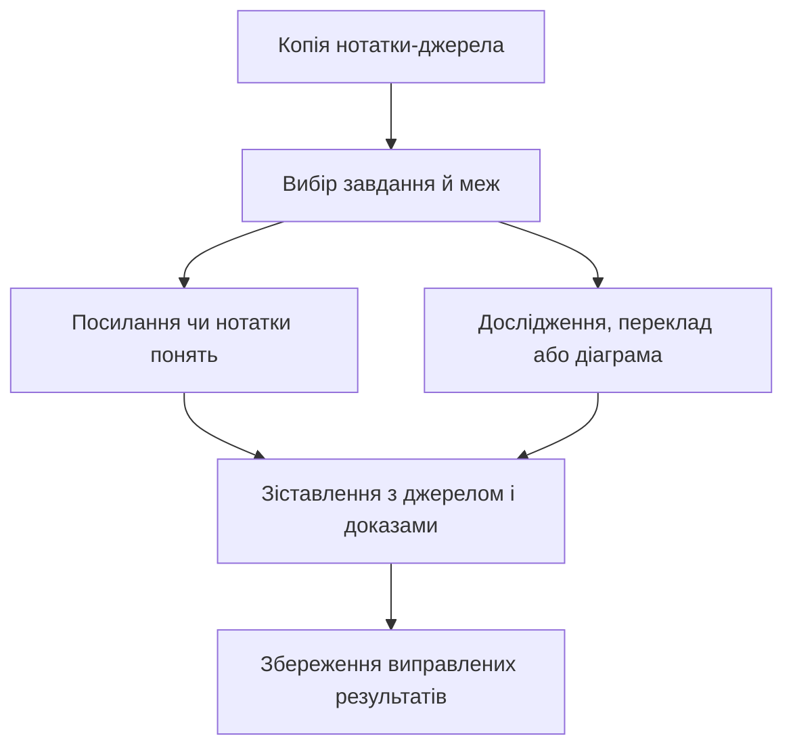

import TLDR from '@site/src/components/TLDR';

# Керування знаннями з AI в Obsidian

<TLDR>Корисний процес розрізняє джерело, згенерований моделлю текст і ваші виправлення. Notemd надає посилання, виділення, дослідження, переклад і діаграми як перевірювані файли. Почніть з одного джерела й після перевірки автоматизуйте обмежену папку.</TLDR>

## Визначте результат

Виберіть пов’язану нотатку читання, колекцію понять, підсумок із джерелами, переклад чи діаграму. Більше файлів і посилань автоматично не покращує розуміння чи пошуку. Вирішіть, як перевірите точність і знайдете матеріал пізніше.

## Увесь процес


```mermaid
flowchart TD
    A[Копія нотатки-джерела] --> B[Вибір завдання й меж]
    B --> C[Посилання чи нотатки понять]
    B --> D[Дослідження, переклад або діаграма]
    C --> E[Зіставлення з джерелом і доказами]
    D --> E
    E --> F[Збереження виправлених результатів]
```

Це доступні завдання, а не всі кроки однієї типової кнопки. Збережіть джерело й перевірте ціль кожного завдання перед поєднанням.

## 1. Вікіпосилання: явні зв’язки

Запустіть **Обробити файл (додати посилання)** на тестовій нотатці. Перевірте сусідній `_processed.md`, корисність термінів і точність цитат, коду та рівнянь.

Тематичний фокус і зменшення синонімів спрямовують модель без примусової тотожності понять чи числового порога. Для відтворюваних посилань на наявні назви розгляньте детерміноване зіставлення.

[Вікіпосилання](./features/wiki-links)

## 2. Поняття: термін окремо від пояснення

Перед виділенням виберіть папку. Самостійне виділення створює лише назви й зберігає джерело. Для `Linked From` у нових самостійних нотатках увімкніть зворотні посилання й вимкніть мінімальний шаблон.

Виділення й пояснення — окремі операції. **Пакетна генерація з назв** може заповнити й наявні придатні нотатки папки. Тестуйте окремо та перевіряйте повідомлені переміщення complete. Евристика дублікатів заснована на назвах; подібні назви можуть мати різний технічний зміст.

[Нотатки понять](./features/concept-notes)

## 3. Дослідження: збереження доказів

Виберіть тему чи назву, налаштуйте Tavily/DuckDuckGo та виконайте **Дослідити й підсумувати**. Порожній ключ Tavily не перемикає сервіс. Відкрийте джерела й перевірте головні твердження доданого підсумку.

Необов’язковий локальний пошук додає уривки з обмеженої області. Індекс лексичний, текст надсилається вибраному LLM. Локальний індекс не робить усе дослідження автономним чи суто локальним.

[Дослідження](./features/research)

## 4. Переклад: значення й структура

Виберіть мову результату й перекладіть файл. Типовий суфікс `_<language>.md`; наявна ціль може перезаписуватися. Для одного уривка спочатку створіть тимчасову нотатку.

Зіставляйте терміни, числа, код, посилання й математичний запис. Поділ довгих нотаток може втрачати контекст. 21 мова UI та 34 маршрути сайту не доводять якості жодної мовної пари.

[Переклад](./features/translation)

## 5. Діаграми: редагований артефакт

Виберіть кілька типів діаграм за один запуск і кілька форматів для кожного типу окремо. Зняття позначки зберігає формати типу; без вибраних типів вміст аналізується автоматично. Прапорець додає тип. Натисніть назву, щоб вибрати його й налаштувати формати. Наведення вказівника або фокус клавіатури змінює перегляд без збереження налаштувань. Escape закриває меню й повертає фокус.

Користуйтеся підтримуваним каталогом. CircuitikZ обмежений, нативна компіляція має власну перевірку. Статичні міжгілкові стрілки Drawnix не гарантують прикріплення після переміщення. Виправлення таблиць PowerPoint не усувають можливого експорту Mermaid/SVG як зображень.

[Діаграми](./features/diagrams)

## 6. Процеси: автоматизація перевіреної послідовності

Синтаксис містить назву, `::` та ID, розділені `>`. Типова послідовність:

```text
One-Click Extract::process-current-add-links>batch-generate-from-titles>batch-mermaid-fix
```

Виконує посилання, генерацію за назвами папки й ремонт Mermaid. Загального дослідження чи створення діаграм не додає. Дії мають власні передумови й результати; це не довільний конвеєр тексту.

Типова політика зупиняється на повідомленій помилці. Продовження доречне лише для кроків, які можуть працювати із залишком входів. Скасування зберігає готове, а не відкочує.

[Процеси](./features/workflows)

## 7. Провайдери: протокол і навантаження

36 профілів охоплюють п’ять сімейств. Вибирайте endpoint, права моделі, політику даних і виміряний результат під завдання. Порівнюйте швидкість/ціну на однаковому джерелі та запиті.

Маршрутизація за завданнями вимкнена початково. Вмикайте свідомо й перевірте кожен маршрут, перш ніж називати процес локальним.

[Провайдери](./providers/overview)

## Початковий перелік

1. Встановіть і створіть копію джерел.
2. Налаштуйте й перевірте точного провайдера/модель.
3. Виберіть папку понять і відмінні цілі.
4. Виконайте одне завдання на копії.
5. Зіставте результат і збережіть виправлення.
6. До довгої послідовності перевірте малу папку й часткове завершення.

## Типові сценарії

### Наукова стаття

Зовнішнім засобом перетворіть статтю на Markdown, спочатку перевірте формули, рисунки й таблиці. Виділіть поняття чи оригінальні уривки, дослідіть конкретні питання та створюйте діаграму для зв’язку, який можна перевірити. Збережіть посилання на статтю й виправлення.

### Колекція понять

Використовуйте окрему папку, перегляньте термінологію та генеруйте пояснення для свідомо вибраної підмножини. Перед очищенням дублікатів зробіть копію. Більше понять не замінює точних визначень і корисної навігації.

### Приватний матеріал

Підготуйте локальний сервер, моделі й залежності, перевірте маршрути та уникайте мережевого дослідження за вимоги автономності. Перед поширенням перевірте діагностику. Початкова loopback-адреса не забороняє налаштувати віддалений сервер.

### Перерваний пакет

Дочекайтеся завершення скасування/помилки. Читайте звіт, перевіряйте готові й відновлювальні файли та конфлікти, повторюйте лише потрібне. Скасований стан не означає порожнього результату. Не видаляйте супровідних файлів без перевірки посилань на них.

## Далі

- [Перші кроки](./getting-started/quick-start).
- [Пакетна обробка](./advanced/batch-processing).
- [Розробники](./developers/overview).
- [Agent](./agents/overview).
