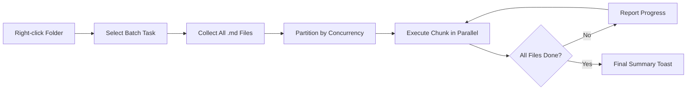

import TLDR from '@site/src/components/TLDR';

# Xử lý theo lô

<TLDR>
**Notemd xử lý toàn bộ thư mục trong một thao tác duy nhất với khả năng điều chỉnh đồng thời và kiểm soát ghi đè.** Nhấp chuột phải vào một thư mục để thêm liên kết wiki theo lô, trích xuất khái niệm, nghiên cứu hoặc dịch tất cả ghi chú bên trong. Giới hạn đồng thời ngăn chặn các lỗi giới hạn tốc độ API. Tiến trình được báo cáo theo từng tập tin. Hành vi ghi đè có thể được thiết lập: bỏ qua tập tin hiện có, thêm vào hoặc thay thế. Các tập tin thất bại sẽ được ghi nhật ký mà không làm dừng quá trình xử lý theo lô.

Đây là một phần của [Obsidian Hướng dẫn Quản lý Kiến thức AI](/docs/pillar-ai-knowledge).
</TLDR>

## Tổng quan

Xử lý theo lô biến một thư mục chứa ghi chú thành một thao tác duy nhất. Thay vì mở từng ghi chú và chạy các lệnh riêng lẻ, bạn chỉ cần nhấp chuột phải vào thư mục và chọn nhiệm vụ. Notemd sẽ duyệt qua từng tập tin `.md`, áp dụng hành động đã chọn và báo cáo tiến trình theo thời gian thực.

Tính năng này rất quan trọng cho việc trích xuất kiến thức trên toàn bộ kho lưu trữ. Ví dụ, sau khi nhập hàng chục tập tin PDF, việc thêm liên kết theo lô tiếp theo là trích xuất khái niệm theo lô sẽ giúp xây dựng đồ thị kiến thức của bạn trong vài phút thay vì vài giờ.

## Cách thức hoạt động

### Mô hình thực thi theo lô

1. **Thu thập tập tin** -- Notemd quét thư mục mục tiêu một cách tuần tự (hoặc chỉ ở cấp độ cao nhất, tùy theo cài đặt) và thu thập tất cả các tập tin `.md`.
2. **Phân chia đồng thời** -- Các tập tin được chia thành các nhóm dựa trên thiết lập `batchConcurrency`. Mỗi nhóm được chạy song song; các nhóm khác thì chạy theo thứ tự.
3. **Thực thi** -- Mỗi tập tin được xử lý bằng cùng một logic như lệnh dành cho tập tin đơn lẻ. Các thiết lập của nhà cung cấp và mô hình cho từng nhiệm vụ sẽ được tuân thủ.
4. **Báo cáo tiến trình** -- Một thông báo hiện lên sẽ được cập nhật sau mỗi tập tin được xử lý xong, hiển thị tỷ lệ `N / Total` đã hoàn thành.
5. **Xử lý lỗi** -- Nếu một tập tin gặp sự cố (API lỗi, hết thời gian chờ mạng, v.v.), lỗi sẽ được ghi nhật ký và quá trình xử lý theo lô vẫn tiếp tục. Bảng tóm tắt cuối cùng sẽ liệt kê các tập tin thất bại.
6. **Hoàn thành** -- Một thông báo tóm tắt sẽ hiển thị tổng số tập tin đã xử lý, số lượng thành công và số lượng thất bại.

### Hành vi ghi đè

Khi xử lý một tệp đã chứa các liên kết wiki, ghi chú khái niệm hoặc bản dịch, hành vi của Notemd phụ thuộc vào thiết lập ghi đè:

| Chế độ | Hành vi |
|------|----------|
| **Bỏ qua** | Nội dung hiện có sẽ không bị thay đổi. Chỉ những tệp chưa được chỉnh sửa mới được xử lý. |
| **Thêm vào cuối** (mặc định) | Nội dung mới sẽ được thêm vào cuối. Các liên kết wiki, khái niệm hoặc bản dịch hiện có sẽ được giữ nguyên. |
| **Thay thế** | Tệp sẽ được xử lý lại hoàn toàn. Tất cả các thay đổi trước đó của Notemd sẽ bị ghi đè. |

Đối với việc tạo liên kết wiki cụ thể: nếu một ghi chú đã chứa `[[wiki-links]]`, chế độ **Bỏ qua** sẽ để nguyên nó, trong khi chế độ **Thay thế** sẽ gửi toàn bộ ghi chú đến LLM để chèn liên kết mới. Hãy dùng **Bỏ qua** cho việc xử lý từng phần và **Thay thế** cho việc xử lý lại sau khi nâng cấp mô hình.

### Kiểm soát đồng thời

Thiết lập `batchConcurrency` giới hạn số lượng yêu cầu API được thực hiện song song. Điều này ngăn chặn các lỗi giới hạn tốc độ (HTTP 429) khi xử lý các thư mục lớn trên các nhà cung cấp có giới hạn nghiêm ngặt.

| Đồng thời | Khuyến nghị sử dụng cho | Tác động tiêu biểu đến giới hạn tốc độ |
|-------------|----------------|---------------------------|
| `1` | Gói miễn phí, các nhà cung cấp nghiêm ngặt | Không có (số seri) |
| `3` (mặc định) | Hầu hết các nhà cung cấp đám mây | Thấp |
| `5` | Ollama (địa phương), các gói hào phóng | Không có / Thấp |
| `10` | Các mô hình địa phương với khả năng suy luận nhanh | Không có |

Nếu bạn gặp lỗi 429 khi xử lý theo nhóm, hãy giảm số lượng đồng thời xuống còn 1 hoặc 2.

## Cấu hình

| Thiết lập | Mặc định | Tác động |
|---------|---------|--------|
| `batchConcurrency` | `3` | Số lượng yêu cầu song song tối đa API trong các thao tác thư mục |
| `batchOverwriteExisting` | `false` | Ghi đè nội dung Notemd hiện có. `false` = chế độ ghi thêm. |
| `batchSkipProcessed` | `false` | Bỏ qua các tệp đã chứa dấu hiệu Notemd (ví dụ: liên kết wiki) |
| `batchRecursive` | `true` | Bao gồm các thư mục con khi quét thư mục |
| `enableStableApiCall` | `false` | Kích hoạt logic thử lại (tối đa 4 lần) cho mỗi tệp trong quá trình xử lý theo nhóm |

### Các mô hình riêng cho từng nhiệm vụ trong quá trình xử lý theo nhóm

Mỗi thao tác theo nhóm sẽ sử dụng mô hình tương ứng với nhiệm vụ đó. batch-add-links sử dụng `addLinksProvider`, batch-research sử dụng `researchProvider`, và cứ thế. Điều này cho phép bạn sử dụng các mô hình rẻ tiền cho các thao tác với khối lượng lớn và giữ lại các mô hình đắt tiền cho những nhiệm vụ yêu cầu chất lượng cao.

## Ví dụ

Bạn có một thư mục `papers/` chứa 40 ghi chú nghiên cứu được nhập vào. Bạn muốn thêm các liên kết wiki và trích xuất các khái niệm từ tất cả chúng:

1. Nhấp chuột phải vào thư mục `papers/`
2. Chọn **"Notemd: Xử lý thư mục (thêm liên kết)"**
3. Notemd quét thư mục, tìm thấy 40 tệp `.md` và xử lý 3 tệp mỗi lần (độ đồng thời mặc định)
4. Một thông báo tiến trình hiển thị: `12/40 files processed...`
5. Sau khoảng 3 phút, một thông báo tổng kết báo cáo: `39 succeeded, 1 failed (API timeout on paper-37.md)`
6. Lặp lại với **"Notemd: Xử lý thư mục (trích xuất khái niệm)"** để tạo các ghi chú khái niệm cho tất cả 40 tệp

Tệp bị thất bại sẽ được ghi nhật ký. Bạn có thể chạy lại chỉ trên tệp đó sau này.

## Mẹo

- **Bắt đầu với độ đồng thời thấp** -- Nếu bạn không chắc về giới hạn tốc độ của nhà cung cấp, hãy bắt đầu với `1` và tăng dần.
- **Sử dụng chế độ bỏ qua để cập nhật từng phần** -- Sau lô đầy đủ đầu tiên, chuyển sang `batchSkipProcessed: true` để chỉ xử lý các ghi chú mới trong các lần chạy sau.
- **Kích hoạt các cuộc gọi API ổn định** -- `enableStableApiCall: true` thêm logic thử lại giúp phục hồi từ các lỗi mạng tạm thời trong các lô xử lý dài.
- **Chạy lại sau khi nâng cấp mô hình** -- Nếu bạn chuyển sang mô hình tốt hơn, hãy thiết lập `batchOverwriteExisting: true` và chạy lại để có được các liên kết và khái niệm tốt hơn.

---

## Các bước tiếp theo

- [Workflows](/docs/features/workflows) -- Kết nối các nhiệm vụ theo lô thành các nút bên cạnh một cú nhấp
- [Custom Prompts](/docs/advanced/custom-prompts) -- Tùy chỉnh các mẫu câu hỏi cho việc trích xuất theo lô
- [Troubleshooting](/docs/advanced/troubleshooting) -- Khắc phục các lỗi giới hạn tốc độ và sự cố kết nối trong quá trình chạy theo lô
- [LLM Các nhà cung cấp](/docs/providers/overview) -- Tham chiếu cấu hình mô hình theo nhiệm vụ
