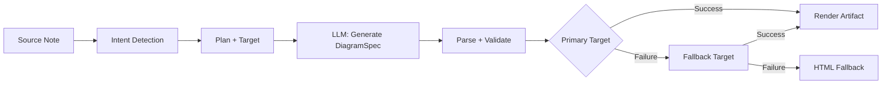
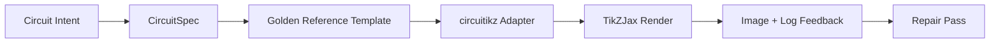

import TLDR from '@site/src/components/TLDR';

# Sơ đồ

<TLDR>
**Notemd tạo ra các đồ thị từ ghi chú của bạn bằng cách sử dụng quy trình lấy mô tả làm ưu tiên.** Mô hình LLM tạo ra một tệp JSON `DiagramSpec` không phụ thuộc vào công cụ hiển thị, sau đó các bộ chuyển đổi chuyên dụng sẽ chuyển đổi nó thành định dạng Mermaid, JSON Canvas, Vega-Lite, HTML, HTML/SVG có thể chỉnh sửa, Draw.io, Drawnix, hoặc các sơ đồ circuitikz có giới hạn. Hỗ trợ 9 loại mục đích sử dụng, các chuỗi phản hồi tự động, xem trước trực tiếp kèm khả năng xuất ra SVG/PNG/PDF, kiểm tra ngữ nghĩa, và khả năng tạo nội dung được tăng cường bằng kiến thức địa phương.
</TLDR>

Đây là một phần của [Obsidian Hướng dẫn Quản lý Kiến thức AI](/docs/pillar-ai-knowledge).

## Kiến trúc: Quy trình dựa trên mô tả trước

Notemd không bao giờ yêu cầu LLM tạo ra ngôn ngữ cú pháp Mermaid/Vega/Canvas trực tiếp. Thay vào đó:



**Tại sao lại dùng mô tả trước?** LLM thường tạo ra cú pháp công cụ hiển thị không hợp lệ (đặc biệt là Mermaid). Một mô tả `DiagramSpec` có cấu trúc có thể được xác thực trước khi hiển thị, và cùng một mô tả có thể cung cấp dữ liệu cho nhiều công cụ hiển thị dùng làm giải pháp sao lưu.

## Các loại sơ đồ được hỗ trợ

| Mục đích | Công cụ hiển thị chính | Giải pháp sao lưu | Trường hợp sử dụng |
|--------|-----------------|-----------|----------|
| `mindmap` | Mermaid | HTML | Phân tích chủ đề theo cấp bậc |
| `flowchart` | Mermaid | HTML | Dòng chảy quy trình, cây quyết định |
| `sequence` | Mermaid | HTML | Tương tác client-server, giao thức |
| `classDiagram` | Mermaid | HTML | Mối quan hệ lớp OOP |
| `erDiagram` | Mermaid | HTML | Các sơ đồ cơ sở dữ liệu, mối quan hệ giữa các thực thể |
| `stateDiagram` | Mermaid | HTML | Máy trạng thái, mô hình vòng đời |
| `canvasMap` | JSON Canvas | Mermaid → HTML | Bản đồ khái niệm, đồ thị kiến thức |
| `dataChart` | Vega-Lite | Mermaid → HTML | Biểu đồ thanh, biểu đồ đường, biểu đồ diện tích, biểu đồ rải rác, biểu đồ tròn, bảng |
| `circuit` | circuitikz | none | Các sơ đồ mạch có giới hạn được tạo từ các dữ liệu `CircuitSpec` đã được xác thực |

## Nhận diện ý định

Notemd suy luận loại sơ đồ tốt nhất từ nội dung ghi chú của bạn bằng cách đánh giá theo từ khóa:

| Ý định | Nguyên nhân kích hoạt | Mức độ tin cậy |
|--------|----------|------------|
| `dataChart` | Bảng, ô số, từ khóa về chỉ số/trend, tỷ lệ phần trăm | 0.88 |
| `sequence` | Từ vựng yêu cầu/phản hồi (4+ trùng khớp) hoặc dấu hiệu `->`/`=>` | 0.82 |
| `erDiagram` | Khóa chính, khóa ngoại, thực thể, sơ đồ (2+ trùng khớp) | 0.80 |
| `stateDiagram` | Trạng thái, chuyển tiếp, chờ xử lý, đang chạy, thất bại (3+ trùng khớp) | 0.76 |
| `flowchart` | Các bước được đánh số (2+) hoặc từ vựng liên quan đến if/then/else/workflow | 0.74 |
| `canvasMap` | Bản đồ khái niệm, đồ thị kiến thức, không gian, nhóm | 0.72 |
| `circuit` | circuitikz, TikZJax, circuit, schematic, CMOS, NMOS, PMOS, MOSFET, VDD/GND, `vin`/`vout` | 0.78 |
| `mindmap` | Giá trị mặc định dự phòng | 0.55 |

Thay thế bằng thiết lập **Loại sơ đồ ưu tiên**, bộ lọc thanh bên, hoặc tùy chọn bảng lệnh cụ thể.

## Chọn Mục tiêu hiển thị

Quy trình thử nghiệm dựa trên tiêu chuẩn hiện có hai bộ điều khiển độc lập:

| Bộ điều khiển | Thiết lập | Tác động |
|---------|---------|--------|
| Loại sơ đồ ưu tiên | `preferredDiagramIntent` | Định hướng hình dạng ngữ nghĩa của `DiagramSpec` được tạo ra |
| Mục tiêu hiển thị ưu tiên | `preferredDiagramRenderTarget` | Chọn trình hiển thị tài liệu cho các lệnh **Tạo sơ đồ** và **Xem trước sơ đồ** |

Hãy đặt **Preferred render target** thành **Auto** để sử dụng giá trị mặc định của bộ lập kế hoạch, hoặc hãy chọn rõ ràng giữa Mermaid, JSON Canvas, Vega-Lite, HTML, Editable HTML/SVG, Draw.io, Drawnix, hoặc Circuitikz. Việc thay đổi này chỉ áp dụng cho các lệnh tạo tệp đồ họa và xem trước. Lệnh tiêu chuẩn **Summarise as Mermaid diagram** vẫn sẽ luôn tạo ra đầu ra tương thích với Mermaid để đảm bảo các quy trình làm việc dựa trên Markdown hiện có không bị chuyển đổi định dạng một cách lặng lẽ.

Sự phân biệt này rất quan trọng vì giờ đây mục đích sử dụng `flowchart` có thể được hiển thị dưới dạng Mermaid cho các ghi chú Markdown, dạng HTML để sử dụng làm giải pháp dự phòng vững chắc, dạng Editable HTML/SVG để chỉnh sửa sau này, hoặc dưới dạng các tệp nguồn Draw.io/Drawnix kèm theo các hình ảnh SVG để xem xét. Mục đích sử dụng `circuit` sẽ được chuyển hướng đến Circuitikz và yêu cầu phải có một tệp `CircuitSpec` đã được xác thực; đây không phải là yêu cầu tạo văn bản TikZ tùy ý.
## Cách sử dụng

### Tạo sơ đồ

1. Mở một ghi chú
2. Chạy lệnh **"Notemd: Tạo sơ đồ"** từ bảng lệnh
3. Notemd nhận diện ý định, tạo tiêu chuẩn, hiển thị, và lưu tài liệu

**Các tập tin đầu ra theo mục tiêu:**

| Mục tiêu | Phần mở rộng | Mẫu tên tệp |
|--------|-----------|------------------|
| Mermaid | `.md` | `{note}_summ.md` |
| JSON Canvas | `.canvas` | `{note}_diagram.canvas` |
| Vega-Lite | `.json` | `{note}_diagram.json` |
| HTML | `.html` | `{note}_diagram.html` |
| Có thể chỉnh sửa HTML/SVG | `.html` | `{note}_diagram.html` |
| Draw.io | `.drawio` + `.drawio.svg` + `.drawio.md` | `{note}_diagram.drawio` cùng các tệp hỗ trợ dùng để xem xét |
| Drawnix | `.drawnix` + `.drawnix.svg` + `.drawnix.md` | `{note}_diagram.drawnix` cùng các tệp hỗ trợ dùng để xem xét |
| Circuitikz | `.tex` + `.tex.svg` + `.tex.md` | `{note}_diagram.tex` cùng các tệp hỗ trợ dùng để xem xét |

### Xem trước sơ đồ

1. Chạy **"Notemd: Xem trước sơ đồ"**
2. Một cửa sổ modal hiển thị sơ đồ đã được vẽ
3. Sử dụng các nút trên thanh công cụ để xuất ra dưới dạng SVG, PNG, hoặc PDF

Tính năng **Mở xem trước tự động** có sẵn trong cài đặt — sau khi tạo, cửa sổ modal xem trước sẽ mở tự động.

Việc xuất file xem trước dạng PNG và PDF sẽ sử dụng độ phân giải màn hình (PPI) đã được cấu hình. Giá trị mặc định là 300 PPI và các giá trị lớn hơn 600 PPI sẽ bị giới hạn ở mức 600. SVG vẫn giữ nguyên kích thước vector. Các tệp nguồn như `.drawio`, `.drawnix`, và `.tex` có thể cung cấp một tệp phụ `previewSvg` để Obsidian có thể hiển thị và xuất các hình ảnh có thể xem xét mà không cần nhúng circuit.net, Drawnix, LaTeX, hoặc TikZJax vào môi trường chạy của plugin.

Modal xem trước cũng có một bảng điều khiển chẩn đoán các lỗi tạo ra artifact. Các công cụ render và bài kiểm tra smoke check có thể gắn thông tin `RenderArtifact.diagnostics`; modal sẽ hiển thị tóm tắt các thông báo lỗi, cảnh báo và thông tin, kèm theo mức độ nghiêm trọng, loại chẩn đoán, nội dung thông báo và gợi ý sửa chữa ngay bên cạnh phần xem trước. Tóm tắt tương tự cũng được hiển thị trong các mục lịch sử hỗ trợ chẩn đoán, vì vậy người dùng có thể so sánh các lần thử nghiệm smoke check với circuitikz mà không cần mở từng mục riêng lẻ. Đối với những artifact có nội dung nguồn nhưng không thể được render trực tiếp hoặc qua đường dẫn iframe HTML, modal hiện sẽ chuyển sang phương thức xem trước chỉ dựa trên nội dung nguồn thay vì ép buộc sử dụng một iframe trống. Điều này giúp các bài kiểm tra compile/render của circuitikz, kiểm tra ký tự văn bản trong SVG, kiểm tra ảnh chụp màn hình trống của PNG, báo cáo chồng chéo ký tự chỉ dựa trên đường dẫn, cùng các báo cáo chồng chéo trong tương lai có thể được hiển thị rõ ràng trên giao diện người dùng, mà không làm cho TikZJax hay LaTeX trở thành yêu cầu bắt buộc về mặt thời gian chạy plugin, cũng như không giả vờ rằng văn bản nguồn đã được render thành hình ảnh xác thực.

### Chế độ Mermaid cũ

Khi `enableExperimentalDiagramPipeline` bị tắt, Notemd gửi một lệnh Mermaid trực tiếp đến LLM. Cách này bỏ qua toàn bộ quy trình theo tiêu chuẩn. Nếu quy trình thí nghiệm thất bại, nó sẽ chuyển sang chế độ này.

## Các backend vẽ

### Mermaid

6 bộ chuyển đổi (mindmap, flowchart, sequence, ER, class, state) chuyển `DiagramSpec` thành ngôn ngữ Mermaid. Sau khi tạo, `mermaid.parse()` kiểm tra kết quả. Nếu kiểm tra thất bại:

1. **Thử lại LLM** — một lần thử với thông báo lỗi Mermaid làm ngữ cảnh
2. **Phương án dự phòng tối thiểu** — một sơ đồ Mermaid đơn giản được tạo từ các ID nút trong tiêu chuẩn

**Legacy Mermaid Fixer** tự động sửa các lỗi cú pháp LLM phổ biến như: chuẩn hóa chỉ thị note, thoát ký hiệu pipe-label, điều chỉnh vị trí dấu chấm phẩy, dấu ngoặc thông minh, mũi tên hai dấu gạch ngang, sự không tương thích hình dạng, và nhiều thứ khác.

### JSON Canvas

Tạo định dạng Obsidian JSON Canvas với bố cục không gian:
- Các nút được đặt theo độ sâu (x = độ sâu × 420) và chỉ số (y = chỉ số × 170)
- Chiều rộng được ước lượng dựa trên độ dài nhãn
- Các cạnh chứa `fromSide: 'right'`, `toSide: 'left'`, `toEnd: 'arrow'`

### Vega-Lite

Tạo các tài liệu Vega-Lite v5 JSON hoàn chỉnh với việc mã hóa tự động:
- **Biểu đồ Descartes** (cột/dòng/khu vực/dot/bụi): kênh x + y cùng màu sắc cho nhiều chuỗi dữ liệu
- **Biểu đồ tròn**: theta = y (định lượng), màu sắc = x (tên gọi)
- **Bảng**: hàng = x, văn bản = y + cột = chuỗi dữ liệu

Các phiên bản chủ đề tối và sáng được hợp nhất sâu trước khi biên dịch.

### HTML

Giải pháp dự phòng toàn cầu. Tài liệu HTML tự chứa đầy đủ:
- Tiêu đề meta CSP
- Chế độ sáng/tối thông qua `prefers-color-scheme`
- Các nhãn UI được dịch sang 20 ngôn ngữ
- Các mục: hero, cấu trúc (cây nút), mối quan hệ, ghi chú, bảng chuỗi dữ liệu

### Có thể chỉnh sửa HTML/SVG

Mục tiêu con số rõ ràng cho các quy trình xuất có thể chỉnh sửa. Nó chuyển `DiagramSpec` thành một `SemanticFigureModel` xác định, sau đó tạo ra một tài liệu HTML tự chứa đựng với các nhóm SVG nội bộ mang theo ghi chú kiểu Draw.io:

- `data-drawio-type`, `data-drawio-id` và `data-drawio-role` trên các nút ngữ nghĩa
- `data-drawio-source` và `data-drawio-target` trên các cạnh ngữ nghĩa
- các định danh nút/cạnh ổn định sau khi chuẩn hóa khoảng trắng và xử lý xung đột
- không có script, không có phông chữ bên ngoài và không có tài nguyên từ xa

Mục tiêu này cố ý chưa phải là lộ trình lập kế hoạch mặc định. Nó được cung cấp như một mục tiêu hiển thị rõ ràng trong khi con đường sản phẩm chứng minh hành vi chỉnh sửa trên các công cụ thực tế.

### Draw.io và Drawnix Biên giới xuất

Phiên bản triển khai hiện tại vẫn duy trì việc hỗ trợ các trình soạn thảo bên thứ ba ở ranh giới của tệp kết quả, đồng thời vẫn cung cấp các mục tiêu hiển thị rõ ràng:

| Mục tiêu | Hợp đồng | Phụ thuộc thời gian chạy |
|--------|----------|--------------------|
| Draw.io | XML `mxfile` được nén gỡ bỏ tính ngẫu nhiên có thể dự đoán được từ `SemanticFigureModel`, cùng với các tệp bản xem xét dạng SVG/PNG/PDF | Không có gì trong môi trường chạy plugin hay quy trình CI |
| Drawnix | Tập hợp JSON `.drawnix` tối giản sử dụng các phần tử `geometry` và `arrow-line`, cùng với các tệp bản xem xét dạng SVG/PNG/PDF | Không có gì trong môi trường chạy plugin hay quy trình CI |

Sự đánh đổi này là cố ý: Notemd có thể kiểm tra các nhãn hiển thị, các ID ổn định và mức độ bao phủ các kiểu dữ liệu cơ bản được hỗ trợ mà không cần nhúng Diagram.net Desktop, Drawnix, Plait hoặc trạng thái trình soạn thảo chỉ dành cho trình duyệt vào plugin.

### circuitikz / TikZJax Hướng dẫn

Sơ đồ mạch điện không phải là cùng loại vấn đề với sơ đồ luồng tổng quát. Cú pháp chính xác dành cho mạch điện thường là **circuitikz**, được hiển thị trong Obsidian thông qua các tiện ích mở rộng như TikZJax. TikZJax có thể tải các gói như `circuitikz`, `pgfplots`, `tikz-cd` và `chemfig`, điều này khiến nó trở nên hấp dẫn cho các ghi chú về vật lý, mạch điện, hóa học và toán học.

Rủi ro là mã TikZ được tạo ra từ LLM ở dạng nguyên thủy khá mong manh:

- Cấu trúc mạch phức tạp có thể đúng về mặt điện nhưng khó đọc về mặt hình ảnh;
- Các dây và nhãn chồng lên nhau có thể khiến danh sách mạch chính xác trở nên không thể sử dụng được cho ghi chú học tập;
- Việc thiếu phần mở đầu gói, chốt neo sai hoặc tên linh kiện không hợp lệ có thể ngăn cản việc hiển thị;
- Phản hồi từ công cụ hiển thị thường ở mức độ hình ảnh, trong khi LLM tạo ra hình dạng ở mức độ văn bản.

Kiến trúc tốt hơn là coi circuitikz như một mục tiêu sơ đồ có giới hạn, chứ không phải là một mệnh lệnh tự do:



Mô hình hạng nhất nên mô tả cấu trúc mạch và bố cục riêng biệt:

| Tầng | Trách nhiệm | Ví dụ |
|-------|----------------|---------|
| Cấu trúc mạch | các nút điện và kết nối linh kiện | `VDD -> RD -> drain(M1)`, `source(M1) -> GND` |
| Bố cục | vị trí trên lưới, hướng, các làn đường dẫn | `M1 at (3,2.2)`, đầu vào ở bên trái, đầu ra ở bên phải |
| Phong cách | gói, quy ước điện áp, nhãn, điểm cố định | `\begin{circuitikz}[american voltages]` |
| Xác thực | ghi nhật ký biên dịch, thiếu các điểm tựa, kiểm tra chồng chéo/hình chụp màn hình | TikZJax/Chẩn đoán LaTeX cùng xem xét trực quan |

### Mẫu thử nghiệm hiện tại circuitikz

Notemd hiện đã bao gồm mẫu nguyên mẫu kho lưu trữ có ràng buộc đầu tiên cho hướng phát triển này. Nó được thiết kế để hoạt động ngoại tuyến và bị giới hạn bởi mẫu:

```bash
npm run diagram:export-circuitikz -- --input cmos-inverter.json --output cmos-inverter.tex
```

Mẫu nguyên mẫu này thêm vào một ranh giới `CircuitSpec` có các ràng buộc và bộ xuất dữ liệu có thể dự đoán được cho sáu nhóm mẫu chuẩn vàng:

Trong pipeline vẽ sơ đồ thí nghiệm này, người dùng giờ đây cũng có thể truy cập vào chức năng này thông qua `intent: "circuit"` và mục tiêu hiển thị `circuitikz`. Tệp `DiagramSpec` được tạo ra chỉ có thể chứa phần `circuitSpec` khi mục đích là vẽ sơ đồ mạch. `CircuitikzRenderer` sẽ viết mã nguồn `.tex` có tính ngẫu nhiên tương tự và gắn kèm một tệp xem trước dạng SVG được tạo ra từ cấu trúc mạch đã được xác thực, giúp hỗ trợ xem trước trong Obsidian cùng với việc xuất ra định dạng SVG/PNG/PDF. Tệp xem trước này không phải là kết quả biên dịch LaTeX/TikZJax; bằng chứng thực tế từ bộ hiển thị vẫn thuộc về các lệnh kiểm tra cụ thể được liệt kê bên dưới.

Đối với các mẫu chuẩn vàng được hỗ trợ, các thuộc tính `layoutHints.inputSide` và `layoutHints.outputSide` vẫn chỉ là những công cụ điều khiển dùng để trình bày. Chúng có thể di chuyển vị trí các cổng đầu vào/đầu ra một cách có thể dự đoán được, nhưng chúng không làm thay đổi thông tin ký hiệu về cấu trúc mạch và cũng không cho phép thực hiện các bước sửa chữa để điều chỉnh lại mạch.

| Loại mạch | Tài liệu tham khảo vàng | Bảo hành hiện tại |
|--------------|------------------|-------------------|
| `common-source-amplifier` | `common-source-nmos-v1` | Kiểm tra tính hợp lệ của `VDD -> R_D -> M1.D`, `vin -> M1.G`, `M1.S -> GND`, và `M1.D -> vout` trước khi viết LaTeX |
| `cmos-inverter` | `cmos-inverter-v1` | Kiểm tra cấu trúc PMOS-over-NMOS, đầu vào cổng chung, đầu ra drain chung, `VDD -> MP.S`, và `MN.S -> GND` trước khi viết mã LaTeX |
| `cmos-buffer` | `cmos-buffer-v1` | Kiểm tra hai cấp bộ biến tần nối tiếp, nút trung gian `vmid`, trạng thái được khôi phục `vout`, và các đường dây VDD/GND chung trước khi viết mã LaTeX |
| `cmos-transmission-gate` | `cmos-transmission-gate-v1` | Kiểm tra các thiết bị khuếch đại song song PMOS/NMOS giữa `vin` và `vout` với các bộ điều khiển bổ sung `phib` / `phi` trước khi ghi vào LaTeX |
| `cmos-nand2` | `cmos-nand2-v1` | Kiểm tra xem có hoạt động bình thường không các mạch kéo lên loại PMOS song song, kéo xuống loại NMOS nối tiếp, hai đầu vào `va` / `vb`, và `vout` trước khi ghi vào LaTeX |
| `cmos-nor2` | `cmos-nor2-v1` | Kiểm tra xem có hoạt động bình thường không các mạch kéo lên loại PMOS, kéo xuống loại NMOS song song, hai đầu vào `va` / `vb`, và `vout` trước khi ghi vào LaTeX |

Đây không phải là công cụ tạo mã TikZ tổng quát. Nó không chấp nhận mã TikZ tùy ý, không biên dịch LaTeX, không gọi TikZJax, không kiểm tra hình ảnh trong môi trường chạy plugin, và cũng không thực hiện các bước sửa chữa tự động dựa trên phản hồi hình ảnh. Những chức năng đó vẫn được tích hợp ở các giai đoạn sau.

Lệnh Preview diagram có thể mở lại trực tiếp các tệp nguồn circuitikz đã lưu khi phần mở rộng tệp là `.tex` hoặc `.tikz` và nội dung tệp chứa `\usepackage{circuitikz}` hoặc `\begin{circuitikz}`. Con đường xử lý này là phiên xem trước chỉ dựa trên nguồn circuitikz: cửa sổ pop-up hiển thị nội dung nguồn, thông tin chẩn đoán, các nút sao chép/lưu, và siêu dữ liệu lịch sử, nhưng nó không biên dịch LaTeX hay gọi TikZJax trong thời gian chạy plugin.

Giới hạn xem trước chỉ dựa trên mã nguồn hiện tại cũng bao gồm các tệp đã lưu Draw.io và Drawnix. Các tệp `.drawio` sẽ được chấp nhận nếu chúng có dạng giống Draw.io XML (`mxfile` hoặc `mxGraphModel`), còn các tệp `.drawnix` sẽ được chấp nhận nếu chúng là Drawnix JSON kèm theo `type: "drawnix"` và một mảng `elements`. Tiện ích mở rộng vẫn không tích hợp diagram.net hay máy chủ bảng trắng Drawnix; những bản xem trước này hiển thị mã nguồn, thông tin chẩn đoán và lịch sử các tệp mà không yêu cầu phải có trình soạn thảo hình ảnh bên trong tiện ích mở rộng.

Để thực hiện sửa chữa giữ nguyên cấu trúc mạng, hãy truyền thông số kỹ thuật trước khi sửa chữa như tài liệu tham khảo trước khi chấp nhận ứng viên đã được sửa chữa:

```bash
npm run diagram:export-circuitikz -- --input repaired-cmos-inverter.json --topology-reference cmos-inverter.json --output cmos-inverter.tex
```

Bộ bảo vệ sửa chữa sử dụng `createCircuitTopologySignature` và `assertCircuitTopologyUnchanged` để so sánh `circuitKind`, `goldenReferenceId`, các mạng lưới, mã/loại/terminal của linh kiện, cùng các đầu mút kết nối không có hướng trước khi xuất kết quả. Các nhãn, văn bản tiêu đề, gợi ý bố cục, thứ tự kết nối và nhãn kết nối đều bị bỏ qua một cách cố ý. Ứng viên nào thêm terminal ngắn hoặc đổi dây kết nối sẽ thất bại với lỗi `Circuit topology drift detected` trước khi tệp `.tex` được ghi lại.

CLI giờ đây có thể phân tích nhật ký biên dịch LaTeX/TikZJax hiện có mà không cần chạy trình biên dịch:

```bash
npm run diagram:export-circuitikz -- --input cmos-inverter.json --output cmos-inverter.tex --compile-log cmos-inverter.log --diagnostics-output cmos-inverter.diagnostics.json
```

Con đường chẩn đoán này báo cáo các gói bị thiếu như `circuitikz.sty`, các khóa TikZ/circuitikz chưa được biết đến, các lỗi cú pháp đường dẫn TikZ như thiếu dấu chấm phẩy, các đối số vượt quá giới hạn do cặp ngoặc không cân bằng hoặc nhãn chưa kết thúc, các chuỗi điều khiển chưa được định nghĩa, các lỗi chung của LaTeX, các lệnh dừng khẩn cấp, và các cảnh báo mức độ bộ nhớ quá tải `\hbox`. Nó vẫn dựa trên log: việc thực thi LaTeX/TikZJax ở cấp độ địa phương và các cơ chế kiểm soát chất lượng tương đương hình ảnh chụp màn hình vẫn là những nhiệm vụ sẽ được thực hiện trong tương lai.

Đối với các kiểm tra nhanh dành cho người bảo trì, CLI có thể chọn chạy trình hiển thị đã được cấu hình rõ ràng mà không cần phân tích lệnh shell:

```bash
npm run diagram:export-circuitikz -- --input cmos-inverter.json --output cmos-inverter.tex --compile-executable pdflatex --compile-arg -interaction=nonstopmode --compile-arg -halt-on-error --compile-arg -output-directory={outputDir} --compile-arg {tex} --expected-artifact {outputDir}/{jobName}.pdf
```

Trình chạy biên dịch sử dụng `shell: false`, mở rộng các tham số `{tex}`, `{outputDir}` và `{jobName}` thành các giá trị trong mảng đối số, đọc tập tin `{jobName}.log` được tạo ra, và trả về `compileExecution` cùng `compileDiagnostics` trong đầu ra CLI JSON. `--compile-executable` chỉ là đường dẫn tệp nhị phân hoặc bộ wrapper của trình hiển thị; các cờ của trình hiển thị nằm trong các giá trị lặp lại của `--compile-arg`. Các tệp thực thi trống sẽ gây lỗi dưới dạng `compile-executable-invalid`, các tệp nhị phân bị thiếu sẽ gây lỗi dưới dạng `compile-executable-not-found`, và các chuỗi mô tả tệp thực thi dạng lệnh shell sẽ nhận được hướng dẫn chia các đối số để Windows, Linux và macOS tuân theo cùng một quy ước thực thi trực tiếp. Với `--expected-artifact`, nó cũng báo cáo `compileExecution.renderSmoke` và sẽ gây lỗi CLI nếu trình hiển thị không tạo ra tệp kết quả khác rỗng. Nó vẫn không đóng gói LaTeX, không biến TikZJax thành phụ thuộc thời gian chạy của plugin, và cũng không thực hiện việc sửa chữa hình ảnh ở mức chụp màn hình.

Nếu sản phẩm mong đợi là `.svg`, bước kiểm tra nhanh sẽ được thực hiện sâu hơn một tầng nữa:

```bash
npm run diagram:export-circuitikz -- --input cmos-inverter.json --output cmos-inverter.tex --compile-executable dvisvgm --compile-arg ... --expected-artifact {outputDir}/{jobName}.svg --expected-svg-text v_{in} --expected-svg-text v_{out}
```

SVG công cụ kiểm tra khói xác minh phần gốc `<svg>`, các kích thước dương hoặc `viewBox`, ít nhất một phần tử vẽ có thể nhìn thấy sau khi loại bỏ các phần tử ẩn/ trong suốt, bất kỳ token văn bản nào được yêu cầu, các phần tử rõ ràng nằm ngoài `viewBox`, các nhãn `<text>` / `<tspan>` được đặt chồng lên nhau một cách rõ ràng, và các nhãn văn bản rõ ràng chồng lên phần tử vẽ thông qua `render-svg-label-overlap`. Văn bản mong muốn sẽ được tìm kiếm trong văn bản có thể nhìn thấy và giải mã các siêu dữ liệu truy cập khả năng sử dụng như `aria-label`, `<title>`, và `<desc>`, vì vậy các công cụ hiển thị giữ nguyên các nhãn mang ý nghĩa bên ngoài phạm vi `<text>` vẫn có thể vượt qua bài kiểm tra token văn bản mà không cần OCR. Bước kiểm tra hình học hiện tại sử dụng hình học nhạy biến đổi cho các thuộc tính nhóm và phần tử phổ biến `transform`, vì vậy các hộp SVG đã được dịch, phóng to, xoay, nghiêng hoặc chuyển đổi bằng ma trận sẽ được kiểm tra sau khi thực hiện các phép biến đổi. Nó bao gồm việc xác định chính xác giới hạn của các cung A/a ở hai đầu, giới hạn chính xác của các đường cong Bezier ở các điểm cuối của C/S/Q/T, các giới hạn SVG nhạy với độ dày đường nét và việc kiểm tra chồng lấp nhãn, hình học vẽ `polyline` / `polygon`, đồng thời giải quyết việc đặt các ký tự chỉ dựa trên đường dẫn từ các tham chiếu `<use href="#...">`, để các nhãn được chuyển đổi thành các đường dẫn ký tự có thể tái sử dụng vẫn có thể thất bại trong các kiểm tra giới hạn bảng vẽ khi hình học của ký tự đó vượt ra ngoài `viewBox`. Nhiều nhãn `tspan` được đặt ở vị trí khác nhau dưới cùng một phụ huynh `<text>` sẽ được so sánh như những hộp nhãn riêng biệt, điều này giúp phát hiện các kết quả kiểu LaTeX SVG mà nếu không sẽ khiến các nhãn riêng biệt bị gộp thành một nút văn bản duy nhất. Các hộp `text` và `tspan` được đặt vị trí tuân theo các giá trị `start`, `middle`, và `end`, vì vậy các nhãn được căn chỉnh ở giữa hoặc bên phải có thể kích hoạt các chẩn đoán về sự chồng lấp giữa văn bản/văn bản và nhãn so với phần tử vẽ mà không cần yêu cầu bố cục văn bản ở mức độ trình duyệt. Các đường dẫn ký tự chỉ chứa định nghĩa bên trong `<defs>` không được tính là phần tử vẽ có thể nhìn thấy, nhưng các thuộc tính `transform` tại chỗ của chúng vẫn được áp dụng trước khi đặt vào vị trí `<use>`, để các định nghĩa ký tự đã được phóng to hoặc phản chiếu không bị tính thiếu. Việc kiểm tra nhãn so với phần tử vẽ sử dụng mức độ dung sai nhỏ cho hộp vẽ và giá trị `stroke-width` đã được chỉ định, vì vậy các dây mảnh, dây dày và đường viền của các thành phần đa giác đều có thể bị coi là nguyên nhân gây khó đọc nhãn khi đường nét có thể nhìn thấy của chúng chạm vào nhãn. Các nhãn ký tự chỉ dựa trên đường dẫn được giải quyết từ `<use href="#...">` cũng sẽ được so sánh với các hộp vẽ và sẽ thất bại với `render-svg-path-glyph-overlap` khi hình học ký tự có thể tái sử dụng chồng lên các dây hoặc thành phần. Nếu công cụ hiển thị chuyển đổi các nhãn thành các ký tự đường dẫn có thể tái sử dụng thay vì các văn bản có thể tìm kiếm `<text>` và không giữ nguyên các siêu dữ liệu truy cập khả năng sử dụng, báo cáo kiểm tra khói sẽ ghi lại `pathOnlyGlyphUseCount` và khiến token văn bản được yêu cầu thất bại thông qua `render-svg-text-path-only` thay vì giả vờ rằng nhãn đó đơn giản là không tồn tại. Các lỗi khác sẽ được báo cáo thông qua `render-svg-invalid`, `render-svg-dimension-missing`, `render-svg-no-visible-elements`, `render-svg-text-missing`, `render-svg-out-of-bounds`, `render-svg-text-overlap`, `render-svg-label-overlap`, hoặc `render-svg-path-glyph-overlap`. Các kiểm tra token văn bản và chồng lấp chỉ nên được coi là các bài kiểm tra cấu trúc đối với những công cụ hiển thị giữ nguyên các nhãn dưới dạng văn bản có thể tìm kiếm SVG hoặc siêu dữ liệu truy cập khả năng sử dụng; các kết quả chỉ dựa trên đường dẫn SVG vẫn cần bước chụp màn hình/OCR sau đó để chứng minh tính dễ đọc của nhãn về mặt thị giác, và bước kiểm tra khói này vẫn không tuyên bố rằng đã phủ sóng toàn bộ các đường dẫn SVG.

Các nhóm và phần tử ẩn SVG luôn bị bỏ qua trong quá trình đếm các phần tử hiển thị và thu thập dữ liệu hình học. Các thuộc tính hoặc kiểu nội bộ `display:none`, `visibility:hidden`, `visibility:collapse`, cùng với toàn bộ `opacity:0` cũng không thể giúp một sản phẩm kết quả trống rỗng vượt qua bài kiểm tra đầu ra hiển thị.

Các định nghĩa ký tự chỉ chứa đường dẫn có thể là những đường dẫn trực tiếp hoặc các container nhóm/ký hiệu bên trong `<defs>`. Bước xử lý smoke pass sẽ giải quyết hình dạng đường dẫn con từ `<g id="...">` và `<symbol id="...">` trước khi đặt chúng vào `<use>`, vì vậy kết quả ký tự được bao bọc vẫn được cung cấp cho `pathOnlyGlyphUseCount`, các kiểm tra canvas có giới hạn, và `render-svg-path-glyph-overlap`.

Bộ phân tích đường dẫn cũng theo dõi điểm bắt đầu của các đường dẫn con và đặt lại điểm hiện tại ở `Z/z`, nhờ đó các lệnh tương đối sau một đường dẫn con đã kết thúc sẽ tiếp tục từ điểm SVG chính xác thay vì tạo ra các báo cáo lỗi sai ở `render-svg-out-of-bounds`.

Quy trình xử lý hình học tương tự tuân theo quy tắc số SVG dành cho các số thập phân có chấm đầu và dấu cộng rõ ràng, vì vậy các tọa độ dvisvgm gọn gàng như `.5`, `-.5`, hoặc `+.5` vẫn giữ nguyên dạng phân số trong các kiểm tra giới hạn, thay vì trở thành trường hợp hình học ngoài giới hạn sai lệch hoặc bị bỏ qua.

Nếu bộ xử lý hiển thị phát ra `.png`, đường dẫn tạo ra tệp kết quả mong đợi sẽ trở thành hình ảnh chụp màn hình đầu tiên được kiểm tra: Notemd giải mã các tệp PNG màu theo bảng chỉ mục với độ sâu bit 1/2/4/8, các tệp PNG màu xám với độ sâu bit 1/2/4/8/16, và các tệp PNG màu xám alpha/RGB/RGBA với độ sâu bit 8/16. Các hình ảnh màu theo bảng chỉ mục và hình ảnh màu xám dạng byte con hỗ trợ các mẫu dữ liệu được nén; hình ảnh màu theo bảng chỉ mục còn hỗ trợ dữ liệu PLTE và dữ liệu tRNS tùy chọn; các hình ảnh màu xám/RGB hỗ trợ các mẫu dữ liệu trong suốt tRNS. Các mẫu dữ liệu trực tiếp 16-bit sẽ được chuẩn hóa thành không gian so sánh RGBA 8-bit giống như được sử dụng trong các bài kiểm tra smoke check. Bài kiểm tra smoke check sẽ xác minh kích thước hợp lệ, ghi lại giới hạn vùng nền như `foregroundBounds`, ghi lại mật độ vùng nền bên trong khung đó như `foregroundDensity`, thất bại với `render-png-blank` khi mọi điểm ảnh hiển thị đều trùng màu với màu nền ở góc trên bên trái, thất bại với `render-png-content-clipped` khi nội dung vùng nền chạm vào ranh giới hình ảnh, thất bại với `render-png-foreground-too-small` khi hình ảnh chụp màn hình lớn có ít hơn bốn điểm ảnh vùng nền, và thất bại với `render-png-foreground-dense` khi các điểm ảnh vùng nền quá dày đặc bên trong một khung giới hạn phức tạp. Các định dạng PNG không được hỗ trợ sẽ gây thất bại với `render-png-unsupported` cùng hướng dẫn cụ thể cho các tệp PNG có kiểu Adam7 interlaced hoặc độ sâu bit màu theo bảng chỉ mục không được hỗ trợ. Phương pháp này giúp phát hiện các hình ảnh chụp màn hình trống, tình trạng cắt xén khung vẽ rõ ràng, vùng nền được hiển thị chưa đầy đủ, các lỗi chen chúc ở cấp độ điểm ảnh đầu tiên, và các thiết lập xuất PNG của bộ xử lý không chính xác, mà không cần phụ thuộc vào bất kỳ công cụ nào đặc thù cho từng nền tảng. Đây vẫn chưa phải là công nghệ nhận diện nhãn ở mức OCR, phát hiện chính xác sự chồng chéo văn bản, hay khả năng sửa chữa hình ảnh giữ nguyên cấu trúc.

Khi các công cụ chẩn đoán cho thấy việc biên dịch hoặc chạy thử render-smoke đã thất bại, CLI cũng có thể soạn thảo một bản tóm tắt sửa chữa giúp bảo toàn cấu trúc mạng:

```bash
npm run diagram:export-circuitikz -- --input cmos-inverter.json --topology-reference cmos-inverter.json --output cmos-inverter.tex --compile-log cmos-inverter.log --repair-brief-output cmos-inverter.repair-brief.json
```

Bản tóm tắt sửa chữa sử dụng schema `notemd.circuitikz.repair-brief.v1` và chứa nguồn gốc `CircuitSpec`, chữ ký cấu trúc mạng, thông tin chẩn đoán khi biên dịch/khởi chạy, các thay đổi được phép, các thay đổi cấu trúc mạng bị cấm, các bước kiểm tra tiếp theo, cùng một cấu trúc có tổ chức `repairPrompt`. Vai trò của lệnh là `topology-preserving-circuitikz-repair`; danh sách `diagnosticFocus` của nó được lấy từ thông tin chẩn đoán khi biên dịch/khởi chạy, và các yêu cầu `acceptanceCriteria` đòi hỏi phải xác minh ứng viên cùng với các kiểm tra biên dịch và khởi chạy mới. Đây là định dạng chuyển giao cho vòng lặp sửa chữa sau này, chứ không phải là khẳng định rằng Notemd đã thực hiện việc sửa chữa hình ảnh một cách tự động.

Sau khi tạo ra một ứng viên sửa chữa, cùng cái CLI đó có thể kiểm tra xem nó có phù hợp với yêu cầu ban đầu hay không trước khi ghi kết quả ra:

```bash
npm run diagram:export-circuitikz -- --input repaired-cmos-inverter.json --repair-brief cmos-inverter.repair-brief.json --output repaired-cmos-inverter.tex
```

`--repair-brief` kiểm tra chữ ký cấu trúc mạng được đề xuất từ bản tóm tắt, và nó loại trừ khả năng xảy ra đồng thời với `--topology-reference`. Việc vượt qua bước kiểm tra này chỉ chứng minh rằng cấu trúc mạng đã được giữ nguyên; ứng viên vẫn cần các báo cáo lỗi khi biên dịch và các kiểm tra render-smoke.

Kết quả `--repair-brief` cũng bao gồm bằng chứng `repairAcceptance` kèm theo schema `notemd.circuitikz.repair-acceptance.v1`. Nó báo cáo các cổng `topology-signature`, `compile-diagnostics`, và `render-smoke` dưới dạng `passed`, `failed`, hoặc `missing`; tiết lộ `remainingChecks`; và giữ trạng thái `readyForVisualAcceptance` là sai cho đến khi lần chạy thử bao gồm đầy đủ các bằng chứng cần thiết.

Hãy sử dụng `--repair-acceptance-output` cùng với `--repair-brief` khi bằng chứng từ CI hoặc việc phát hành yêu cầu một tập tin JSON bền vững:

```bash
npm run diagram:export-circuitikz -- --input repaired-cmos-inverter.json --repair-brief cmos-inverter.repair-brief.json --output repaired-cmos-inverter.tex --repair-acceptance-output repaired-cmos-inverter.repair-acceptance.json
```

Để lấy bằng chứng về việc phát hành hoặc bảo trì, hãy chạy tất cả các gia đình dữ liệu vàng được hỗ trợ qua công cụ chạy bộ thiết lập tổng hợp:

```bash
npm run diagram:smoke-circuitikz -- --output-dir docs/export/circuitikz-smoke --compile-executable pdflatex --compile-arg -interaction=nonstopmode --compile-arg -halt-on-error --compile-arg -output-directory={outputDir} --compile-arg {tex} --expected-artifact {outputDir}/{jobName}.pdf
```

Chương trình chạy sử dụng `docs/maintainer/fixtures/circuitikz/common-source-nmos-v1.json`, `docs/maintainer/fixtures/circuitikz/cmos-inverter-v1.json`, `docs/maintainer/fixtures/circuitikz/cmos-buffer-v1.json`, `docs/maintainer/fixtures/circuitikz/cmos-transmission-gate-v1.json`, `docs/maintainer/fixtures/circuitikz/cmos-nand2-v1.json` và `docs/maintainer/fixtures/circuitikz/cmos-nor2-v1.json`, gọi cùng một đường dẫn xuất ra không cần shell cho mỗi thiết bị kiểm thử, và trả về báo cáo tổng hợp JSON kèm theo thông tin `compileExecution` và `compileDiagnostics` riêng cho từng thiết bị. Đây vẫn là lệnh dành cho người quản trị, chứ không phải là phụ thuộc trong thời gian chạy của plugin.

Khi máy bảo trì chưa cấu hình bất kỳ công cụ hiển thị nào, hãy chạy lệnh fixture tương tự mà không sử dụng `--compile-executable` và thiết lập rõ ràng cổng môi trường:

```bash
npm run diagram:smoke-circuitikz -- --output-dir docs/export/circuitikz-smoke --report-output docs/export/circuitikz-smoke/renderer-availability.json
```

Con đường đó vẫn ghi lại các tệp artifact cố định của fixture `.tex`, nhưng trả về `ok: false` với `rendererAvailability.status` được đặt thành `missing-configuration` cùng một thông báo chẩn đoán `compile-executable-invalid`. Hãy coi đó chỉ là bằng chứng về khả năng hoạt động của công cụ hiển thị; nó không phải là kết quả biên dịch, kiểm thử render-smoke, hay xác nhận về mặt hình ảnh.

### Hình dạng mẫu tham chiếu vàng

Đối với việc sử dụng trong thời gian ngắn, hãy cung cấp một tài liệu tham khảo vàng có thể hiển thị trước khi yêu cầu biến thể mạch. Một mẫu yêu cầu có giới hạn cần phải giữ nguyên phần mở đầu, thang đo tọa độ, kiểu điểm tựa và các quy ước định tuyến:

```latex
\usepackage{circuitikz}
\begin{document}
\begin{circuitikz}[american voltages]
\draw
  (3,5) node[vcc]{$V_{DD}$}
  to [R, l=$R_D$] (3,3)
  to [short, *-o] (5,3) node[right]{$v_{out}$}
  (3,3) to [short] (3,2.2)
  node[nmos, anchor=D] (M1) {$M_1$}
  (M1.S) to [short] (3,0.5)
  node[ground]{}
  (M1.G) to [short, -o] (0.8,2.2)
  node[left]{$v_{in}$};
\draw
  (3,0.5) node[below right]{$S$};
\end{circuitikz}
\end{document}
```

Đối với bộ phản đảo CMOS, yêu cầu cần nêu rõ cấu trúc mạch và các ràng buộc về bố trí, chứ không chỉ là “vẽ một bộ phản đảo CMOS”.

- Giữ `VDD` ở phía trên, `GND` ở phía dưới, nhập liệu ở bên trái, kết quả ở bên phải;
- Sử dụng `pmos` phía trên `nmos`, với các cổng chung và các ống dẫn chung;
- Giữ nút đầu ra tại điểm giao của các ống dẫn và đánh dấu nó bằng `*-o`;
- Sử dụng các điểm neo có tên (`PM1.G`, `NM1.G`, `PM1.D`, `NM1.D`) thay vì các tọa độ được suy ra từ hình ảnh;
- Tránh việc sử dụng các dây dẫn chéo hoặc giao nhau trừ khi thực sự cần thiết về mặt điện.

### Tiến độ hiện tại và các giai đoạn tiếp theo

| Diện tích | Trạng thái hiện tại | Bước tiếp theo |
|------|----------------|-----------|
| Sơ đồ tổng quát | Dòng công việc dựa trên thông số đã được triển khai cho Mermaid, JSON Canvas, Vega-Lite, HTML | Tiếp tục mở rộng phạm vi kiểm tra ngữ nghĩa |
| Hình ảnh có thể chỉnh sửa | Các ranh giới của `editable-html-svg`, Draw.io XML và Drawnix JSON đã được triển khai | Chỉ thêm các phần tử cơ bản phong phú hơn sau khi các bài kiểm tra chứng minh được khả năng chỉnh sửa |
| Hỗ trợ CLI | Lệnh `npm run diagram:export-artifact` sẽ xuất các tập tin HTML/SVG có thể chỉnh sửa, cùng với các bằng chứng dùng để xem xét dưới dạng Draw.io, Drawnix, Circuitikz, và SVG/PNG/PDF, từ một tệp `DiagramSpec` đã được xác thực | Thêm các bộ kiểm thử smoke riêng biệt cho từng mục tiêu khi các mục tiêu mới được phát hành |
| circuitikz | `DiagramSpec(intent: "circuit", circuitSpec) -> CircuitikzRenderer -> circuitikz` sẽ xuất các mẫu vàng dành cho các mạch nguồn chung, bộ inverter CMOS, `cmos-buffer` / `cmos-buffer-v1`, `cmos-transmission-gate` / `cmos-transmission-gate-v1`, `cmos-nand2` / `cmos-nand2-v1`, và `cmos-nor2` / `cmos-nor2-v1`, đồng thời hiển thị các tùy chọn về mục đích UI và mục tiêu hiển thị, ghi lại mã TeX cùng các tập tin xem trước dạng SVG/PNG/PDF, kiểm tra cấu trúc mạch trước khi xuất ra, phân tích nhật ký biên dịch, cho phép chạy các công cụ hiển thị địa phương cụ thể cùng tùy chọn `--expected-artifact`, và duy trì phương án dự phòng chỉ dựa trên mã nguồn cùng các thông tin chẩn đoán xem trước thông qua `RenderArtifact.diagnostics` và modal xem trước | Thêm khả năng nhận diện nhãn ở mức OCR cho văn bản hình ảnh chỉ gồm đường dẫn, các kiểm tra chồng lấp chính xác ở mức pixel, phạm vi bao phủ đường dẫn SVG rộng hơn khi cần thiết, việc cài đặt/phát hiện công cụ hiển thị tự động chỉ khi nó vẫn có thể được sử dụng một cách tùy chọn, và khả năng tự động sửa chữa để bảo toàn cấu trúc mạch |
| Sự tích hợp TikZJax | Máy chủ hiển thị ứng viên cho màn hình phía Obsidian | Giữ nó là tùy chọn; đừng biến TikZJax thành phụ thuộc thời gian chạy plugin bắt buộc |

## Cấu hình

| Thiết lập | Mặc định | Tác động |
|---------|---------|--------|
| `enableExperimentalDiagramPipeline` | `false` | Chuyển đổi giữa phiên bản dựa trên tiêu chuẩn và phiên bản cũ Mermaid |
| `experimentalDiagramCompatibilityMode` | `'legacy-mermaid'` | `'legacy-mermaid'` = Mermaid thôi; `'best-fit'` = các mục tiêu gốc + các phương án dự phòng |
| `preferredDiagramIntent` | `undefined` (tự động) | Đặt lại việc phát hiện ý định tự động |
| `preferredDiagramRenderTarget` | `undefined` (tự động) | Đặt lại trình hiển thị tài liệu, bao gồm Draw.io, Drawnix và Circuitikz |
| `summarizeToMermaidLanguage` | `'en'` | Ngôn ngữ mục tiêu cho nhãn sơ đồ |
| `summarizeToMermaidProvider` / `Model` | DeepSeek | LLM theo từng nhiệm vụ để tạo sơ đồ |
| `autoMermaidFixAfterGenerate` | (từ các hằng số) | Chạy tự động công cụ sửa chữa cũ trên kết quả Mermaid |
| `enableLocalKnowledgeForDiagramGeneration` | `false` | Bổ sung nguồn bằng kiến thức kho lưu trữ cục bộ |

### Tăng cường kiến thức cục bộ

Khi được kích hoạt, Notemd sẽ lấy các đoạn nội dung bối cảnh liên quan từ cơ sở kiến thức địa phương của kho lưu trữ (dựa trên MiniSearch) và chèn chúng vào đầu tài liệu markdown gốc. Mẫu mệnh lệnh bổ sung ghi rõ: "Chỉ dùng làm tài liệu tham khảo; giữ nguyên cấu trúc chính của ghi chú nguồn."

### Chế độ tương thích

- **`legacy-mermaid`**: Tất cả các ý định đều được chuyển hướng đến Mermaid. Các ý định không phải Mermaid (canvasMap, dataChart) sẽ bị ép buộc sử dụng `flowchart` hoặc `mindmap`. Không có chuỗi dự phòng nào.
- **`best-fit`**: Mỗi ý định sẽ được chuyển hướng đến mục tiêu gốc của nó. Nếu mục tiêu chính thất bại, hệ thống sẽ đi theo chuỗi dự phòng (ví dụ: Vega-Lite → Mermaid → HTML).

## Xem trước và xuất

| Hành động | Phương thức |
|--------|--------|
| SVG export | `mermaid.render()` / `vega.View.toSVG()` / SVG builder for Canvas |
| Xuất sang PNG | SVG → Hình ảnh → Canvas / bộ chuyển đổi raster hóa theo PPI đã cấu hình → Mảng byte PNG |
| Xuất sang PDF | SVG → hình ảnh raster theo PPI đã cấu hình → tệp PDF một trang |
| Lưu nguồn | Nội dung tài liệu thô được lưu với phần mở rộng tương ứng với mục tiêu |
| Xem trước chỉ nguồn | Các tài liệu không nằm trong dòng mã sẽ được hiển thị dưới dạng mã cùng các thông tin chẩn đoán, không sử dụng iframe để hiển thị |
| Kiểm toán ngữ nghĩa | Mermaid, JSON Canvas, Vega-Lite, HTML/SVG có thể chỉnh sửa, Draw.io, Drawnix và circuitikz có các ràng buộc sẽ được kiểm tra bởi `scripts/diagram-semantic-verification.js` cùng với các bài kiểm tra trình hiển thị và CLI |

**Lưu trữ đệm**: RenderCache sử dụng khóa JSON xác định rõ của `{spec, target, theme}`. Việc loại bỏ trùng lặp trong quá trình xử lý ngăn chặn việc tạo ra các kết quả hiển thị trùng lặp.

## Mẹo

- **Bắt đầu với chế độ `best-fit`** — nó tạo ra kết quả hình ảnh tốt nhất cho mỗi loại mục đích
- **Sử dụng các mô hình mạnh mẽ cho các sơ đồ phức tạp** — các sơ đồ luồng và sơ đồ ER được hưởng lợi từ GPT-4o hoặc Claude
- **Kích hoạt kiến thức cục bộ** cho các sơ đồ chuyên ngành — bối cảnh kho lưu trữ liên quan giúp nâng cao độ chính xác
- **Đặt `autoMermaidFixAfterGenerate`** — các lỗi cú pháp Mermaid thường xuất hiện nếu không có nó
- **Công cụ sửa lỗi cũ rất toàn diện** — nếu việc xem trước Mermaid thất bại, việc chạy lệnh sửa lỗi một cách thủ công thường giúp giải quyết vấn đề

---

## Các bước tiếp theo

- 🔗 [Wiki-Links](./wiki-links) — Cách các khái niệm được liên kết ngay trong văn bản
- 📝 [Concept Notes](./concept-notes) — Trích xuất các khái niệm để làm tài liệu nguồn cho sơ đồ
- 🔍 [Research](./research) — Bổ sung dữ liệu từ web vào các sơ đồ
