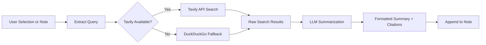

import TLDR from '@site/src/components/TLDR';

# Nghiên cứu và Tìm kiếm web

<TLDR>
**Notemd sẽ tìm kiếm trên web và chèn trực tiếp các kết quả được LLM tóm tắt vào ghi chú của bạn.** Tavily API là backend tìm kiếm chính; DuckDuckGo đóng vai trò là giải pháp dự phòng không cần cấu hình. Các kết quả được tóm tắt kèm theo nguồn trích dẫn và được thêm vào dưới tiêu đề `## Research`. Hỗ trợ nghiên cứu trong một ghi chú, nghiên cứu theo danh mục hàng loạt, và lựa chọn mô hình cho từng nhiệm vụ trong bước tóm tắt.

Đây là một phần của [Obsidian Hướng dẫn Quản lý Kiến thức AI](/docs/pillar-ai-knowledge).
</TLDR>

## Tổng quan

Nghiên cứu là một trong những tích hợp mạnh mẽ nhất của Notemd: nó kết nối các hoạt động đọc, tìm kiếm và viết lại với nhau. Thay vì chuyển sang trình duyệt để tìm kiếm một thuật ngữ chưa quen, bạn chỉ cần đánh dấu nó và để Notemd thực hiện việc tìm kiếm, tóm tắt và thêm kết quả vào – tất cả đều diễn ra trong kho lưu trữ của bạn.

Quy trình này hoàn toàn có thể được cấu hình. Bạn có thể chọn nhà cung cấp dịch vụ tìm kiếm, LLM sẽ viết bản tóm tắt, và quyết định xem kết quả sẽ được thêm vào ghi chú đang mở hay được lưu vào các tệp riêng biệt. Chế độ hàng loạt cho phép bạn nghiên cứu tất cả các ghi chú trong một thư mục chỉ với một cú nhấp.

## Cách thức hoạt động

### Quy trình Tìm kiếm rồi Tóm tắt



1. **Trích xuất truy vấn** -- Notemd sẽ trích xuất các từ khóa tìm kiếm từ phần được chọn hoặc tiêu đề ghi chú.
2. **Tìm kiếm web** -- Trước tiên sẽ thử sử dụng Tavily. Nếu không cấu hình khóa API nào, DuckDuckGo sẽ được sử dụng tự động (không cần khóa).
3. **Tóm tắt bằng LLM** -- Các kết quả tìm kiếm thô sẽ được gửi đến LLM đã được cấu hình, nơi này sẽ tạo ra một bản tóm tắt ngắn gọn kèm theo nguồn trích dẫn ngay trong văn bản.
4. **Thêm vào** -- Bản tóm tắt đã được định dạng sẽ được thêm vào dưới tiêu đề `## Research` trong ghi chú đang mở.

### Tavily so với DuckDuckGo

| Khía cạnh | Tavily | DuckDuckGo |
|--------|--------|------------|
| Khóa API | Cần thiết (có gói miễn phí) | Không cần thiết |
| Chất lượng kết quả | Cao hơn (được thiết kế riêng cho AI) | Đủ tốt cho các truy vấn thông thường |
| Giới hạn tần suất | Gói miễn phí rộng lớn | Bị giới hạn tốc độ |
| Cấu hình | `tavilyApiKey` trong cài đặt | Không cần cấu hình -- tự động chuyển sang phương án dự phòng |

### Nghiên cứu thư mục theo nhóm

Nhấp chuột phải vào thư mục và chọn **"Notemd: Thư mục nghiên cứu"**. Mỗi tệp `.md` trong thư mục sẽ được xử lý theo thứ tự (hoặc song song tùy theo mức độ đồng thời đã cấu hình). Mỗi ghi chú sẽ nhận được bản tóm tắt nghiên cứu riêng.

## Cấu hình

| Thiết lập | Mặc định | Tác động |
|---------|---------|--------|
| `tavilyApiKey` | `''` | Khóa Tavily API. Khi trống, chỉ sử dụng DuckDuckGo. |
| `researchProvider` / `researchModel` | DeepSeek | LLM mỗi nhiệm vụ để tóm tắt kết quả tìm kiếm |
| `maxResearchContentTokens` | `4000` | Ngân sách token cho nội dung được gửi đến LLM. Phần dư sẽ bị cắt bỏ. |
| `researchAppendToNote` | `true` | Thêm bản tóm tắt vào ghi chú nguồn. Nếu giá trị là false, sẽ tạo một tệp riêng. |
| `researchLanguage` | `'en'` | Ngôn ngữ đầu ra cho bản tóm tắt nghiên cứu |

### Khuyến nghị mô hình mỗi nhiệm vụ

Nghiên cứu được hưởng lợi từ một mô hình có thể xử lý nội dung đa ngôn ngữ và tạo ra văn bản có cấu trúc rõ ràng. Hãy xem xét:

- **DeepSeek** -- mặc định, giá cả phải chăng, chất lượng tốt
- **GPT-4o** -- khả năng tóm tắt chất lượng cao hơn, chi phí cao hơn
- **Gemini Flash** -- nhanh và rẻ, phù hợp cho các truy vấn đơn giản

## Ví dụ

Bạn đang đọc một bài báo về *cơ chế chú ý transformer* và gặp một thuật ngữ chưa quen: *relative positional encoding*. Thay vì để Obsidian:

1. Đánh dấu **"relative positional encoding"**
2. Nhấp chuột phải --> **"Notemd: Nghiên cứu và tóm tắt"**
3. Notemd tìm kiếm trên web, tóm tắt các kết quả hàng đầu và thêm vào:

```markdown
## Research

### Relative Positional Encoding

Relative positional encoding is a method used in transformer models
where positional information is expressed as relative distances between
tokens rather than absolute positions. Introduced by Shaw et al. (2018),
it improves generalization to unseen sequence lengths compared to
absolute encodings (Vaswani et al., 2017).

Sources:
- [Shaw et al., Self-Attention with Relative Position Representations (2018)](https://arxiv.org/abs/1803.02155)
- [Transformer Positional Encoding Overview](https://example.com/transformer-pos-enc)
```

Bản tóm tắt giờ đây đã trở thành một phần của kho lưu trữ của bạn, có thể tìm kiếm, liên kết và truy cập ngoại tuyến.

## Mẹo

- **Đặt một khóa Tavily để có kết quả tốt nhất** -- ngay cả gói miễn phí cũng mang lại độ liên quan tốt hơn so với DuckDuckGo nguyên bản.
- **Sử dụng mô hình tóm tắt mạnh mẽ** -- các mô hình rẻ tiền có thể làm mất đi chi tiết kỹ thuật tinh tế.
- **Nghiên cứu theo nhóm** sau khi đọc sơ bộ để lấp đầy các khoảng trống trong nhiều ghi chú cùng lúc.
- **Kiểm tra các bản tóm tắt được thêm vào** -- LLM có thể tạo ra thông tin nguồn sai lệch. Hãy xác minh các khẳng định quan trọng.

---

## Các bước tiếp theo

- [Concept Notes](./concept-notes) -- Trích xuất và lưu giữ các thuật ngữ chính từ kết quả nghiên cứu
- [Wiki-Links](./wiki-links) -- Liên kết các khái niệm có được từ nghiên cứu trong kho lưu trữ của bạn
- [Translation](./translation) -- Dịch các bản tóm tắt nghiên cứu sang ngôn ngữ khác
- [LLM Các nhà cung cấp](/docs/providers/overview) -- Cấu hình mô hình dùng để tóm tắt
