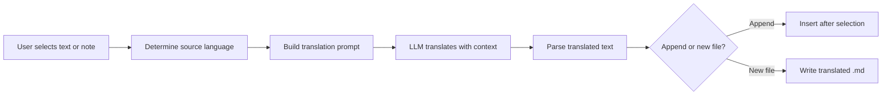

import TLDR from '@site/src/components/TLDR';

# Dịch thuật

<TLDR>
**Notemd dịch văn bản giữa hơn 21 ngôn ngữ nhờ công nghệ dịch của LLM.** Hỗ trợ dịch từng đoạn, dịch toàn bộ ghi chú và dịch theo toàn bộ thư mục. Mỗi nhiệm vụ dịch có thể sử dụng nhà cung cấp và mô hình riêng thông qua cài đặt cho từng nhiệm vụ. Ngôn ngữ đầu ra có thể được thiết lập riêng biệt so với ngôn ngữ UI. Kết quả sẽ được gắn thêm vào hoặc viết vào một tệp mới tùy theo sở thích của bạn.

Đây là một phần của [Obsidian Hướng dẫn Quản lý Kiến thức AI](/docs/pillar-ai-knowledge).
</TLDR>

## Tổng quan

Việc dịch bằng Notemd không phải là việc tra từ điển -- đó là dịch có nhận thức ngữ cảnh nhờ LLM. Mô hình xem toàn bộ đoạn văn hoặc ghi chú, giữ nguyên giọng văn, thuật ngữ chuyên ngành và cấu trúc câu. Điều này tạo ra kết quả chất lượng cao hơn so với các dịch vụ dịch từng cụm từ, đặc biệt đối với văn bản kỹ thuật, học thuật và sáng tạo.

Tính năng này hỗ trợ ba phạm vi: đoạn được chọn, ghi chú đang mở và toàn bộ thư mục. Kết hợp với việc chọn mô hình cho từng nhiệm vụ, bạn có thể sử dụng mô hình nhanh (Gemini Flash) cho các bản dịch thông thường và mô hình mạnh mẽ (Claude Sonnet) cho nội dung đòi hỏi sự tinh tế -- mà không cần thay đổi nhà cung cấp toàn cục.

## Cách thức hoạt động

### Lệnh Dịch



1. **Phát hiện nguồn ngôn ngữ** -- LLM suy luận ngôn ngữ gốc từ nội dung. Bạn không cần phải chỉ định nó thủ công.
2. **Xây dựng mệnh lệnh** -- Notemd tạo ra một mệnh lệnh bao gồm ngôn ngữ đích, gợi ý chuyên ngành tùy chọn và nội dung cần dịch.
3. **Dịch LLM** -- `translateProvider` / `translateModel` đã được cấu hình xử lý yêu cầu. Mô hình giữ nguyên định dạng markdown, liên kết wiki và khối mã.
4. **Kết quả** -- Văn bản đã dịch sẽ được gắn thêm phía dưới văn bản gốc hoặc viết vào một tệp mới trong kho lưu trữ.

### Các cặp ngôn ngữ

Notemd hỗ trợ bất kỳ cặp ngôn ngữ nào mà LLM ở phía sau hỗ trợ. Các cặp phổ biến bao gồm:

| Ngôn ngữ gốc | Mục tiêu | Chất lượng thông thường |
|--------|--------|----------------|
| Tiếng Anh | Tiếng Trung Giản Thể | Xuất sắc |
| Tiếng Trung | Tiếng Anh | Tuyệt vời |
| Tiếng Anh | Tiếng Nhật | Rất tốt |
| Tiếng Anh | Tiếng Đức / Tiếng Pháp / Tiếng Tây Ban Nha | Rất tốt |
| Bất kỳ ngôn ngữ nào được hỗ trợ | Bất kỳ ngôn ngữ nào được hỗ trợ | Tùy thuộc vào mô hình |

Cài đặt `translateLanguage` kiểm soát **ngôn ngữ đầu ra**. Ngôn ngữ nguồn sẽ được tự động phát hiện.

### Lựa chọn mô hình theo nhiệm vụ

Chất lượng dịch thuật thay đổi đáng kể tùy theo mô hình. Notemd cho phép bạn chỉ định một mô hình riêng dành riêng cho việc dịch thuật:

| Mô hình | Tốc độ | Chất lượng | Chi phí | Phù hợp nhất cho |
|-------|-------|--------|------|----------|
| `gemini-2.0-flash-exp` | Nhanh | Tốt | Thấp | Sử dụng thông thường, khối lượng lớn |
| `gpt-4o-mini` | Nhanh | Tốt | Thấp | Tìm kiếm nhanh |
| `deepseek-chat` | Trung bình | Tốt | Rất thấp | Dự án đa ngôn ngữ ngân sách thấp |
| `claude-3-5-sonnet` | Trung bình | Xuất sắc | Trung bình | Kỹ thuật / học thuật |
| `gpt-4o` | Trung bình | Xuất sắc | Trung bình | Văn bản nhạy cảm với sắc thái ngôn ngữ |

### Dịch toàn bộ thư mục theo lô

Nhấp chuột phải vào một thư mục và chọn **"Notemd: Dịch thư mục"** để dịch tất cả ghi chú trong thư mục đó. Mỗi tệp được xử lý riêng biệt. Thiết lập đồng thời kiểm soát số lượng tệp được dịch song song.

## Cấu hình

| Thiết lập | Mặc định | Tác động |
|---------|---------|--------|
| `translateProvider` / `translateModel` | DeepSeek | Nhà cung cấp chuyên dụng cho các nhiệm vụ dịch thuật |
| `translateLanguage` | `'en'` | Ngôn ngữ đầu ra mục tiêu |
| `translationAppendToNote` | `true` | Thêm văn bản đã dịch phía dưới văn bản gốc. Nếu đặt thành false, sẽ tạo một tệp mới. |
| `batchConcurrency` | `3` | Số lượng tệp được xử lý song song trong quá trình dịch theo lô |

## Ví dụ

Bạn đang đọc một ghi chú nghiên cứu bằng tiếng Trung và muốn có phiên bản bằng tiếng Anh:

1. Mở ghi chú
2. Nhấp chuột phải --> **"Notemd: Dịch tệp hiện tại"**
3. Notemd nhận diện tiếng Trung, dịch sang ngôn ngữ đích đã cấu hình (tiếng Anh) và thêm vào phía dưới:

```markdown
## Translation (English)

The experimental results show that the proposed method achieves
a 12% improvement in F1 score compared to the baseline, primarily
due to the enhanced feature extraction module described in Section 3.
```

Văn bản tiếng Trung gốc vẫn được giữ nguyên phía trên phần dịch. Tiêu đề `## Translation` giúp giữ cả hai phiên bản trong cùng một tệp để dễ tham khảo.

## Mẹo

- **Sử dụng Gemini Flash cho việc dịch số lượng lớn** -- đây là lựa chọn nhanh nhất và rẻ nhất cho việc dịch theo lô các thư mục lớn.
- **Giữ nguyên các liên kết wiki** -- Yêu cầu của Notemd hướng dẫn LLM phải giữ `[[wiki-links]]` nguyên vẹn trong quá trình dịch. Hãy kiểm tra lại sau khi dịch, vì một số mô hình đôi khi sẽ làm mất chúng.
- **Đặt rõ ngôn ngữ đầu ra** -- Việc tự động nhận diện hoạt động tốt với nguồn văn bản, nhưng luôn cấu hình `translateLanguage` để tránh sự mơ hồ về ngôn ngữ đích.
- **Dịch hàng loạt các ghi chú ý tưởng** -- Nếu thư mục ý tưởng của bạn được viết bằng một ngôn ngữ nào đó và bạn cần chuyển nó sang ngôn ngữ khác, việc dịch ở cấp độ thư mục sẽ xử lý điều này trong một bước duy nhất.

---

## Các bước tiếp theo

- [Nghiên cứu](./research) -- Tìm kiếm và tóm tắt bằng bất kỳ ngôn ngữ nào, sau đó dịch kết quả
- [Công việc](./workflows) -- Kết hợp dịch với liên kết wiki hoặc trích xuất ý tưởng
- [Xử lý hàng loạt](/docs/advanced/batch-processing) -- Chế độ đồng thời và hành vi ghi đè khi thao tác với thư mục
- [LLM Các nhà cung cấp](/docs/providers/overview) -- Chọn mô hình phù hợp nhất cho cặp ngôn ngữ của bạn
