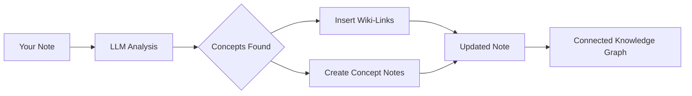

import TLDR from '@site/src/components/TLDR';

# Wiki-Links

<TLDR>
**Notemd sẽ tự động thêm `[[wiki-links]]` vào các khái niệm trong ghi chú của bạn.** LLM sẽ đọc nội dung, xác định các thuật ngữ quan trọng trong ngữ cảnh và chèn các liên kết wiki theo kiểu Obsidian tại mỗi lần xuất hiện. Nó cũng có thể tạo ra các tệp ghi chú khái niệm kèm theo liên kết ngược. Hỗ trợ việc loại bỏ từ đồng nghĩa, duy trì tính toàn vẹn của liên kết khi đổi tên hoặc xóa, và chế độ trích xuất thuần túy (không sửa đổi tệp). Khác với Auto Link chỉ ghép nối với các tiêu đề ghi chú hiện có, Notemd sử dụng AI để xác định các khái niệm mới và tạo ra các ghi chú tương ứng. Đây là một phần của [Obsidian Hướng dẫn Quản lý Kiến thức AI](/docs/pillar-ai-knowledge).
</TLDR>

## Tổng quan

Việc tạo liên kết wiki là tính năng cốt lõi của Notemd. Nó biến văn bản thông thường thành một đồ thị kiến thức có sự kết nối thông qua các bước sau:

1. **Phân tích ghi chú** của bạn bằng LLM
2. **Xác định các khái niệm chính** (từ ngữ, người, phương pháp, lý thuyết)
3. **Chèn `[[wiki-links]]`** tại mỗi lần xuất hiện
4. **Tạo ghi chú khái niệm** (tùy chọn) kèm theo liên kết ngược

## Cách thức hoạt động

### Quy trình



### Ví dụ

**Trước khi xử lý:**
```markdown
Machine learning models use neural networks to learn patterns from data.
The transformer architecture revolutionized natural language processing.
```

**Sau khi xử lý:**
```markdown
[[Machine learning]] models use [[neural networks]] to learn patterns from data.
The [[transformer architecture]] revolutionized [[natural language processing]].
```

## Cách sử dụng

### Cơ bản: Thêm liên kết vào ghi chú hiện tại

1. Mở một ghi chú
2. Nhấp chuột phải trong trình soạn thảo → **"Xử lý tệp (thêm liên kết)"**
3. Chờ vài giây
4. Các khái niệm giờ đã được liên kết rồi!

### Nhóm xử lý: Xử lý nhiều ghi chú

1. Nhấp chuột phải vào một thư mục trong File Explorer
2. Chọn **"Notemd: Xử lý thư mục (thêm liên kết)"**
3. Cấu hình:
   - Độ đồng thời (số tệp được xử lý song song)
   - Ghi đè các liên kết hiện có (có/không)
4. Nhấp **Xử lý**

### Chọn lọc: Liên kết văn bản cụ thể

1. Đánh dấu văn bản cần xử lý
2. Nhấp chuột phải → **"Xử lý phần được đánh dấu (thêm liên kết)"**
3. Chỉ phần được đánh dấu mới được phân tích

## Notemd so với Tự động liên kết

Obsidian có hai phương pháp tạo liên kết wiki tự động:

| | **Tự động liên kết** | **Notemd** |
|--|---------------|-------------|
| Nguồn liên kết | Tên ghi chú hiện có trong kho lưu trữ | Các khái niệm được LLM xác định trong nội dung |
| Có thể liên kết các khái niệm mới | Không — tiêu đề đã phải tồn tại rồi | Có — AI xác định các khái niệm và tạo ghi chú |
| Xử lý từ đồng nghĩa | Không | Có — ức chế từ đồng nghĩa |
| Tạo ghi chú khái niệm | Không | Có — kèm theo liên kết ngược và loại bỏ trùng lặp |
| Xử lý theo lô | Không (tệp đơn) | Có (ở cấp thư mục) |
| Định tuyến mô hình theo nhiệm vụ | Không | Có |

**Auto Link** dựa trên việc so khớp tiêu đề: nếu có ghi chú tên là "Machine Learning" thì nó sẽ bao bọc các lần xuất hiện trong `[[Machine Learning]]`. Nếu không có ghi chú nào thì không xảy ra gì.

**Notemd** được điều khiển bởi AI: LLM đọc nội dung của bạn, hiểu ngữ cảnh, xác định các khái niệm *nên* được liên kết — ngay cả khi chưa có ghi chú nào — và tạo cả liên kết lẫn ghi chú khái niệm.

## Tính năng

### Ức chế từ đồng nghĩa

**Vấn đề:** "transformer", "transformers", "Transformer architecture" → 3 khái niệm riêng biệt

**Giải pháp:** Notemd phát hiện các dữ liệu gần giống nhau và sử dụng dạng chuẩn hóa.

**Cấu hình:**
```
Settings → Advanced → Synonym Suppression
Threshold: 0.8 (0 = off, 1 = aggressive)
```

### Tính toàn vẹn của liên kết

**Khi bạn đổi tên ghi chú khái niệm:**
- Tất cả các liên kết wiki sẽ được cập nhật tự động (Obsidian tính năng cốt lõi)
- Các liên kết ngược vẫn giữ nguyên

**Khi bạn xóa ghi chú khái niệm:**
- Các liên kết vẫn tồn tại nhưng hiển thị là "các đề cập không có liên kết"
- Bạn có thể tạo lại từ bất kỳ lần xuất hiện nào

### Chế độ trích xuất thuần túy

**Trích xuất các khái niệm mà không sửa đổi tài liệu gốc:**

1. Nhấp chuột phải → **"Trích xuất các khái niệm (không liên kết)"**
2. Các ghi chú khái niệm được tạo ra
3. Tập tin gốc không bị thay đổi

Trường hợp sử dụng: Xử lý nội dung chỉ đọc hoặc bản thảo cuối cùng.

## Tạo ghi chú khái niệm

### Tạo tự động

**Khi được bật (mặc định), Notemd tạo ra:**

```markdown
---
tags: [concept, auto-generated]
created: 2026-06-13
source: [[Original Note Name]]
---

# Machine Learning

A branch of artificial intelligence that enables computers
to learn from data without explicit programming.

## Occurrences in Your Vault

- [[Original Note Name#Section]]
- [[Another Note#Header]]

## Related Concepts

- [[Neural Networks]]
- [[Deep Learning]]
- [[Supervised Learning]]
```

### Cấu hình

**Thư mục đầu ra:**
```
Settings → Output → Concept Folder
Default: concepts/
```

**Cấu trúc phân cấp:**
```
Settings → Output → Use Hierarchical Folders
If enabled:
  papers/my-paper.md → papers/concepts/Concept.md
If disabled:
  → concepts/Concept.md
```

**Mẫu:**
```
Settings → Output → Concept Template
Customize with variables:
  {{concept}} — Concept name
  {{description}} — LLM-generated description
  {{backlinks}} — List of source notes
  {{date}} — Creation date
```

## Tùy chọn nâng cao

### Cửa sổ ngữ cảnh

**Số lượng văn bản xung quanh cần gửi:**

```
Settings → Linking → Context Window
Options: Sentence | Paragraph | Full Note
Default: Paragraph
```

Số lượng lớn = độ chính xác cao hơn, chi phí cao hơn.

### Số lần xuất hiện tối thiểu

**Chỉ liên kết các khái niệm xuất hiện nhiều lần:**

```
Settings → Linking → Min Occurrences
Default: 1 (link all)
```

Đặt thành 2 hoặc 3 để tập trung vào các chủ đề lặp lại.

### Loại trừ mẫu

**Bỏ qua một số từ:**

```
Settings → Linking → Exclude List
Example: note, idea, example, thing
```

Ngăn việc liên kết quá mức các thuật ngữ chung.

### Các mẫu yêu cầu tùy chỉnh

**Đặt lại hướng dẫn mặc định của LLM:**

```
Settings → Advanced → Custom Linking Prompt
Default:
  "Identify key concepts, theories, methods, and technical
   terms in the following text. Return as a list..."
```

Thay đổi để phù hợp với nhu cầu cụ thể của lĩnh vực (ví dụ: "Tập trung vào thuật ngữ y khoa").

## Mẹo và Thực tiễn tốt nhất

### ✅ NÊN làm

- **Xử lý ghi chú có hơn 100 từ** — Các ghi chú ngắn sẽ cho ít khái niệm hơn
- **Sử dụng các mô hình mạnh mẽ** để nhận diện khái niệm tốt hơn (GPT-4o, Claude)
- **Kiểm tra lại trước khi chấp nhận** — Xem xét các liên kết được đề xuất có hợp lý không
- **Xây dựng theo từng bước** — Xử lý 5-10 ghi chú, xem xét sơ đồ, điều chỉnh cài đặt

### ❌ KHÔNG nên làm

- **Liên kết quá mức** — Không phải mọi danh từ đều cần có liên kết
- **Xử lý bản thảo nhiều lần** — Các khái niệm có thể thay đổi, hãy chờ cho đến khi ổn định
- **Bỏ qua từ đồng nghĩa** — Bật chức năng ức chế để tránh sự khác biệt giữa "ML" và "Machine Learning"

## Hiệu suất

### Tốc độ

| Kích thước ghi chú | GPT-4o-mini | Claude Sonnet | Ollama (local) |
|-----------|-------------|---------------|----------------|
| 500 từ | 2-3 giây | 3-5 giây | 5-10 giây |
| 2000 từ | 5-8 giây | 10-15 giây | 20-40 giây |
| 5000+ từ | Chia thành từng phần (nhiều lần gọi) | Được chia thành từng phần | Được chia thành từng phần |

### Ước tính chi phí

**Ví dụ: Ghi chú 1000 từ với GPT-4o-mini**
- Đầu vào: ~1500 token
- Kết quả: ~200 token
- Chi phí: ~

**Xử lý theo lô 100 ghi chú:** khoảng $0.10

## Khắc phục sự cố

### Không có liên kết nào được thêm vào

**Kiểm tra:**
1. LLM gọi đã thành công (Settings → Diagnostics)
2. Ghi chú đã có đủ nội dung (hơn 50 từ)
3. Các khái niệm là kỹ thuật/cụ thể (không chỉ là đại từ)

**Thử:**
- Sử dụng mô hình mạnh hơn
- Tăng kích thước cửa sổ ngữ cảnh
- Kiểm tra tính hợp lệ của khóa API

### Quá nhiều liên kết

**Giải pháp:**
1. Tăng số lần xuất hiện tối thiểu (2 hoặc 3)
2. Thêm các từ phổ biến vào danh sách loại trừ
3. Sử dụng mô hình ít hung hăng hơn

### Các khái niệm liên kết bị sai

**Các cập nhật:**
1. Sử dụng mẫu yêu cầu tùy chỉnh để tăng độ chuyên biệt cho miền
2. Kích hoạt việc ức chế từ đồng nghĩa
3. Xem xét thủ công và gỡ liên kết

### Liên kết bị hỏng sau khi đổi tên

**Đây là hành vi bình thường Obsidian.**

Để cập nhật tất cả các liên kết:
1. Đổi tên ghi chú khái niệm
2. Obsidian sẽ tự động cập nhật `[[old]]` thành `[[new]]`

---

## Các bước tiếp theo

- 📖 [Ghi chú khái niệm](./concept-notes) — Tìm hiểu sâu về việc tạo ghi chú khái niệm
- 🔍 [Tích hợp nghiên cứu](./research) — Kết hợp việc liên kết với nghiên cứu trên web
- 🎨 [Sơ đồ](./diagrams) — Trực quan hóa đồ thị kiến thức của bạn
