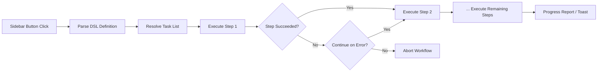

import TLDR from '@site/src/components/TLDR';

# Công việc theo dây chuyền

<TLDR>
**Notemd Các công việc theo dây chuyền kết hợp nhiều nhiệm vụ thành một thao tác nhấp một lần duy nhất.** Bạn có thể định nghĩa trình tự như `add-links > extract-concepts > research > diagram` bằng một ngôn ngữ kịch bản đơn giản. Các công việc theo dây chuyền hiển thị dưới dạng các nút ở thanh bên, chạy toàn bộ chuỗi thao tác trên ghi chú hoặc thư mục hiện tại. Phần mềm đi kèm với các công việc theo dây chuyền đã được định nghĩa sẵn; bạn có thể tạo các công việc theo dây chuyền tùy chỉnh trong phần cài đặt. Mỗi bước sử dụng cấu hình mô hình riêng cho từng nhiệm vụ.

Đây là một phần của [Obsidian Hướng dẫn Quản lý Kiến thức AI](/docs/pillar-ai-knowledge).
</TLDR>

## Tổng quan

Một công việc theo dây chuyền loại bỏ sự phiền toái khi phải thực hiện các nhiệm vụ từng cái một. Thay vì nhấp chuột phải bốn lần để thêm liên kết, trích xuất khái niệm, tìm kiếm các thuật ngữ chưa quen thuộc và tạo sơ đồ, bạn chỉ cần nhấn một nút ở thanh bên và toàn bộ chuỗi thao tác sẽ được thực thi. Notemd sẽ xử lý việc sắp xếp trình tự, truyền lỗi và báo cáo tiến độ.

Các công việc theo dây chuyền được định nghĩa bằng một ngôn ngữ kịch bản nhẹ (ngôn ngữ chuyên dụng cho lĩnh vực). Chúng nằm trong phần cài đặt, hiển thị dưới dạng các nút có thể nhấp ở thanh bên Obsidian, và có thể được áp dụng cho ghi chú hiện tại hoặc toàn bộ thư mục.

## Cách thức hoạt động

### Đường ống thực thi công việc theo dây chuyền



1. **Giải mã** -- Chuỗi ngôn ngữ kịch bản được chia theo `>` (hoặc `>`) thành danh sách có trình tự các định danh nhiệm vụ.
2. **Xác định** -- Mỗi định danh được ánh xạ tới một lệnh nội bộ (add-links, extract-concepts, research, translate, diagram, v.v.).
3. **Thực thi** -- Các bước được chạy theo trình tự. Mỗi bước sử dụng nhà cung cấp và mô hình được cấu hình riêng cho nhiệm vụ đó.
4. **Xử lý lỗi** -- Nếu một bước thất bại, công việc theo dây chuyền sẽ dừng lại hoặc tiếp tục sang bước tiếp theo, tùy theo chính sách xử lý lỗi của bạn.
5. **Hoàn tất** -- Một thông báo hiện lên báo cáo kết quả thành công hoặc liệt kê các bước thất bại.

### Định dạng ngôn ngữ kịch bản

Các công việc theo dây chuyền được định nghĩa là một chuỗi các định danh nhiệm vụ được tách bằng `>`:

```
process-current-add-links>extract-concepts-current>research-and-summarize
```

**Các định danh nhiệm vụ có sẵn:**

| Định danh | Hành động |
|------------|--------|
| `process-current-add-links` | Thêm các liên kết wiki vào ghi chú đang hoạt động |
| `extract-concepts-current` | Trích xuất các khái niệm từ ghi chú đang hoạt động |
| `research-and-summarize` | Nghiên cứu văn bản hoặc tiêu đề ghi chú đã chọn |
| `process-current-translate` | Dịch ghi chú đang hoạt động |
| `summarize-to-mermaid` | Tạo sơ đồ từ ghi chú đang hoạt động |
| `generate-from-title` | Tạo nội dung từ tiêu đề ghi chú |
| `extract-original-text` | Trích xuất văn bản gốc (để sử dụng OCR / nội dung được quét) |

**Các biến thể ở cấp thư mục** thay thế `current` bằng `folder` trong tên định danh.

### Quy trình làm việc có sẵn so với quy trình tùy chỉnh

Notemd đi kèm với các quy trình làm việc đã được chuẩn bị sẵn cho các mẫu phổ biến:

| Quy trình làm việc | Chuỗi | Trường hợp sử dụng |
|----------|-------|----------|
| **Trích xuất một cú nhấp** | thêm-liên-kết > trích-xuất-khái-niệm > nghiên-cứu | Xử lý một bài báo nghiên cứu trong một lần duy nhất |
| **Toàn bộ chuỗi xử lý** | thêm-liên-kết > trích-rút-khái-niệm > nghiên-cứu > sơ-đồ | Hoàn tất việc trích rút kiến thức kèm theo trực quan hóa |
| **Dịch + Liên kết** | dịch > thêm-liên-kết | Dịch rồi liên kết các khái niệm bằng ngôn ngữ mục tiêu |

**Các công việc tự định** được tạo trong phần cài đặt:

1. Mở **Cài đặt** --> **Notemd** --> **Công việc**
2. Nhấp vào **"Thêm Công việc"**
3. Nhập chuỗi DSL (ví dụ: `process-current-add-links>extract-concepts-current`)
4. Đặt tên hiển thị cho nó (ví dụ: "Liên kết Nhanh + Trích rút")
5. Nút mới sẽ xuất hiện ngay trong thanh bên

## Cấu hình

| Thiết lập | Mặc định | Tác động |
|---------|---------|--------|
| `workflows` | Bộ định nghĩa sẵn có | Danh sách các định nghĩa công việc (tên + DSL) |
| `workflowContinueOnError` | `true` | Tiếp tục sang bước tiếp theo nếu bước hiện tại thất bại |
| `workflowShowProgress` | `true` | Hiển thị thông báo tiến trình sau mỗi bước hoàn thành |

### Các Mô hình theo Nhiệm vụ trong Công việc

Mỗi bước trong một workflow sử dụng cấu hình mô hình riêng cho từng nhiệm vụ. Bạn không cần phải chỉ định các mô hình trong chính DSL. Thứ tự xử lý là:

1. Nhà cung cấp/mô hình riêng cho nhiệm vụ nếu `useMultiModelSettings` được sử dụng
2. `activeProvider` toàn cục nếu không

Điều này có nghĩa là `add-links` có thể chạy trên DeepSeek trong khi `research` chạy trên GPT-4o -- tất cả đều diễn ra trong cùng một workflow click.

## Ví dụ

Bạn vừa nhập một PDF của một bài báo học máy vào kho lưu trữ của mình và muốn trích xuất toàn bộ kiến thức:

1. Mở ghi chú đã nhập
2. Nhấp vào nút bên cạnh **"Full Pipeline"**
3. Notemd sẽ thực thi các bước sau:
   - **Bước 1**: Thêm các liên kết wiki -- `[[attention mechanism]]`, `[[transformer]]`, v.v.
   - **Bước 2**: Trích xuất các khái niệm -- tạo các ghi chú khái niệm trong thư mục khái niệm của bạn
   - **Bước 3**: Nghiên cứu -- tóm tắt các nguồn trên web cho các từ khóa chính
   - **Bước 4**: Vẽ sơ đồ -- tạo một Mermaid mindmap về cấu trúc của bài báo
4. Sau khoảng 30 giây, ghi chú của bạn sẽ có các liên kết, các ghi chú khái niệm sẽ được tạo ra, phần nghiên cứu sẽ được thêm vào và một tập tin sơ đồ sẽ được lưu lại

Tất cả chỉ với một cú nhấp chuột.

## Mẹo

- **Bắt đầu với các workflow đã định nghĩa sẵn** -- chúng bao phủ các mô hình phổ biến nhất. Chỉ tùy chỉnh khi bạn cần trình tự khác.
- **Kích hoạt `workflowContinueOnError`** -- việc thất bại ở bước vẽ sơ đồ không nên làm gián đoạn toàn bộ pipeline.
- **Sử dụng công việc thư mục** để xử lý hàng loạt -- nhấp chuột phải vào một thư mục, chọn công việc, và mọi ghi chú sẽ được xử lý.
- **Đặt tên công việc một cách rõ ràng** -- không gian ở thanh bên là có hạn. Hãy dùng những tên ngắn, hướng đến hành động như "Trích xuất nhanh" hoặc "Dịch + Liên kết".

---

## Các bước tiếp theo

- [Nghiên cứu](./research) -- Hiểu rõ chức năng của bước nghiên cứu trước khi thêm nó vào các công việc
- [Liên kết Wiki](./wiki-links) -- Tính năng liên kết cốt lõi được sử dụng trong hầu hết các công việc
- [Ghi chú khái niệm](./concept-notes) -- Trích xuất khái niệm như một bước trong công việc
- [Xử lý theo lô](/docs/advanced/batch-processing) -- Đồng thời xử lý và báo cáo tiến trình cho các công việc thư mục
