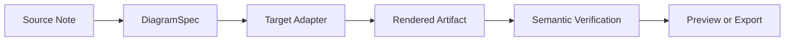
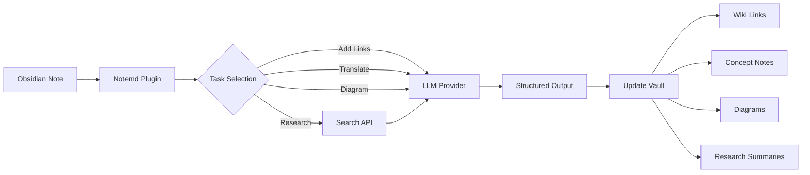

import TLDR from '@site/src/components/TLDR';

# Giới thiệu về Notemd

<TLDR>
**Notemd** (Note + EMD — Enhanced Markdown Documents) là một plugin mã nguồn mở cho Obsidian giúp chuyển đổi việc đọc nội dung dựa trên LLM thành kiến thức bền vững. Khác với AI dựa trên trò chuyện mà các thông tin chỉ tồn tại trong suốt phiên, Notemd ghi lại kết quả **trực tiếp vào kho lưu trữ của bạn** dưới dạng liên kết wiki, ghi chú khái niệm, tóm tắt nghiên cứu, bản dịch, quy trình làm việc và sơ đồ. Nó được thiết kế dành cho các nhà nghiên cứu, sinh viên và nhân viên chuyên về kiến thức muốn tích lũy việc đọc, nghiên cứu và giải thích bằng hình ảnh thành một đồ thị kiến thức có cấu trúc và liên tục phát triển.
</TLDR>

## Notemd là gì?

Notemd tích hợp **hơn 30 mô hình ngôn ngữ lớn** (OpenAI, Anthropic, Google, DeepSeek, Qwen, Ollama và nhiều mô hình khác) vào quy trình làm việc của Obsidian để tự động hóa việc trích xuất kiến thức, sắp xếp, dịch thuật, nghiên cứu và tạo sơ đồ.

### Sự khác biệt chính: Kiến thức tạm thời so với kiến thức bền vững

| Khía cạnh | AI dựa trên trò chuyện (ChatGPT, v.v.) | Notemd |
|--------|-------------------------------|--------|
| **Nơi lưu trữ kết quả** | Lịch sử trò chuyện (biến mất) | Kho lưu trữ Obsidian của bạn (tồn tại mãi) |
| **Định dạng** | Trả lời dạng văn bản thông thường | Các tệp có cấu trúc: `[[wiki-links]]`, ghi chú khái niệm, sơ đồ |
| **Giá trị lâu dài** | Phải hỏi lại mỗi lần | Tích lũy thành một đồ thị kiến thức |
| **Truy cập ngoại tuyến** | Yêu cầu kết nối Internet | Hoạt động hoàn toàn ngoại tuyến với Ollama |

## Các tính năng cốt lõi

### 1. **Liên kết Wiki tự động**
- LLM xác định các khái niệm chính trong ghi chú của bạn
- Chèn `[[wiki-links]]` vào mỗi lần xuất hiện
- Tùy chọn tạo ghi chú khái niệm có liên kết
- Ứng dụng chức năng ức chế từ đồng nghĩa để tránh trùng lặp

### 2. **Tạo ghi chú khái niệm**
- Trích xuất các khái niệm cốt lõi từ bài báo, bài viết, ghi chú
- Tạo các tệp khái niệm riêng biệt kèm theo liên kết ngược
- Đường dẫn đầu ra và mẫu có thể tùy chỉnh

### 3. **Tích hợp nghiên cứu trên web**
- Tra cứu Tavily hoặc DuckDuckGo ngay trong Obsidian
- LLM tóm tắt kết quả kèm theo trích dẫn nguồn
- Thêm kết quả nghiên cứu vào ghi chú hiện tại

### 4. **Dịch đa ngôn ngữ**
- Dịch các phần được chọn hoặc toàn bộ ghi chú
- Hỗ trợ hơn 21 UI ngôn ngữ
- Cấu hình ngôn ngữ đầu ra độc lập
- Hỗ trợ dịch theo nhóm

### 5. **Tạo sơ đồ**
- **Mermaid**: Sơ đồ luồng, trình tự, lớp, trạng thái, ER, Gantt
- **JSON Canvas**: Bố cục gốc Obsidian
- **Vega-Lite**: Biểu đồ dữ liệu, chuỗi thời gian, biểu đồ phân tán
- **HTML / HTML có thể chỉnh sửa/SVG**: Các tài liệu hình ảnh tự chứa với chú thích ngữ nghĩa
- **Draw.io / Ranh giới tài liệu Drawnix**: Đường dẫn xuất dành cho người bảo trì từ cùng mô hình hình ảnh ngữ nghĩa
- **Định hướng sơ đồ mạch điện**: Hỗ trợ circuitikz/TikZJax đang được thiết kế dựa trên các tài liệu tham khảo vàng, các mệnh lệnh có giới hạn, phản hồi hiển thị và xác thực cấu trúc/bố cục thay vì sử dụng TikZ nguyên thủy không bị giới hạn
- **Chẩn đoán xem trước**: Các tài liệu được hiển thị có thể hiển thị thông tin chẩn đoán về quá trình biên dịch/hiển thị, và các nguồn không nằm trong dòng có thể được kiểm tra mà không cần môi trường LaTeX chạy bên phía plugin
- Sửa tự động cú pháp cho lỗi Mermaid

### 6. **Các quy trình một cú nhấp**
- Kết nối nhiều thao tác thành các nút bên thanh điều hướng
- Định nghĩa luồng công việc dựa trên DSL
- Ví dụ: `add-links > extract-concepts > research > diagram`

## Ai nên sử dụng Notemd?

✅ **Các nhà nghiên cứu** đọc bài báo và xây dựng bản tóm tắt tài liệu
✅ **Học sinh** sắp xếp ghi chú học tập và tạo bản đồ khái niệm
✅ **Nhân viên chuyên môn** muốn lưu trữ những hiểu biết sau khi đọc
✅ **Các chuyên gia song ngữ** cần dịch thuật và liên kết wiki
✅ **Người dùng quan tâm đến bảo mật** muốn hỗ trợ LLM tại chỗ (Ollama)
✅ **Người dùng nâng cao** tự tùy chỉnh các mẫu lệnh và luồng công việc

## Tại sao lại là Notemd + Obsidian?

**Obsidian** là cơ sở kiến thức dựa trên markdown, ưu tiên sử dụng tại chỗ. **Notemd** mang lại những tính năng mạnh mẽ của AI:
- Dữ liệu của bạn vẫn nằm trong kho lưu trữ riêng của bạn (không phải dịch vụ đám mây)
- Hoạt động ngoại tuyến với các mô hình tại chỗ
- Miễn phí và mã nguồn mở (giấy phép MIT)
- Tích hợp với các tiện ích mở rộng Obsidian hiện có
- Mở rộng lên hàng chục nghìn ghi chú

## Bắt đầu sử dụng

1. **Cài đặt**: Cài đặt → Các tiện ích mở rộng cộng đồng → Duyệt → "Notemd"
2. **Cấu hình**: Thêm khóa API của nhà cung cấp LLM của bạn (hoặc sử dụng Ollama cục bộ)
3. **Thử nghiệm**: Mở một ghi chú → Nhấp chuột phải → "Xử lý tập tin (thêm liên kết)"
4. **Khám phá**: Kiểm tra thanh bên để xem các công việc một cú nhấp

👉 [Hướng dẫn cài đặt](./getting-started/installation) | [Hướng dẫn nhanh](./getting-started/quick-start)

## Hướng phát triển của chức năng sơ đồ

Công việc về sơ đồ của Notemd đang chuyển từ việc "yêu cầu mô hình viết một chuỗi cú pháp" sang một pipeline có nhiều tầng:

Phiên bản hiện tại đã hỗ trợ Mermaid, JSON Canvas, Vega-Lite, chế độ dự phòng HTML, HTML/SVG có thể chỉnh sửa, các tài liệu Draw.io XML, tập hợp nhỏ Drawnix JSON, chế độ dự phòng chỉ xem trước và kiểm tra nguồn, cùng mẫu nguyên mẫu ngoại tuyến `CircuitSpec -> circuitikz` cho các mẫu vàng của nguồn thông thường và bộ inverter CMOS. Các sơ đồ mạch điện là loại khó hơn: circuitikz có thể biểu diễn cấu trúc điện tử chính xác, nhưng kết quả LLM không bị giới hạn thường tạo ra đường dẫn khó đọc hoặc LaTeX không thể hiển thị. Hướng tiếp theo là duy trì sự kiểm soát circuitikz bằng các mẫu vàng tham chiếu, quy tắc bố trí lưới nút, kiểm tra khi in ấn và vòng phản hồi từ ảnh chụp màn hình.

Đọc chi tiết tại [Sơ đồ](./features/diagrams).

## Kiến trúc

## Notemd so với các tiện ích mở rộng AI Obsidian khác

Hầu hết các tiện ích mở rộng AI Obsidian đều ưu tiên trò chuyện (bạn hỏi, AI trả lời, thông tin được giữ trong cuộc trò chuyện). Notemd thì **ưu tiên viết**: AI xử lý các ghi chú của bạn và viết kết quả có cấu trúc trực tiếp vào kho lưu trữ của bạn.

| Khả năng | Notemd | Copilot | Smart Connections | Text Generator |
|-----------|--------|---------|-------------------|-----------------|
| Chèn liên kết wiki tự động | Có | Không | Không | Không |
| Tạo ghi chú ý tưởng | Có (kèm liên kết ngược + loại bỏ trùng lặp) | Không | Không | Không |
| Tạo sơ đồ | Có (Mermaid, Canvas, Vega-Lite, HTML, các tài liệu có thể chỉnh sửa) | Không | Không | Không |
| Tích hợp nghiên cứu web | Có (Tavily + DuckDuckGo) | Không | Không | Không |
| Xử lý thư mục theo nhóm | Có | Hạn chế | Không | Hạn chế |
| Định tuyến mô hình theo nhiệm vụ | Có (7 nhiệm vụ, các mô hình độc lập) | Không | Không | Không |
| Chuỗi công việc một cú nhấp | Có (DSL) | Không | Không | Không |
| Dịch thuật (theo nhóm) | Có | Không | Không | Không |
| Trò chuyện với kho dữ liệu | Không | Có | Không | Không |
| Tìm kiếm tương đồng ngữ nghĩa | Không | Không | Có | Không |
| Tạo nội dung dựa trên mẫu | Không | Không | Không | Có |
| Các nhà cung cấp LLM | 36 (đám mây + cổng kết nối + cục bộ) | 3-5 | 2-3 | 3-5 |
| Hoạt động hoàn toàn ngoại tuyến | Có (Ollama) | Một phần | Một phần | Một phần |

**Khi nào nên chọn Notemd**: Bạn muốn AI xây dựng một đồ thị kiến thức bền vững — chứ không chỉ trò chuyện về ghi chú của bạn.

**Khi nào nên chọn Copilot**: Bạn muốn một trợ lý AI có khả năng trò chuyện bên trong Obsidian.

**Khi nào nên chọn Smart Connections**: Bạn muốn phát hiện các mối quan hệ hiện có giữa các ghi chú thông qua tìm kiếm ngữ nghĩa.

## Triết lý

**Notemd tin rằng AI nên hỗ trợ công việc tạo kiến thức của con người, chứ không thay thế nó.** Tiện ích mở rộng này:
- Giúp bạn kiểm soát tình hình (xem xét trước khi áp dụng thay đổi)
- Bảo tồn ngữ cảnh (tất cả kết quả đều liên kết lại với nguồn gốc)
- Tôn trọng quyền riêng tư (hỗ trợ LLM ở mức cục bộ, không thu thập dữ liệu từ xa)
- Vẫn có thể mở rộng (các giao diện mở APIs, quy trình làm việc tùy chỉnh)

## Phần mềm nguồn mở

- **Giấy phép**: MIT
- **Nguồn mã**: [github.com/Jacobinwwey/obsidian-NotEMD](https://github.com/Jacobinwwey/obsidian-NotEMD)
- **Cộng đồng**: [Discord](https://discord.gg/qnGgsQ9W) | [GitHub Discussions](https://github.com/Jacobinwwey/obsidian-NotEMD/discussions)
- **Đóng góp**: Chào đón các PR, xem [CONTRIBUTING.md](https://github.com/Jacobinwwey/obsidian-NotEMD/blob/main/CONTRIBUTING.md)

---

**Tiếp theo**: [Installation →](./getting-started/installation)
