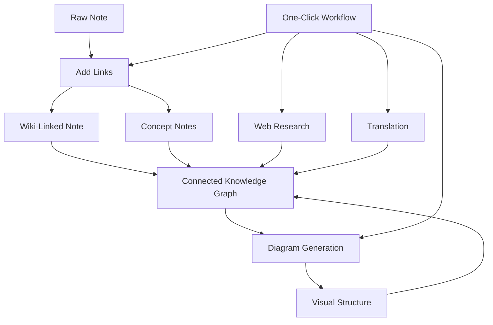

import TLDR from '@site/src/components/TLDR';

# Obsidian Hướng dẫn Quản lý Kiến thức AI

<TLDR>
**Notemd biến việc đọc dựa trên LLM thành kiến thức bền vững: liên kết wiki kết nối các khái niệm, ghi chú khái niệm tạo ra một đồ thị có thể truy xuất, nghiên cứu đưa nội dung web vào kho lưu trữ của bạn, dịch thuật phá vỡ rào cản ngôn ngữ, sơ đồ làm cho cấu trúc trở nên hiển thị, và các công việc luồng kết hợp tất cả chỉ với một cú nhấp.** Hướng dẫn này bao phủ toàn bộ quy trình — từ ghi chú thô đến một cơ sở kiến thức kết nối, trực quan và đa ngôn ngữ.
</TLDR>

## Tại sao lại quản lý kiến thức bằng AI?

Việc ghi chú truyền thống tạo ra các tệp đơn giản. Ngay cả khi có liên kết wiki thủ công, hầu hết các ghi chú vẫn còn tách rời. Notemd sử dụng LLM để tự động hóa lớp kết nối:

- **LLMs đọc nội dung của bạn** và xác định những điều quan trọng — thuật ngữ, phương pháp, người, lý thuyết
- **Liên kết được chèn tự động** tại mỗi lần xuất hiện khái niệm, không bị giấu trong mục "xem thêm"
- **Ghi chú khái niệm được tạo ra** dưới dạng các tệp có thể truy xuất độc lập
- **Nghiên cứu làm giàu ghi chú** bằng ngữ cảnh từ web
- **Sơ đồ làm cho cấu trúc trở nên hiển thị** — sơ đồ tư duy, biểu đồ luồng, biểu đồ dữ liệu từ cùng một nội dung

Kết quả: một đồ thị kiến thức phát triển theo từng ghi chú bạn xử lý, chứ không chỉ khi bạn nhớ thêm liên kết.

## Toàn bộ quy trình



Mỗi bước đều độc lập. Bạn có thể sử dụng một hoặc tất cả. Trình tự mang lại hiệu quả cao nhất: **Thêm Liên kết → Ghi chú Khái niệm → Sơ đồ**.

---

## 1. Liên kết wiki: Làm rõ các mối kết nối

Liên kết wiki là xương sống của đồ thị kiến thức. Notemd sử dụng một LLM để:

1. Đọc nội dung ghi chú của bạn (chia thành các phần cho các tài liệu dài)
2. Xác định các khái niệm cốt lõi — ưu tiên các thuật ngữ kỹ thuật cụ thể hơn là các danh từ chung
3. Chèn `[[wiki-links]]` vào mỗi lần xuất hiện
4. Ứng chế các từ đồng nghĩa để "ML" và "Machine Learning" không tạo ra các nút riêng biệt

### Khi nào nên sử dụng

- **Mọi ghi chú >100 từ** — các ghi chú ngắn hơn sẽ cho ít khái niệm hơn
- **Các bài báo nghiên cứu, tài liệu kỹ thuật, ghi chú cuộc họp** — giàu các thuật ngữ chuyên ngành
- **Sau khi nội dung đã ổn định** — đừng xử lý lại các bản thảo nhiều lần

### Cài đặt chính

| Thiết lập | Khuyến nghị | Lý do |
|---------|-----------|-----|
| `addLinksProvider` | DeepSeek hoặc GPT-4o-mini | Độ chính xác tốt với chi phí thấp |
| Ứng chế từ đồng nghĩa | Bật | Ngăn chặn các nút trùng lặp |
| Cửa sổ ngữ cảnh | Đoạn văn | Cân bằng giữa độ chính xác và chi phí |

→ [Wiki-Links deep dive](/docs/features/wiki-links)

---

## 2. Ghi chú khái niệm: Các nút kiến thức có thể truy xuất được

Các liên kết wiki kết nối các ý tưởng ngay trong văn bản, nhưng ghi chú khái niệm giúp mỗi ý tưởng có thể được truy xuất một cách độc lập. Mỗi khái niệm sẽ có file `.md` riêng của mình:

```markdown
# Machine Learning

## Linked From
- [[My Research Notes]]
- [[Neural Networks Explained]]
```

### Quy trình trích xuất

Mẫu lệnh LLM được thiết kế rất có cấu trúc:
- Chuyển sang dạng số ít
- Ưu tiên các khái niệm gồm nhiều từ thay vì các từ đơn lẻ ("Dielectric Relaxation" chứ không phải "Relaxation")
- Bỏ qua các phần tham khảo/tài liệu tham khảo
- Đầu ra dưới dạng các dòng `CONCEPT:` để dễ dàng phân tích một cách chắc chắn

Các khái niệm được loại bỏ trùng lặp giữa các phần thông qua `Set<string>`. Các lỗi LLM trên từng phần sẽ không làm dừng toàn bộ quy trình.

### Liên kết ngược

Khi được bật, mỗi ghi chú khái niệm sẽ theo dõi những ghi chú nguồn nào đã đề cập đến nó. Bảng liên kết ngược tích hợp sẵn của Obsidian cũng hiển thị các kết nối ngược lại.

### Loại bỏ trùng lặp

Động cơ loại bỏ trùng lặp gồm 4 bước của Notemd có thể phát hiện ra:
1. **Trùng khớp hoàn toàn** — so sánh tên file một cách không phân biệt chữ viết in hoa và in thường
2. **Dạng số nhiều** — "Models.md" so với "Model.md"
3. **Bình thường hóa ký hiệu** — "A-B.md" so với "A B.md"
4. **Chứa một từ duy nhất** — "ML.md" bị đánh dấu khi có "Machine Learning.md" tồn tại

### Cài đặt khóa

| Thiết lập | Được khuyến nghị | Lý do |
|---------|-----------|-----|
| `conceptNoteFolder` | `concepts/` hoặc `🧠 concepts/` | Giúp sắp xếp kho lưu trữ một cách ngăn nắp |
| `extractConceptsAddBacklink` | Bật | Kích hoạt việc tìm kiếm ngược |
| `extractConceptsMinimalTemplate` | Tắt | Mẫu đầy đủ với Linked From |
| Mô hình theo nhiệm vụ | DeepSeek | Rút gọn khái niệm không cần mô hình tốn kém |
| Ức chế từ đồng nghĩa | Bật | Cùng một cài đặt ảnh hưởng đến cả việc liên kết và rút gọn |

→ [Giải thích chi tiết về Ghi chú Khái niệm](/docs/features/concept-notes)

---

## 3. Nghiên cứu: Đưa Web vào

Notemd tích hợp tìm kiếm web vào quy trình ghi chép của bạn:

1. **Xây dựng truy vấn** — tiêu đề hoặc phần được chọn trong ghi chú sẽ trở thành truy vấn tìm kiếm
2. **Tìm kiếm web** — Tavily (được khuyến nghị, cần khóa API) hoặc DuckDuckGo (miễn phí, không cần khóa)
3. **Tóm tắt LLM** — kết quả tìm kiếm được rút gọn thành một bản tóm tắt liên quan
4. **Thêm vào ghi chú** — bản tóm tắt được thêm vào vị trí con trỏ hoặc như một mục mới

### Khi nào nên sử dụng

- Trước khi xử lý một chủ đề mới — hãy thu thập thông tin từ Web trước tiên
- Khi ghi chú khái niệm cần được bổ sung — nghiên cứu rồi thêm liên kết
- Đối với các bài tổng quan tài liệu — nghiên cứu hàng loạt các ghi chú trong một thư mục

### Cài đặt chính

| Thiết lập | Được khuyến nghị | Lý do |
|---------|-----------|-----|
| `researchProvider` | GPT-4o hoặc Claude | Nghiên cứu yêu cầu bản tóm tắt có chất lượng cao hơn |
| Dịch vụ tìm kiếm | Tavily | Độ liên quan tốt hơn, độ sâu có thể thiết lập |
| `maxResearchContentTokens` | 4000 | Sự cân bằng giữa độ sâu và chi phí |

→ [Nghiên cứu chuyên sâu](/docs/features/research)

---

## 4. Dịch: Phá vỡ rào cản ngôn ngữ

Notemd dịch ghi chú bằng công cụ LLM đã được cấu hình của bạn — chứ không phải công cụ dịch chuyên dụng API. Điều này có nghĩa là:

- **Dịch có hiểu ngữ cảnh** — LLM hiểu toàn bộ tài liệu, chứ không phải từng câu một
- **Xử lý thuật ngữ kỹ thuật** — “gradient descent” vẫn được giữ nguyên là “梯度下降” chứ không phải “坡度向下”
- **Hỗ trợ xử lý theo nhóm** — dịch toàn bộ thư mục ghi chú trong một thao tác duy nhất
- **Mô hình theo nhiệm vụ** — sử dụng Gemini Flash để dịch (nhanh, rẻ, đa ngôn ngữ)

### Hỗ trợ ngôn ngữ

Notemd tự thân hỗ trợ 21 ngôn ngữ UI. Ngôn ngữ dịch đích có thể được cấu hình tùy theo từng nhiệm vụ. Các cặp phổ biến: EN↔ZH, EN↔JA, EN↔KO, EN↔DE, EN↔FR, EN↔ES.

→ [Phân tích chi tiết bản dịch](/docs/features/translation)

---

## 5. Sơ đồ: Làm cho cấu trúc trở nên hiển thị

Quy trình xây dựng sơ đồ của Notemd lấy yêu cầu làm ưu tiên hàng đầu: LLM tạo ra một dạng `DiagramSpec` JSON có cấu trúc rõ ràng, sau đó các bộ chuyển đổi sẽ chuyển nó sang định dạng mục tiêu. Cách này cho kết quả đáng tin cậy hơn so với việc yêu cầu LLM xử lý ngôn ngữ cú pháp thô Mermaid.

### Nhận diện ý định

Notemd suy luận loại sơ đồ tốt nhất từ nội dung:

- **Bảng có số liệu** → biểu đồ dữ liệu (Vega-Lite)
- **Từ vựng client/server** → sơ đồ trình tự (Mermaid)
- **Thực thể/khóa chính** → sơ đồ ER (Mermaid)
- **Bước/quy trình** → biểu đồ luồng (Mermaid)
- **Từ khóa bản đồ khái niệm** → JSON Canvas (Obsidian nguyên bản)
- **Mặc định** → bản đồ tư duy (Mermaid)

### Chuỗi hiển thị

Mục tiêu chính → phương án dự phòng → phương án dự phòng → HTML. Nếu cú pháp Mermaid thất bại, nó sẽ thử lại một lần với ngữ cảnh lỗi gửi đến LLM, sau đó chuyển sang sơ đồ tối giản.

### Cài đặt chính

| Thiết lập | Khuyến nghị | Lý do |
|---------|-----------|-----|
| `enableExperimentalDiagramPipeline` | Bật | Chất lượng tốt hơn nhờ tiêu chuẩn trước |
| `experimentalDiagramCompatibilityMode` | `best-fit` | Mục tiêu nguyên bản theo mục đích |
| `summarizeToMermaidProvider` | GPT-4o hoặc Claude | Tiêu chuẩn sơ đồ cần khả năng suy luận không gian |
| `autoMermaidFixAfterGenerate` | Bật | Phát hiện lỗi cú pháp LLM tự động |
| Tăng cường kiến thức địa phương | Bật cho các lĩnh vực cụ thể | Nâng cao độ chính xác nhờ ngữ cảnh kho lưu trữ |

→ [Phân tích sâu về sơ đồ](/docs/features/diagrams)

---

## 6. Công việc: Tự động hóa một cú nhấp

Công việc kết nối nhiều nhiệm vụ thành một nút bên thanh công cụ duy nhất. Định dạng DSL là:

```
task1 | task2 | task3
```

Ví dụ: `addLinks | extractConcepts | generateDiagram` — xử lý một ghi chú từ văn bản thô thành một nút kiến thức trực quan, có kết nối đầy đủ chỉ trong một cú nhấp.

### Các công việc được khuyến nghị

| Quy trình làm việc | Chuỗi | Trường hợp sử dụng |
|----------|-------|----------|
| Quy trình hoàn chỉnh | `addLinks \| extractConcepts \| generateDiagram` | Ghi chú mới |
| Nghiên cứu trước | `research \| addLinks` | Chủ đề chưa quen thuộc |
| Đa ngôn ngữ | `translate \| addLinks` | Ghi chú đa ngôn ngữ |
| Chỉ sơ đồ | `generateDiagram` | Trực quan hóa nhanh |

→ [Tìm hiểu sâu về Workflows](/docs/features/workflows)

---

## 7. LLM Nhà cung cấp: 36 lựa chọn từ đám mây đến máy cục bộ

Notemd hỗ trợ 36 nhà cung cấp trên 4 loại giao thức. Các nhóm chính là.

- **Đám mây quốc tế**: OpenAI, Anthropic, Google, Mistral, xAI
- **Đám mây Trung Quốc**: DeepSeek, Qwen, Doubao, Moonshot, GLM, Baidu, SiliconFlow
- **Cổng kết nối**: OpenRouter, GitHub Models, Hugging Face, Vercel
- **Máy cục bộ**: Ollama, LMStudio, OVMS — không có khóa API, dữ liệu không rời máy của bạn

### Chiến lược mô hình theo nhiệm vụ

Cách thiết lập tiết kiệm chi phí nhất là sử dụng các mô hình giá rẻ cho các nhiệm vụ đơn giản và các mô hình mạnh mẽ cho các nhiệm vụ phức tạp:

```
extractConcepts  → DeepSeek (fast, cheap, accurate enough)
addLinks          → DeepSeek or GPT-4o-mini
research          → GPT-4o or Claude (needs quality)
generateDiagram   → GPT-4o or Claude (needs spatial reasoning)
translate         → Gemini Flash (fast, multilingual)
```

→ [Tổng quan về LLM Nhà cung cấp](/docs/providers/overview)

---

## Danh sách kiểm tra khi bắt đầu

1. **Cài đặt Notemd** — [Community Plugins](/docs/getting-started/installation) (được khuyến nghị) hoặc thủ công
2. **Cấu hình nhà cung cấp** — DeepSeek (dễ nhất), OpenAI, hoặc Ollama (miễn phí)
3. **Xử lý ghi chú đầu tiên** — nhấp chuột phải → "Xử lý tệp (thêm liên kết)"
4. **Đặt thư mục khái niệm** — Cài đặt → Notemd → Đầu ra → Thư mục khái niệm
5. **Trích xuất khái niệm** — chạy lệnh "Trích xuất khái niệm" trên cùng một ghi chú
6. **Tạo sơ đồ** — chạy lệnh "Tạo sơ đồ" để hiển thị các mối liên kết
7. **Tạo quy trình công việc** — kết nối các bước trên thành một nút nhấp một lần

## Các cấu hình được khuyến nghị

### Học sinh (Ngân sách)

```
Provider: DeepSeek (free tier available)
Concept extraction: DeepSeek
Research: DuckDuckGo (free) + DeepSeek
Diagrams: Off (or legacy Mermaid)
Workflows: addLinks | extractConcepts
```

### Nhà nghiên cứu (Chất lượng)

```
Provider: GPT-4o (primary)
Concept extraction: DeepSeek (cost savings)
Research: GPT-4o + Tavily
Diagrams: best-fit mode, GPT-4o
Workflows: research | addLinks | extractConcepts | generateDiagram
```

### Ưu tiên quyền riêng tư (Chỉ địa phương)

```
Provider: Ollama (llama3 or qwen2.5:7b)
All tasks: Ollama
Research: DuckDuckGo (free, no API key)
Diagrams: legacy Mermaid mode
```

### Song ngữ (ZH + EN)

```
Primary: DeepSeek (Chinese queries)
Translation: Google Gemini Flash
Research: Tavily + DeepSeek (Chinese search context)
Language output: per-task (extractConceptsLanguage: zh-CN)
```

---

## Các mẫu phổ biến

### Mẫu: Xử lý bài báo nghiên cứu

1. Nhập nội dung PDF (hoặc dán vào)
2. **Nghiên cứu** — thu thập thông tin web về chủ đề
3. **Thêm liên kết** — xác định và liên kết các khái niệm chính
4. **Trích xuất khái niệm** — tạo các ghi chú riêng biệt
5. **Tạo sơ đồ** — hiển thị cấu trúc của bài báo

### Mẫu: Bổ sung nội dung cho ghi chú hàng ngày

1. Viết ghi chú hàng ngày
2. **Thêm Liên kết** — kết nối các ý tưởng hôm nay với các khái niệm hiện có
3. Ghi chú khái niệm tự động cập nhật cùng các liên kết ngược

### Mẫu: Tổng quan tài liệu

1. Tạo thư mục chứa các bài báo/ghi chú
2. **Thêm Liên kết theo Nhóm** — xử lý toàn bộ thư mục
3. **Loại bỏ các khái niệm trùng lặp** — dọn dẹp các ghi chú gần giống nhau
4. **Tạo Sơ đồ** — sơ đồ tư duy của toàn bộ tài liệu nghiên cứu

---

*Notemd là mã nguồn mở (MIT) và hoạt động với Obsidian 0.15.0+ trên mọi nền tảng. [Cài đặt ngay](/docs/getting-started/installation) hoặc [xem trên GitHub](https://github.com/Jacobinwwey/obsidian-NotEMD).*
