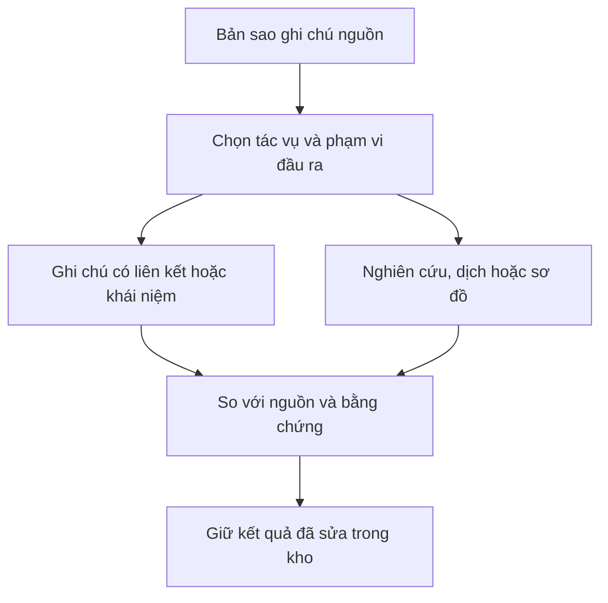

import TLDR from '@site/src/components/TLDR';

# Quản lý kiến thức với AI trong Obsidian

<TLDR>Quy trình hữu ích phân biệt nguồn, đầu ra mô hình và phần bạn sửa. Notemd có liên kết, trích xuất, nghiên cứu, dịch và sơ đồ để ghi tệp kiểm tra được. Bắt đầu từ một nguồn, xác minh kết quả rồi tự động hóa thư mục có phạm vi.</TLDR>

## Xác định kết quả cần có

Chọn sản phẩm cần: ghi chú đọc có liên kết, bộ khái niệm, tóm tắt có nguồn, bản dịch hoặc sơ đồ. Nhiều tệp và liên kết không tự tăng hiểu biết hay khả năng tìm lại. Quyết định cách kiểm tra đúng sai và tìm tài liệu sau này.

## Luồng tổng thể


```mermaid
flowchart TD
    A["Bản sao ghi chú nguồn"] --> B["Chọn tác vụ và phạm vi đầu ra"]
    B --> C["Ghi chú có liên kết hoặc khái niệm"]
    B --> D["Nghiên cứu, dịch hoặc sơ đồ"]
    C --> E["So với nguồn và bằng chứng"]
    D --> E
    E --> F["Giữ kết quả đã sửa trong kho"]
```

Đây là các tác vụ sẵn có, không có nghĩa một nút mặc định thực hiện tất cả. Giữ nguồn và kiểm tra đích từng tác vụ trước khi ghép quy trình.

## 1. Wiki-link: làm rõ kết nối

Chạy **Xử lý tệp (thêm liên kết)** trên ghi chú thử. Mặc định xem tệp `_processed.md` bên cạnh. Đánh giá thuật ngữ có hữu ích để điều hướng không, trích dẫn/mã/công thức có còn trung thực không.

Chỉ dẫn trọng tâm và hạn chế đồng nghĩa hướng mô hình, không cưỡng chế tương đương khái niệm hay ngưỡng tương đồng số. Nếu ưu tiên tái lập theo tên ghi chú hiện có, dùng đối chiếu tiêu đề xác định.

[Hướng dẫn wiki-link](./features/wiki-links)

## 2. Khái niệm: tách thuật ngữ khỏi giải thích

Chọn thư mục trước khi trích. Trích độc lập mặc định chỉ có tiêu đề và giữ nguồn. Bật liên kết ngược và tắt mẫu tối giản nếu cần `Linked From` trong ghi chú độc lập mới.

Trích xuất và sinh giải thích là hai thao tác. **Tạo hàng loạt từ tiêu đề** có thể điền ghi chú đủ điều kiện đã có lẫn vừa tạo trong thư mục chọn. Thử bằng thư mục riêng, xem hành vi chuyển sang complete được báo.

Dò trùng dùng quy tắc tên tệp. Duyệt trước khi xóa; tên gần nhau có thể là khái niệm kỹ thuật khác.

[Hướng dẫn khái niệm](./features/concept-notes)

## 3. Nghiên cứu: giữ dấu vết bằng chứng

Chọn chủ đề hoặc dùng tiêu đề hiện tại, chọn Tavily/DuckDuckGo rồi chạy **Nghiên cứu và tóm tắt**. Thiếu khóa Tavily không tự chọn DuckDuckGo. Mở URL và kiểm chứng nhận định trong tóm tắt.

Truy xuất cục bộ có thể bổ sung trích đoạn theo phạm vi. Chỉ mục hiện tại là từ vựng; văn bản truy xuất được gửi đến mô hình của tác vụ. Lập chỉ mục cục bộ không có nghĩa toàn luồng ngoại tuyến hoặc dữ liệu chỉ ở máy.

[Hướng dẫn nghiên cứu](./features/research)

## 4. Dịch: kiểm tra ý nghĩa và cấu trúc

Chọn ngôn ngữ rồi dịch tệp. Đầu ra mặc định có hậu tố `_<language>.md`, đích có sẵn có thể bị ghi đè. Muốn dịch đoạn riêng, chép vào ghi chú tạm trước.

So thuật ngữ, số, mã, liên kết và ký hiệu toán với nguồn. Chia đoạn có thể làm mất ngữ cảnh. 21 ngôn ngữ giao diện và 34 tuyến website không chứng minh chất lượng cặp dịch.

[Hướng dẫn dịch](./features/translation)

## 5. Sơ đồ: chọn sản phẩm có thể chỉnh sửa

Chọn loại và nguồn tương thích. Kiểm tra xem trước rồi lưu nguồn cùng SVG/PNG/PDF được hỗ trợ. Ảnh dựng không chứng minh trình sửa khác giữ mọi quan hệ ngữ nghĩa.

Chọn theo danh mục hỗ trợ. CircuitikZ có giới hạn và kiểm tra môi trường biên dịch riêng. Mũi tên tĩnh Drawnix giữa nhánh không bảo đảm gắn sau sắp xếp lại. Sửa bảng PowerPoint cải thiện đầu ra gốc, nhưng Mermaid/SVG vẫn có thể là ảnh.

[Hướng dẫn sơ đồ](./features/diagrams)

## 6. Quy trình: tự động hóa chuỗi đã kiểm chứng

Quy trình dùng tên, `::` và ID tách bằng `>`. Mặc định:

```text
One-Click Extract::process-current-add-links>batch-generate-from-titles>batch-mermaid-fix
```

Chuỗi gồm liên kết, sinh theo tiêu đề thư mục và sửa Mermaid. Không tự thêm nghiên cứu hoặc tạo sơ đồ tổng quát. Mỗi bước giữ điều kiện và đầu ra riêng; không phải đường ống văn bản tùy ý.

Mặc định dừng khi lỗi được báo. Tiếp tục sau lỗi chỉ phù hợp khi bước sau dùng được phần đầu vào còn lại. Hủy giữ kết quả đã xong, không hoàn tác.

[Hướng dẫn quy trình](./features/workflows)

## 7. Mô hình: khớp giao thức với công việc

36 hồ sơ bao phủ năm nhóm giao thức. Chọn theo điểm cuối, quyền mô hình, chính sách dữ liệu và kết quả đo được. Dùng cùng nguồn/lời nhắc trước khi so tốc độ hay chi phí.

Định tuyến nhà cung cấp/mô hình riêng mặc định tắt. Chỉ bật khi muốn các tác vụ dùng hồ sơ khác nhau; kiểm tra từng lựa chọn trước khi coi cả chuỗi là cục bộ.

[Tổng quan nhà cung cấp](./providers/overview)

## Các bước bắt đầu

1. Cài Notemd và sao lưu nguồn.
2. Cấu hình/thử đúng mô hình.
3. Chọn thư mục khái niệm và đích riêng.
4. Chạy một tác vụ trên bản sao.
5. So nguồn và giữ sửa chữa.
6. Mở rộng sang thư mục nhỏ, xem phần hoàn thành trước khi ghép chuỗi dài.

## Cách áp dụng thường gặp

### Xử lý bài báo

Chuyển bài báo sang Markdown bằng công cụ ngoài phù hợp, kiểm tra công thức, hình và bảng trước. Trích khái niệm/nguyên văn, nghiên cứu câu hỏi chọn và chỉ vẽ sơ đồ khi giúp làm rõ quan hệ kiểm chứng được. Giữ liên kết bài gốc và sửa chữa.

### Duy trì bộ khái niệm

Dùng thư mục riêng, kiểm tra thuật ngữ sau trích xuất, sinh giải thích cho tập được chọn có chủ ý. Sao lưu trước khi dọn trùng. Số lượng không thay thế định nghĩa đúng và điều hướng hữu ích.

### Làm việc với dữ liệu riêng tư

Chuẩn bị máy chủ cục bộ, mô hình và phụ thuộc; xem định tuyến theo tác vụ và tránh nghiên cứu cần mạng khi yêu cầu ngoại tuyến. Lọc chẩn đoán trước khi chia sẻ. Địa chỉ loopback mặc định không ngăn hồ sơ được đổi sang máy chủ từ xa.

### Khôi phục đợt xử lý bị gián đoạn

Chờ hủy/lỗi ổn định. Đọc báo cáo, xem kết quả hoàn thành và khôi phục, so xung đột rồi chạy lại phần muốn. Không suy ra không có đầu ra từ trạng thái đã hủy; không xóa tệp đi kèm trước khi kiểm tra tham chiếu.

## Tiếp theo

- [Bắt đầu nhanh](./getting-started/quick-start): hoàn thành tác vụ đầu.
- [Xử lý hàng loạt](./advanced/batch-processing): chọn phạm vi và sở hữu đầu ra.
- [Nhà phát triển](./developers/overview): mở rộng và xác minh.
- [Agent](./agents/overview): hợp đồng công khai thực tế.
