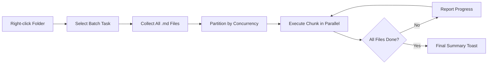

import TLDR from '@site/src/components/TLDR';

# 批量处理

<TLDR>
**Notemd** 可通过配置并发数和覆盖规则，一次性处理整个文件夹。右键点击文件夹即可批量添加维基链接、提取概念、进行研究或翻译其中的所有笔记。并发限制可避免出现 API 速率限制错误。进度会按文件逐一显示。覆盖行为也可自定义：跳过现有内容、追加或直接替换。出错的文件会被记录下来，而不会导致整个批处理中断。

这是[Obsidian AI知识管理指南](/docs/pillar-ai-knowledge)的一部分。
</TLDR>

## 概览

批量处理可将一个笔记文件夹视为一个整体操作。无需逐个打开笔记并分别执行命令，只需右键点击该文件夹并选择相应任务即可。Notemd会遍历每一个`.md`文件，应用选定的操作，并实时反馈处理进度。

该功能对于在整个知识库中提取信息至关重要。例如，在导入数十个 PDF 后，通过先批量添加链接再批量提取概念的方式，只需几分钟就能构建出知识图谱，而无需花费数小时。

## 它是如何工作的？

### 批量执行模型

1. **文件收集** -- Notemd 会递归扫描目标文件夹（或仅扫描顶层目录，具体取决于设置），并收集所有 `.md` 文件。
2. **并发分区**——文件会根据 `batchConcurrency` 的设置被分割成多个块。每个块会并行运行；而其他块则按顺序运行。
3. **执行** -- 每个文件都会使用与单文件命令相同的逻辑进行处理。会尊重每个任务对应的提供方及模型设置。
4. **进度报告**——每个文件处理完成后，系统会更新一个提示通知，显示 `N / Total` 的处理进度。
5. **错误处理** -- 如果某个文件处理失败（API 错误、网络超时等），系统会记录该错误并继续执行批处理任务。最终的汇总信息会列出所有处理失败的文件。
6. **完成** -- 一条摘要提示会显示总共处理的数量、成功次数以及失败次数。

### 覆盖行为

在处理已包含维基链接、概念说明或翻译的文件时，Notemd的行为取决于覆盖设置：

| 模式 | 行为 |
|------|----------|
| **跳过** | 现有内容保持不变。仅处理未被修改的文件。 |
| **Append**（默认） | 新内容将被追加。现有的维基链接、概念或翻译将保持不变。 |
| **替换** | 该文件已完全重新处理。所有之前的 Notemd 修改内容均被覆盖。 |

针对维基链接功能：如果笔记中已存在 `[[wiki-links]]`，则**跳过**模式会保持原样，而**替换**模式则会将整个笔记重新发送到 LLM 以插入新的链接。在进行增量处理时请使用**跳过**模式，在模型升级后需要重新处理时则使用**替换**模式。

### 并发控制

`batchConcurrency` 设置限制了并行进行的 API 调用次数。这样在处理大型文件夹时，即便面对配额限制严格的服务提供商，也能避免出现速率限制错误（HTTP 429）。

| 并发 | 推荐给 | 典型的速率限制影响 |
|-------------|----------------|---------------------------|
| `1` | 免费套餐，严格的供应商要求 | 无（串行） |
| `3`（默认） | 大多数云服务提供商 | 低 |
| `5` | Ollama（本地），丰富的套餐层级 | 无 / 低 |
| `10` | 具有快速推理能力的本地模型 | 无 |

如果在批量处理过程中遇到 429 错误，请将并发数降低到 1 或 2。

## 配置

| 设置 | 默认值 | 效果 |
|---------|---------|--------|
| `batchConcurrency` | `3` | 在文件夹操作期间，最大并行 API 调用数 |
| `batchOverwriteExisting` | `false` | 覆盖现有的 Notemd 内容。`false` 表示追加模式。 |
| `batchSkipProcessed` | `false` | 跳过已包含 Notemd 标记的文件（例如维基链接）。 |
| `batchRecursive` | `true` | 扫描文件夹时包含子目录 |
| `enableStableApiCall` | `false` | 在批量处理时，为每个文件启用重试逻辑（最多尝试4次） |

### 批量处理中的任务级模型

每次批量操作都会使用对应的任务专用模型。batch-add-links使用`addLinksProvider`，batch-research使用`researchProvider`，以此类推。这意味着你可以为大规模操作分配成本较低的模型，而为对质量要求较高的任务保留成本较高的模型。

## 示例

你有一个名为 `papers/` 的文件夹，其中包含40份导入的研究笔记。你想为它们添加维基链接，并提取所有笔记中的概念。

1. 右键点击 `papers/` 文件夹
2. 选择**“Notemd: 处理文件夹（添加链接）”**
3. Notemd 会扫描该文件夹，找到40个`.md`文件，并以每次处理3个的方式进行处理（默认并发数）
4. 进度提示框显示：`12/40 files processed...`
5. 大约3分钟后，摘要提示会显示：`39 succeeded, 1 failed (API timeout on paper-37.md)`
6. 使用**“Notemd: Process folder (extract concepts)”**重复操作，为全部40个创建概念笔记

那个失败的文件已被记录。之后你可以仅针对该文件重新运行。

## 技巧

- **从较低的并发数开始**——如果您不确定服务提供商的速率限制，可以先从 `1` 开始，然后逐步增加。
- **使用跳过模式进行增量更新**——在完成第一次完整批量处理后，切换到 `batchSkipProcessed: true`，这样在后续运行时只会处理新笔记。
- **启用稳定的 API 调用** -- `enableStableApiCall: true` 添加了重试逻辑，可在处理大型数据批次时从短暂的网络错误中恢复。
- **在模型升级后重新运行** -- 如果您更换为更优的模型，请设置 `batchOverwriteExisting: true` 并重新运行，以获得更好的链接和概念。

---

## 后续步骤

- [工作流](/docs/features/workflows) -- 将批量任务串联为一键式侧边栏按钮
- [自定义提示词](/docs/advanced/custom-prompts) -- 自定义批量提取的提示词
- [故障排除](/docs/advanced/troubleshooting) -- 解决批量运行时的速率限制错误和连接失败问题
- [LLM 提供商](/docs/providers/overview) -- 每个任务的模型配置参考
