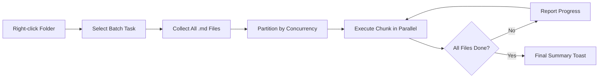

import TLDR from '@site/src/components/TLDR';

# 批处理

<TLDR>
**Notemd 可以用一次操作处理整个文件夹，并支持可配置的并发与覆盖策略。** 右键文件夹即可批量添加 wiki-links、抽取概念、研究或翻译所有笔记。并发限制可避免 API rate-limit 错误。进度会按文件报告。覆盖行为可配置为跳过、追加或替换。失败文件会记录下来，但不会中断整个 batch。

这是 [Obsidian AI Knowledge Management Guide](/docs/pillar-ai-knowledge) 的一部分。
</TLDR>

## Overview

批处理把一个文件夹中的笔记变成一次操作。你不需要逐篇打开笔记运行命令，而是右键文件夹并选择任务。Notemd 会遍历所有 `.md` 文件，执行对应动作，并实时报告进度。

这对 vault-wide knowledge extraction 很关键。导入几十篇 PDF 后，先 batch-add-links 再 batch-extract-concepts，可以在几分钟内建立知识图谱，而不是手工花几个小时。

## How It Works

### Batch Execution Model

1. **File collection** -- Notemd 扫描目标文件夹，按设置递归或只扫描顶层，并收集所有 `.md` 文件。
2. **Concurrency partitioning** -- 文件按 `batchConcurrency` 分块。每个 chunk 内并行运行，chunk 之间顺序执行。
3. **Execution** -- 每个文件使用与单文件命令相同的逻辑处理。每个任务自己的 provider/model 设置都会生效。
4. **Progress reporting** -- 每完成一个文件，toast 更新 `N / Total` 进度。
5. **Error handling** -- 某个文件失败时，错误会记录下来，batch 继续执行。最终 summary 会列出失败文件。
6. **Completion** -- summary toast 报告总数、成功数和失败数。

### Overwrite Behavior

处理已经包含 wiki-links、概念笔记或翻译内容的文件时，Notemd 的行为由 overwrite 设置决定：

| Mode | Behavior |
|------|----------|
| **Skip** | 保留已有内容，只处理未修改文件。 |
| **Append**（默认） | 追加新内容，保留已有 wiki-links、概念或翻译。 |
| **Replace** | 完整重处理文件，覆盖之前的 Notemd 修改。 |

对 wiki-linking 来说：如果笔记已有 `[[wiki-links]]`，**skip** 会保持不动；**replace** 会重新把整篇笔记发送给 LLM 做链接插入。增量处理用 **skip**，模型升级后重处理用 **replace**。

### Concurrency Control

`batchConcurrency` 限制并行 API 调用数量，避免在大文件夹处理时触发 provider 的 HTTP 429 rate limit。

| Concurrency | Recommended For | Typical Rate-Limit Impact |
|-------------|----------------|---------------------------|
| `1` | 免费额度、严格 provider | 无（串行） |
| `3`（默认） | 大多数云 provider | 低 |
| `5` | Ollama（本地）、宽松额度 | 无 / 低 |
| `10` | 快速本地模型 | 无 |

如果批处理遇到 429，将 concurrency 降到 1 或 2。

## Configuration

| Setting | Default | Effect |
|---------|---------|--------|
| `batchConcurrency` | `3` | 文件夹操作时最大并行 API 调用数 |
| `batchOverwriteExisting` | `false` | 覆盖已有 Notemd 内容；`false` 表示 append mode |
| `batchSkipProcessed` | `false` | 跳过已经包含 Notemd markers 的文件 |
| `batchRecursive` | `true` | 扫描文件夹时包含子目录 |
| `enableStableApiCall` | `false` | 为每个文件启用最多 4 次 retry |

### Per-Task Models in Batch

每个 batch operation 使用对应任务的 per-task model。batch-add-links 使用 `addLinksProvider`，batch-research 使用 `researchProvider`，以此类推。这样可以给高频任务配置便宜模型，把高质量模型留给质量敏感任务。

## Example

假设 `papers/` 文件夹里有 40 篇导入的研究笔记，你想给它们添加 wiki-links 并抽取概念：

1. 右键 `papers/` 文件夹
2. 选择 **"Notemd: Process folder (add links)"**
3. Notemd 扫描文件夹，找到 40 个 `.md` 文件，并按默认并发 3 个一组处理
4. progress toast 显示：`12/40 files processed...`
5. 约 3 分钟后，summary toast 报告：`39 succeeded, 1 failed (API timeout on paper-37.md)`
6. 再运行 **"Notemd: Process folder (extract concepts)"**，为 40 篇笔记创建概念笔记

失败文件会记录下来。你可以之后只对那一个文件重跑。

## Tips

- **先用低并发** -- 不确定 provider rate limit 时，从 `1` 开始再逐步提高。
- **增量更新用 skip mode** -- 首次完整 batch 后，启用 `batchSkipProcessed: true`，后续只处理新笔记。
- **启用 stable API calls** -- `enableStableApiCall: true` 会加入 retry，适合长时间 batch 中的临时网络错误。
- **模型升级后重跑** -- 如果切到更强模型，设置 `batchOverwriteExisting: true` 后重新处理，可得到更好的链接和概念。

---

## Next Steps

- [Workflows](https://jacobinwwey.github.io/obsidian-NotEMD/docs/features/workflows) -- 将 batch tasks 串成一键侧边栏按钮（英文）
- [Custom Prompts](/docs/advanced/custom-prompts) -- 为 batch extraction 自定义 prompts
- [Troubleshooting](/docs/advanced/troubleshooting) -- 修复 batch 运行中的 rate-limit 与连接失败
- [LLM Providers](/docs/providers/overview) -- per-task model 配置参考
