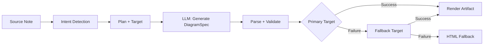
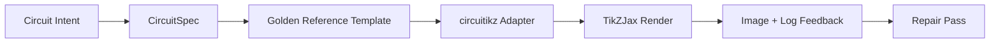

import TLDR from '@site/src/components/TLDR';

# 图表与可编辑 Figure

<TLDR>
**Notemd 通过 spec-first 管线从笔记生成图表。** LLM 先生成 renderer-agnostic 的 `DiagramSpec` JSON，再由专用 adapter 转换为 Mermaid、JSON Canvas、Vega-Lite、HTML 或 editable HTML/SVG 输出。当前支持 8 类 intent、自动 fallback chain、带 SVG/PNG 导出的实时预览、语义验证，以及 local-knowledge-augmented generation。
</TLDR>

这是 [Obsidian AI Knowledge Management Guide](/docs/pillar-ai-knowledge) 的一部分。

## 架构：Spec-First Pipeline

Notemd 不要求 LLM 直接生成 Mermaid、Vega 或 Canvas 语法。核心路径是：



**为什么使用 spec-first？** LLM 经常生成无效的 renderer 语法，Mermaid 尤其明显。结构化 `DiagramSpec` 可以在渲染前校验，同一份 spec 也可以作为多个 renderer 的 fallback 输入。

## 支持的图表类型

| Intent | Primary Renderer | Fallbacks | Use Case |
|--------|------------------|-----------|----------|
| `mindmap` | Mermaid | HTML | 层级主题拆解 |
| `flowchart` | Mermaid | HTML | 流程、决策树 |
| `sequence` | Mermaid | HTML | 客户端-服务端交互、协议 |
| `classDiagram` | Mermaid | HTML | OOP 类关系 |
| `erDiagram` | Mermaid | HTML | 数据库 schema、实体关系 |
| `stateDiagram` | Mermaid | HTML | 状态机、生命周期模型 |
| `canvasMap` | JSON Canvas | Mermaid → HTML | 概念图、知识图谱 |
| `dataChart` | Vega-Lite | Mermaid → HTML | 柱状图、折线图、面积图、散点图、饼图、表格 |

## Intent Detection

Notemd 会根据笔记内容用关键词评分推断最合适的图表类型：

| Intent | Triggers | Confidence |
|--------|----------|------------|
| `dataChart` | 表格、数值单元格、指标/趋势关键词、百分比 | 0.88 |
| `sequence` | request/response 词汇（4+ 命中）或 `->` / `=>` 标记 | 0.82 |
| `erDiagram` | primary key、foreign key、entity、schema（2+ 命中） | 0.80 |
| `stateDiagram` | state、transition、pending、running、failed（3+ 命中） | 0.76 |
| `flowchart` | 编号步骤（2+）或 if/then/else/workflow 词汇 | 0.74 |
| `canvasMap` | concept map、knowledge graph、spatial、cluster | 0.72 |
| `mindmap` | 默认 fallback | 0.55 |

可以通过 **首选图表类型** 设置、侧边栏选择器或 command palette 的显式选项覆盖自动检测。

## 渲染目标选择

实验性 spec-first 管线现在有两个彼此独立的控制项：

| Control | Setting | Effect |
|---------|---------|--------|
| 首选图表类型 | `preferredDiagramIntent` | 指导生成出来的 `DiagramSpec` 采用哪种语义形状 |
| 首选渲染目标 | `preferredDiagramRenderTarget` | 为 **Generate diagram** 和 **Preview diagram** 选择 artifact renderer |

将 **首选渲染目标** 设为 **自动** 时使用 planner 默认值；也可以显式选择 Mermaid、JSON Canvas、Vega-Lite、HTML 或可编辑 HTML/SVG。这个 override 只作用于 artifact 与 preview 命令。标准 **Summarise as Mermaid diagram** 命令仍固定为 Mermaid-compatible 输出，避免既有 Markdown 工作流静默切换格式。

这种分离很关键：同一个 `flowchart` intent 现在可以渲染为适合 Markdown 笔记的 Mermaid、用于鲁棒 fallback 的 HTML，或用于后续编辑的可编辑 HTML/SVG。Draw.io 和 Drawnix 仍然是 CLI artifact exporter，而不是插件内 render target。

## Usage

### Generate a Diagram

1. 打开一篇笔记
2. 从 command palette 运行 **"Notemd: Generate diagram"**
3. Notemd 检测 intent、生成 spec、渲染并保存 artifact

**各 target 的输出文件：**

| Target | Extension | Filename Pattern |
|--------|-----------|------------------|
| Mermaid | `.md` | `{note}_summ.md` |
| JSON Canvas | `.canvas` | `{note}_diagram.canvas` |
| Vega-Lite | `.json` | `{note}_diagram.json` |
| HTML | `.html` | `{note}_diagram.html` |
| Editable HTML/SVG | `.html` | `{note}_diagram.html` |

### Preview a Diagram

1. 运行 **"Notemd: Preview diagram"**
2. modal 会打开渲染后的图表
3. 使用 toolbar 按钮导出 SVG 或 PNG

设置中可以启用 **Auto-open preview**，生成后自动打开 preview modal。

### Legacy Mermaid Mode

当 `enableExperimentalDiagramPipeline` 关闭时，Notemd 会把直接 Mermaid prompt 发送给 LLM。这会完全绕过 spec pipeline。如果 experimental pipeline 失败，也会 fallback 到这个模式。

## Rendering Backends

### Mermaid

6 个 adapter（mindmap、flowchart、sequence、ER、class、state）会把 `DiagramSpec` 转换为 Mermaid 语法。生成后，`mermaid.parse()` 会校验输出。如果校验失败：

1. **LLM retry**：把 Mermaid 错误信息作为上下文重试一次
2. **Minimal fallback**：从 spec node id 生成最小 Mermaid 图

**Legacy Mermaid Fixer** 会自动修复常见 LLM 语法错误：note directive 归一化、pipe-label escaping、semicolon repositioning、smart quotes、double-dash arrows、shape mismatches 等。

### JSON Canvas

生成 Obsidian JSON Canvas 格式并带空间布局：
- 节点按深度定位（x = depth × 420），按索引定位（y = index × 170）
- 宽度根据 label 长度估算
- 边使用 `fromSide: 'right'`、`toSide: 'left'`、`toEnd: 'arrow'`

### Vega-Lite

构建完整的 Vega-Lite v5 JSON spec，并自动编码：
- **Cartesian charts**（bar/line/area/point/scatter）：x + y channels，多系列使用 color
- **Pie**：theta = y（quantitative），color = x（nominal）
- **Table**：row = x，text = y + column = series

dark / light theme patch 会在 compilation 前 deep-merge。

### HTML

通用 fallback。自包含 HTML 文档包含：
- CSP meta headers
- 通过 `prefers-color-scheme` 支持 light/dark mode
- 20 个 locale 的本地化 UI labels
- Sections：hero、structure（node tree）、relationships、callouts、data series tables

### Editable HTML/SVG

面向 editable export workflow 的显式 figure target。它把 `DiagramSpec` 投影为 deterministic `SemanticFigureModel`，再渲染为自包含 HTML 文档，inline SVG group 带 Draw.io-style annotations：

- semantic nodes 上的 `data-drawio-type`、`data-drawio-id`、`data-drawio-role`
- semantic edges 上的 `data-drawio-source`、`data-drawio-target`
- 空白归一化和碰撞处理后的稳定 node/edge id
- 不包含脚本、外部字体或远程资源

这个 target 目前有意不作为默认 planner route。它作为显式 render target 可用，同时产品路径继续验证真实工具中的编辑行为。

### Draw.io and Drawnix Export Boundaries

当前实现把第三方编辑器支持保持在 artifact boundary：

| Target | Contract | Runtime Dependency |
|--------|----------|--------------------|
| Draw.io | 从 `SemanticFigureModel` 生成 deterministic uncompressed `mxfile` XML | 插件 runtime 和 CI 中都没有依赖 |
| Drawnix | 使用 `geometry` 与 `arrow-line` elements 的最小 `.drawnix` JSON subset | 插件 runtime 和 CI 中都没有依赖 |

这个权衡是有意的：Notemd 可以验证 visible labels、stable IDs 和 supported primitive coverage，而不把 diagrams.net Desktop、Drawnix、Plait 或 browser-only editor state 嵌入插件。

### circuitikz / TikZJax Direction

电路图不是普通流程图问题。电学电路通常正确的语法 target 是 **circuitikz**，在 Obsidian 中可以通过 TikZJax 等插件渲染。TikZJax 可以加载 `circuitikz`、`pgfplots`、`tikz-cd`、`chemfig` 等包，因此对物理、电路、化学和数学笔记很有吸引力。

风险在于：未经约束的 LLM TikZ 输出非常脆弱：

- 复杂电路拓扑可能电气上正确，但视觉上不可读；
- wire 和 label 重叠会让正确 netlist 也无法用于学习笔记；
- 缺少 package preamble、anchor 错误或 component name 无效会导致无法渲染；
- renderer 的反馈通常是图像级，而 LLM 生成的是文本级 geometry。

更好的架构是把 circuitikz 当作强约束 diagram target，而不是自由 prompt：



一等模型应当把电路拓扑与布局分开描述：

| Layer | Responsibility | Example |
|-------|----------------|---------|
| Topology | 电气节点和元件连接 | `VDD -> RD -> drain(M1)`, `source(M1) -> GND` |
| Layout | 网格位置、方向、routing lanes | `M1 at (3,2.2)`, input left, output right |
| Style | package、电压约定、labels、anchors | `\begin{circuitikz}[american voltages]` |
| Validation | compile log、missing anchors、overlap/screenshot checks | TikZJax/LaTeX diagnostics plus visual review |

### 当前 circuitikz 原型

Notemd 现在已经包含这个方向的第一个受约束仓库内原型。它有意保持为离线、template-bound 的导出能力：

```bash
npm run diagram:export-circuitikz -- --input cmos-inverter.json --output cmos-inverter.tex
```

这个原型新增了独立的 `CircuitSpec` 边界，并为两个 golden-reference families 提供确定性 exporter：

| Circuit kind | Golden reference | Current guarantee |
|--------------|------------------|-------------------|
| `common-source-amplifier` | `common-source-nmos-v1` | 写出 LaTeX 前验证 `VDD -> R_D -> M1.D`、`vin -> M1.G`、`M1.S -> GND` 和 `M1.D -> vout` |
| `cmos-inverter` | `cmos-inverter-v1` | 写出 LaTeX 前验证 PMOS-over-NMOS 拓扑、shared gate input、shared drain output、`VDD -> MP.S` 和 `MN.S -> GND` |

这还不是通用 TikZ 生成器。它不会编译 LaTeX、调用 TikZJax、检查截图或运行图像反馈修复；这些仍是后续 gate。

### Golden Reference Prompt Shape

近期使用时，应该在要求生成电路变体前给出一个可渲染 golden reference。强约束 prompt 应保留 preamble、coordinate scale、anchor style 和 routing conventions：

```latex
\usepackage{circuitikz}
\begin{document}
\begin{circuitikz}[american voltages]
\draw
  (3,5) node[vcc]{$V_{DD}$}
  to [R, l=$R_D$] (3,3)
  to [short, *-o] (5,3) node[right]{$v_{out}$}
  (3,3) to [short] (3,2.2)
  node[nmos, anchor=D] (M1) {$M_1$}
  (M1.S) to [short] (3,0.5)
  node[ground]{}
  (M1.G) to [short, -o] (0.8,2.2)
  node[left]{$v_{in}$};
\draw
  (3,0.5) node[below right]{$S$};
\end{circuitikz}
\end{document}
```

对于 CMOS 反相器，prompt 应要求显式拓扑和布局约束，而不是只说“draw a CMOS inverter”：

- 保持 `VDD` 在上、`GND` 在下、input 在左、output 在右；
- 使用上方 `pmos`、下方 `nmos`，共享 gate 和 shared drains；
- output node 放在 drain junction，并用 `*-o` 标记；
- 使用 named anchors（`PM1.G`、`NM1.G`、`PM1.D`、`NM1.D`），不要依赖视觉推断坐标；
- 除非电气上必要，避免 diagonal 或 crossing wires。

### Current Progress And Next Phases

| Area | Current status | Next move |
|------|----------------|-----------|
| General diagrams | Mermaid、JSON Canvas、Vega-Lite、HTML 的 spec-first pipeline 已实现 | 继续扩展 semantic verification coverage |
| Editable figures | `editable-html-svg`、Draw.io XML、Drawnix JSON artifact boundaries 已实现 | 只有在测试证明 editability 后再加入更丰富 primitives |
| CLI support | `npm run diagram:export-artifact` 可从同一个 `DiagramSpec` 导出 editable HTML/SVG、Draw.io、Drawnix | 新 target 发布时增加 target-specific smoke fixtures |
| circuitikz | `CircuitSpec -> circuitikz` 原型已经可通过 `npm run diagram:export-circuitikz` 导出 common-source 与 CMOS inverter golden templates | 增加 compile/screenshot feedback 与 topology-preserving repair |
| TikZJax integration | Obsidian-side display 的候选 render host | 保持可选，不把 TikZJax 变成硬 runtime 依赖 |

## Configuration

| Setting | Default | Effect |
|---------|---------|--------|
| `enableExperimentalDiagramPipeline` | `false` | 在 spec-first 和 legacy Mermaid 之间切换 |
| `experimentalDiagramCompatibilityMode` | `'legacy-mermaid'` | `'legacy-mermaid'` = 只走 Mermaid；`'best-fit'` = native targets + fallbacks |
| `preferredDiagramIntent` | `undefined`（auto） | 覆盖自动 intent detection |
| `summarizeToMermaidLanguage` | `'en'` | 图表 labels 的目标语言 |
| `summarizeToMermaidProvider` / `Model` | DeepSeek | 图表生成任务使用的 LLM |
| `autoMermaidFixAfterGenerate` | 来自 constants | 对 Mermaid 输出自动运行 legacy fixer |
| `enableLocalKnowledgeForDiagramGeneration` | `false` | 用本地 vault knowledge 增强 source |

### Local Knowledge Augmentation

启用后，Notemd 会从 vault 的 local knowledge base（基于 MiniSearch）检索相关 context snippet，并把它们加到 source markdown 前。增强 prompt 会说明：“supporting reference only; keep the primary structure faithful to the source note.”

### Compatibility Modes

- **`legacy-mermaid`**：所有 intent 都路由到 Mermaid。非 Mermaid intent（canvasMap、dataChart）会被强制转成 `flowchart` 或 `mindmap`。没有 fallback chain。
- **`best-fit`**：每类 intent 路由到 native target。如果 primary 失败，就遍历 fallback chain（例如 Vega-Lite → Mermaid → HTML）。

## Preview & Export

| Action | Method |
|--------|--------|
| SVG export | `mermaid.render()` / `vega.View.toSVG()` / Canvas 的 SVG builder |
| PNG export | SVG → Image → Canvas（device pixel ratio 1x-3x）→ PNG ArrayBuffer |
| Source save | raw artifact content 按 target-specific extension 保存 |
| Semantic audit | Mermaid、JSON Canvas、Vega-Lite 和 editable HTML/SVG 由 `scripts/diagram-semantic-verification.js` 检查 |

**Caching**：RenderCache 使用 `{spec, target, theme}` 的 deterministic JSON key。In-flight deduplication 会避免重复渲染。

## Tips

- **从 `best-fit` mode 开始**：它会为每类 intent 选择更合适的视觉输出。
- **复杂图表使用更强模型**：flowchart 和 ER diagram 通常更受益于 GPT-4o 或 Claude。
- **为领域图表启用 local knowledge**：相关 vault context 能提升准确性。
- **启用 `autoMermaidFixAfterGenerate`**：没有自动修复时，Mermaid 语法错误很常见。
- **legacy fixer 覆盖很广**：如果 Mermaid preview 失败，手动运行 fixer command 通常能修复。

---

## Next Steps

- 🔗 [Wiki-Links](https://jacobinwwey.github.io/obsidian-NotEMD/docs/features/wiki-links) — 概念如何被内联链接（英文）
- 📝 [Concept Notes](https://jacobinwwey.github.io/obsidian-NotEMD/docs/features/concept-notes) — 为 diagram source material 抽取概念（英文）
- 🔍 [Research](https://jacobinwwey.github.io/obsidian-NotEMD/docs/features/research) — 用 web-sourced data 增强图表（英文）
