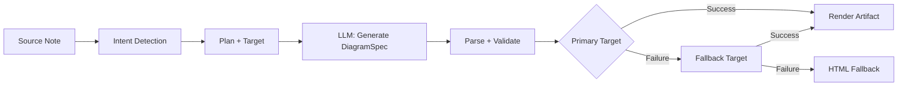
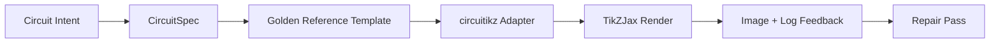

import TLDR from '@site/src/components/TLDR';

# 图表

<TLDR>
**Notemd** 通过以规范为先的流程，根据您的笔记生成图表。LLM 会先创建一个与渲染器无关的 `DiagramSpec` JSON，随后专门的适配器会将其转换为 Mermaid、JSON Canvas、Vega-Lite、HTML，或是可编辑的 HTML/SVG 格式输出。该工具支持 8 种意图类型、自动回退机制、带有 SVG/PNG 导出功能的实时预览、语义验证，以及基于本地知识的增强型生成功能。
</TLDR>

这是[Obsidian AI知识管理指南](/docs/pillar-ai-knowledge)的一部分。

## 架构：以规范为先的流水线

Notemd 从不要求 LLM 直接生成 Mermaid/Vega/Canvas 语法。而是：



**为何要优先考虑规范？** LLM 通常会生成无效的渲染器语法（尤其是 Mermaid）。结构化的 `DiagramSpec` 可以在渲染前进行验证，而且同一个规范可以同时用于多个作为备选的渲染器。

## 支持的图表类型

| 意图 | 主渲染器 | 备用方案 | 用例 |
|--------|-----------------|-----------|----------|
| `mindmap` | Mermaid | HTML | 分层主题拆分 |
| `flowchart` | Mermaid | HTML | 流程图、决策树 |
| `sequence` | Mermaid | HTML | 客户端-服务器交互，协议 |
| `classDiagram` | Mermaid | HTML | 面向对象类之间的关系 |
| `erDiagram` | Mermaid | HTML | 数据库模式、实体关系 |
| `stateDiagram` | Mermaid | HTML | 状态机、生命周期模型 |
| `canvasMap` | JSON Canvas | Mermaid → HTML | 概念图，知识图谱 |
| `dataChart` | Vega-Lite | Mermaid → HTML | 柱状图、折线图、面积图、散点图、饼图、表格 |

## 意图检测

Notemd 会通过关键词评分从您的笔记内容中推断出最佳的图表类型：

| 意图 | 触发器 | 信心 |
|--------|----------|------------|
| `dataChart` | 表格、数字单元格、指标/趋势相关关键词、百分比 | 0.88 |
| `sequence` | 请求/响应词汇表（4次及以上匹配）或 `->`/`=>` 标记 | 0.82 |
| `erDiagram` | 主键、外键、实体、模式（2次及以上匹配） | 0.80 |
| `stateDiagram` | 状态、过渡、待处理、运行中、失败（匹配3次及以上） | 0.76 |
| `flowchart` | 编号步骤（2个以上）或 if/then/else/工作流相关术语 | 0.74 |
| `canvasMap` | 概念图、知识图谱、空间结构、聚类 | 0.72 |
| `mindmap` | 默认回退方案 | 0.55 |

可以使用**首选图表类型**设置、侧边栏选择器或明确的命令面板选项来覆盖它。

## 渲染目标选择

这个基于规格文件的实验性流水线现在拥有两个独立的控制模块：

| 控制 | 设置 | 效果 |
|---------|---------|--------|
| 首选的图表类型 | `preferredDiagramIntent` | 为生成的 `DiagramSpec` 指导语义结构 |
| 首选渲染目标 | `preferredDiagramRenderTarget` | 为“生成图表”和“预览图表”选择工件渲染器 |

将规划器的默认**首选渲染目标**设置为**自动**，或者直接选择 Mermaid、JSON Canvas、Vega-Lite、HTML，或是可编辑的 HTML/SVG。此覆盖设置仅适用于生成结果和预览命令。标准的**汇总为 Mermaid 图表**命令仍会保持与 Mermaid 兼容的输出格式，从而避免现有的 Markdown 工作流在后台自动切换格式。

这种区分很重要，因为现在 `flowchart` 类型的意图可以被渲染为用于 Markdown 笔记的 Mermaid、用于可靠备用的 HTML，或是用于后续编辑的可编辑版本 HTML/SVG。而 Draw.io 和 Drawnix 仍然只是 CLI 类型的内容导出工具，而非插件内的渲染目标。

## 使用方法

### 生成图表

1. 打开一个笔记
2. 从命令面板运行 **“Notemd: Generate diagram”**
3. Notemd 用于检测意图、生成规范、进行渲染，并保存最终成果。

**按目标生成的输出文件：**

| 目标 | 扩展程序 | 文件名模式 |
|--------|-----------|------------------|
| Mermaid | `.md` | `{note}_summ.md` |
| JSON Canvas | `.canvas` | `{note}_diagram.canvas` |
| Vega-Lite | `.json` | `{note}_diagram.json` |
| HTML | `.html` | `{note}_diagram.html` |
| 可编辑的 HTML/SVG | `.html` | `{note}_diagram.html` |

### 预览图表

1. 运行 **“Notemd: 预览图表”**
2. 一个弹窗打开，显示已渲染的图表。
3. 使用工具栏按钮导出为 SVG 或 PNG 格式

在设置中可开启**自动打开预览**功能——生成完成后，预览弹窗会自动显示。

预览模态框还包含一个缺陷诊断面板。渲染器和烟雾测试可以附加 `RenderArtifact.diagnostics`；该模态框会在预览旁边显示诊断摘要，包括错误/警告/信息数量，以及严重程度、诊断类型、消息和修复建议。同样的摘要也会显示在预览历史记录中，因此无需逐一查看每条记录即可对比重复的 circuitikz 烟雾测试结果。对于那些有源代码内容但无法通过内联方式或 HTML iframe 路径进行渲染的缺陷，该模态框现在会转而使用仅显示源代码的预览方式，而不会强制使用空 iframe。这样一来，circuitikz 编译/渲染烟雾测试、SVG 文本标记检查、PNG 空白截图检查以及未来的重叠报告都能有可见的 UI 展示界面，同时无需让 TikZJax 或 LaTeX 成为必须的插件运行时依赖，也不会将源代码文本当作已验证的可视化渲染结果。

### 传统 Mermaid 模式

当 `enableExperimentalDiagramPipeline` 关闭时，Notemd 会直接将 Mermaid 提示发送给 LLM。这样便完全绕过了规范处理流程。如果实验性处理流程失败，系统就会回退到这种模式。

## 渲染后端

### Mermaid

6个适配器（思维导图、流程图、时序图、ER图、类图、状态图），将`DiagramSpec`转换为Mermaid语法。生成后，`mermaid.parse()`会对输出进行验证。如果验证失败：

1. **LLM 重试** — 使用 Mermaid 错误信息作为上下文进行一次尝试
2. **最小化回退方案**——基于规范节点 ID 的最简 Mermaid 图表

**Legacy Mermaid Fixer** 能自动修复常见的 LLM 语法错误，包括指令规范化、管道标签转义、分号位置调整、智能引号、双连字符箭头、形状不匹配等问题。

### JSON Canvas

生成具有空间布局的 Obsidian JSON Canvas 格式：
- 节点根据深度（x = 深度 × 420）和索引（y = 索引 × 170）来确定位置
- 宽度根据标签长度估算得出
- 包含 `fromSide: 'right'`、`toSide: 'left'`、`toEnd: 'arrow'` 的边

### Vega-Lite

自动编码，生成完整的 Vega-Lite v5 JSON 规范。
- **笛卡尔坐标图**（柱状图/折线图/面积图/点图/散点图）：多系列数据使用x轴、y轴通道以及颜色区分。
- **饼图**：theta = y（定量），颜色 = x（名义型）
- **表格**：行 = x，文本 = y + 列 = 序列

深色与浅色主题补丁会在编译前进行深度合并。

### HTML

通用回退方案。自包含的 HTML 文档，其中包含：
- CSP元标题
- 通过 `prefers-color-scheme` 切换亮色/暗色模式
- 为20种语言环境提供的本地化 UI 标签
- 板块：标题区域、结构（节点树）、关联关系、标注说明、数据系列表格

### 可编辑的 HTML/SVG

用于可编辑导出工作流的明确图形目标。它将 `DiagramSpec` 转换为确定的 `SemanticFigureModel`，然后生成一个包含内联 SVG 组的独立 HTML 文档，这些组带有 Draw.io 风格的注释：

- 语义节点上的`data-drawio-type`、`data-drawio-id`和`data-drawio-role`
- 语义边上的 `data-drawio-source` 和 `data-drawio-target`
- 经过空白字符规范化与冲突处理后的稳定节点/边缘标识符
- 不使用脚本，不使用外部字体，也不使用远程资源。

该目标目前并非默认的规划器路径。在产品路径能够验证其在实际工具中的编辑行为时，它可作为明确的渲染目标使用。

### Draw.io 和 Drawnix 导出边界

当前的实现将第三方编辑器支持限制在构建产物边界内：

| 目标 | 合同 | 运行时依赖项 |
|--------|----------|--------------------|
| Draw.io | 来自 `SemanticFigureModel` 的确定性未压缩 `mxfile` XML | 插件运行时或 CI 中均无。 |
| Drawnix | 使用 `geometry` 和 `arrow-line` 元素构成的最小 `.drawnix` JSON 子集 | 插件运行时或 CI 中均无。 |

这种权衡是经过刻意设计的：Notemd能够验证可见标签、稳定标识以及受支持的原始数据覆盖情况，而无需将 diagrams.net Desktop、Drawnix、Plait 或仅适用于浏览器的编辑器状态嵌入到插件中。

### circuitikz / TikZJax 方向

电路图与普通的流程图并非同一类问题。电气电路的正确语法格式通常是**circuitikz**，通过 TikZJax 等插件在 Obsidian 中进行渲染。TikZJax 能够加载 `circuitikz`、`pgfplots`、`tikz-cd` 和 `chemfig` 等插件包，因此很适合用于物理、电路、化学和数学相关的笔记制作。

风险在于，由 LLM 直接生成的 TikZ 代码非常脆弱：

- 复杂的电路拓扑结构在电气上可能是正确的，但看起来难以理解。
- 重叠的导线和标签会导致正确的网表无法用于制作学习笔记。
- 缺失的包前置内容、错误的锚点或无效的组件名称都可能导致无法渲染。
- 渲染器反馈的通常是图像级别的信息，而 LLM 生成的则是文本级别的几何数据。

更好的架构是将 circuitikz 视为受限的图表生成目标，而非自由形式的提示语。



一级模型应分别描述电路拓扑结构和布局：

| 图层 | 责任 | 示例 |
|-------|----------------|---------|
| 拓扑结构 | 电气节点与元件连接 | `VDD -> RD -> drain(M1)`，`source(M1) -> GND` |
| 布局 | 网格布局、方向、路径规划车道 | `M1 at (3,2.2)`，输入在左侧，输出在右侧 |
| 风格 | 包装，电压约定，标签，固定点 | `\begin{circuitikz}[american voltages]` |
| 验证 | 编译日志，缺少锚点，重叠/截图检查 | TikZJax/LaTeX诊断功能及可视化查看 |

### 当前的 circuitikz 原型

Notemd 现已包含该方向首个受限仓库原型。它被刻意设置为离线状态，并受模板限制：

```bash
npm run diagram:export-circuitikz -- --input cmos-inverter.json --output cmos-inverter.tex
```

该原型为六个黄金参考系列添加了独立的 `CircuitSpec` 边界以及确定的导出器：

| 电路类型 | 金色参考手册 | 当前保修期 |
|--------------|------------------|-------------------|
| `common-source-amplifier` | `common-source-nmos-v1` | 在编写 LaTeX 之前，会先验证 `VDD -> R_D -> M1.D`、`vin -> M1.G`、`M1.S -> GND` 和 `M1.D -> vout`。 |
| `cmos-inverter` | `cmos-inverter-v1` | 在生成 LaTeX 代码之前，会验证 PMOS-over-NMOS 结构、共享栅极输入、共享漏极输出、`VDD -> MP.S` 以及 `MN.S -> GND` 是否正确。 |
| `cmos-buffer` | `cmos-buffer-v1` | 在编写 LaTeX 之前，会验证两个级联的反相器级、中间节点 `vmid`、已恢复的 `vout`，以及共享的 VDD/GND 导轨。 |
| `cmos-transmission-gate` | `cmos-transmission-gate-v1` | 在写入 LaTeX 之前，会使用互补的 `phib` / `phi` 控制机制，验证 `vin` 和 `vout` 之间的并行 PMOS/NMOS 放大器件是否正常。 |
| `cmos-nand2` | `cmos-nand2-v1` | 在写入 LaTeX 之前，会验证并联的 PMOS 上拉电阻、串联的 NMOS 下拉电阻、双输入 `va` / `vb` 以及 `vout` 的功能。 |
| `cmos-nor2` | `cmos-nor2-v1` | 在写入 LaTeX 之前，会验证串联 PMOS 上拉、并联 NMOS 下拉、双输入 `va` / `vb` 以及 `vout` 的功能。 |

这还不是一个通用的 TikZ 生成器。它无法编译 LaTeX、调用 TikZJax、查看截图，也无法执行自动图像反馈修复功能。这些功能仍是后续需要实现的环节。

当文件扩展名为 `.tex` 或 `.tikz`，且源代码包含 `\usepackage{circuitikz}` 或 `\begin{circuitikz}` 时，Preview diagram 命令可以直接重新打开已保存的 circuitikz 源文件。这种预览方式属于仅显示源代码的 circuitikz 预览模式：弹窗会展示源代码、诊断信息、复制/保存控件以及历史记录元数据，但不会在插件运行时编译 LaTeX 代码或调用 TikZJax。

现在的仅源代码预览范围已涵盖已保存的 Draw.io 和 Drawnix 构建产物。当 `.drawio` 文件呈现为 Draw.io XML（`mxfile` 或 `mxGraphModel`）的形式时会被接受，而 `.drawnix` 文件在为 Drawnix JSON 并包含 `type: "drawnix"` 以及 `elements` 数组时也会被接受。该插件仍然不会嵌入 diagrams.net 或 Drawnix 白板服务；这些预览仅展示源代码、诊断信息及构建历史记录，而不提供插件内的可视化编辑器。

对于保持拓扑结构的修复，应在接受修复后的候选结果之前，将修复前的配置规格作为参考传递过去：

```bash
npm run diagram:export-circuitikz -- --input repaired-cmos-inverter.json --topology-reference cmos-inverter.json --output cmos-inverter.tex
```

修复保护机制会使用 `createCircuitTopologySignature` 和 `assertCircuitTopologyUnchanged` 来比较 `circuitKind`、`goldenReferenceId`、网络结构、组件编号/类型/端子以及无向连接端点，然后再输出结果。标签、标题文本、布局提示、连接顺序和连接标识会被刻意忽略。那些试图添加新端子或重新连接端子的候选方案会在 `.tex` 文件被写入之前因 `Circuit topology drift detected` 而失败。

现在 CLI 可以在不运行编译器的情况下解析现有的 LaTeX/TikZJax 编译日志：

```bash
npm run diagram:export-circuitikz -- --input cmos-inverter.json --output cmos-inverter.tex --compile-log cmos-inverter.log --diagnostics-output cmos-inverter.diagnostics.json
```

该诊断路径会报告缺失的包，如 `circuitikz.sty`；未知的 TikZ/circuitikz 键；TikZ 路径语法错误，例如缺少分号、因括号不匹配或标签未闭合而导致的参数过多问题；未定义的控制序列；通用的 LaTeX 错误；紧急停止情况；以及关于 `\hbox` 已接近容量上限的警告信息。该系统仍以日志为基础：本地 LaTeX/TikZJax 的执行功能以及类似截图质量的检测机制仍是未来需要实现的功能。

在维护人员的烟雾测试中，相同的 CLI 可以选择性地运行预先配置好的渲染器，而无需解析shell命令：

```bash
npm run diagram:export-circuitikz -- --input cmos-inverter.json --output cmos-inverter.tex --compile-executable pdflatex --compile-arg -interaction=nonstopmode --compile-arg -halt-on-error --compile-arg -output-directory={outputDir} --compile-arg {tex} --expected-artifact {outputDir}/{jobName}.pdf
```

编译运行器会使用 `shell: false`，将 `{tex}`、`{outputDir}` 和 `{jobName}` 这些占位符替换为参数数组中的值，读取生成的 `{jobName}.log`，然后在 CLI JSON 格式的输出中返回 `compileExecution` 以及 `compileDiagnostics`。`--compile-executable` 仅表示渲染器二进制文件或包装器的路径；渲染器相关标志则应包含在重复的 `--compile-arg` 值中。空的可执行文件会导致 `compile-executable-invalid` 错误，缺失的二进制文件会导致 `compile-executable-not-found` 错误，而形如shell命令的可执行字符串则会收到建议，要求将其参数拆分，以便Windows、Linux和macOS都能遵循相同的直接执行规范。借助 `--expected-artifact`，它还会报告 `compileExecution.renderSmoke` 的情况；如果渲染器未能生成非空的输出文件，则会触发 CLI 错误。此外，它不会打包LaTeX文件，也不会将 TikZJax 作为插件运行时的依赖项，更不会进行截图级别的视觉修复。

如果预期的构建产物是 `.svg`，那么冒烟测试会再深入一层进行验证：

```bash
npm run diagram:export-circuitikz -- --input cmos-inverter.json --output cmos-inverter.tex --compile-executable dvisvgm --compile-arg ... --expected-artifact {outputDir}/{jobName}.svg --expected-svg-text v_{in} --expected-svg-text v_{out}
```

SVG 测试会验证 `<svg>` 根节点、正尺寸或 `viewBox`，在排除隐藏/透明元素后至少存在一个可见的绘图元素、所有要求的文本标记、位于 `viewBox` 外部的明显元素、位置重叠的明显 `<text>` / `<tspan>` 标签，以及通过 `render-svg-label-overlap` 与绘图元素重叠的明显文本标签。所需的文本会从可见文本中搜索，并从 `aria-label`、`<title>` 和 `<desc>` 等可访问性元数据中解码，因此那些能在可见 `<text>` 范围外保留语义标签的渲染器仍可在无需 OCR 的情况下通过文本标记测试。几何检查现在针对常见的组与元素 `transform` 属性采用了具备变换感知能力的几何处理方式，因此经过平移、缩放、旋转、倾斜或矩阵变换后的 SVG 矩形也会在变换组合后进行检测。该检查涵盖 A/a 弧端点的精确弧线范围、C/S/Q/T 曲线端点的精确贝塞尔曲线范围、考虑笔宽的 SVG 范围及标签重叠检测、`polyline` / `polygon` 绘图几何结构，同时还能根据 `<use href="#...">` 参考解析仅由路径构成的字形位置，这样即便转换后的标签被转为可复用的字形路径，若其几何结构超出了 `viewBox` 范围，仍可能无法通过边界检查。位于同一个 `<text>` 父节点下的多个 `tspan` 标签会被视为独立的标签矩形进行比较，这有助于检测那些原本会将不同标签合并为一个文本节点的 LaTeX 风格 SVG 输出。定位的 SVG `text` 和 `tspan` 矩形会遵循 `text-anchor`、`start`、`middle` 和 `end` 这些值，因此居中或右对齐的标签即便不依赖浏览器级的文本布局，也能触发文本/文本之间以及标签与绘图之间的重叠检测。位于 `<defs>` 内部的仅定义用的字形路径不会被视为可见的绘图元素，但它们自身的定义级 `transform` 属性仍会在 `<use>` 安置之前应用，从而避免缩放或镜像后的字形定义被遗漏统计。标签与绘图的检测会使用较小的绘图矩形容差以及所声明的 `stroke-width` 值，因此细线、粗线以及多边形组件轮廓，只要其可见笔触触及到标签，都可能被视为影响标签可读性的因素。从 `<use href="#...">` 解析出的仅由路径构成的字形标签也会与绘图矩形进行比较，若可复用的字形几何结构与线条或组件重叠，则会因 `render-svg-path-glyph-overlap` 而失败。如果渲染器将标签转换为可复用的路径字形而非可搜索的 `<text>`，且不保留可访问性元数据，测试报告会记录 `pathOnlyGlyphUseCount`，并通过 `render-svg-text-path-only` 检测到缺失的文本标记，而不会假装该标签根本不存在。其他故障则会通过 `render-svg-invalid`、`render-svg-dimension-missing`、`render-svg-no-visible-elements`、`render-svg-text-missing`、`render-svg-out-of-bounds`、`render-svg-text-overlap`、`render-svg-label-overlap` 或 `render-svg-path-glyph-overlap` 进行报告。对于那些将标签保留为可搜索的 SVG 文本或可访问性元数据的渲染器而言，文本标记与重叠检测仅应视为结构层面的测试；而仅由路径构成的 SVG 输出仍需后续的截图/OCR 验证来证明标签的视觉可读性，且此测试也不代表已实现完整的 SVG 路径覆盖。

在统计可见元素数量及收集几何信息时，隐藏的 SVG 组和元素会始终被跳过。属性或内联样式 `display:none`、`visibility:hidden`、`visibility:collapse` 以及整体 `opacity:0` 也无法让原本为空的渲染结果通过可见输出测试。

仅包含路径的图形定义可以是直接路径，也可以是位于 `<defs>` 内的组/符号容器。在 `<use>` 定位之前，预处理阶段会从 `<g id="...">` 和 `<symbol id="...">` 中获取子路径的几何信息，因此封装后的图形输出仍会传递给 `pathOnlyGlyphUseCount`、边界画布检查以及 `render-svg-path-glyph-overlap`。

路径解析器还会记录子路径的起始位置，并在 `Z/z` 处重置当前指针，这样在封闭的子路径之后的相对命令就会从正确的 SVG 位置继续执行，而不会产生错误的 `render-svg-out-of-bounds` 错误信息。

相同的几何处理遵循 SVG 数字格式规则，即使用小数点表示小数并明确添加加号，因此像 `.5`、`-.5` 或 `+.5` 这样的紧凑 dvisvgm 坐标在边界检查时仍保持分数形式，而不会变成无效的越界几何数据或被跳过。

如果渲染器输出 `.png`，相同的预期输出路径就会成为首个截图检测的目标： Notemd 能够解码非隔行扫描的 1/2/4/8 位索引颜色 PNG 文件、1/2/4/8/16 位灰度 PNG 文件，以及 8/16 位灰度-阿尔法/RGB/RGBA PNG 文件。索引颜色图像和子字节级灰度图像支持压缩采样；索引颜色图像还支持 PLTE 以及可选的 tRNS 数据；灰度/RGB 图像则支持使用 tRNS 表示透明样本。16 位直接采样值会被标准化为与截图检测所使用的相同 8 位 RGBA 比较空间。该检测会验证图像尺寸是否正常，将前景区域的边界记录为 `foregroundBounds`，将该区域内前景元素的密度记录为 `foregroundDensity`；如果所有可见像素都与左上角的背景颜色一致，则检测失败并返回 `render-png-blank`；如果前景内容触及图像边界，则检测失败并返回 `render-png-content-clipped`；如果较大的截图中前景像素数量少于四个，则检测失败并返回 `render-png-foreground-too-small`；如果非简单边界框内的前景像素密度异常高，则检测失败并返回 `render-png-foreground-dense`。不支持的 PNG 格式会导致检测失败并返回 `render-png-unsupported`，同时还会提供针对 Adam7 隔行扫描 PNG 或不受支持的索引颜色位深度的特定格式说明。该机制能够检测到空白截图、明显的画布裁剪问题、渲染不足的前景区域、像素级拥挤故障以及错误的渲染器 PNG 导出设置，且无需依赖任何特定平台的工具。不过它还无法实现 OCR 级别的文本识别、精确的文本重叠检测，也无法进行保持图像拓扑结构的修复。

当诊断结果显示编译或渲染测试失败时，CLI 还可以生成一份保持拓扑结构的修复报告：

```bash
npm run diagram:export-circuitikz -- --input cmos-inverter.json --topology-reference cmos-inverter.json --output cmos-inverter.tex --compile-log cmos-inverter.log --repair-brief-output cmos-inverter.repair-brief.json
```

该修复说明使用了架构 `notemd.circuitikz.repair-brief.v1`，并包含来源信息 `CircuitSpec`、拓扑结构签名、编译/渲染诊断结果、允许的编辑内容、禁止的拓扑结构编辑项、后续验证步骤以及结构化的 `repairPrompt`。提示词的角色为 `topology-preserving-circuitikz-repair`；其 `diagnosticFocus` 列表源自编译/渲染诊断结果，而其 `acceptanceCriteria` 需要经过候选方案验证，还需进行新的编译和渲染测试。这是一种用于后续修复循环的交接格式，并不能说明 Notemd 已经能够自动执行视觉修复功能。

在生成修复候选方案后，同一个 CLI 可以在输出结果之前根据需求说明对其进行验证：

```bash
npm run diagram:export-circuitikz -- --input repaired-cmos-inverter.json --repair-brief cmos-inverter.repair-brief.json --output repaired-cmos-inverter.tex
```

`--repair-brief` 会检查简报中给出的候选拓扑签名，且与 `--topology-reference` 存在互斥关系。通过此检测仅能证明拓扑结构得到了保留；该候选方案仍需经过编译诊断和渲染测试。

`--repair-brief` 的结果还包含了带有 `notemd.circuitikz.repair-acceptance.v1` 模式的 `repairAcceptance` 证据。它会将 `topology-signature`、`compile-diagnostics` 和 `render-smoke` 网关标记为 `passed`、`failed` 或 `missing`；公开 `remainingChecks`；并且在候选运行包含所有必需的证据之前，会保持 `readyForVisualAcceptance` 为假状态。

当 CI 或发布证明需要一个持久性的 JSON 文件时，请将 `--repair-acceptance-output` 与 `--repair-brief` 一起使用：

```bash
npm run diagram:export-circuitikz -- --input repaired-cmos-inverter.json --repair-brief cmos-inverter.repair-brief.json --output repaired-cmos-inverter.tex --repair-acceptance-output repaired-cmos-inverter.repair-acceptance.json
```

如需发布或维护证据，请通过汇总测试用例运行器对所有受支持的金色系列进行测试：

```bash
npm run diagram:smoke-circuitikz -- --output-dir docs/export/circuitikz-smoke --compile-executable pdflatex --compile-arg -interaction=nonstopmode --compile-arg -halt-on-error --compile-arg -output-directory={outputDir} --compile-arg {tex} --expected-artifact {outputDir}/{jobName}.pdf
```

该运行器使用 `docs/maintainer/fixtures/circuitikz/common-source-nmos-v1.json`、`docs/maintainer/fixtures/circuitikz/cmos-inverter-v1.json`、`docs/maintainer/fixtures/circuitikz/cmos-buffer-v1.json`、`docs/maintainer/fixtures/circuitikz/cmos-transmission-gate-v1.json`、`docs/maintainer/fixtures/circuitikz/cmos-nand2-v1.json` 和 `docs/maintainer/fixtures/circuitikz/cmos-nor2-v1.json`，为每个测试用例调用相同的无壳导出路径，并返回包含每个测试用例的 `compileExecution` 和 `compileDiagnostics` 数据的汇总 JSON 报告。它仍然是维护者命令，而非插件运行时的依赖项。

当维护机器尚未配置渲染器时，运行不包含 `--compile-executable` 的相同测试命令，并明确保存环境门控设置：

```bash
npm run diagram:smoke-circuitikz -- --output-dir docs/export/circuitikz-smoke --report-output docs/export/circuitikz-smoke/renderer-availability.json
```

该路径仍然会生成确定的 `.tex` 构件，但会返回 `ok: false`，其中 `rendererAvailability.status` 被设置为 `missing-configuration`，并附带 `compile-executable-invalid` 的诊断信息。请仅将其视为渲染器可用性的证据，它并不代表编译、渲染测试或视觉验收的结果。

### 金色参考提示框形状

对于近期使用，应在请求电路变体之前提供可渲染的黄金参考版本。受限提示语需保留前置内容、坐标比例、锚点样式以及布线规则。

```latex
\usepackage{circuitikz}
\begin{document}
\begin{circuitikz}[american voltages]
\draw
  (3,5) node[vcc]{$V_{DD}$}
  to [R, l=$R_D$] (3,3)
  to [short, *-o] (5,3) node[right]{$v_{out}$}
  (3,3) to [short] (3,2.2)
  node[nmos, anchor=D] (M1) {$M_1$}
  (M1.S) to [short] (3,0.5)
  node[ground]{}
  (M1.G) to [short, -o] (0.8,2.2)
  node[left]{$v_{in}$};
\draw
  (3,0.5) node[below right]{$S$};
\end{circuitikz}
\end{document}
```

对于CMOS反相器，请求时应明确指定拓扑结构及布局约束，而不仅仅是“绘制一个CMOS反相器”。

- 将 `VDD` 保持在顶部，`GND` 保持在底部，输入在左侧，输出在右侧；
- 在 `nmos` 上方使用 `pmos`，并采用共享栅极和共享漏极的结构。
- 将输出节点保持在漏极结处，并用 `*-o` 标记它。
- 请使用命名锚点（`PM1.G`、`NM1.G`、`PM1.D`、`NM1.D`）来代替通过视觉推断出的坐标。
- 除非电气设计上有要求，否则应避免使用对角线或交叉的导线。

### 当前进度与后续阶段

| 区域 | 当前状态 | 下一步操作 |
|------|----------------|-----------|
| 通用图表 | 已为 Mermaid、JSON Canvas、Vega-Lite、HTML 实现以规格优先的流水线 | 持续扩大语义验证的覆盖范围 |
| 可编辑的图表 | 已实现 `editable-html-svg`、Draw.io XML 以及 Drawnix JSON 的构件边界划分。 | 只有在测试证明可编辑之后，才添加更丰富的原始数据类型。 |
| CLI 支持功能 | `npm run diagram:export-artifact` 从一个 `DiagramSpec` 导出可编辑的 HTML/SVG、Draw.io 和 Drawnix | 在新的目标版本发布时，添加针对该目标的烟雾装置。 |
| circuitikz | `CircuitSpec -> circuitikz`原型导出了公共源、CMOS反相器、`cmos-buffer` / `cmos-buffer-v1`、`cmos-transmission-gate` / `cmos-transmission-gate-v1`、`cmos-nand2` / `cmos-nand2-v1`以及`cmos-nor2` / `cmos-nor2-v1`这些标准模板，将项目`layoutHints.inputSide`和`layoutHints.outputSide`以确定性的方式布置输入/输出端口，同时不会改变拓扑结构；通过`--topology-reference`防止拓扑结构出现偏差，通过`--repair-brief-output`和架构`notemd.circuitikz.repair-brief.v1`生成能够保留拓扑结构的修复方案；包含带有`diagnosticFocus`、`acceptanceCriteria`以及角色 `topology-preserving-circuitikz-repair`的结构性`repairPrompt`交接内容；通过`--repair-brief`验证候选修复方案，通过架构`notemd.circuitikz.repair-acceptance.v1`并借助`readyForVisualAcceptance`和`remainingChecks`返回`repairAcceptance`级联电路的相关证据，通过`--repair-acceptance-output`保存该证据，可解析编译日志，能够运行特定的本地渲染器以及`--expected-artifact`、SVG `--expected-svg-text`，通过`aria-label`、`<title>`和`<desc>`检查无障碍功能相关的元数据，可排除隐藏/透明类型的SVG元素，对仅包含路径的标签进行`render-svg-text-path-only` / `pathOnlyGlyphUseCount`分类，针对`<use href="#...">`检查仅包含路径的图形放置情况，通过`render-svg-path-glyph-overlap`诊断仅包含路径的图形重叠问题，为`Z/z`处理闭合路径上的电流点，精确确定A/a弧线的端点范围，精确确定C/S/Q/T曲线端点的贝塞尔曲线范围，考虑笔触宽度因素进行SVG范围及标签重叠检查，进行`polyline` / `polygon`绘制几何结构检查，处理已定位的`tspan`标签几何结构，根据`text-anchor`调整已定位文本的几何形状，针对SVG有限画布/文本重叠以及标签与图形重叠问题，结合变换功能进行几何结构处理，同时检查PNG图像的非空白/裁剪/密集前景部分的截图情况，包括索引颜色调色板中的透明度值、灰度/RGB模式下的tRNS透明样本，以及针对Adam7交错式PNG格式和索引位深错误提供的特定格式的`render-png-unsupported`指导，通过`foregroundBounds`、`foregroundDensity`、`render-png-content-clipped`和`render-png-foreground-dense`实现这些功能且无需进行shell解析；包含用于综合测试的维护人员专用测试用例，通过`npm run diagram:smoke-circuitikz`记录缺失的渲染器配置信息，以及通过`rendererAvailability.status: "missing-configuration"`和`compile-executable-invalid`进行相关记录，同时还具备通用的预览诊断功能、诊断摘要统计、基于诊断结果的历史记录功能，以及通过`RenderArtifact.diagnostics`和预览模式实现的仅基于源代码的备用方案。 | 为仅包含路径的视觉文本添加OCR级标签识别功能，实现精确的像素级重叠检测，在需要时覆盖更广泛的SVG路径范围；仅在保持可选性的前提下自动安装或发现渲染器，并自动执行能够保留拓扑结构的修复操作。 |
| TikZJax 集成 | 用于 Obsidian 端显示的候选渲染主机 | 保持其可选性，不要让 TikZJax 成为插件运行时的强制依赖项。 |

## 配置

| 设置 | 默认值 | 效果 |
|---------|---------|--------|
| `enableExperimentalDiagramPipeline` | `false` | 在以规范优先和传统模式之间切换 Mermaid |
| `experimentalDiagramCompatibilityMode` | `'legacy-mermaid'` | `'legacy-mermaid'` 只能等于 Mermaid；`'best-fit'` 等于原生目标及备用选项 |
| `preferredDiagramIntent` | `undefined`（自动） | 覆盖自动意图检测功能 |
| `summarizeToMermaidLanguage` | `'en'` | 图表标签的目标语言 |
| `summarizeToMermaidProvider` / `Model` | DeepSeek | 用于图表生成的每任务 LLM |
| `autoMermaidFixAfterGenerate` | （来自常量） | 在 Mermaid 的输出上自动运行旧版本修复工具 |
| `enableLocalKnowledgeForDiagramGeneration` | `false` | 用本地保险库知识增强源数据 |

### 本地知识增强

启用后，Notemd会从您保险库的本地知识库（基于MiniSearch）中检索相关的上下文片段，并将其添加到原始Markdown内容的前面。增强提示中写道：“仅作为参考；请保持与原始笔记一致的主要结构。”

### 兼容模式

- **`legacy-mermaid`**：所有意图都会被路由到 Mermaid。非 Mermaid 类型的意图（如 canvasMap、dataChart）会被强制发送到 `flowchart` 或 `mindmap`，没有备用处理流程。
- **`best-fit`**：每个意图都会被路由到其对应的默认目标。如果主目标无法处理，系统会按备用链依次尝试（例如：Vega-Lite → Mermaid → HTML）。

## 预览与导出

| 操作 | 方法 |
|--------|--------|
| SVG export | Canvas 的 `mermaid.render()` / `vega.View.toSVG()` / SVG 构建工具 |
| 导出为 PNG 格式 | SVG → 图像 → 画布（设备像素比 1x-3x）→ PNG ArrayBuffer |
| 源文件保存 | 原始工件内容已使用特定目标扩展名保存 |
| 仅源代码预览 | 非内联的工件，其源代码内容以代码形式显示并附带诊断信息，不会使用 iframe 渲染。 |
| 语义审计 | Mermaid、JSON Canvas、Vega-Lite，以及可编辑的 HTML/SVG，已由 `scripts/diagram-semantic-verification.js` 进行检查 |

**缓存**：RenderCache 使用 `{spec, target, theme}` 的确定性 JSON 键。传输过程中的去重功能可避免重复渲染。

## 技巧

- **从 `best-fit` 模式开始**——它能为每种意图类型生成最佳的视觉效果。
- **使用强大的模型处理复杂图表**——流程图和ER图能从GPT-4o或Claude中获益。
- 为领域特定的图表**启用本地知识**——相关的保险库上下文可提升准确性
- **设置 `autoMermaidFixAfterGenerate`** —— 没有它的话，Mermaid 语法错误会很常见
- **这个旧版本修复工具非常全面**——如果 Mermaid 预览失败，手动运行修复命令通常就能解决问题。

---

## 后续步骤

- 🔗 [Wiki-链接](./wiki-links) — 概念如何实现内联关联
- 📝 [概念笔记](./concept-notes) — 提取用于图表制作的概念素材
- 🔍 [研究](./research) — 用网络获取的数据增强图表
