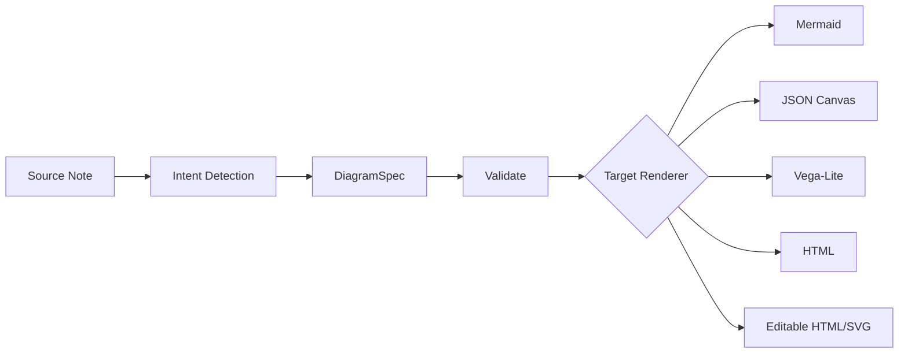

import TLDR from '@site/src/components/TLDR';

# 图表与可编辑 Figure

<TLDR>
**Notemd 的图表生成走 spec-first 管线。** LLM 先生成 renderer-agnostic 的 `DiagramSpec`，再由适配器渲染为 Mermaid、JSON Canvas、Vega-Lite、HTML 或显式的 editable HTML/SVG 产物。这样可以在渲染前验证结构，并让同一份语义 spec 支持多种导出链路。
</TLDR>

## 架构边界

Notemd 不要求 LLM 直接写 Mermaid、Vega 或 Canvas 语法。核心路径是：

这个边界的价值不是“多一个格式”，而是把语义、渲染和导出拆开：LLM 承担结构意图，renderer 承担格式约束，verification 脚本检查产物是否保留核心语义。

## 支持的输出

| Target | 文件类型 | 适用场景 |
|--------|----------|----------|
| Mermaid | `.md` / `.mmd` | 流程图、时序图、类图、状态图、ER 图 |
| JSON Canvas | `.canvas` | Obsidian 原生 canvas / 知识图谱 |
| Vega-Lite | `.json` | 数据图、时间序列、柱状图、散点图、表格 |
| HTML | `.html` | 通用 fallback，自包含预览 |
| Editable HTML/SVG | `.html` | 显式 figure target，面向后续编辑器导入链路 |
| Draw.io XML | `.drawio` / XML | `SemanticFigureModel` 到 diagrams.net 的 deterministic artifact boundary |
| Drawnix JSON | `.drawnix` | 最小 `geometry` / `arrow-line` subset spike |

## Editable HTML/SVG

`editable-html-svg` 是显式 render target，不是默认 planner route。它把 `DiagramSpec` 投影为 deterministic 的 `SemanticFigureModel`，再生成自包含 HTML 与 inline SVG：

- 节点 `<g>` 标注 `data-drawio-type`、`data-drawio-id`、`data-drawio-role`
- 边 `<g>` 标注 `data-drawio-source`、`data-drawio-target`
- 节点 id 归一化后会做碰撞处理，避免 `client app` 与 `client-app` 导出为同一个 id
- 不包含脚本、外部字体或远程资源

当前选择是保守的：先保证 artifact contract 可验证，再决定是否进入默认生成路线。过早把它设为默认 target，会把真实编辑器兼容性风险推给用户。

## Draw.io 与 Drawnix

第三方编辑器集成目前停在 artifact boundary：

| 目标 | 当前 contract | 不做什么 |
|------|---------------|----------|
| Draw.io | 从 `SemanticFigureModel` 导出未压缩 `mxfile` XML，并检查可见 label 保真 | 不把 diagrams.net Desktop 放进插件 runtime 或 CI |
| Drawnix | 导出最小 `.drawnix` JSON subset：`geometry` rectangle 与 `arrow-line` | 不引入 Drawnix / Plait runtime 依赖 |

这是工程权衡：稳定、可测试、可维护优先于“看起来集成很多”。完整 UI import/open 行为应当作为本地 runbook 证据或后续端到端测试推进。

## 语义验证

`scripts/diagram-semantic-verification.js` 覆盖以下 surface：

- Mermaid
- JSON Canvas
- Vega-Lite
- Editable HTML/SVG

验证重点是语义保真，而不是截图相似：节点、边、标签、数据系列和 editable SVG 注解必须能被程序化读取。对导出链路来说，这比单纯“能打开”更可靠。

## 使用建议

- 日常笔记优先用 Mermaid / JSON Canvas / Vega-Lite 的既有链路。
- 需要后续编辑器导入时，再显式选择 editable HTML/SVG 或 Draw.io/Drawnix artifact。
- 不要把 Drawnix JSON subset 误认为完整 Drawnix UI 兼容承诺；它是可验证的最小导出 spike。
- 对跨工具导出，优先检查 visible label、stable id、edge endpoint 和 unsupported primitive，而不是只看截图。
