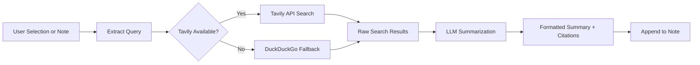

import TLDR from '@site/src/components/TLDR';

# 研究与网络搜索

<TLDR>
**Notemd** 会查询网络并将经过 LLM 摘要处理后的结果直接插入到您的笔记中。Tavily API 是主要的搜索后端，而 DuckDuckGo 则作为无需配置的备用方案。结果会附带来源引用，并汇总在 `## Research` 标题下。该工具支持单篇笔记研究、批量文件夹研究，以及为摘要步骤选择不同的模型。

这是[Obsidian AI知识管理指南](/docs/pillar-ai-knowledge)的一部分。
</TLDR>

## 概览

Research 是 Notemd 最强大的集成功能之一：它实现了阅读、搜索和写作之间的无缝衔接。无需切换到浏览器去查找不熟悉的术语，只需将其高亮并让 Notemd 进行搜索、总结并添加结果——所有操作都在您的安全存储空间内完成。

该流程完全可配置。您可以自行选择搜索提供商、负责撰写摘要的 LLM，以及是将结果追加到当前笔记中还是写入单独的文件中。批量模式让您只需点击一次即可对文件夹中的所有笔记进行检索。

## 它是如何工作的？

### 搜索后总结流程



1. **查询提取** -- Notemd 会从您的选择内容或笔记标题中提取搜索词。
2. **网络搜索**——会首先尝试 Tavily。如果未配置 API 键，则会自动使用 DuckDuckGo（无需键）。
3. **LLM 摘要生成** -- 原始搜索结果会被发送到已配置的 LLM，由其生成包含内联引用来源的简明摘要。
4. **Append** -- 将格式化后的摘要附加到当前笔记中 `## Research` 标题下方。

### Tavily 对比 DuckDuckGo

| 方面 | Tavily | DuckDuckGo |
|--------|--------|------------|
| API 键 | 必需（提供免费套餐） | 无需。 |
| 结果质量 | 更高性能（专为人工智能设计） | 足以应对常规查询。 |
| 速率限制 | 丰厚的免费套餐 | 可能会受到速率限制 |
| 配置 | 设置中的`tavilyApiKey` | 零配置——自动回退 |

### 批量文件夹研究

右键点击文件夹，然后选择**“Notemd：研究文件夹”**。该文件夹中的每个`.md`文件都会被依次处理（或根据配置的并发数并行处理）。每条笔记都会生成对应的分析摘要。

## 配置

| 设置 | 默认值 | 效果 |
|---------|---------|--------|
| `tavilyApiKey` | `''` | Tavily API 键。如果为空，则仅使用 DuckDuckGo。 |
| `researchProvider` / `researchModel` | DeepSeek | 针对每个任务的 LLM 搜索结果摘要功能 |
| `maxResearchContentTokens` | `4000` | 发送到 LLM 的内容的令牌预算。超出部分将被截断。 |
| `researchAppendToNote` | `true` | 将摘要追加到源笔记中。如果设置为 false，则创建单独的文件。 |
| `researchLanguage` | `'en'` | 总结研究的输出语言 |

### 按任务模型推荐

研究工作会从能够处理多语言内容并生成结构严谨的文本的模型中受益。请考虑：

- **DeepSeek** -- 默认款，价格实惠，品质优良
- **GPT-4o** -- 更高的摘要质量，更高的成本
- **Gemini Flash**——快速且价格低廉，非常适合处理简单的查询任务

## 示例

你正在阅读一篇关于*Transformer注意力机制*的论文，遇到了一个不熟悉的术语：*相对位置编码*。而不是留下 Obsidian：

1. 高亮显示**“相对位置编码”**
2. 右键点击 --> **“Notemd：研究与总结”**
3. Notemd 会搜索网络，汇总最相关的结果，然后追加：

```markdown
## Research

### Relative Positional Encoding

Relative positional encoding is a method used in transformer models
where positional information is expressed as relative distances between
tokens rather than absolute positions. Introduced by Shaw et al. (2018),
it improves generalization to unseen sequence lengths compared to
absolute encodings (Vaswani et al., 2017).

Sources:
- [Shaw et al., Self-Attention with Relative Position Representations (2018)](https://arxiv.org/abs/1803.02155)
- [Transformer Positional Encoding Overview](https://example.com/transformer-pos-enc)
```

该摘要现已存储在您的保险库中，可搜索、可创建链接，并且支持离线访问。

## 技巧

- **设置 Tavily 键以获得最佳效果**——即便是在免费套餐中，其相关性也优于原始的 DuckDuckGo。
- **使用功能强大的摘要模型**——廉价的模型可能会简化复杂的技术内容。
- 在初步通读之后进行**批量研究**，一次性填补多份笔记中的空白。
- **查看附加的摘要**——LLM可能会编造来源细节。请核实关键陈述的真实性。

---

## 后续步骤

- [概念说明](./concept-notes) -- 从研究结果中提取并保存关键术语
- [Wiki-Links](./wiki-links) -- 在您的知识库中关联通过研究得出的概念
- [翻译](./translation) -- 将研究摘要翻译成另一种语言
- [LLM 提供商](/docs/providers/overview) -- 配置用于摘要生成的模型
