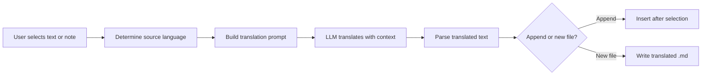

import TLDR from '@site/src/components/TLDR';

# 翻译

<TLDR>
**Notemd** 能够借助 LLM 提供的翻译技术，在 21 种以上语言之间实现文本互译。它支持单条文本翻译、整篇文档翻译以及批量文件夹翻译功能。每项翻译任务均可通过任务专属设置选择不同的服务提供商和模型。输出语言可独立于 UI 语言进行配置。根据您的需求，翻译结果可以追加到现有文件中，也可以写入新的文件中。

这是[Obsidian AI知识管理指南](/docs/pillar-ai-knowledge)的一部分。
</TLDR>

## 概览

Notemd中的翻译并非简单的词典查询——它是基于LLM技术、具备上下文感知能力的翻译。模型会完整阅读整段文字或笔记，从而保留原文的语气、领域专用术语以及句子结构。相比逐词翻译的服务，这种方式能产生更高质量的结果，尤其适用于技术、学术及创意写作领域。

该功能支持三种范围：选中内容、当前笔记以及整个文件夹。结合任务级模型选择，您可以在不更换全局服务提供商的情况下，使用快速模型（Gemini Flash）进行日常翻译，或使用强大模型（Claude Sonnet）处理对细节要求较高的内容。

## 它是如何工作的？

### 翻译命令



1. **源语言检测** -- LLM 会根据内容自动推断源语言，无需手动指定。
2. **提示词构建** -- Notemd 会生成一个包含目标语言、可选领域提示以及需要翻译内容的提示词。
3. **LLM 翻译** -- 已配置的 `translateProvider` / `translateModel` 会处理该请求。该模型能够保留 Markdown 格式、维基链接以及代码块。
4. **输出** -- 翻译后的文本会附加在原文下方，或被写入保险库中的新文件中。

### 语言对

Notemd 支持底层 LLM 所支持的任意语言对。常见的组合包括：

| 源文件 | 目标 | 典型质量 |
|--------|--------|----------------|
| 英语 | 简体中文 | 太好了 |
| 中文 | 英语 | 太好了 |
| 英语 | 日语 | 非常好 |
| 英语 | 德语 / 法语 / 西班牙语 | 非常好 |
| 任何受支持的 | 任何受支持的 | 取决于模型 |

`translateLanguage` 设置用于控制**输出语言**。源语言会自动检测。

### 按任务选择模型

不同模型的翻译质量差异很大。Notemd 允许你为翻译任务指定专门的模型：

| 模型 | 速度 | 质量 | 成本 | 最佳适用场景 |
|-------|-------|--------|------|----------|
| `gemini-2.0-flash-exp` | 快速 | 好的 | 低 | 休闲风，高容量 |
| `gpt-4o-mini` | 快速 | 很好 | 低 | 快速查询 |
| `deepseek-chat` | 中号 | 很好 | 非常低 | 经济型多语言版本 |
| `claude-3-5-sonnet` | 中号 | 太好了 | 中号 | 技术/学术类 |
| `gpt-4o` | 中号 | 太好了 | 中号 | 注重细微差别的散文写作 |

### 批量文件夹翻译

右键点击文件夹，选择**“Notemd: 翻译文件夹”**即可翻译该文件夹中的所有笔记。每个文件都会被独立处理。并发设置用于控制同时进行翻译的文件数量。

## 配置

| 设置 | 默认值 | 效果 |
|---------|---------|--------|
| `translateProvider` / `translateModel` | DeepSeek | 专为翻译任务设计的提供商 |
| `translateLanguage` | `'en'` | 目标输出语言 |
| `translationAppendToNote` | `true` | 在原文下方追加翻译内容。如果为 false，则创建新文件。 |
| `batchConcurrency` | `3` | 批量翻译时并行处理的文件数量 |

## 示例

您正在阅读一份中文研究报告，需要将其转换为英文版本：

1. 打开笔记
2. 右键点击 --> **“Notemd：翻译当前文件”**
3. Notemd 会检测中文内容，将其翻译为你配置的目标语言（英语），然后追加：

```markdown
## Translation (English)

The experimental results show that the proposed method achieves
a 12% improvement in F1 score compared to the baseline, primarily
due to the enhanced feature extraction module described in Section 3.
```

翻译内容位于上方，原始中文文本保持不变。`## Translation` 标题将两个版本放在同一文件中，以便查阅。

## 技巧

- **使用 Gemini Flash 进行批量处理**——它是处理大型文件夹批量翻译最快且最经济的选择。
- **保留维基链接**——Notemd的提示要求LLM在翻译时保持`[[wiki-links]]`的完整形式。翻译完成后请进行验证，因为某些模型偶尔会破坏这些链接结构。
- **明确设置输出语言**——虽然源语言可以自动检测，但务必配置 `translateLanguage`，以避免目标语言出现歧义。
- **批量翻译概念文档**——如果您的概念文件夹是某种语言，而您需要将其转换为另一种语言，只需在文件夹层级进行翻译即可一步完成。

---

## 后续步骤

- [研究](./research) -- 以任意语言进行搜索和总结，然后翻译结果
- [工作流](./workflows) -- 结合维基链接的链式翻译或概念提取
- [批量处理](/docs/advanced/batch-processing) -- 文件夹操作的并发性与覆盖行为
- [LLM 提供商](/docs/providers/overview) -- 为您的语言对选择最佳模型
