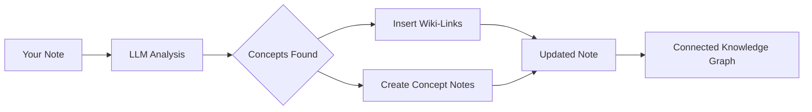

import TLDR from '@site/src/components/TLDR';

# 维基链接

<TLDR>
**Notemd**会自动在您笔记中的关键概念后添加`[[wiki-links]]`。LLM会读取您的内容，识别上下文中的重要术语，并在每个出现的位置插入Obsidian风格的维基链接。它还可以选择性地创建带有反向链接的概念笔记文件。该工具支持同义词过滤、重命名或删除时的链接完整性保持，以及纯提取模式（不修改任何文件）。与仅能匹配现有笔记标题的Auto Link不同，Notemd利用人工智能来识别新概念并创建相应的笔记。这是[Obsidian人工智能知识管理指南](/docs/pillar-ai-knowledge)的一部分。
</TLDR>

## 概览

wiki链接是Notemd的核心功能。它通过以下方式将纯文本转换为相互关联的知识图谱：

1. 正在使用 LLM **分析您的笔记**
2. **识别核心概念**（术语、人物、方法、理论）
3. 在每个出现的位置插入 `[[wiki-links]]`
4. **创建概念说明**（可选），并附上反向链接

## 它是如何工作的？

### 处理



### 示例

**之前：**
```markdown
Machine learning models use neural networks to learn patterns from data.
The transformer architecture revolutionized natural language processing.
```

**之后：**
```markdown
[[Machine learning]] models use [[neural networks]] to learn patterns from data.
The [[transformer architecture]] revolutionized [[natural language processing]].
```

## 使用方法

### 基础版：为当前笔记添加链接

1. 打开一个笔记
2. 在编辑器中右键点击 → **“处理文件（添加链接）”**
3. 稍等几秒。
4. 概念现已关联！

### 批量处理：同时处理多条笔记

1. 在文件资源管理器中右键点击一个文件夹
2. 选择**“Notemd: 处理文件夹（添加链接）”**
3. 配置：
   - 并发性（可同时处理的文件数量）
   - 覆盖现有链接（是/否）
4. 点击**处理**

### 选择性：链接特定文本

1. 高亮需要处理的文本
2. 右键点击 → **“处理选择（添加链接）”**
3. 仅分析高亮显示的部分。

## Notemd 与自动链接的对比

Obsidian 提供了两种自动创建维基链接的方法：

| | **自动链接** | **Notemd** |
|--|---------------|-------------|
| 链接来源 | 保险库中现有的笔记标题 | LLM-内容中识别出的概念 |
| 可以关联新概念 | 不行——标题必须已经存在。 | 是的——AI能够识别概念并生成笔记。 |
| 同义词处理 | 不行 | 是的——同义词抑制 |
| 概念说明文档的创建 | 不行 | 是的——通过反向链接和去重。 |
| 批量处理 | 否（单个文件） | 是（文件夹级） |
| 按任务模型路由 | 不行 | 是的 |

**自动链接**的功能是标题匹配：如果存在名为“机器学习”的笔记，它就会将其中出现的文本用 `[[Machine Learning]]` 括起来。如果该笔记不存在，则不会发生任何变化。

**Notemd** 是由人工智能驱动的：LLM 会读取您的内容，理解上下文，识别出应当建立关联的概念——即便目前还没有相关备注——进而同时创建链接和概念备注。

## 功能特性

### 同义词抑制

**问题：** “transformer”、“transformers”、“Transformer architecture”被视作3个不同的概念

**解决方案：** Notemd 能够检测出近乎重复的内容，并使用规范形式进行处理。

**配置：**
```
Settings → Advanced → Synonym Suppression
Threshold: 0.8 (0 = off, 1 = aggressive)
```

### 链接完整性

**当您重命名概念说明时：**
- 所有维基链接都会自动更新（Obsidian 核心功能）
- 反向链接保持完整。

**删除概念说明时：**
- 链接仍然存在，但显示为“未关联的提及”。
- 你可以从任意出现的位置重新创建。

### 纯提取模式

**在不修改原文的情况下提取概念：**

1. 右键点击 → **“提取概念（不建立链接）”**
2. 概念说明已创建
3. 原始文件未被修改

使用场景：处理只读内容或最终稿。

## 概念说明文档生成

### 自动创建

**当启用时（默认情况），Notemd 会创建：**

```markdown
---
tags: [concept, auto-generated]
created: 2026-06-13
source: [[Original Note Name]]
---

# Machine Learning

A branch of artificial intelligence that enables computers
to learn from data without explicit programming.

## Occurrences in Your Vault

- [[Original Note Name#Section]]
- [[Another Note#Header]]

## Related Concepts

- [[Neural Networks]]
- [[Deep Learning]]
- [[Supervised Learning]]
```

### 配置

**输出文件夹：**
```
Settings → Output → Concept Folder
Default: concepts/
```

**层次结构：**
```
Settings → Output → Use Hierarchical Folders
If enabled:
  papers/my-paper.md → papers/concepts/Concept.md
If disabled:
  → concepts/Concept.md
```

**模板：**
```
Settings → Output → Concept Template
Customize with variables:
  {{concept}} — Concept name
  {{description}} — LLM-generated description
  {{backlinks}} — List of source notes
  {{date}} — Creation date
```

## 高级选项

### 上下文窗口

**需要发送多少周围文本：**

```
Settings → Linking → Context Window
Options: Sentence | Paragraph | Full Note
Default: Paragraph
```

尺寸越大，精度越高，但成本也越高。

### 最小出现次数

**仅链接出现多次的概念：**

```
Settings → Linking → Min Occurrences
Default: 1 (link all)
```

设置为2或3，以便聚焦于重复出现的主题。

### 排除模式

**跳过某些单词：**

```
Settings → Linking → Exclude List
Example: note, idea, example, thing
```

防止通用术语出现过度链接。

### 自定义提示词

**覆盖默认的 LLM 指令：**

```
Settings → Advanced → Custom Linking Prompt
Default:
  "Identify key concepts, theories, methods, and technical
   terms in the following text. Return as a list..."
```

根据特定领域需求进行修改（例如：“侧重医学术语”）。

## 技巧与最佳实践

### ✅ 已完成

- **处理字数超过100字的笔记**——简短的笔记难以涵盖完整概念
- **使用强大的模型**以实现更精准的概念识别（GPT-4o、Claude）
- **接受前请审阅** — 请确认建议的链接是合理的
- **逐步构建** — 处理5到10条笔记，查看图表，调整设置

### ❌ 不要

- **过链接** — 并非每个名词都需要链接
- **反复处理草稿**——概念可能会发生变化，需等待其稳定下来。
- **忽略同义词** — 启用抑制功能，以避免出现“ML”与“机器学习”这样的表述

## 性能

### 速度

| 笔记大小 | GPT-4o-mini | Claude Sonnet | Ollama（本地） |
|-----------|-------------|---------------|----------------|
| 500字 | 2-3秒 | 3-5秒 | 5-10秒 |
| 2000字 | 5-8秒 | 10-15秒 | 20-40秒 |
| 5000多字 | 分块处理（多次调用） | 分块处理 | 分块处理 |

### 成本估算

**示例：使用 GPT-4o-mini 撰写的1000字笔记**
- 输入：约1500个标记
- 输出：约200个标记
- 成本：约0.001美元

**批量处理100条笔记：** 约0.10美元

## 故障排除

### 未添加任何链接。

**检查：**
1. LLM 调用成功（设置 → 诊断）
2. 该笔记的内容足够丰富（超过50个字）。
3. 概念是技术性/具体的（而不仅仅是代词）

**尝试：**
- 使用更强大的模型
- 增加上下文窗口大小
- 检查 API 密钥的有效性

### 链接过多

**解决方案：**
1. 将最小出现次数提高至（2或3）
2. 将常用词添加到排除列表中
3. 使用攻击性较低的模型

### 关联了错误的概念

**修复内容：**
1. 使用自定义提示词以实现领域特定性
2. 启用同义词抑制功能
3. 手动审核并解除关联

### 重命名后链接失效

**这是 Obsidian 的正常行为。**

要更新所有链接：
1. 重命名概念说明文档
2. Obsidian 会自动将 `[[old]]` 更新为 `[[new]]`

---

## 后续步骤

- 📖 [概念说明](./concept-notes) — 深入探讨概念说明的撰写方法
- 🔍 [研究整合](./research) — 将链接功能与网络研究相结合
- 🎨 [图表](./diagrams) — 可视化您的知识图谱
